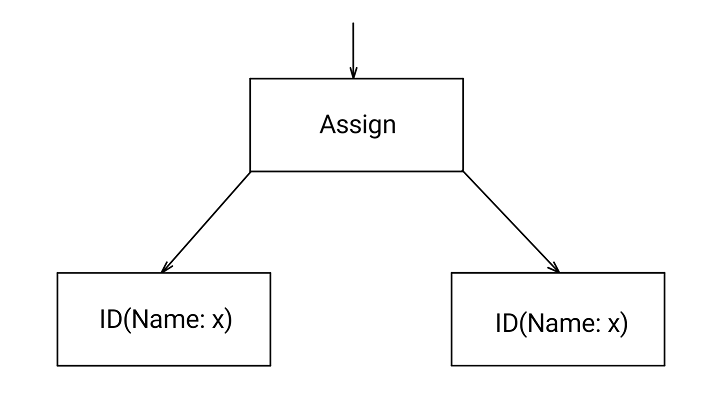
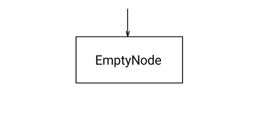

## AST-оптимизация заменой оператора присваивания вида x = x на пустой узел

### Постановка задачи
Реализовать оптимизацию по AST дереву вида x = x => null

### Команда
Карякин В.В., Карякин Д.В.

### Зависимые и предшествующие задачи

Предшествующие:

- Построение AST-дерева
- Базовые визиторы
- ChangeVisitor

### Теоретическая часть

Принцип работы данной оптимизации показан с помощью блок-схем, соответствующих некоторому поддереву абстрактного синтаксического дерева.

Ниже приведена блок-схема, которая соответствует строчке кода ```x = x;``` . Узел ```Assign``` подлежит оптимизации.



Данный узел ```Assign``` должен быть заменён на пустой узел ```EmptyNode```.
Блок-схема ниже показывает, что происходит после применения этой оптимизации.



### Практическая часть
Данная оптимизация реализована в виде визитора, унаследованного от класса `ChangeVisitor`.
В визиторе переопределяется метод `PostVisit`, таким образом, чтобы при присваивании вида `x = x` данный узел абстрактного синтаксического дерева заменялся на `EmptyNode` с помощью метода `ReplaceStat` унаследованного от класса `ChangeVisitor`.

Реализация оптимизации:

```csharp
/* OptAssignEquality.cs */
public class OptAssignEquality : ChangeVisitor
{
    public override void PostVisit(Node n)
    {
        if (n is AssignNode assignNode && assignNode.Expr is IdNode idn && assignNode.Id.Name == idn.Name)
        {
            ReplaceStat(assignNode, new EmptyNode());
        }
    }
}
```

### Место в общем проекте (Интеграция)
Данная оптимизация выполняется вместе с остальными оптимизациями по абстрактному синтаксическому дереву.

```csharp
/* ASTOptimizer.cs */
private static IReadOnlyList<ChangeVisitor> ASTOptimizations { get; } = new List<ChangeVisitor>
{
    /* ... */
    new OptAssignEquality(),
    /* ... */
};
```

### Тесты
Метод ```BuildAST``` используется для создания абстрактного синтаксического дерева по переданной ему строке кода. Схема тестирования выглядит следующим образом: сначала по заданному тексту программы генерируется AST, затем применяется оптимизация, после сравниваются строка ожидаемого результата и строка полученная с помощью визитора ```PrettyPrintVisitor``` по оптимизированному абстрактному дереву. Пустая строчка соответствуют пустому оператору. Ниже приведён один из тестов.

```csharp
[TestCase(@"
var a, b;
a = a;
{ b = b; }
",
    ExpectedResult = new[]
    {
        "var a, b;",
        "{",
        "}"
    },
    TestName = "RemoveNode")]

public string[] TestOptAssignEquality(string sourceCode) =>
    TestASTOptimization(sourceCode, new OptAssignEquality());
```
