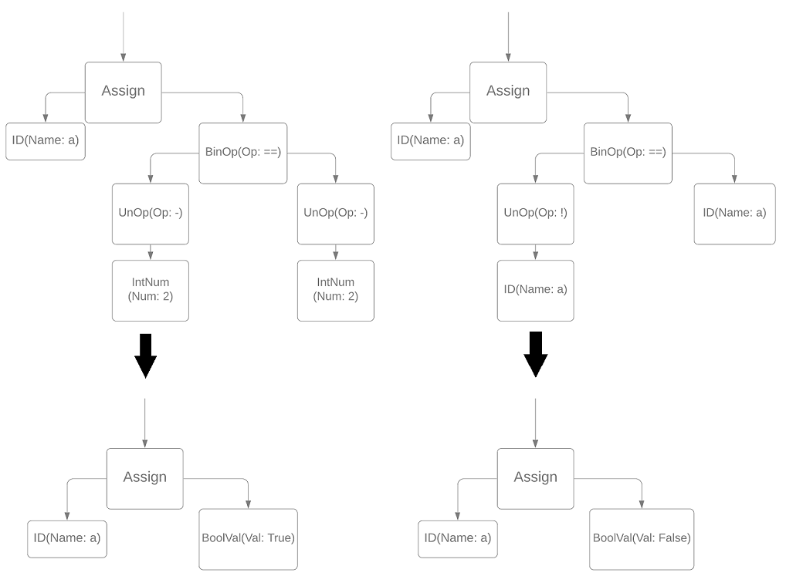
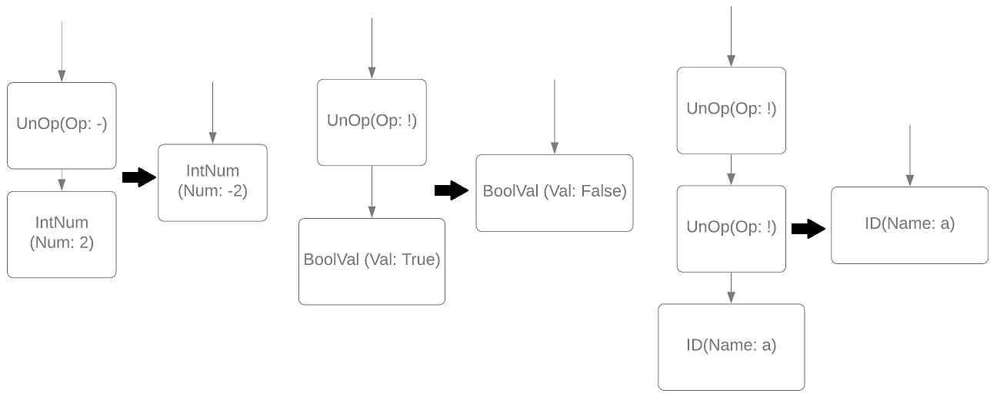

### AST-оптимизации свертки и устранения унарных операций
#### Постановка задачи
Реализовать оптимизации по AST дереву:
1. Свертка двух унарных операций
- op a == op a => True
- op a != op a => False
где op = {!, -}
- !a == a => False
- a != !a => True
2. Устранение унарной операции
- Превращение унарной операции «минус» с узлом целых чисел с Num\==1 в узел целых чисел с Num==-1
- !True=> False и !False => True
- !!a=>a
- \-\-a => a

#### Команда
А. Татарова, Т. Шкуро
#### Зависимые и предшествующие задачи
Предшествующие:
- Построение AST-дерева
- Базовые визиторы

#### Теоретическая часть
Данные оптимизации должны по необходимым условиям преобразовать поддерево АСТ таким образом:

1. 



2. 




#### Практическая часть
1. Свертка двух унарных операций
Данная оптимизация заходит только в узлы бинарных операций. Прежде всего проверяются необходимые условия: левый и правый операнды представляют собой узлы унарных операций и тип бинарной операции "равно" или "неравно". После разбирается, что в этих операндах только одна и так же переменная/константа, что тип унарных операций одинаков и т.д. Если условия выполняются, в родительском узле происходит замена бинарной операции на значение Boolean. В противном случае узел обрабатывается по умолчанию.
```csharp
public override void VisitBinOpNode(BinOpNode binop)
{
    var left = binop.Left as UnOpNode;
    var right = binop.Right as UnOpNode;
    
    if (left != null && right != null && left.Op == right.Op && left.Expr is IdNode idl)
    {
        if (right.Expr is IdNode idr && idl.Name == idr.Name)
        {
            if (binop.Op == OpType.EQUAL)
            {
                ReplaceExpr(binop, new BoolValNode(true));
            }
            if (binop.Op == OpType.NOTEQUAL)
            {
                ReplaceExpr(binop, new BoolValNode(false));
            }
        }
    }
    else
    if (left != null && left.Op == OpType.NOT && left.Expr is IdNode
        && binop.Right is IdNode && (left.Expr as IdNode).Name == (binop.Right as IdNode).Name)
    {
        /*...*/
    }
    else
    if (right != null && right.Op == OpType.NOT && right.Expr is IdNode
        && binop.Left is IdNode && (right.Expr as IdNode).Name == (binop.Left as IdNode).Name)
    {
        /*...*/
    }
    else
    {
        base.VisitBinOpNode(binop);
    }
}
```

2. Устранение унарных операций
Данная оптимизация работает с узлами унарных операций. Прежде всего проверяется: выражение должно быть переменной или константой. Если условие не выполняется, то узел обрабатывается по умолчанию.
Если условие выполняется, то производятся следующие проверки и действия при их выполнении:
- если выражение было целочисленной константой, в родительском узле происходит замена унарной операции на узел целых чисел со значением, умноженным на -1;
- если выражение было значением Boolean, в родительском узле происходит замена унарной операции на  значение Boolean, взятое с отрицанием (было !true, стало false);
- если выражение было переменной, то дополнительно проверяется, является ли родительский узел так же унарной операцией с тем же типом операции. Если является, то в родительском узле второго порядка происходит замена выражения на переменную. 

```csharp
public override void VisitUnOpNode(UnOpNode unop)
{
    if (unop.Expr is IntNumNode num)
    {
        if (unop.Op == OpType.UNMINUS)
        {
            ReplaceExpr(unop, new IntNumNode(-1 * num.Num));
        }
        //...
    }
    else if (unop.Expr is BoolValNode b)
    {
        if (unop.Op == OpType.NOT)
        {
            ReplaceExpr(unop, new BoolValNode(!b.Val));
        }
        //...
    }
    else if (unop.Expr is IdNode)
    {
        if (unop.Parent is UnOpNode && (unop.Parent as UnOpNode).Op == unop.Op)
        {
            ReplaceExpr(unop.Parent as UnOpNode, unop.Expr);
        }
    }
    else
    {
        base.VisitUnOpNode(unop);
    }
}
```

#### Место в общем проекте (Интеграция)
Данные оптимизации выполняются вместе с остальными АСТ оптимизациями после построения абстрактного синтаксического дерева, но до генерации трехадресного кода.

#### Пример работы
1. Свертка двух унарных операций
- До 
```csharp
c = ((-a) != (-a));
a = (b != (!b));
d = ((!b) == (!b));
b = ((!c) == c);
```
- После
```csharp
c = false;
a = true;
d = true;
b = false;
```
2. Устранение унарных операций
- До
```csharp
a = (!true);
a = (a - (-(-1)));
d = (!(!(!b)));
a = (a - (-(-(-b))));
```
- После
```csharp
a = false;
a = (a - 1);
d = (!b);
a = (a - (-b)); // здесь первый минус - бинарный
```