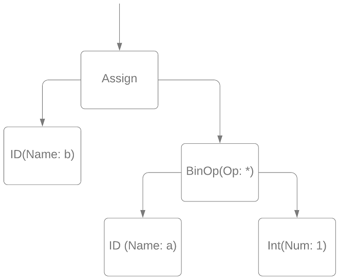

### AST-оптимизация умножения на единицу слева и справа, деления на единицу справа

#### Постановка задачи
Реализовать оптимизацию по AST дереву вида a\*1 = a, 1\*a = a, a/1 = a

#### Команда
А. Татарова, Т. Шкуро

#### Зависимые и предшествующие задачи
Предшествующие:
- Построение AST-дерева
- Базовые визиторы
- ChangeVisitor (?)

#### Теоретическая часть
Эта оптимизация представляет собой визитор, унаследованный от ChangeVisitor и меняющий ссылки между узлами ACT.
Рассмотрим некие узлы АСТ:


Эта блок-схема соответствует строчке  ```b = a * 1```.
Данная оптимизация должна отработать так: ``` b = a ```.
Блок-схема ниже показывает, что происходит с деревом после применения этой оптимизации:


#### Практическая часть
Алгоритм заходит только в узлы бинарных операций. Прежде всего проверяются необходимые условия: тип операции либо умножение, либо деление и что один из операндов это единица. Если условия выполняются, в родительском узле происходит замена бинарной операции на переменную. В противном случае узел обрабатывается по умолчанию.
```csharp
internal class OptExprMultDivByOne : ChangeVisitor
{
    public override void VisitBinOpNode(BinOpNode binop)
    {
		switch (binop.Op)
        {
            case OpType.MULT:
                if (binop.Left is IntNumNode && (binop.Left as IntNumNode).Num == 1)
                {
                    binop.Right.Visit(this);
                    ReplaceExpr(binop, binop.Right);
                }
                else if (binop.Right is IntNumNode && (binop.Right as IntNumNode).Num == 1)
                {
                    binop.Left.Visit(this);
                    ReplaceExpr(binop, binop.Left);
                }
                else
                {
				    base.VisitBinOpNode(binop);
                }
                break;

            case OpType.DIV:
                if (binop.Right is IntNumNode && (binop.Right as IntNumNode).Num == 1)
                {
                    binop.Left.Visit(this);
                    ReplaceExpr(binop, binop.Left);
                }
                break;

            default:
                base.VisitBinOpNode(binop);
                break;
            }
        }
    }
```

#### Место в общем проекте (Интеграция)
Данная оптимизация выполняется вместе с остальными АСТ оптимизациями после построения абстрактного синтаксического дерева, но до генерации трехадресного кода. 

#### Пример работы
- До 
```csharp
var a, b, c;
a = (b * 1);
b = (1 * a);
c = (a / 1);
a = (1 * 5);
b = (1 / 1);
```
- После
```csharp
var a, b, c;
a = b;
b = a;
c = a;
a = 5;
b = 1;
```
- До
```csharp
var a, b, c; 
a = a * (b * 1) / 1;
b = b + (1 * (c + a));
```
- После
```csharp
var a, b, c;
a = (a * b);
b = (b + (c + a));
```