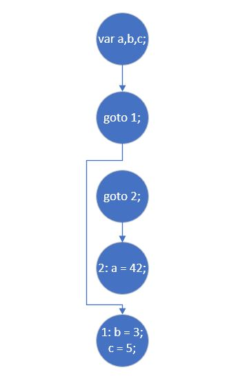

## Удаление недостижимого кода

### Постановка задачи
Необходимо реализовать оптимизацию, удаляющую недостижимый код.

### Команда
К. Галицкий, А. Черкашин

### Зависимые и предшествующие задачи
Предшествующие задачи:
* Трехадресный код
* Построение CFG. Обход потомков и обход предков для каждого базового блока
* Алгоритм упорядочения в глубину с построением глубинного остовного дерева

### Теоретическая часть
В рамках этой задачи необходимо было реализовать оптимизацию устранения недостижимого кода. Такой код чаще всего образуется в случаях написания программного кода с использованием операторов безусловного перехода. Например:
* До оптимизации
```csharp
var a, b, c;
goto 1;
goto 2;
2: a = 42;
1: b = 3;
c = 5;
```
* После оптимизации
```csharp
var a, b, c;
goto 1;
1: b = 3;
c = 5;
```

Пример графа с недостижимым кодом.



### Практическая часть
Оптимальный способ применения: удаление недостижимого кода на этапе построение графа потока управления. Используя данные обхода графа в глубину, позволяет определить базовые блоки, которые являются недостижимыми. Суть метода заключается в проходе по всем веткам графа для каждого блока, ища путь из начала графа в конец, используя все допустимые комбинации блоков.
Реализовали удаление недостижимых блоков используя DFS:
```csharp
private IReadOnlyCollection<BasicBlock> UnreachableCodeElimination()
{
    var tmpBasicBlock = new List<BasicBlock>(_basicBlocks);

    for (var i = 1; i < _dfn.Count - 1; i++)
    {
        if (_dfn[i] == 0)
        {
            tmpBasicBlock[i] = null;
        }
    }
    tmpBasicBlock.RemoveAll(x => x == null);
    return tmpBasicBlock.Skip(1).Take(tmpBasicBlock.Count - 2).ToList();
}
```

Удаление недостижимого кода происходит при каждом построении графа потока управления. После чего граф перестраивается с новым кодом, полученым после удаления недостижимых частей.
Для использования оптимизации изменили функции вызова всех оптимизаций трехадресного кода так, чтобы вызвать удаление недостижимого кода до оптимизации и после:
```csharp
public static IReadOnlyList<Instruction> OptimizeAll(List<Instruction> instructions)
{
    var cfg = new ControlFlowGraph(instructions);
    cfg.ReBuildCFG(Optimize(cfg.GetInstructions(), BasicBlockOptimizations, AllCodeOptimizations));
    return cfg.GetInstructions();
}
```

### Место в общем проекте (Интеграция)
Используется при создании графа потока управления и проходе DFS по нему.
```csharp
    /* ... */
public ControlFlowGraph(IReadOnlyCollection<BasicBlock> basicBlocks)
{
    ConstructedCFG(basicBlocks);
    DFS();
    ConstructedCFG(UnreachableCodeElimination());
    DFS();
}
    /* ... */
```

### Тесты
В тестах проверяется, что применение оптимизации удаления недостижимого кода возвращает ожидаемый результат:
```csharp
[Test]
public void MultipleBlocksTest1()
{
    var TAC = GenTAC(@"
var a, b, c;

goto 1;
111:a = 1; 
goto 55; 
55: goto 10; 
10: goto 111; 
if a>a goto 10; 
else goto 111; 
 
c = c; 
if a==b 
b = b; 
 
a = -1; 
b = -a; 
c = -(a+b); 
a = !b; 
c = !(a == b); 
1: b = 3;
");
    var cfg = new ControlFlowGraph(BasicBlockLeader.DivideLeaderToLeader(TAC));

    var actual = cfg.GetCurrentBasicBlocks();

    var expected = new[]
    {
        new BasicBlock(new[]
        {
            new Instruction("", "goto", "1", "", "")
        }),
        new BasicBlock(new[]
        {
            new Instruction("1", "assign", "3", "", "b")
        }),
    };

    AssertSet(expected, actual.Skip(1).Take(actual.Count - 2).ToArray());
}
```
