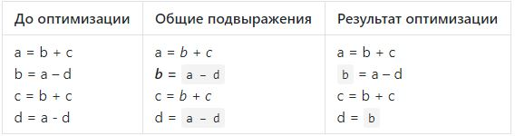
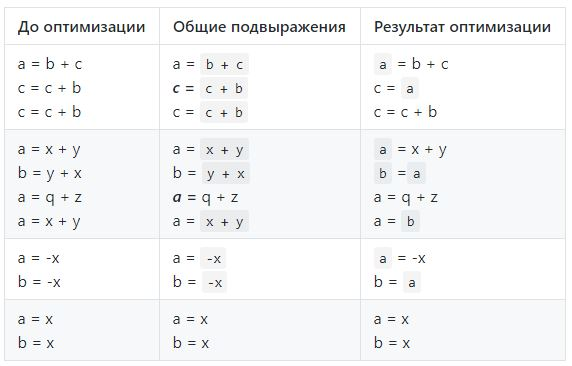

## Оптимизация общих подвыражений

### Постановка задачи
Реализовать оптимизацию по трёхадресному коду вида:



### Команда
Д. Лутченко, М. Письменский

### Зависимые и предшествующие задачи
Предшествующие задачи:
* AST дерево

### Теоретическая часть
a = `b + c`  
`b =` a – d  
c = `b + c`  
d = a - d  

1. Было ли использовано в правой части
`b + c` раньше в этом блоке?
2. Если да, то ***в промежутке между этими
определениями менялось ли b или c?***  
`Да`  => не подлежит оптимизации

a = b + c  
b = `a - d`  
c = b + c  
d = `a - d`

1. Было ли использовано в правой части
`a - d` раньше в этом блоке?
2. Если да, то ***в промежутке между этими
определениями менялось ли a или d?***  
`Нет` => можно оптимизировать

a = b + c  
`b` = a – d  
c = b + c  
d = `b`

### Практическая часть

Метод поддерживает проверку коммутативности, что позволяет выполнять оптимизации вида
```csharp
public static bool IsCommutative(Instruction instr)
{
    switch (instr.Operation)
    {
        case "OR":
        case "AND":
        case "EQUAL":
        case "NOTEQUAL":
        case "PLUS":
        case "MULT":
            return true;
    }
    return false;
}
```

Что позволяет выполнять оптимизации вида:  


Ориентированный граф связей подвыражений представлен следующим образом:
```csharp
var exprToResults = new StringToStrings();
var argToExprs = new StringToStrings();
var resultToExpr = new Dictionary<string, string>();
```
Где:  

- `exprToResults` связи выражений к результатам (один ко многим)
- `argToExprs` связи операнд к выражениям (один ко многим)
- `resultToExpr` связь результата с выражением (один к одному)

Для построения общего ключа для выражений с коммутативной операцией применяется сортировка операнд:
```
string uniqueExpr(Instruction instr) =>
    string.Format(IsCommutative(instr) && string.Compare(instr.Argument1, instr.Argument2) > 0 ?
        "{2}{1}{0}" : "{0}{1}{2}", instr.Argument1, instr.Operation, instr.Argument2);
```
Основной алгоритм представляет из себя цикл по входным инструкциям,  
на каждой итерации которого, происходят следующие действия для каждой инструкции:

- создание ключа по выражению
- если для выражения есть связь с результатом
    - то - выполняем оптимизацию
    - иначе - добавляем связи операнд к выражению
- обновлям связи результата и выражения
- если результат имеет связь с выражениями как операнд - удаляем все зависимые связи

```csharp
foreach (var instruction in instructions)
{
    if (instruction.Operation == "noop")
    {
        continue;
    }

    var expr = uniqueExpr(instruction);
    if (instruction.Operation != "assign" && exprToResults.TryGetValue(expr, out var results) && results.Count != 0)
    {
        wasChanged = true;

        newInstructions.Add(new Instruction(instruction.Label, "assign", results.First(), "", instruction.Result));
    }
    else
    {
        newInstructions.Add(instruction.Copy());
        addLink(argToExprs, instruction.Argument1, expr);
        addLink(argToExprs, instruction.Argument2, expr);
    }

    if (resultToExpr.TryGetValue(instruction.Result, out var oldExpr) &&
        exprToResults.ContainsKey(oldExpr))
    {
        exprToResults[oldExpr].Remove(instruction.Result);
    }

    resultToExpr[instruction.Result] = expr;
    addLink(exprToResults, expr, instruction.Result);

    if (argToExprs.ContainsKey(instruction.Result))
    {
        foreach (var delExpr in argToExprs[instruction.Result])
        {
            if (exprToResults.ContainsKey(delExpr))
            {
                foreach (var res in exprToResults[delExpr])
                {
                    resultToExpr.Remove(res);
                }
            }
            exprToResults.Remove(delExpr);
        }
    }
}
```

### Место в общем проекте (Интеграция)
Используется после создания трехадресного кода:
```csharp
/* ThreeAddressCodeOptimizer.cs */
private static List<Optimization> BasicBlockOptimizations => new List<Optimization>()
{
    /* ... */
};
private static List<Optimization> AllCodeOptimizations => new List<Optimization>
{
  ThreeAddressCodeCommonExprElimination.CommonExprElimination,
 /* ... */
};

public static List<Instruction> OptimizeAll(List<Instruction> instructions) =>
    Optimize(instructions, BasicBlockOptimizations, AllCodeOptimizations);

/* Main.cs */
var threeAddrCodeVisitor = new ThreeAddrGenVisitor();
parser.root.Visit(threeAddrCodeVisitor);
var threeAddressCode = threeAddrCodeVisitor.Instructions;
var optResult = ThreeAddressCodeOptimizer.OptimizeAll(threeAddressCode);
```

### Примеры работы



### Тесты
##### Проверка несрабатывания оптимизации:

```csharp
[TestCase(@"
var a, b, c, g, k;
a = b + c;
c = a + g;
k = b + c;
",
    ExpectedResult = new string[]
    {
        "#t1 = b + c",
        "a = #t1",
        "#t2 = a + g",
        "c = #t2",
        "#t3 = b + c",
        "k = #t3"
    },
    TestName = "NoCommonExpressions")]
```

##### Проверка срабатывания оптимизации:

```csharp
[TestCase(@"
var a, b, c, k;
a = b + c;
k = b + c;
",
    ExpectedResult = new string[]
    {
        "#t1 = b + c",
        "a = #t1",
        "#t2 = #t1",
        "k = #t2"
    },
    TestName = "SimplestCase")]
```

##### Корректность проверки коммутативности:

```csharp
[TestCase(@"
var a, b, c, k;
a = b + c;
k = c + b;
",
    ExpectedResult = new string[]
    {
        "#t1 = b + c",
        "a = #t1",
        "#t2 = #t1",
        "k = #t2"
    },
    TestName = "CommutativeOperation")]
```

##### Корректность проверки некоммутативности:

```csharp
[TestCase(@"
var a, b, c, k;
a = b - c;
k = c - b;
",
    ExpectedResult = new string[]
    {
        "#t1 = b - c",
        "a = #t1",
        "#t2 = c - b",
        "k = #t2"
    },
    TestName = "NotCommutativeOperation")]
```

##### Проверка сброса связи:

```csharp
[TestCase(@"
var a, b, c, k;
a = b * c;
b = b * c;
k = b * c;
",
    ExpectedResult = new string[]
    {
        "#t1 = b * c",
        "a = #t1",
        "#t2 = #t1",
        "b = #t2",
        "#t3 = b * c",
        "k = #t3"
    },
    TestName = "UsingItselfInExpression")]
```

##### С унарными операциями:

```csharp
[TestCase(@"
var a, b, c, k;
a = -b;
k = -b;
",
    ExpectedResult = new string[]
    {
        "#t1 = -b",
        "a = #t1",
        "#t2 = #t1",
        "k = #t2"
    },
    TestName = "UnaryOperation")]
```
