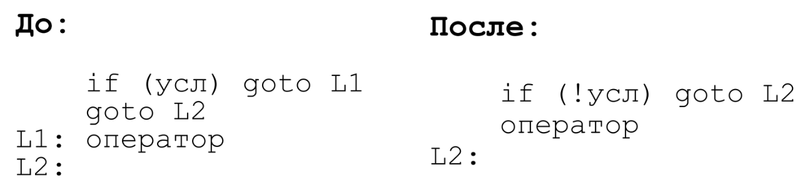

## Устранение переходов через переходы

### Постановка задачи
Произвести оптимизацию в трёхадресном коде программы для устранения переходов через переходы.

### Команда
Карякин В.В., Карякин Д.В.

### Зависимые и предшествующие задачи
Предшествующие задачи:

- Генерация трехадресного кода

### Теоретическая часть
В рамках данной задачи необходимо реализовать оптимизацию трёхадресного кода, которая устраняет безусловный оператор перехода. На изображении ниже показана работа данной оптимизации.



### Практическая часть
В алгоритме оптимизации происходит последовательный проход по трёхадресному коду программы. Если последовательность трёхадресных комманд удовлетворяет условию, которое позволяет провести оптимизацию, то она проводится, иначе команды остаются в неизменном виде.

Код оптимизации:
```csharp
/* ThreeAddressCodeRemoveGotoThroughGoto.cs */
for (var i = 0; i < instructions.Count; ++i)
{
    if (instructions[i].Operation == "ifgoto" && 4 <= (instructions.Count - i))
    {
        var com0 = instructions[i];
        var com1 = instructions[i + 1];
        var com2 = instructions[i + 2];
        var com3 = instructions[i + 3];

        if (com1.Operation == "goto" && com1.Label == "" && com2.Operation != "noop" && com0.Argument2 == com2.Label && com1.Argument1 == com3.Label)
        {
            var tmpName = ThreeAddressCodeTmp.GenTmpName();
            newInstructions.Add(new Instruction(com0.Label, "NOT", com0.Argument1, "", tmpName));
            newInstructions.Add(new Instruction("", "ifgoto", tmpName, com3.Label, ""));
            newInstructions.Add(new Instruction(com2.Label.StartsWith("L") && uint.TryParse(com2.Label.Substring(1), out _) ? "" : com2.Label, com2.Operation, com2.Argument1, com2.Argument2, com2.Result));
            newInstructions.Add(new Instruction(com3.Label, com3.Operation, com3.Argument1, com3.Argument2, com3.Result));

            wasChanged = true;
            i += 3;
            continue;
        }
    }
    newInstructions.Add(new Instruction(instructions[i].Label, instructions[i].Operation, instructions[i].Argument1, instructions[i].Argument2, instructions[i].Result));
            
```

### Место в общем проекте (Интеграция)
Устранение переходов через переходы применяется в списке оптимизаций к трехадресному коду:
```csharp
/* ThreeAddressCodeOptimizer.cs */
private static List<Optimization> AllCodeOptimizations => new List<Optimization>
{ 
    /* ... */ 
    ThreeAddressCodeRemoveGotoThroughGoto.RemoveGotoThroughGoto,
    /* ... */
};
```

### Тесты
Метод ```GenTAC``` вызывается для обновления глобальных переменных которые использует оптимизация. Схема тестирования выглядит следующим образом: создаётся TAC; затем применяется оптимизация; после построчно сравниваются строки трёхадресного кода ожидаемого результата и полученного после оптимизации TAC. Ниже приведён один из тестов.

```csharp
[Test]
public void Optimization()
{
    // обновление глобальных переменных для корректной работы теста
    GenTAC(@"var a;");

    // "1: #t1 = 1 < 2",
    // "7: if #t1 goto L1",
    // "goto L2",
    // "L1: goto 3",
    // "L2: noop",
    // "2: goto 4",
    // "3: a = 0",
    // "4: a = 1",
    // "666: a = False"

    var TAC = new List<Instruction>()
    {
        new Instruction("1", "LESS", "1", "2", "#t1"),
        new Instruction("7", "ifgoto", "#t1", "L1", ""),
        new Instruction("", "goto", "L2", "", ""),
        new Instruction("L1", "goto", "3", "", ""),
        new Instruction("L2", "noop", "", "", ""),
        new Instruction("2", "goto", "4", "", ""),
        new Instruction("3", "assign", "0", "", "a"),
        new Instruction("4", "assign", "1", "", "a"),
        new Instruction("666", "assign", "False", "", "a")
    };

    ThreeAddressCodeTmp.GenTmpLabel(); // L1
    ThreeAddressCodeTmp.GenTmpLabel(); // L2
    ThreeAddressCodeTmp.GenTmpName();  // #t1

    var expected = new List<string>()
    {
        "1: #t1 = 1 < 2",
        "7: #t2 = !#t1",
        "if #t2 goto L2",
        "goto 3",
        "L2: noop",
        "2: goto 4",
        "3: a = 0",
        "4: a = 1",
        "666: a = False"
    };

    var optimizations = new List<Optimization> { ThreeAddressCodeRemoveGotoThroughGoto.RemoveGotoThroughGoto };
    var actual = ThreeAddressCodeOptimizer.Optimize(TAC, allCodeOptimizations: optimizations)
        .Select(instruction => instruction.ToString()).ToList();

    CollectionAssert.AreEqual(expected, actual);
}
```