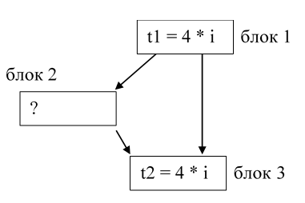
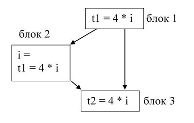

### Доступные выражения

#### Постановка задачи
Реализовать поиск доступных выражений между блоками графа потока управления.

#### Команда
С. Рыженков, А. Евсеенко

#### Зависимые и предшествующие задачи
Предшествующие задачи:
* Построение графа потока управления
* Построение класса, реализующего итерационных алгоритм 

#### Теоретическая часть
Определение: выражение x + y доступно в точке p, если любой путь от входного узла к p вычисляет x + y, и после последнего такого вычисления до достижения p нет последующих присваиваний переменным x и y. 



Рис. 1.a Потенциальные общие подвыражения, пересекающие границы блоков



Рис. 1.б Потенциальные общие подвыражения, пересекающие границы блоков

Рассмотрим пример, показанный на рисунке 1.а). На нем изображена часть графа потока управления. Мы видим, что блок 1 является родителем блоков 2 и 3, а блок 2 является родителем блока 3. Выражение 4 * i будет доступно в блоке 3 в следующих случаях:
* в блоке 2 переменной i не присваивается значение;
* в блоке 2 вычисляется выражение 4 * i, а после последнего такого вычисления до входа в блок 3 переменной i не присваивается новое значение. Пример такой ситуации показан на Рис. 1.б

Требуется отыскать множество доступных выражений между блоками компилируемой программы. Для этого для каждого блока B графа потока управления нам необходимо было определить множество доступных выражений на входе блока B и на его выходе. Обозначим эти множества ```IN[B]``` и ```OUT[B]```.
Для этого введём вспомогательные термины, применяемые только для поиска доступных выражений.
Определение: блок генерирует выражение ```x + y```, если он вычисляет ```x + y``` и не выполняет последующих переопределений x и(или) y.
Множество выражений, генерируемых каждым блоком, можно вычислить для каждой точки блока, проходя от начала до конца блока. Пусть множество ```S``` будет содержать множество доступных выражений от токи входа в блок до некоторой точки ```p```. В точке, предшествующей блоку сгенерированных выражений нет. Поэтому на входе в блок ```S = ∅.```Если при дальнейшем проходе от начала к концу в некоторой точке p стоит выражение ```x = y + z```, то для того, чтобы найти множество ```S``` для рассматриваемой точки ```p```, мы должны:
* Добавить в ```S``` выражение ```y + z```;
* Удалить из ```S``` все выражения, содержащие переменную ```x```.
Таким образом, для того, чтобы найти множество всех выражений, генерируемых блоком, необходимо найти множество S, идя от первой инструкции блока до последней. После обработки последней инструкции блока мы получим множество выражений, генерируемых всем блоком. Оно обозначается ```e_gen[B]```. 
Было создано универсальное множество ```U```. Оно включает в себя множество всех выражений, встречающихся в компилируемой программе. 
Определение: блок уничтожает выражение ```x + y```, если он присваивает (или может присваивать) x и (или) y, и после этого не вычисляет ```x + y``` заново.
Рассмотрим ещё одно множество, обозначаемое ```e_kill[B]```. Оно представляет собой множество выражений из U, уничтожаемых в B. Для того, чтобы найти ```e_kill[B]``` необходимо завести пустое множество K. Затем пройтись от начала блока до его конца. Для каждой арифметической операции или оператора присваивания необходимо в К добавить те выражения, в которых встречается переменная, указанная в рассматриваемой инструкции слева от знака равенства. По завершении прохода по блоку необходимо из К удалить те выражения, которые содержатся в множестве ```e_gen[B]```. То есть – генерируются блоком B.
Таким образом, после выполнения указанных процедур по каждому базовому блоку компилируемой программы у нас для каждого базового блока B будет известно множество выражений, генерируемых блоком B – ```e_gen[B]```, уничтожаемых блоком B – ```e_kill[B]```, а также универсальное множество U всех выражений, встречающихся справа от знака равенства в программе.
Для того, чтобы найти для каждого блока множество выражений, доступных на его входе и выходе, т.е. ```IN[B]``` и ```OUT[B]``` необходимо действовать по следующему алгоритму.

``` 
Вход: граф потока управления, у которого для каждого блока вычислены e_kill[B] и e_gen[B], универсальное множество U. Начальный блок – В1
Выход: IN[B] и OUT[B] - множества выражений, доступных на входе и выходе из каждого базового блока B
Метод: выполняется следующий алгоритм.
OUT[Вход] = ∅;
for (каждый базовый блок B, отличный от входного) OUT[B] = U;
while (внесены изменения в OUT)
	for (каждый базовый блок B, отличный от входного) {
		IN[B] = ∩_(P-предшественник B) OUT[P];
		OUT[B] = e_gen[B]∪(IN[B] - e_kill[B]);
} 
```

#### Практическая часть
Вычисление доступных выражений между базовыми блоками основано на применении абстрактного класса, реализующего итерационный алгоритм. 
Для этого сначала был реализован класс ```OneExpression```, который отвечает за хранения информации об одном выражении. Его объекты имеют следующие свойства:
```csharp
public string Operation { get; }
public string Argument1 { get; }
public string Argument2 { get; }
```
Первое отвечает за хранение знака операции, а два других – за хранение аргументов.
С помощью метода ```Equals``` можно сравнить два выражения. Причем два выражения считаются равными, если равны их операции, а также первые и вторые аргументы равны друг другу, или же первый аргумент одного выражения равен второму аргументу другого и первый аргумент другого выражения равен второму аргументу исходного выражения. То есть:
```csharp
public bool Equals(OneExpression expr1, OneExpression expr2) 
                => expr1.Operation == expr2.Operation && (expr1.Argument1 == expr2.Argument1 
                && expr1.Argument2 == expr2.Argument2
                || expr1.Argument1 == expr2.Argument2 && expr1.Argument2 == expr2.Argument1);
```
Метод ```ToString``` позволяет преобразовать выражение к строковому типу, а ```ContainsVariable``` – проверить, содержит ли выражение искомую переменную.
Метод ```Intersection``` принимает на вход два списка (```List<OneExpression>``` и ```List<OneExpression>```) и находит их пересечение того же типа. Он берет каждое выражение из первого списка и проверяет, содержится ли оно во втором. Если да, то рассматриваемое выражение добавляется в результирующий список.
Метод ```IsEqual``` проверяет, равны ли два списка типа List<OneExpression> между собой. Списки считаются равными, если они оба не равны null, второй содержит все элементы первого списка и количество элементов каждого из них равны.
Для того, чтобы реализовать передаточную функцию, а также вычисление множества ```U```, а также множеств ```e_gen``` и ```e_kill``` для каждого блока, отличного от входного был реализован класс ```AvailableExpressionTransferFunc```. Он имеет четыре свойства. Одно – для хранения U, а два других – для хранения ```e_gen``` и ```e_kill``` для каждого базового блока и четвертое – для хранения списка операций, которые могут участвовать в доступных выражениях.
```csharp
public static List<OneExpression> u;
private readonly Dictionary<BasicBlock, List<OneExpression>> e_gen;
private readonly Dictionary<BasicBlock, List<OneExpression>> e_kill;
public static readonly List<string> operationTypes = new List<string> { "OR", "AND", "LESS", "PLUS", "MINUS", "MULT", "DIV" };
```
Метод ```GetU``` указанного класса отвечает за создание списка всех выражений, встречающихся в компилируемой программе. Оно получается путём прохода по всем блокам программы. В случае, если, выражение, стоящее в правой части от знака равенства, не встречается в результирующем множестве, оно добавляется в него.
Методы ```Get_e_gen``` и ```Get_e_kill``` отвечают соответственно за получение множеств ```e_gen``` и ```e_kill``` для каждого базового блока программы. Они работают в точности так, как было описано равнее в теоретической части. При этом за удаление требуемого выражения из списка отвечает специальный метод ```RemoveExpression```.
Для обеспечения функциональности рассматриваемого класса конструктор по очереди запускает методы ```GetU```, ```Get_e_gen``` и ```Get_e_kill```. Полученные значения присваиваются соответствующим свойствам.
Для реализации передаточной функции используются следующие методы:
- ```Transfer```, который запускает работу передаточной функции для рассматриваемого базового блока
- ```In_minus_e_kill```, который находит множество, равное ```IN[B] – e_kill[B]```
- ```E_gen_join```, который находит множество, равное объединению ```e_genB``` и множеству, полученному в результате работы метода ```In_minus_e_kill```.
Второй метод просматривает все выражения, содержащиеся в множестве ```IN[B]```, и в случае, если рассматриваемое выражение присутствует в множестве ```e_kill[B]```, данный метод удаляет его из данного множества с помощью метода ```RemoveExpression```.
Третий метод копирует в результирующий список выражения из ```e_gen[B]```, а затем с помощью метода ```ContainsExpression``` проверяет каждое выражение из результата работы метода ```In_minus_e_kill```. Если выражение не содержится в результирующем списке, то он добавляет его в этот список.
Класс ```AvailableExpressions``` является потомком абстрактного класса ```GenericIterativeAlgorithm<List<OneExpression>>```, реализующий итерационный алгоритм. 
При инициализации объектов сначала задается оператор сбора. В случае доступных выражений таковым является пересечение. Оно реализовано в методе ```Intersection```.
В качестве делегата, сравнивающего списки используется метод ```IsEqual```.
Свойству ```InitFirst``` присваивается пустое множество, поскольку, согласно алгоритму, ```OUT[B]``` равен пустому множеству.
Свойству ```Init``` присваивается универсальное множество ```U```. Оно получено в результате вызова метода ```GetU``` класса ```AvailableExpressionTransferFunc```. 
Кроме того, был определён делегат, реализующий передаточную функцию. Он указывает на метод ```Transfer``` вспомогательного класса ```AvailableExpressionTransferFunc```.
Для того, чтобы запустить работу созданного алгоритма используется метод Execute, который реализует итерационный алгоритм. Сам алгоритм реализован в абстрактном классе ```GenericIterativeAlgorithm```, который на выходе даёт кортеж ```InOutData```.

#### Место в общем проекте (Интеграция)
Поиск доступный выражений применяется наряду с другими итерационными алгоритмами, которые могут быть реализованы с помощью абстрактного класса ```GenericIterativeAlgorithm```. Работа описанного алгоритма основана на работе с графом потока управления и поиске блоков – предков на данном графе.

#### Тесты
Для проверки работоспособности программы был написан ряд разнообразных тестов, охватывающих всевозможные случаи.
Вспомогательный метод ```AssertSet``` - сравнивает ожидаемый и полученный результаты
```csharp
private void AssertSet(
    List<(List<OneExpression>, List<OneExpression>)> expected,
    List<(List<OneExpression>, List<OneExpression>)> actual)
{
    for (var i = 0; i < expected.Count; i++)
    {
        Assert.AreEqual(expected[i].Item1.Count, actual[i].Item1.Count);
        Assert.AreEqual(expected[i].Item2.Count, actual[i].Item2.Count);
        Assert.True(ContainsExpression(expected[i].Item1, actual[i].Item1));
        Assert.True(ContainsExpression(expected[i].Item2, actual[i].Item2));
    }
}

```
```csharp
[Test]
public void SimpleTestWithUnreachableCode2()
{
    var TAC = GenTAC(@"var a, b, c, d, x, u, e, g, y, zz, i;
1: g = c + d;
b = c + x;
goto 1;
e = zz + i;");
    var actual = GetActualInOutData(TAC);
    var expected = new List<(List<OneExpression>, List<OneExpression>)>()
    {
        (new List<OneExpression>(), new List<OneExpression>()),
        (new List<OneExpression>(), new List<OneExpression>() { new OneExpression("PLUS", "c", "d"), new OneExpression("PLUS", "c", "x")} ),
        
        (new List<OneExpression>(), new List<OneExpression>())
    };
    Assert.AreEqual(expected.Count, actual.Count);
    AssertSet(expected, actual);
}
```


