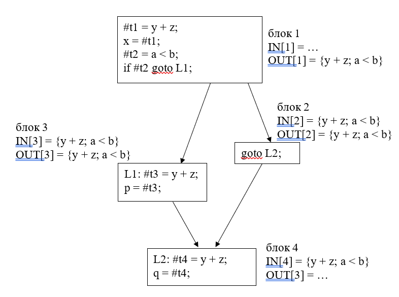
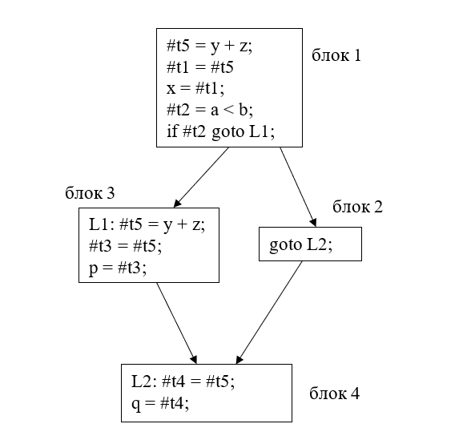
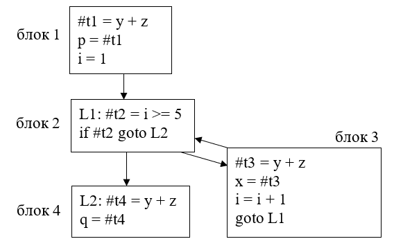
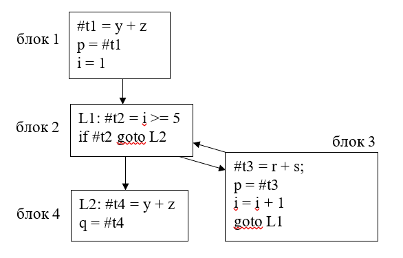

## Оптимизация «Доступные выражения»

### Постановка задачи
Реализовать применение оптимизации «Доступные выражения» на графе потока управления, имея информацию о выражениях, доступных на входе и выходе каждого базового блока.

### Команда
С. Рыженков, А. Евсеенко

### Зависимые и предшествующие задачи
Предшествующие задачи:

* Построение графа потока управления
* Построение класса, реализующего итерационных алгоритм 
* Применение итерационного алгоритма для поиска доступных выражений на входе и выходе каждого базового блока
* Удаление недостижимого кода

### Теоретическая часть
До начала работы описываемого алгоритма необходимо проверить граф потока управления на приводимость. Если он неприводим, то данная оптимизация не применяется.
Для простоты изложения поясним суть алгоритма на конкретном примере, изображённом на рис. 1.
Отметим сразу, что данная оптимизация программы применяется к каждому блоку только один раз. В противном случае мы получим бессмысленные повторные присваивания значений.
Рассмотрим часть графа потока управления, изображённую на Рис.1. Она получается после компилирования программы, указанной в листинге 1.

```
x = y + z;
if (a < b)
{
    p = y + z;
}
q = y + z;
```
Листинг 1. Компилируемая программа

Для простоты были умышленно исключены входной и выходной блоки графа потока управления, поскольку они нам в рассмотрении не понадобятся.



Пусть у нас имеются множества выражений, доступных на входе и выходе каждого базового блока. Предположим, что мы хотим применить оптимизацию к базовому блоку 4, изображённому на Рис. 1. Для этого последовательно перебираем все доступные выражения, содержащиеся в множестве IN[4]. Возьмём, например, первое доступное выражение из IN[4] – «y + z». Проходим по списку всех инструкций данного блока и ищем инструкцию, содержащую выражение “y + z”. Действительно, такая инструкция содержится в блоке 4. Тогда запоминаем её номер, а также сам блок. Блок 4, будем называть целевым блоком, а первую инструкцию в целевом блоке, содержащую искомое доступное выражение, – целевой инструкцией.

Теперь наша цель – найти все инструкции в блоках – предках целевого блока, содержащие выражение ‘y + z”, которые последними выполняются до выполнения целевой инструкции.

Для того, чтобы это сделать мы находим все блоки – предки целевого блока по графу потока управления. Пусть первым из них оказался блок 3. Проходим по списку инструкций блока 3 снизу вверх. Ищем в нём инструкцию, содержащую выражение “y + z”. Такая инструкция действительно содержится в данном блоке. Она имеет вид: “L1: #t3 = y + z”. Запоминаем этот блок и номер найденной инструкции в списке инструкций блока. 
Берём теперь второго предка целевого блока – блок 2. Опять проходимся по списку инструкций данного блока снизу вверх в поисках инструкции, содержащей выражение “y + z”. Такая инструкция в данном блоке отсутствует. Теперь мы должны найти все последние инструкции, содержащие выражение “y + z” в блоках – предках блока 2.

Блок 2 имеет только одного предка – это базовый блок 1. Проходим по списку всех его инструкций снизу вверх. Ищем необходимую нам инструкцию. Такая инструкция действительно содержится в данном блоке и имеет вид: “#t1 = y + z;”. Проверяем, что данный блок не содержится среди тех, которые мы запомнили ранее. Действительно, ранее нами был запомнен блок 3.  Запоминаем блок 1 и номер указанной инструкции.

Теперь возвращаемся к блоку 2. У него мы рассмотрели всех предков. Возвращаемся к целевому блоку. У него также рассмотрены все предки. Значит мы должны закончить поиск инструкций и произвести необходимую замену. 

Для этого мы генерируем новую временную переменную. Пусть это будем переменная “#t5”. Тогда во всех запомненных блоках мы запоминаем метку инструкции, которая подлежит замене, и имя переменной, в которую записывался результат вычисления. После этого мы удаляем указанную инструкцию. Далее мы на её место вставляем две инструкции. Первая содержит присваивание результату удалённой инструкции значения созданной временной переменной “#t5”. Вторая содержит присваивание созданной временной переменной значение выражения “y + z”. 

Далее мы запоминаем метку целевой инструкции и имя результирующей переменной из неё. Удаляем целевую инструкцию и на её место вставляем новую инструкцию, содержащую запомненную метку, а также представляющую собой присваивание запомненной результирующей переменной значения переменной “#t5”.

Таким образом мы завершаем работу с доступным выражением для блока 4. Далее мы переходим к новому выражению из множества IN[4]. Таковым является “a < b”. Проверяем, есть ли инструкция в блоке 4, содержащая данное выражение. Такой не оказалось. Поскольку в IN[4] больше не содержится доступных выражений, то для блока 4 оптимизация завершена. Переходим к следующему блоку. Результат применения данной оптимизации только для блока 4 представлен на Рис. 2.



Стоит отметить, что при наличии циклов существует ряд ограничений. Первой ограничение состоит в том, что если мы переходили от потомка к родителям и по какой-либо ветке пришли в целевой блок, то оптимизация для данного доступного выражения в данном блоке не применяется. 
Рассмотрим программу, код которой представлен в листинге 2.

```
var x, y, z, p, q, i;
p = y + z;
for i = 1, 5
{
    x = y + z;
}
q = y + z;
```
Листинг 2. Программа с циклом

Данная программа содержит цикл. Рассмотрим то, как она разбивается на базовые блоки. Схема разбиения приведена на Рис. 3. На данной схеме умышленно не показаны входной и выходной блок для компактности и наглядности.

Предположим, что мы хотим применить оптимизацию Доступные выражения к базовому блоку 3. IN[3] содержит выражение “y + z”. Кроме того, сам целевой блок содержит в одной из инструкций данное выражение. Но перебирая родителей по описанному выше алгоритму мы придём в целевой блок. Получается, что мы в результате оптимизации должны будем заменить выражение “y + z” само на себя, что бессмысленно. Поэтому в случае, если в ходе перебора родителей мы пришли в целевой базовый блок, работа по сбору данных для оптимизации прекращается, и оптимизация для данного выражения данного базового блока не производится.



Рассмотрим второе ограничение. Пусть у нас есть программа, представленная в листинге 3. 

```
var x, y, z, p, q, r, s, i;
p = y + z;
for i = 1, 5
{
    p = r + s;
}
q = y + z;
```
Листинг 3. Программа с циклом

Компилятором она разбивается на блоки так, как показано на Рис. 4. Пусть мы хотим применить оптимизацию Доступные выражения для выражения “y + z” базового блока 4. Если мы будем проходить по предкам данного базового блока, мы по одной ветке из блока 2, в котором нет выражения “y + z”, попадём в блок 3, являющийся телом цикла, в котором также нет указанного выражения. После этого мы опять по рассматриваемой ветке придём в блок 2. Получается, что мы обошли контур, в котором нет искомого доступного выражения. Проходить по нему ещё раз бессмысленно. Поэтому в случае, если мы пришли в блок, который уже встречался по пути данной ветки, мы не должны ничего делать с этой веткой пути, а просто перейти к рассмотрению другого предка блока 2, т.е. блока 1.



Таким образом, мы должны пропустить тело цикла, не содержащее искомого доступного выражения. Для того, чтобы это сделать мы должны создать пустой список блоков для каждого предка целевого блока. При переходе к предкам предков и т.д. мы копируем пройденный путь и добавляем в него раскрываемый блок.

### Практическая часть
Работа данного алгоритма основана на использовании стека. Рассмотрим по порядку, как он работает.
Как уже было сказано ранее, в начале мы проверяем, является ли граф приводимым. В случае, если он неприводим, мы не делаем никаких оптимизаций, связанных с доступными выражениями. Для этого используется свойство приводимости графа.
В случае успешной проверки на приводимость мы переходим в метод `GraphTraversing`. В данном методе организован цикл, который перебирает все блоки графа потока управления от первого до последнего. При выборе некоторого блока производится по описанному выше алгоритму поиск выражения из множества IN выбранного блока. Если оно найдено, с помощью метода OpenBlock запускается поиск описанных инструкций, содержащих рассматриваемое выражение. 
При инициализации мы кладём в стек информацию о предках целевого блока, включающую сам блок и путь до него. После входа в цикл мы снимаем элемент со стека. Если инструкция в нём содержит искомое выражение, мы запоминаем информацию о данном блоке в описанных выше случаях. В противном случае мы добавляем в стек информацию о предках раскрываемого блока.
Код метода OpenBlock представлен ниже в листинге 4. Случай, когда мы должны прекратить поиск инструкций, а также выхода из исследуемой ветки также реализованы в данном методе.

```csharp
private bool OpenBlock(BasicBlock block, OneExpression expression)
{
    var stack = new Stack<(BasicBlock block, List<BasicBlock> way)>();
    foreach (var bblock in graph.GetParentsBasicBlocks(graph.VertexOf(block)))
    {
        var way = new List<BasicBlock>() { bblock.block };
        stack.Push((bblock.block, way));
    }
    while (stack.Count != 0)
    {
        var element = stack.Pop();
        if (!IsContainedInListOfInstr(element.block.GetInstructions(), expression, element.block))
        {
            foreach (var parent in graph.GetParentsBasicBlocks(graph.VertexOf(element.block)))
            {
                if (parent.block == targetBlock)
                {
                    return false;
                }
                if (!element.way.Contains(parent.block))
                {
                    stack.Push((parent.block, new List<BasicBlock>(element.way) { parent.block }));
                }
            }
        }
    }
    return true;
}
```

Метод `IsContainedInListOfInstr` проходит по инструкциям блока снизу вверх и ищет первую инструкцию снизу, которая содержит исследуемое доступное выражение. Если он находит такую инструкцию, он возвращает true. В противном случае – false. Кроме того, в случае обнаружения такой инструкции он добавляет данные о блоке и номере инструкции в список `listOfPointsInBlock` в случае отсутствия таковой в указанном списке.

### Место в общем проекте (Интеграция)
Оптимизация Доступные выражения использует главным образом граф потока управления и вычисленную информацию о доступных выражениях в соответствующих классах. Применяется только один раз для всего графа потока управления.

### Тесты
Для проверки работоспособности программы был написан ряд разнообразных тестов, охватывающих всевозможные случаи.

```csharp
[Test]
public void SimpleProgram()
{
    var TAC = GenTAC(@"
var a, b, x, y, z, p, q, s;
x = y + z;
if (a < b)
{
    p = y + z;
}
q = y + z;
");
    var availableExpr = GeneratorBasicBlockAfterOptimization(TAC);

    var actual = GetStringFromBlocks(availableExpr);
    var expected = new List<string>()
    {
        "#in: noop",
        "#t6 = y + z",
        "#t5 = #t6",
        "#t1 = #t5",
        "x = #t1",
        "#t2 = a < b",
        "if #t2 goto L1",
        "goto L2",
        "L1: #t3 = #t5",
        "p = #t3",
        "L2: noop" ,
        "#t4 = #t6",
        "q = #t4",
        "#out: noop",
    };

    CollectionAssert.AreEqual(expected, actual);
}
```
```csharp
[Test]
public void ProgramWithLoopForNoOptimization2()
{
    var TAC = GenTAC(@"
var a, b, c, d, x, u, e,g, y,zz,i;
e = x + d;
zz = i + x;
for i=2,7
{
    x = x + d;
    a = a + b;
}
");
    var availableExpr = GeneratorBasicBlockAfterOptimization(TAC);

    var actual = GetStringFromBlocks(availableExpr);
    var expected = new List<string>()
    {
        "#in: noop",
        "#t1 = x + d",
        "e = #t1",
        "#t2 = i + x",
        "zz = #t2",
        "i = 2",
        "L1: #t3 = i >= 7",
        "if #t3 goto L2",
        "#t4 = x + d",
        "x = #t4",
        "#t5 = a + b",
        "a = #t5",
        "i = i + 1",
        "goto L1",
        "L2: noop",
        "#out: noop",
    };

    CollectionAssert.AreEqual(expected, actual);
}
```
