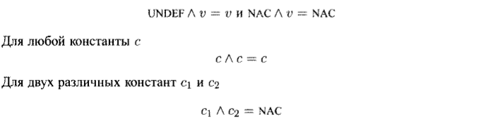

## Итерационный алгоритм в структуре распространения констант

### Постановка задачи
Необходимо в вершинах потока управления накопить IN-OUT информацию, реализовав итерационный алгоритм в структуре распространения констант.

### Команда
Карякин В.В., Карякин Д.В.

### Зависимые и предшествующие задачи
Предшествующие:
- Построение графа потока управления
- Вычисление передаточной функции для распространения констант

### Теоретическая часть
Распространение констант является прямой задачей потока данных. Алгоритм позволяет найти переменные, которые имеют константые значения на входе в блоки, что позволит в дальнейшем подставить их для повышения эффективности программы. Множество значений потока данных представляет собой решетку произведения, в которой имеется по одному компоненту для каждой переменной программы. В решетку для переменной входит следующее:
1. Все константы подходящего для данной переменной типа;
2. Значение NAC, означающее "не константу". Переменная отображается на это значение, если выяснится, что она не имеет константного значения;
3. Значение UNDEF, которое означает "не определена".

Сбор двух значений представляет собой их наибольшую нижнюю границу. Таким образом:




Итеративный алгоритм для прямой задачи потока данных имеет следующий вид:


На каждом шаге вычисляются множества IN и OUT для каждого блока. 

### Практическая часть
Сначала определяется множество используемых в программе переменных проходом по всем блокам графа потока управления.
Далее задаются начальные значения IN и OUT для всех блоков. Значение UNDEF ставится в соответствие всем переменным при инициализации входного узла и иницализации внутренних точек программы перед итерациями.

```cs
var temp = new Dictionary<string, LatticeValue>();
foreach (var elem in variables)
{
    temp.Add(elem, new LatticeValue(LatticeTypeData.UNDEF));
}

foreach (var block in blocks)
{
    INs.Add(block, temp.ToDictionary(entry => entry.Key, entry => entry.Value));
    OUTs.Add(block, temp.ToDictionary(entry => entry.Key, entry => entry.Value));
}
```

Сбор в структуре распространения констант выполняется следующим образом:

```cs
public static Dictionary<string, LatticeValue> Collect(Dictionary<string, LatticeValue> first, Dictionary<string, LatticeValue> second)
{
    var result = new Dictionary<string, LatticeValue>(first.Count, first.Comparer);
    foreach (var elem in second)
    {
        result[elem.Key] = first[elem.Key].collecting(elem.Value);
    }

    return result;
}
```
Передаточная функция реализована в рамках задачи другой команды. Применяется следующим образом:

```cs
var newOut = Transfer(block, INs[block]);
```
Реализация итерационного алгоритма:

```cs
var Changed = true;
while (Changed)
{
    Changed = false;
    foreach (var block in blocks)
    {
        var parents = g.GetParentsBasicBlocks(g.VertexOf(block)).Select(x => x.block);
        INs[block] = parents.Select(x => OUTs[x])
            .Aggregate(temp.ToDictionary(entry => entry.Key, entry => entry.Value), (x, y) => Collect(x, y));
        var newOut = Transfer(block, INs[block]);
        if (OUTs[block].Where(entry => newOut[entry.Key] != entry.Value).Any())
        {
            Changed = true;
            OUTs[block] = newOut;
        }
    }
}
```

### Место в общем проекте (Интеграция)
Данный итерационный алгоритм является одним из итерационных алгоритмов, вычисляющих IN-OUT иформацию для последующих оптимизаций. Для унифицированного применения в проекте реализован итерационный алгоритм в обобщенном виде. Он представлен в виде абстрактного класса, который наследуется классом, реализующим задачу.

Свойства и методы абстрактного класса:
```cs
public abstract Func<T, T, T> CollectingOperator { get; }
public abstract Func<T, T, bool> Compare { get; }
public abstract T Init { get; protected set; }
public virtual T InitFirst { get => Init; protected set { } }
public abstract Func<BasicBlock, T, T> TransferFunction { get; protected set; }
public virtual Direction Direction => Direction.Forward;
public virtual InOutData<T> Execute(ControlFlowGraph graph);
```

### Тесты
Тесты проверяют соответсвие IN-OUT значений для графа потока управления, полученного по указываемому тексту программы. Некоторые примеры:

```cs
// Проверяет недистрибутивность структуры распространения констант
[Test]
public void TransfNotDistr()
{
    var TAC = GenTAC(@"
        var a,b,c;
        if c > 5
        {
            a = 2;
            b = 3;
        }
        else
        {
            a = 3;
            b = 2;
        }
        c = a + b;
    ");
    var blocks = BasicBlockLeader.DivideLeaderToLeader(TAC);
    Assert.AreEqual(4, blocks.Count);
    var cfg = new ControlFlowGraph(blocks);
    var InOut = new ConstPropagation().ExecuteNonGeneric(cfg);
    var actual = InOut.OUT[blocks.Last()];

    Assert.AreEqual(LatticeTypeData.NAC, actual["a"].Type);
    Assert.AreEqual(LatticeTypeData.NAC, actual["b"].Type);
    Assert.AreEqual(LatticeTypeData.NAC, actual["c"].Type);
}
```
```cs
// Распространение констант из раличных блоков
[Test]
public void PropagateTwoVariants()
{
    var TAC = GenTAC(@"
        var a, x, c;
        if c > 10
            x = 10;
        else
            a = 20;
        c = a + x;
    ");
    var blocks = BasicBlockLeader.DivideLeaderToLeader(TAC);
    var cfg = new ControlFlowGraph(blocks);
    var InOut = new ConstPropagation().ExecuteNonGeneric(cfg);
    var actual = InOut.OUT[blocks.Last()];

    Assert.AreEqual(LatticeTypeData.CONST, actual["a"].Type);
    Assert.AreEqual(LatticeTypeData.CONST, actual["x"].Type);
    Assert.AreEqual(LatticeTypeData.CONST, actual["c"].Type);

    Assert.AreEqual("10", actual["x"].ConstValue);
    Assert.AreEqual("20", actual["a"].ConstValue);
    Assert.AreEqual("30", actual["c"].ConstValue);
}
```
```cs
// Случай с двумя достигающими константами
[Test]
public void TwoConstValues()
{
    var TAC = GenTAC(@"
        var a, x, c;
        input(c);
        if c > 5
            x = 10;
        else
            input(c);
        if c > 5
            x = 20;
        a = x;
");
    var blocks = BasicBlockLeader.DivideLeaderToLeader(TAC);
    var cfg = new ControlFlowGraph(blocks);
    var InOut = new ConstPropagation().ExecuteNonGeneric(cfg);
    var actual = InOut.OUT[blocks.Last()];

    Assert.AreEqual(LatticeTypeData.NAC, actual["a"].Type);
    Assert.AreEqual(LatticeTypeData.NAC, actual["x"].Type);
    Assert.AreEqual(LatticeTypeData.NAC, actual["c"].Type);
}
```
```cs
// Распространение переменных из одного предшествующего блока
[Test]
public void PropagateTwoVariants2()
{
    var TAC = GenTAC(@"
        var a, x, c;
        x = 10;
        a = 20;
        goto 666;
        666: c = a + x;
        ");

        var blocks = BasicBlockLeader.DivideLeaderToLeader(TAC);
        var cfg = new ControlFlowGraph(blocks);
        var InOut = new ConstPropagation().ExecuteNonGeneric(cfg);
        var actual = InOut.OUT[blocks.Last()];
        Assert.AreEqual(LatticeTypeData.CONST, actual["a"].Type);
        Assert.AreEqual(LatticeTypeData.CONST, actual["x"].Type);
        Assert.AreEqual(LatticeTypeData.CONST, actual["c"].Type);

        Assert.AreEqual("20", actual["a"].ConstValue);
        Assert.AreEqual("30", actual["c"].ConstValue);
        Assert.AreEqual("10", actual["x"].ConstValue);
}
```
