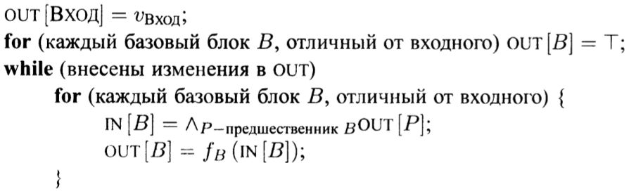
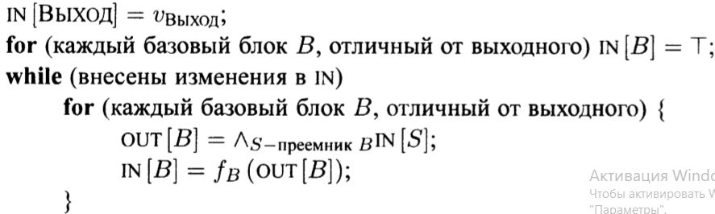
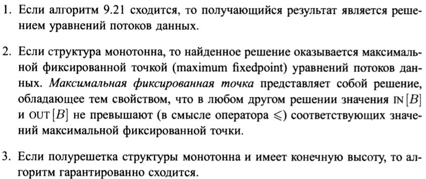

### Итерационный алгоритм в обобщённой структуре

#### Постановка задачи
Реализовать итеративный алгоритм в обобщенной структуре.

#### Команда
К. Галицкий, А. Черкашин

#### Зависимые и предшествующие задачи
Предшествующие задачи:
* Построение CFG. Обход потомков и обход предков для каждого ББл
Зависимые задачи:
* Вычисление передаточной функции для достигающих определений композицией передаточных функций команд
* Активные переменные
* Доступные выражения
* Передаточная функция в структуре распространения констант
* Достигающие определения
* Итерационный алгоритм в структуре распространения констант


#### Теоретическая часть
В рамках этой задачи необходимо было реализовать обобщенный итерационный алгоритм.
Входы итерационного алгоритма:
* Граф потока данных с помеченными  входными и выходными узлами
* Направление потока данных
* Множество значений V
* Оператор сбора ∧
* Множество функций f где f(b) из F представляет собой передаточную функцию для блока b
* Константное значение v вход или v выход из V, представляющее собой граничное условие для прямой и обратной структуры соответсвтвенно.
Выходы итерационного алгоритма:
* Значения из V для in(b) и out(b) для каждого блока b в CFG


Алгоритм для решения прямой задачи потока данных:

Алгоритм для решения обратной задачи потока данных:

Служит для избежания базового итеративного алгоритма для каждой структуры потока данных используемой на стадии оптимизации.
Его задача вычисление in и out для каждого блока как ряд последовательных приближений. А так же его использование предоставляет ряд полезных свойств приведенных ниже:


#### Практическая часть
Реализовали класс выходных данных:
```csharp
public class InOutData<T> : Dictionary<BasicBlock, (T In, T Out)> // Вид выходных данных вида (Базовый блок, (его входы, его выходы))
        where T : IEnumerable
    {
        public override string ToString()
        {
            var sb = new StringBuilder();
            sb.AppendLine("++++");
            foreach (var kv in this)
            {
                sb.AppendLine(kv.Key + ":\n" + kv.Value);
            }
            sb.AppendLine("++++");
            return sb.ToString();
        }

        public InOutData() { }  // конструктор по умолчанию

        public InOutData(Dictionary<BasicBlock, (T, T)> dictionary)  // Конструктор заполнения выходных данных
        {
            foreach (var b in dictionary)
            {
                this[b.Key] = b.Value;
            }
        }
    }
```

Указываем вид прохода алгоритма:
```csharp
public enum Direction { Forward, Backward }
```

Реализовали алгоритм:
```csharp
public abstract class GenericIterativeAlgorithm<T> where T : IEnumerable
    {
        /// <summary>
        /// Оператор сбора
        /// </summary>
        public abstract Func<T, T, T> CollectingOperator { get; }

        /// <summary>
        /// Сравнение двух последовательностей (условие продолжения цикла)
        /// </summary>
        public abstract Func<T, T, bool> Compare { get; }

        /// <summary>
        /// Начальное значение для всех блоков, кроме первого
        /// (при движении с конца - кроме последнего)
        /// </summary>
        public abstract T Init { get; protected set; }

        /// <summary>
        /// Начальное значение для первого блока
        /// (при движении с конца - для последнего)
        /// </summary>
        public virtual T InitFirst { get => Init; protected set { } }

        /// <summary>
        /// Передаточная функция
        /// </summary>
        public abstract Func<BasicBlock, T, T> TransferFunction { get; protected set; }

        /// <summary>
        /// Направление
        /// </summary>
        public virtual Direction Direction => Direction.Forward;

        /// <summary>
        /// Выполнить алгоритм
        /// </summary>
        /// <param name="graph"> Граф потока управления </param>
        /// <returns></returns>
        public virtual InOutData<T> Execute(ControlFlowGraph graph)
        {
            GetInitData(graph, out var blocks, out var data,
                out var getPreviousBlocks, out var getDataValue, out var combine);  
                // Заполнение первого элемента верхним или нижним элементом полурешетки в зависимости от прохода

            var outChanged = true;  // Были ли внесены изменения
            while (outChanged)
            {
                outChanged = false;
                foreach (var block in blocks)  //  цикл по блокам
                {
                    var inset = getPreviousBlocks(block).Aggregate(Init, (x, y) => CollectingOperator(x, getDataValue(y)));  // Применение оператора сбора для всей колекции
                    var outset = TransferFunction(block, inset);  // применение передаточной функции

                    if (!Compare(outset, getDataValue(block)))  // Сравнение на равенство множеств методом пересечения
                    {
                        outChanged = true;
                    }
                    data[block] = combine(inset, outset);  // Запись выходных данных
                }
            }
            return data;
        }

        private void GetInitData(  // функция инициализации данных относительно вида прохода алгоритма
            ControlFlowGraph graph,
            out IEnumerable<BasicBlock> blocks,
            out InOutData<T> data,
            out Func<BasicBlock, IEnumerable<BasicBlock>> getPreviousBlocks,
            out Func<BasicBlock, T> getDataValue,
            out Func<T, T, (T, T)> combine)
        {
            var start = Direction == Direction.Backward  // Если обратный проход то мы берем блоки с конца, в обратном случае с начала
                ? graph.GetCurrentBasicBlocks().Last()
                : graph.GetCurrentBasicBlocks().First();
            blocks = graph.GetCurrentBasicBlocks().Except(new[] { start }); 

            var dataTemp = new InOutData<T>
            {
                [start] = (InitFirst, InitFirst)  // инициализация первого элемента полурешетки
            };
            foreach (var block in blocks)
            {
                dataTemp[block] = (Init, Init); // инициализация остальных элементов полурешетки
            }
            data = dataTemp;

            switch (Direction) // инициализация свойств для каждого типа прохода
            {
                case Direction.Forward:
                    getPreviousBlocks = x => graph.GetParentsBasicBlocks(graph.VertexOf(x)).Select(z => z.Item2);
                    getDataValue = x => dataTemp[x].Out;
                    combine = (x, y) => (x, y);
                    break;
                case Direction.Backward:
                    getPreviousBlocks = x => graph.GetChildrenBasicBlocks(graph.VertexOf(x)).Select(z => z.Item2);
                    getDataValue = x => dataTemp[x].In;
                    combine = (x, y) => (y, x);
                    break;
                default:
                    throw new NotImplementedException("Undefined direction type");
            }
        }
    }
```

#### Место в общем проекте (Интеграция)
Используется для вызова итерационных алгоритмов в единой структуре.
```csharp

            /* ... */
            var iterativeAlgorithm = new GenericIterativeAlgorithm<IEnumerable<Instruction>>();
            return iterativeAlgorithm.Analyze(graph, new Operation(), new ReachingTransferFunc(graph));
            /* ... */
            /* ... */
            var iterativeAlgorithm = new GenericIterativeAlgorithm<HashSet<string>>(Pass.Backward);
           return iterativeAlgorithm.Analyze(cfg, new Operation(), new LiveVariableTransferFunc(cfg));
           /* ... */

```

#### Тесты
В тестах проверяется использование итерационных алгоритмов в обобщенной структуре, результаты совпадают с ожидаемыми.
```csharp
public void LiveVariableIterativeTest()
        {
            var TAC = GenTAC(@"
var a,b,c;

input (b);
a = b + 1;
if a < c
	c = b - a;
else
	c = b + a;
print (c);"
);

            var cfg = new ControlFlowGraph(BasicBlockLeader.DivideLeaderToLeader(TAC));
            var activeVariable = new LiveVariableAnalysis();
            var resActiveVariable = activeVariable.Execute(cfg);
            HashSet<string> In = new HashSet<string>();
            HashSet<string> Out = new HashSet<string>();
            List<(HashSet<string> IN, HashSet<string> OUT)> actual = new List<(HashSet<string> IN, HashSet<string> OUT)>();
            foreach (var x in resActiveVariable)
            {
                foreach (var y in x.Value.In)
                {
                    In.Add(y);
                }

                foreach (var y in x.Value.Out)
                {
                    Out.Add(y);
                }
                actual.Add((new HashSet<string>(In), new HashSet<string>(Out)));
                In.Clear(); Out.Clear();
            }

            List<(HashSet<string> IN, HashSet<string> OUT)> expected =
                new List<(HashSet<string> IN, HashSet<string> OUT)>()
                {
                    (new HashSet<string>(){"c"}, new HashSet<string>(){ "c" }),
                    (new HashSet<string>(){"c"}, new HashSet<string>(){"a", "b"}),
                    (new HashSet<string>(){"a", "b"}, new HashSet<string>(){ "c" }),
                    (new HashSet<string>(){"a", "b"}, new HashSet<string>(){"c"}),
                    (new HashSet<string>(){"c"}, new HashSet<string>(){ }),
                    (new HashSet<string>(){ }, new HashSet<string>(){ })
                };

            AssertSet(expected, actual);
        }
```
