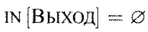
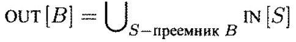

### Анализ активных переменных

#### Постановка задачи
Необходимо накопить IN-OUT информацию для дальнейшей оптимизации «Живые и мертвые переменные» между базовыми блоками.

#### Команда
А. Татарова, Т. Шкуро

#### Зависимые и предшествующие задачи
Предшествующие:
- Построение графа потока управления

Зависимые:
- Использование информации IN-OUT в удалении мертвого кода (Живые и мертвые переменные)

#### Теоретическая часть
Для переменной x и точки p анализ выясняет, может ли значение x из точки p использоваться вдоль некоторого пути в графе потока управления, начинающемся в точке p. Если может, то переменная x активна(жива) в точке p, если нет — неактивна(мертва). 
__defB__ – множество переменных, определенных в блоке B до любых их использований в этом блоке.
__useB__ -  множество переменных, значения которых могут использоваться в блоке B до любых определений этих переменных.
Отсюда любая переменная из useB рассматривается как активная на входе в блок B, а переменная из defB рассматривается как мертвая на входе в блок B. 
И тогда множества IN и OUT определяются следующими уравнениями

1. 

Это уравнение определяет граничное условие, что активных переменных при выходе из программы нет.

2. 

Второе уравнение говорит о том, что переменная активна при выходе из блока тогда и только тогда, когда она активна при входе по крайней мере в один из дочерних блоков. Здесь оператор сбора является объединением.

3. 

Здесь уравнение гласит, что переменная активна при входе в блок, если она используется в блоке до переопределения или если она активна на выходе из блока и не переопределена в нем.


Анализ активных переменных идет обратно направлению потока управления, поскольку необходимо проследить, что использование переменной x в точке p передается всем точкам, предшествующим p вдоль путей выполнения. 

#### Практическая часть
Первым шагом для каждого блока строятся def и use множества переменных. 
```csharp
private (HashSet<string> def, HashSet<string> use) FillDefUse(List<Instruction> block)
{
    Func<string, bool> IsId = ThreeAddressCodeDefUse.IsId;
    var def = new HashSet<string>();
    var use = new HashSet<string>();
    for (var i = 0; i < block.Count; ++i)
    {
        var inst = block[i];
        if (IsId(inst.Argument1) && !def.Contains(inst.Argument1))
        {
            use.Add(inst.Argument1);
        }
        if (IsId(inst.Argument2) && !def.Contains(inst.Argument2))
        {
            use.Add(inst.Argument2);
        }
        if (IsId(inst.Result) && !use.Contains(inst.Result))
        {
            def.Add(inst.Result);
        }
    }
    return (def, use);
}
```
где ```IsID``` --- функция определения переменной.
Далее определяется передаточная функция по уравнению (3)
```csharp
public HashSet<string> Transfer(BasicBlock basicBlock, HashSet<string> OUT) =>
    dictDefUse[basicBlock].Use.Union(OUT.Except(dictDefUse[basicBlock].Def)).ToHashSet();
```
где ```dictDefUse``` - структура для хранения def-use для каждого блока, ```OUT``` - множество, вычисленное уже для этого блока.

Сам анализ запускается на графе потока управления и выдает IN-OUT множества для каждого блока графа.
```csharp
public void ExecuteInternal(ControlFlowGraph cfg)
{
    var blocks = cfg.GetCurrentBasicBlocks();
    var transferFunc = new LiveVariableTransferFunc(cfg); //определение передаточной функции
    
    //каждый блок в начале работы алгоритма хранит пустые IN и OUT множества
    //в том числе входной и выходной блоки
    foreach (var x in blocks)
	{
        dictInOut.Add(cfg.VertexOf(x), new InOutSet()); 
    }
    //алгоритм вычисляет до тех пор, пока IN-OUT множества меняются на очередной итерации
    bool isChanged = true;
    while (isChanged)
	{
        isChanged = false;
        for (int i = blocks.Count - 1; i >= 0; --i)
		{
            var children = cfg.GetChildrenBasicBlocks(i);
            //здесь собирается информация IN множеств от дочерних узлов
            dictInOut[i].OUT =
                children
                .Select(x => dictInOut[x.Item1].IN)
                .Aggregate(new HashSet<string>(), (a, b) => a.Union(b).ToHashSet());
            var pred = dictInOut[i].IN;
            //Вычисление IN передаточной функцией
            dictInOut[i].IN = transferFunc.Transfer(blocks[i], dictInOut[i].OUT);
            isChanged = !dictInOut[i].IN.SetEquals(pred) || isChanged;
        }
    }
}
```

#### Место в общем проекте (Интеграция)
Анализ активных переменных является одним из итерационных алгоритмов по графу потока управления, преобразующих глобально текст программы. 
На данный момент анализ представлен как отдельный метод (```ExecuteInternal```) и как реализация абстрактного класса, представляющего собой обобщенный итерационный алгоритм:

```csharp
    public override Func<HashSet<string>, HashSet<string>, HashSet<string>> CollectingOperator =>
        (a, b) => a.Union(b).ToHashSet();
    public override Func<HashSet<string>, HashSet<string>, bool> Compare =>
        (a, b) => a.SetEquals(b);
    public override HashSet<string> Init { get => new HashSet<string>(); protected set { } }
    public override Func<BasicBlock, HashSet<string>, HashSet<string>> TransferFunction 
        { get; protected set; }
    public override Direction Direction => Direction.Backward;
        /*...*/
    public override InOutData<HashSet<string>> Execute(ControlFlowGraph cfg)
    {
        TransferFunction = new LiveVariableTransferFunc(cfg).Transfer;
        return base.Execute(cfg);
    }
```

#### Тесты
В тестах проверяется, что для заданного текста программы (для которого генерируется трехадресный код и граф потока управления по нему) анализ активных переменных возвращает ожидаемые IN-OUT множества для каждого блока:
```csharp
[Test]
public void WithCycle() {
var TAC = GenTAC(@"
var a,b,c;
input (b);
while a > 5{
	a = b + 1;
	c = 5;
}
print (c);"
);
    List<(HashSet<string> IN, HashSet<string> OUT)> expected =
        new List<(HashSet<string> IN, HashSet<string> OUT)>(){
            (new HashSet<string>(){"a","c"}, new HashSet<string>(){"a","c"}),
            (new HashSet<string>(){"a","c"}, new HashSet<string>(){"a","b","c"}),
            (new HashSet<string>(){"a","b","c"}, new HashSet<string>(){"b", "c"}),
            (new HashSet<string>(){ "c" }, new HashSet<string>(){ "c" }),
            (new HashSet<string>(){"b"}, new HashSet<string>(){ "a", "b", "c"}),
            (new HashSet<string>(){"c"}, new HashSet<string>(){ }),
            (new HashSet<string>(){ }, new HashSet<string>(){ })
        };
    var actual = Execute(TAC);
    AssertSet(expected, actual);
}

[Test]
public void ComplexWithCycleTest() {
    var TAC = GenTAC(@"
var a,b,c,i;
for i = 1,b {
	input (a);
	c = c + a;
	print(c);
	if c < b
		c = c + 1;
	else {
		b = b - 1;
		print(b);
		print(c);
	}
}
print (c+a+b);"
);
    List<(HashSet<string> IN, HashSet<string> OUT)> expected =
        new List<(HashSet<string> IN, HashSet<string> OUT)>(){
            (new HashSet<string>(){"b","c","a"}, new HashSet<string>(){"c","b","a"}),
            (new HashSet<string>(){"b","c","a"}, new HashSet<string>(){"c","b","i","a"}),
            (new HashSet<string>(){"c","b","i","a"}, new HashSet<string>(){"c","b","i","a"}),
            (new HashSet<string>(){"c","a","b"}, new HashSet<string>(){"c","a","b"}),
            (new HashSet<string>(){"c","b","i"}, new HashSet<string>(){"c","b","i","a"}),
            (new HashSet<string>(){"c","b","i","a"}, new HashSet<string>(){"c","b","i","a"}),
            (new HashSet<string>(){"c","b","i","a"}, new HashSet<string>(){"c","b","i","a"}),
            (new HashSet<string>(){"c","b","i","a"}, new HashSet<string>(){"c","b","i","a"}),
            (new HashSet<string>(){"c","a","b"}, new HashSet<string>(){ }),
            (new HashSet<string>(){ }, new HashSet<string>(){ })
        };
    var actual = Execute(TAC);
    AssertSet(expected, actual);
}
```