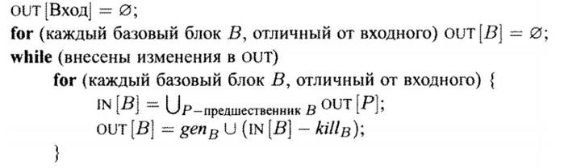

### Анализ достигающих определений
#### Постановка задачи
Необходимо накопить IN-OUT информацию по достигающим определениям в базовых блоках для дальнейшей оптимизации.
#### Команда
Д. Володин, Н. Моздоров
#### Зависимые и предшествующие задачи
Предшествующие: 
- Построение графа потока управления
- Вычисление передаточной функции для достигающих определений
- Итерационный алгоритм в обобщённой структуре

#### Теоретическая часть
Определение *d* достигает точки *p*, если существует путь от точки, непосредственно следующей за *d*, к точке *p*, такой, что *d* не уничтожается вдоль этого пути. Обозначим *genB* --- множество определений, генерируемых и не переопределённых базовым блоком *B*, и *killB* --- множество остальных определений переменных, определяемых в определениях *genB*, в других базовых блоках. Тогда решить задачу о достигающих определениях можно с помощью итерационного алгоритма: на вход ему подаётся граф потока управления с вычисленными для каждого базового блока множествами *genB* и *killB*, описание алгоритма представлено ниже.



На каждом шаге IN[*B*] и OUT[*B*] не уменьшаются для всех *B* и ограничены сверху, поэтому алгоритм сходится.

#### Практическая часть
Для решения задачи использовался обобщённый итерационный алгоритм. Свойства, использующиеся в нём, задаются следующим образом:
```csharp
/// оператор сбора
 public override Func<IEnumerable<BasicBlock>, IEnumerable<BasicBlock>, IEnumerable<BasicBlock>> CollectingOperator
     => (a, b) => a.Union(b);

/// оператор сравнения (условие продолжения цикла)
public override Func<IEnumerable<BasicBlock>, IEnumerable<BasicBlock>, bool> Compare
    => (a, b) => !a.Except(b).Any() && !b.Except(a).Any();
    
/// Начальное значение для всех блоков, кроме первого
public override IEnumerable<Instruction> Init { get => Enumerable.Empty<Instruction>(); protected set { } }
    
/// передаточная функция
public override Func<BasicBlock, IEnumerable<Instruction>, IEnumerable<Instruction>> TransferFunction { get; protected set; }
```

Свойство ```TransferFunction```, задающее передаточную функцию, зависит от графа потока управления, и она задаётся во время вызова алгоритма:
```csharp
TransferFunction = new ReachingTransferFunc(graph).Transfer;
```
Результат возвращается методом ```Execute```.

#### Место в общем проекте (Интеграция)
Анализ достигающих определений является одним из итерационных алгоритмов по графу потока управления, анализирующих глобально текст программы. Его реализация основана на обобщённом итерационном алгоритме, реализованном другой командой. Передаточная функция для достигающих определений была изначально реализована в рамках текущей задачи, а затем вынесена как отдельная задача.
#### Тесты
В тестах проверяется содержимое IN и OUT для каждого базового блока программы. Тестирование проводится на различных примерах: 
- из одного базового блока
```
var a, b, c;
b = 3;
a = 1;
a = 2;
b = a;
c = a;
c = b;
```
- с ветвлениями
```
var a, b;
input(a);
if a > 0
    b = 0;
else
    a = 1;
b = a;
```
- с циклами
```
var i, k;
for k = 0, 2
    i = i + 1;
```
- комбинированные тесты
```
var i, m, j, n, a, u1, u2, u3, k;
1: i = m - 1;
2: j = n;
3: a = u1;
for k = 0, 1
{
    i = i + 1;
    j = j - 1;

    if i < j
        a = u2;
    i = u3;
}
```
