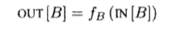
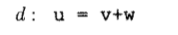
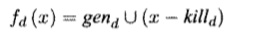
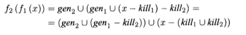
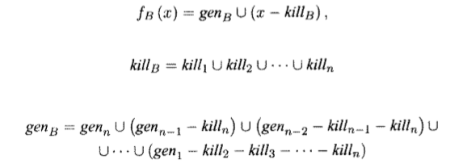

### Вычисление передаточной функции для достигающих определений композицией передаточных функций команд

#### Постановка задачи
Реализовать передаточную функцию в задаче анализа достигающих определений. 

#### Команда
Карякин В.В., Карякин Д.В.

#### Зависимые и предшествующие задачи
Предшествующие задачи:
- Построение Control Flow Graph

Зависимые задачи:
- Анализ достигающих определений

#### Теоретическая часть
Информация в данной задаче распространяется в прямом направлении вдоль пути выполнения. Обозначим значения потока данных непосредственно перед и непосредственно после каждого базового блока B как IN[B] и OUT[B] соответсвенно.

Соотношение между началом блока и его концом имеет вид:


Рассмотрим определение: 


Эта инструкция "генерирует" определение переменной и "уничтожает" все другие определения этой переменной в программе.

Передаточная функция определения d может быть записана как: 


где gen = {d} - мн-во определений, генерируемых инструкцией, а kill - мн-во всех прочих определений u в программе.

Передаточная функция базового блока может быть получена путем композиции передаточных функций, содержащихся в нем инструкций:




Таким образом, базовый блок, как и инструкция, с одной стороны, генерирует множество определений, с другой - уничтожает множество определений.

#### Практическая часть
По графу потока управления для каждого блока вычисляются множества gen и kill следующими методами:

```cs
private void GetDefs(IReadOnlyCollection<BasicBlock> blocks)
{
    var defs = new List<Instruction>();
    foreach (var block in blocks)
    {
        foreach (var instruction in block.GetInstructions())
        {
            if (instruction.Operation == "assign" ||
                instruction.Operation == "input" ||
                instruction.Operation == "PLUS" && !instruction.Result.StartsWith("#"))
            {
                defs.Add(instruction);
            }
        }
    }
    defs_groups = defs.ToLookup(x => x.Result, x => x);
}

private void GetGenKill(IReadOnlyCollection<BasicBlock> blocks)
{
    var gen = new List<DefinitionInfo>();
    var kill = new List<DefinitionInfo>();
    foreach (var block in blocks)
    {
        var used = new HashSet<string>();
        foreach (var instruction in block.GetInstructions().Reverse<Instruction>())
        {
            if (!used.Contains(instruction.Result) &&
                (instruction.Operation == "assign" ||
                instruction.Operation == "input" ||
                instruction.Operation == "PLUS" && !instruction.Result.StartsWith("#")))
            {
                gen.Add(new DefinitionInfo { BasicBlock = block, Instruction = instruction });
                used.Add(instruction.Result);
            }
            foreach (var killed_def in defs_groups[instruction.Result].Where(x => x != instruction))
            {
                kill.Add(new DefinitionInfo { BasicBlock = block, Instruction = killed_def });
            }
        }
    }
    gen_block = gen.ToLookup(x => x.BasicBlock, x => x.Instruction);            
    kill = kill.Distinct().ToList();
    kill_block = kill.ToLookup(x => x.BasicBlock, x => x.Instruction);
}
```

Применение передаточной функции к блоку:

```cs
public IEnumerable<Instruction> ApplyTransferFunc(IEnumerable<Instruction> In, BasicBlock block) =>
    gen_block[block].Union(In.Except(kill_block[block]));
```

#### Место в общем проекте (Интеграция)
Данный метод используется в анализе достигающих определений

```cs
TransferFunction = new ReachingTransferFunc(graph).Transfer;
```

#### Тесты
Тестируется на тестах из реализации задачи анализа достигающих определений. См. ReachingDefinitions
