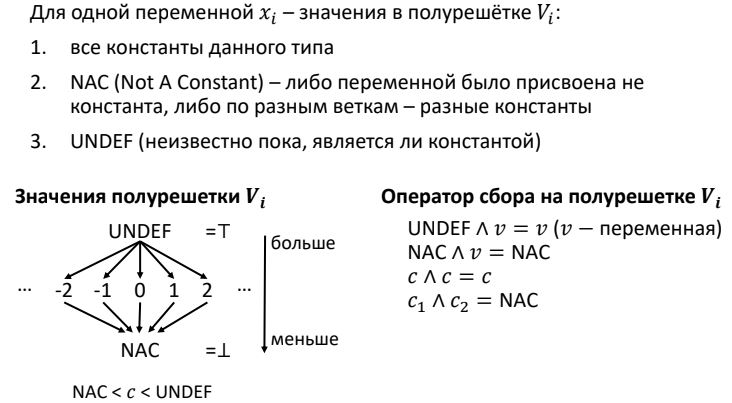
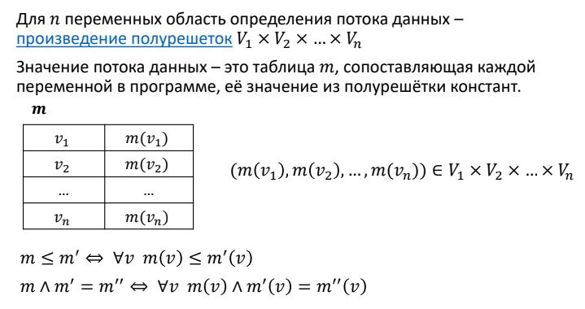
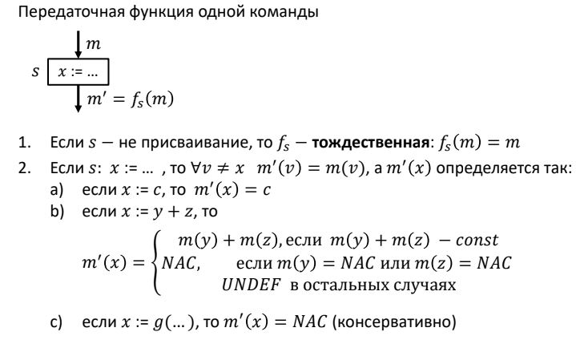

## Передаточная функция в структуре распространения констант

### Постановка задачи
Построить передаточную функцию для задачи распространения констант. На вход функции подаётся базовый блок и таблица значений потока данных, которая представлена словарём. На выходе получается модифицированная таблица значений.

### Команда
Д. Лутченко, М. Письменский

### Зависимые и предшествующие задачи
Предшествующие задачи:
* Разбиение на Базовые Блоки (от лидера до лидера)
* Построение Control Flow Graph

Зависимые задачи:
* Итерационный алгоритм в структуре распространения констант


### Теоретическая часть
Задача распространения констант основывается на полурешётках. 

Полурешётка – это пара `(V, ∧)`, где `V` −
множество, на котором определён оператор `∧: V → V` и
∀ x, y, z ∈ V выполняются следующие условия:

* `x ∧ x` = x (идемпотентность)
* `x ∧ y` = `y ∧ x` (коммутативность)
* `x ∧ y ∧ z` = `x ∧ y ∧ z` (ассоциативность)

Далее вводится понятие частичного порядка: отношение ≤ представляет собой частичный порядок на
множестве `V` если `∀ x, y, z ∈ V` выполняется:

* x ≤ x (рефлексивность)
* Если x ≤ y и y ≤ x, то x = y (антисимметричность)
* Если x ≤ y и y ≤ z, то x ≤ z (транзитивность)

Теперь введём определение операции < на полурешётке:

`x < y` ⇔ `x ≤ y` и `x ≠ y`

Определим, какие значения могут быть у переменной на полурешётке, а также дадим определение оператора сбора на полурешётке:



Теперь рассмотрим случай с `n` переменными. Для него введём понятие области определения потока данных и значений потока данных:



Теперь определим оператор сбора (передаточную функцию) для случая нескольких переменных:



В рамках задачи построения передаточной функции рассматривается не одна команда, а все из Базового Блока, поступающего на вход функции. Для всех операций присваивания проверяется возможность протянуть константы. Эта проверка основывается на значениях потока данных, представленных таблицей и подаваемых на вход передаточной функции.

### Практическая часть
На вход передаточной функции передаётся Базовый Блок и словарь(таблица потока данных) значений переменных:
```csharp
public Dictionary<string, LatticeValue> Transfer(BasicBlock basicBlock, Dictionary<string, LatticeValue> IN)
```
Далее создаётся вспомогательный словарь, который включает значения исходных переменных и в который мы дополнительно записываем временные переменные из трёхадресного кода, и список инструкций Базового Блока.
```csharp
var OUT = IN.ToDictionary(entry => entry.Key, entry => entry.Value);
var instrs = basicBlock.GetInstructions();
```
Далее в цикле обходятся все инструкции ББл.
```csharp
for (var i = 0; i < instrs.Count; i++)
{
	if (instrs[i].Result.StartsWith("#"))
	{
		OUT.Add(instrs[i].Result, new LatticeValue(LatticeTypeData.UNDEF));

		string first, second, operation;

		first = instrs[i].Argument1;
		second = instrs[i].Argument2;
		operation = instrs[i].Operation;
        /*...*/
	}
}
```
В трёхадресном коде все операции имеют не более 2 аргументов, результирующую переменную и операцию. 
Рассмотрим следующий пример:
```csharp
var a, b, c;
a = 5;
b = 4;
c = a + b;
```
Трёхадресный код для него будет выглядеть:
```csharp
a = 5
b = 4
#t1 = a + b
c = #t1
```
Таким образом, видно, что временные переменные в трёхадресном всегда предшествуют результирующей (переменной `c` в данном случае), поэтому сначала мы анализируем те переменные, которые начинаются с решётки(`#`), т.е. временные переменные трёхадресного кода. Сохраняем операнды и операцию в переменные. Далее начинаем проверять операнды согласно правилам, преведённым в теоретической части. Bool-переменные не участвуют в протяжке констант, а также все операции, связанные с ними. Для таких операций было введено специально множество `untreatedTypes`:
```csharp
public HashSet<string> untreatedTypes = new HashSet<string>() {
	"OR",
	"AND",
	"EQUAL",
	"NOTEQUAL",
	"GREATER",
	"LESS",
	"EQGREATER",
	"EQLESS",
	"NOT",
	"UNMINUS"
};
```
Таким образом, сначала мы проверяем, участвуют ли bool-переменные в операции и является ли операция допустимой. Если она не является допустимой, то значение переменной полагается NAC.
```csharp
if (first == "True" || second == "True" || first == "False" 
	|| second == "False" || untreatedTypes.Contains(operation)) //проверка на bool и недопустимые операции
{
	OUT[instrs[i].Result] = new LatticeValue(LatticeTypeData.NAC);
}
```
Далее проверяется, является ли выражение во временной переменной выражением вида `2 + b` и `b + 2`, где `b`-константа. Здесь под `+` понимается любая базовая бинарная операция между константами. Для уточнения операции была написана вспомогательная функция `FindOperations`:
```csharp
public int FindOperations(int v1, int v2, string op)
{
	switch (op)
	{
	case "PLUS":
		return v1 + v2;
	case "MULT":
		return v1 * v2;
	case "DIV":
		return v1 / v2;
	case "MINUS":
		return v1 - v2;
	}
	return 0;
}
```
Проверка на выражения вида `2 + b` и `b + 2`:
```csharp
else if (int.TryParse(first, out var v2) && OUT[second].Type == LatticeTypeData.CONST)
{
	int.TryParse(OUT[second].ConstValue, out var val2);
	OUT[instrs[i].Result] = new LatticeValue
    						(LatticeTypeData.CONST, FindOperations(val2, v2, operation).ToString());
}
else if (OUT[first].Type == LatticeTypeData.CONST && int.TryParse(second, out var v1))
{
	int.TryParse(OUT[first].ConstValue, out var val1);
	OUT[instrs[i].Result] = new LatticeValue
    						(LatticeTypeData.CONST, FindOperations(val1, v1, operation).ToString());
}
```
Далее проверяется, является ли выражение во временной переменной выражением вида `a + b`, где `a, b`-константы:
```csharp
else if (OUT[first].Type == LatticeTypeData.CONST && OUT[second].Type == LatticeTypeData.CONST)
{
	int.TryParse(OUT[first].ConstValue, out var val1);
	int.TryParse(OUT[second].ConstValue, out var val2);
	OUT[instrs[i].Result] = new LatticeValue
    						(LatticeTypeData.CONST, FindOperations(val1, val2, operation).ToString());
}
```
Наконец, если в выражении содержится что-то, помимо констант, то временной переменной присваивается значение согласно описанному в теории определнию передаточной функции.
```csharp
else
{
	OUT[instrs[i].Result] =
	OUT[first].Type == LatticeTypeData.UNDEF
	? new LatticeValue(LatticeTypeData.UNDEF)
	: OUT[first].Type == LatticeTypeData.NAC || OUT[second].Type == LatticeTypeData.NAC
	? new LatticeValue(LatticeTypeData.NAC)
	: new LatticeValue(LatticeTypeData.UNDEF);
}
```
Дав значение временной переменной трёхадресного кода, мы можем определиться с результирующей переменной, которая в трёхадресном коде идёт следующей:
```
#t1 = a + b
c = #t1
```
В результируюшей переменной могут быть записаны не только выражения вида `a = #t1`, но также и выражения 

вида `a = true` и т.п. Поэтому производится повторная проверка, согласно правилам построения передаточной функции из теоретической части. 
```csharp
if (instrs[i].Operation == "assign")
{
	if (int.TryParse(instrs[i].Argument1, out var s))
	{
		OUT[instrs[i].Result] = new LatticeValue(LatticeTypeData.CONST, s);
	}
	else
	{
	var operation = instrs[i].Operation;
	var first = instrs[i].Argument1;

	OUT[instrs[i].Result] =
		untreatedTypes.Contains(operation)
		? new LatticeValue(LatticeTypeData.NAC)
		:first == "True" || first == "False"
		? new LatticeValue(LatticeTypeData.NAC)
		: OUT[first].Type == LatticeTypeData.CONST
		? new LatticeValue(LatticeTypeData.CONST, OUT[first].ConstValue)
		: OUT[first].Type == LatticeTypeData.NAC
		? new LatticeValue(LatticeTypeData.NAC)
		: new LatticeValue(LatticeTypeData.UNDEF);
	}
}
```
Далее из вспомогательного словаря убираются временные переменные трёхадресного кода, и он подаётся на выход функции.
```csharp
var temp_keys = OUT.Keys.Where(x => x.StartsWith("#")).ToList();
foreach (var k in temp_keys)
{
	OUT.Remove(k);
}

return OUT;
```

### Место в общем проекте (Интеграция)
Данная функция входит в состав алгоритма распространения констант и является оператором сбора в этом алгоритме.

### Тесты
Тест, проверяющий, что значение переменной `a` в выражении `a = 2 * b`, где `b = 3`, станет равным 6:
```csharp
[Test]
public void ConstAndVariable()
{
	var TAC = GenTAC(@"
var a,b,c;
b = 3;
a = 2 * b;
	");
	var blocks = BasicBlockLeader.DivideLeaderToLeader(TAC);
	var cfg = new ControlFlowGraph(blocks);
	var InOut = new ConstPropagation().ExecuteNonGeneric(cfg);
	Assert.AreEqual(InOut.OUT[blocks[0]]["b"].Type, LatticeTypeData.CONST);
	Assert.AreEqual(InOut.OUT[blocks[0]]["a"].Type, LatticeTypeData.CONST);

	Assert.AreEqual("3", InOut.OUT[blocks[0]]["b"].ConstValue);
	Assert.AreEqual("6", InOut.OUT[blocks[0]]["a"].ConstValue);
}
```
Тест проверки работоспособности для меток:
```csharp
[Test]
public void PropagateTwoVariants2()
{
	var TAC = GenTAC(@"
var a, x, c;
x = 10;
a = 20;
goto 666;
666: c = a + x;
");

	var blocks = BasicBlockLeader.DivideLeaderToLeader(TAC);
    var cfg = new ControlFlowGraph(blocks);
    var InOut = new ConstPropagation().ExecuteNonGeneric(cfg);
    Assert.AreEqual(InOut.OUT[blocks[1]]["c"].Type, LatticeTypeData.CONST);
    Assert.AreEqual(InOut.OUT[blocks[1]]["c"].ConstValue, "30");
}
```
Тест для проверки протяжки константы `u = 3`:
```csharp
[Test]
public void VariableAndConst()
{
	var TAC = GenTAC(@"
var u,p,v;
u = 3;
p = u + 2;
");
	var blocks = BasicBlockLeader.DivideLeaderToLeader(TAC);
    var cfg = new ControlFlowGraph(blocks);
    var InOut = new ConstPropagation().ExecuteNonGeneric(cfg);
    Assert.AreEqual(InOut.OUT[blocks[0]]["u"].Type, LatticeTypeData.CONST);
    Assert.AreEqual(InOut.OUT[blocks[0]]["p"].Type, LatticeTypeData.CONST);

	Assert.AreEqual("3", InOut.OUT[blocks[0]]["u"].ConstValue);
	Assert.AreEqual("5", InOut.OUT[blocks[0]]["p"].ConstValue);
}
```
