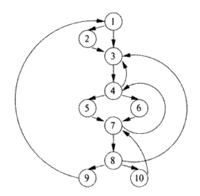
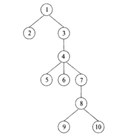
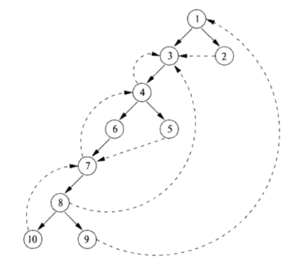
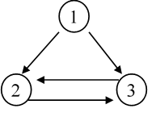
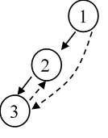
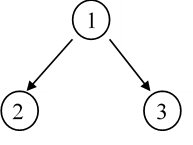
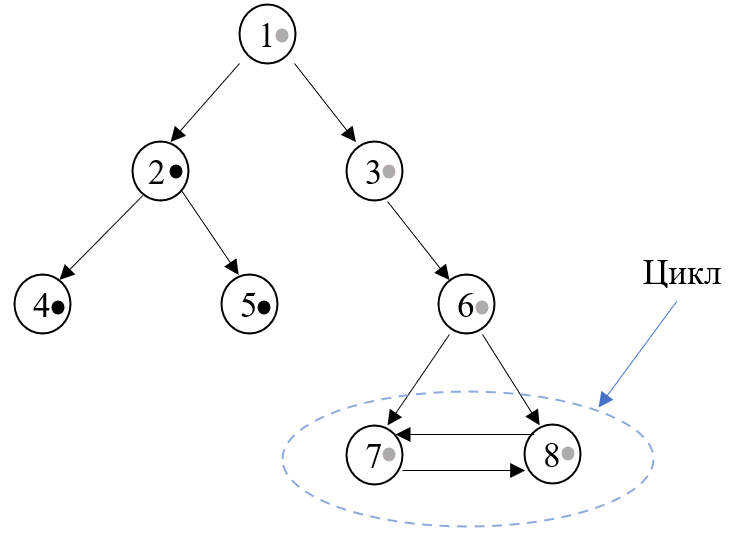

### Обратные рёбра и определение того, что граф является приводимым

#### Постановка задачи
Реализовать поиск обратных рёбер и определение того, что граф является приводимым.

#### Команда
С. Рыженков, А. Евсеенко

#### Зависимые и предшествующие задачи
Предшествующие задачи:
* Построение графа потока управления
* Построение дерева доминаторов

Зависимые задачи:
* Поиск естественных циклов

#### Теоретическая часть
Предположим, что у нас есть граф потока управления, изображённый на Рис. 1. Дерево доминаторов для него изображено на Рис. 2. Напомним, что дерево доминаторов строится при помощи соответствующего итерационного алгоритма.



Рис. 1. Граф потока управления.  



Рис. 2. Дерево доминаторов

Далее путём обхода в глубину мы можем построить глубинное остовное дерево. Оно изображено на Рис. 3 жирными стрелочками. Введём теперь классификацию рёбер в глубинном остовном дереве.

Определение: рёбра глубинного остовного дерева называются наступающими, если они идут от некоторого узла m к истинным приемникам в дереве. Все рёбра в глубинном остовном дереве являются наступающими. Других наступающих рёбер на Рис. 3 нет. Но если бы имелось ребро из 4 в 8, то оно также попадало в эту категорию.

Определение: ребра графа потока управления, идущие от узла m к предку m в глубинном остовном дереве (возможно к самому m) называются отступающими. Например, на Рис. 3 отступающими рёбрами являются рёбра из 4 в 3, из 7 в 4, из 10 в 7, из 8 в 3 и из 9 в 1.

Определение: ребра графа потока управления, ведущие из m в n, такие, что в глубинном остовном дереве ни m, ни n не являются предками друг друга называются поперечными.

Определение: обратным ребром называется ребро графа потока управления из a в b, у которого b доминирует над a.



Рис. 3. Представление графа потока управления

Заметим, что каждое обратное ребро графа потока управления является отступающим. Но не всякое отступающее ребро является обратным. Приведём пример, показанный на Рис. 4. В данном графе не все отступающие рёбра являются обратными. Построим глубинное остовное дерево данного графа. Оно изображено на Рис. 5.



Рис. 4. Пример неприводимого графа     



Рис. 5. Перестроенный граф

На Рис. 5 мы видим, что рёбра из 1 в 2, из 2 в 3, из 1 в 3 являются наступающими, а ребро из 3 в 2 – отступающим. Построим дерево доминаторов данного графа. Оно изображено на Рис. 6. По нему видно, что вершина 1 доминирует над 2 и 3, но вершина 2 не доминируют над 3 и вершина 3 не доминирует над 2. Значит ребро из 3 в 2 не является обратным.



Рис. 6. Дерево доминаторов

Для того, чтобы определить, является ли ребро обратным необходимо посмотреть на дерево доминаторов. Если конец доминирует над началом, то по определению данное ребро является обратным. В противном случае – нет. Перебрав все ребра графа потока управления и проверив указанное условие, мы получим искомое множество обратных рёбер.

Рассмотрим теперь приводимость графа.

Определение: граф потока управления называется приводимым, если все его отступающие рёбра в любом остовном дереве являются обратными. 

Поскольку все обратные рёбра являются отступающими, то можно считать, что граф потока управления является приводимым, если все его остовные деревья имеют одно и то же множество отступающих рёбер, совпадающее с множеством обратных рёбер. Из примера, приведенного выше, видно, что для различных остовных деревьев множества их отступающих рёбер могут отличаться. Таким образом, если удалить все обратные ребра из графа потока управления и оставшийся граф будет цикличен, то такой граф неприводим, и наоборот.

Таким образом, для того, чтобы установить, является ли граф потока управления приводимым или нет, необходимо: 
1)	Удалить из него все обратные ребра;
2)	Найти циклы в получившемся графе. Если они есть, то граф неприводим. В противном случае – приводим.

Существует стандартный алгоритм поиска циклом в графе. Рассмотрим его суть. Пусть у нас есть некоторый граф, изображённый на Рис. 7. Все его вершины изначально пометим белым цветом. Обойдём данный граф поиском в глубину. Мы стартуем из вершины 1. Поскольку она белая, мы перекрашиваем её в серый цвет и переходим к одной из вершин, в которую ведут дуги из данной. Пусть это вершина 2. Поскольку изначально она белая, мы также помечаем её серым цветом и переходим в вершину 5. Она также белая, поэтому помечаем её серым цветом. Из вершины 5 не выходит ни одна дуга. Поэтому помечаем её чёрным цветом, как просмотренную, и возвращаемся в вершину 2. Идем из неё в вершину 4. Помечаем вершину 4 серым цветом. Из неё также не выходит ни одна дуга. Поэтому помечаем её черным цветом и возвращаемся в вершину 2. Помечаем вершину 2 чёрным цветом, переходим в вершину 1. Из вершины 1 аналогичным образом идём в вершины 2, 6, 7, 8. Из вершины 8 идёт дуга в вершину 7, помеченную серым цветом. Поскольку мы попали в серую вершину, значит в нашем графе есть цикл. Алгоритм прекращает свою работу. Если бы мы в ходе обхода графа в глубину не наткнулись на вершину, покрашенную серым цветом, то это означало бы, что в графе нет циклов.



Рис. 7. Поиск циклов в графе

Необходимо также отметить, что приводимость графа потока управления, согласно определению, не накладывает ограничения, связанные с недостижимостью кода. Поэтому в случае, если граф потока управления имеет две или более компоненты сильной связности, нам необходимо проверить на наличие циклов каждую из них. Таким образом, после того, как мы обойдём в глубину компоненту сильной связности, содержащую начальный блок, нам необходимо запустить поиск в глубину из каждой вершины, помеченной белым цветом.

#### Практическая часть
Реализовано расширение для ControlFlowGraph ```public static class ControlFlowGraphExtension```
```csharp
public static bool IsReducibleGraph(this ControlFlowGraph cfg)
            => new BackEdges(cfg).GraphIsReducible;
public static IReadOnlyList<(BasicBlock, BasicBlock)> GetBackEdges(this ControlFlowGraph cfg) 
            => new BackEdges(cfg).BackEdgesFromCFG;            
```
```IsReducibleGraph``` - возвращает true в случае, если граф приводим.
```GetBackEdges``` - возвращает список обратных рёбер (от вершины к вершине).
Поиск обратных рёбер и анализ графа на приводимость реализованы в приватном классе ```BackEdges```. 
Для обеспечения работы алгоритма был дополнительно создан класс ```Edge```, который отвечает за хранение данных о рёбрах. То есть о начале и о конце каждого ребра.
Класс ```BackEdges``` имеет конструктор, принимающий граф потока управления. Сначала данный конструктор запускает ```EdgesFromCFG```, который создает объекты класса Edge. Тем самым он создает список всех рёбер в графе потока управления. Данный список сохраняется в свойстве ```enumEdgesCFG```. 
Далее запускается метод ```GetBackEdges```, который в цикле берёт ребро из свойства ```enumEdgesCFG``` и проверяет по дереву доминаторов, является ли данное ребро обратным или нет. Если да, то данное ребро добавляется в результирующий список ```enumBackEdges```. Код данного метода представлен ниже.
```csharp
private void GetBackEdges()
{
    var dominators = new DominatorTree().GetDominators(controlFlowGraph);
    foreach (var edge in enumEdgesCFG)
    {
        if (dominators[edge.From].ToList().Contains(edge.To))
        {
            enumBackEdges.Add(new Edge(edge.From, edge.To));
        }
    }
}    
```
Далее запускается метод ```CheckReducibility```. Он проверяет граф на приводимость. Алгоритм работы данного метода в точности повторяет алгоритм, описанный в теоретической части. Цвет вершин графа хранится в словаре ```BlockColorDictionary```. После запуска указанного метода, в словаре все вершины помечаются белым цветом. Далее запускается цикл, который в свою очередь запускает обход графа в глубину из начальной вершины. Если по окончанию обхода останутся белые вершины, то обход в глубину будет запущен из них. 
Сам обход в глубину запускается с помощью рекурсивного метода ```OpenBlock```. Код данного метода представлен ниже.

```csharp
private bool OpenBlock(BasicBlock block)
{
    if (BlockColorDictionary[block] == BlockColor.White)
    {
        BlockColorDictionary[block] = BlockColor.Gray;
    }
    var blockNumber = controlFlowGraph.VertexOf(block);            
    foreach (var child in controlFlowGraph.GetChildrenBasicBlocks(blockNumber))
    {
        var childBlock = child.block;               
        var isNotBackEdge = !enumBackEdges.ContainsEdge(block, childBlock);
        if (isNotBackEdge && BlockColorDictionary[childBlock] == BlockColor.Gray)
        {
            return false;
        }
        if (isNotBackEdge && BlockColorDictionary[childBlock] == BlockColor.White && OpenBlock(childBlock) == false)
        {                   
            return false;                                       
        }
        
    }
    BlockColorDictionary[block] = BlockColor.Black;
    return true;
}    
```

#### Место в общем проекте (Интеграция)
Обратные рёбра, а также информация о приводимости графа потока управления используется дальше в поиске естественных циклов и ряде других задач.

#### Тесты
Для проверки работоспособности программы был написан ряд разнообразных тестов, охватывающих всевозможные случаи.

Тест на наличие обратных рёбер
```csharp
[Test]
public void BackEdgesWithGoTo()
{
    var graph = BuildCFG(@"var a, b, c, d, e, f;
1: a = 1;
5: b = 2;
goto 2;
2: c = 3;
d = 4;
goto 3;
3: e = 5;
goto 4;
4: f = 6;
goto 5;");
    Assert.AreEqual(1, graph.GetBackEdges().Count);
}
```

Тест на приводимость графа
```csharp
[Test]
public void CheckIfGraphIsReducible1()
{
    var graph = BuildCFG(@"var a, b, i, j, p, x;
input(a);
1: for i = 1, 5
{
    b = b + a * a;
    a = a + 1;
}
goto 1;
2: for j = 1, 5
{
    p = b + a * a;
    x = a + 1;
}
goto 2;
");
    Assert.AreEqual(true, graph.IsReducibleGraph());
}
```

