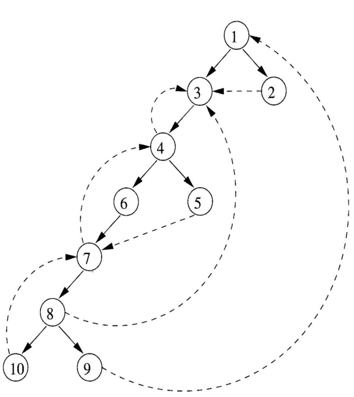

### Классификация рёбер графа: наступающие, отступающие, поперечные (по построенному остовному дереву)

#### Постановка задачи
В данной задаче необходимо классифицировать ребра графа по остновму дереву на три группы: наступающие, отступающие и поперечные.

#### Команда
А. Пацеев, И. Ушаков

#### Зависимые и предшествующие задачи
Предшествующие:
- Алгоритм упорядочения в глубину с построением глубинного остовного дерева

#### Теоретическая часть
Ребра графа классифицируются на три группы:

Наступающие (advancing) – от m к потомкам в дереве (все рёбра глубинного остовного дерева + возможно другие – например, 4 → 8)

Отступающие (retreating) – от m к предку в дереве (возможно, к самому m): 4 → 3, 7 → 4, 10 → 7, 8 → 3, 9 → 1

Поперечные (cross) – рёбра m → n, такие что ни m ни n не являются предками друг друга: 2 → 3, 5 → 7




#### Практическая часть
Были произведены изменения текущего метода нахождения DTFS и самого класса CFG следующим образом:

Первым шагом были введены новые поля, отвечающие за тот или иной тип к которому относится ребро:
```csharp
public enum EdgeType
{
    Advancing,
    Retreating,
    Cross
}

private List<(int from, int to, EdgeType type)> _classifiedEdges;
public IReadOnlyList<(int from, int to, EdgeType type)> ClassifiedEdges => _classifiedEdges;
```

Следующим шагом были введены два новых статуса для каждой из вершин и модифицирован алгоритм DFS таким образом, чтобы при проходе определять, к какому классу относится то или иное ребро. Согласно теоретической части описаной выше мы получаем:

```csharp
private void DFS()
    {
        /* ... */

        _classifiedEdges = new List<(int, int, EdgeType)>();
        var vertexStatuses = Enumerable.Repeat(VertexStatus.Init, c).ToArray();
        var pre = new int[c];
        var counter = 0;

        void dfs(int vertex)
        {
            vertexStatuses[vertex] = VertexStatus.InProgress;
            pre[vertex] = counter++;
            _nlr.Add(vertex);
            foreach (var (v, _) in _children[vertex])
            {
                switch (vertexStatuses[v])
                {
                    case VertexStatus.Init:
                        _classifiedEdges.Add((vertex, v, EdgeType.Advancing));
                        _dfst.Add((vertex, v));
                        dfs(v);
                        break;
                    case VertexStatus.InProgress:
                        _classifiedEdges.Add((vertex, v, EdgeType.Retreating));
                        break;
                    case VertexStatus.Done:
                        var edgeType = (pre[v] < pre[vertex]) ? EdgeType.Cross : EdgeType.Advancing;
                        _classifiedEdges.Add((vertex, v, edgeType));
                        break;
                }
            }
            vertexStatuses[vertex] = VertexStatus.Done;
            /* ... */
        }
        dfs(0);
    }
```

#### Место в общем проекте (Интеграция)
Данный метод был успешно интегрирован в Control Flow Graph, получить все ребра в остовном дереве и их типы можно при помощи следующей функции:
```csharp
public IReadOnlyList<(int from, int to, EdgeType type)> ClassifiedEdges => _classifiedEdges;
```

#### Тесты
В тестах проверяется работоспособность данного алгоритма, а также его соответствите заранее заданной структуре:

```csharp
namespace SimpleLanguage.Tests.CFG
{
    [TestFixture]
    internal class CFGdfs : TACTestsBase
    {
        [Test]
        public void Test1()
        {
            var TAC = GenTAC(@"
var a, b, c, d, x, u, e,g, y,zz,i;
goto 200;
200: a = 10 + 5;
for i=2,7 
	x = 1;
if c > a
{
	a = 1;
}
else 
{
    b = 1;
}
");

            var blocks = BasicBlockLeader.DivideLeaderToLeader(TAC);
            var cfg = new ControlFlowGraph(blocks);

           /* ... */

            var ce = new List<(int from, int to, ControlFlowGraph.EdgeType type)>{
                (0, 1, ControlFlowGraph.EdgeType.Advancing),
                (1, 2, ControlFlowGraph.EdgeType.Advancing),
                (2, 3, ControlFlowGraph.EdgeType.Advancing),
                (3, 5, ControlFlowGraph.EdgeType.Advancing),
                (5, 7, ControlFlowGraph.EdgeType.Advancing),
                (7, 8, ControlFlowGraph.EdgeType.Advancing),
                (8, 9, ControlFlowGraph.EdgeType.Advancing),
                (5, 6, ControlFlowGraph.EdgeType.Advancing),
                (6, 8, ControlFlowGraph.EdgeType.Cross),
                (3, 4, ControlFlowGraph.EdgeType.Advancing),
                (4, 3, ControlFlowGraph.EdgeType.Retreating)
                };
            
            Assert.AreEqual(ce.Count, cfg.ClassifiedEdges.Count);
            Assert.AreEqual(
                ce.FindAll(c => c.type == ControlFlowGraph.EdgeType.Cross).Count, 
                1
            );
            Assert.AreEqual(
                ce.FindAll(c => c.type == ControlFlowGraph.EdgeType.Retreating).Count, 
                1
            );
            Assert.AreEqual(
                ce.FindAll(c => c.type == ControlFlowGraph.EdgeType.Advancing).Count, 
                9
            );
            Assert.IsTrue(ce.Find(x => x.from == 6 && x.to == 8).type == ControlFlowGraph.EdgeType.Cross);
            Assert.IsTrue(ce.Find(x => x.from == 4 && x.to == 3).type == ControlFlowGraph.EdgeType.Retreating);
            foreach (var c in cfg.ClassifiedEdges)
            {
                Assert.Contains(c, ce);
            }
            CollectionAssert.AreEqual(ce, cfg.ClassifiedEdges);
            Console.WriteLine("ClassifiedEdges");
            foreach (var c in cfg.ClassifiedEdges)
            {
                Console.WriteLine(c);
            }
        }
    }
}
```