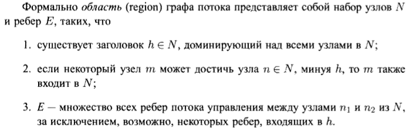
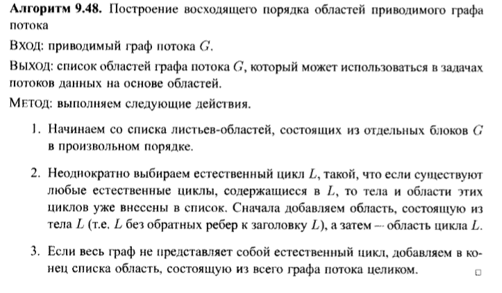

## Построение областей

### Постановка задачи
В данной задаче необходимо построить иерархию областей графа потока управления.

### Команда
Карякин В.В., Карякин Д.В.

### Зависимые и предшествующие задачи
Предшествующие:

- Построение потока графа управления
- Определение всех естественных циклов

### Теоретическая часть
В процессе анализа на основе областей программа рассматривается как иерархия областей, которые грубо можно считать частями графа потока, имеющими единственную точку входа. Дадим формальное определение области:


В рассматриваемом разбиении предполагается, что граф потока приводим. Для построения областей мы идентифицируем естественные циклы. Любые два из которых либо не пересекаются, либо один из них вложен в другой. Приведем используемый алгоритм построения восходящего порядка областей приводимого графа потока.


### Практическая часть
Для представления региона использовался класс Region, где поле Initial используется для хранения блока графа, соответствующего областям-листьям.
```cs
public class Region
{
    public IReadOnlyCollection<Region> includedRegions;
    public IReadOnlyCollection<(Region, Region)> edges;
    public BasicBlock Initial;

    public Region(IReadOnlyCollection<Region> _regs = null, IReadOnlyCollection<(Region, Region)> _edges = null, BasicBlock _initial = null)
    {
        includedRegions = _regs;
        edges = _edges;
        Initial = _initial;
    }
}
```

При построении иерархии областей применяются два метода. `FindRegions`  добавляет в список регионов области-листья, затем отсортированные по вложенности циклы поочередно сводятся к отдельным узлам. После обхода всех естественных циклов добавляем в конец списка область, состоящую из всего графа потока целиком.   

```cs
private void FindRegions()
{
    foreach (var item in blocks)
    {
        _regions.Add(new Region(_initial: item));
        Block_to_region.Add(item, _regions.Count - 1);
        curID++;
    }
    for (var i = 0; i < cycles.Count; ++i)
    {
        CollapseCycle(cycles[i]);
    }
    var temp_edges = new List<(Region, Region)>();
    foreach (var entry in children)
    {
        foreach (var second in entry.Value)
        {
            temp_edges.Add((_regions[Block_to_region[entry.Key]], _regions[Block_to_region[second]]));
        }
    }
    _regions.Add(new Region(blocks.Select(x => _regions[Block_to_region[x]]).ToList(), temp_edges));
}
```

Метод `CollapseCycle` замещает новым узлом переданный естественный цикл на графе потока управления. Добавляя новый узел, мы перенаправляем ребра на заголовок цикла, из цикла во внешнюю область. Узлы и ребра внутри цикла будут соответствовать новому региону. 

```cs
private void CollapseCycle(IReadOnlyCollection<BasicBlock> cycle)
{
    /* ... */
    foreach (var cur_vertex in blocks)
    {
        if (!cycle.Contains(cur_vertex))
        {
            var temp = children[cur_vertex].ToList();
            foreach (var child in temp)
            {
                if (child == cycle.First())
                {
                    children[cur_vertex].Remove(child);
                    children[cur_vertex].Add(body_block);
                }
            }
    /* ... */
    var innerRegions = cycle.Select(x => _regions[Block_to_region[x]]).ToList();
    var innerEdged = cycle_edges.Select(x => (_regions[Block_to_region[x.Item1]], _regions[Block_to_region[x.Item2]])).ToList();

    _regions.Add(new Region(innerRegions, innerEdged));
    Block_to_region.Add(body_block, _regions.Count - 1);
    /* ... */
}
```

### Место в общем проекте (Интеграция)
Данный метод был успешно интегрирован в проект оптимизирующего компилятора. Использовать предлагаемое решение можно, создав объект класса CFGRegions, используя в качестве параметра граф потока управления.

```cs
var blocks = BasicBlockLeader.DivideLeaderToLeader(TAC);
var cfg = new ControlFlowGraph(blocks);
var regions = new CFGregions(cfg);
```

#### Тесты
- Разбиение на регионы графа потока управления без цикла

```cs
[Test]
public void WithoutCycles()
{
    var TAC = GenTAC(@"
var a, b;
a = 5;
if b != 2
{
    a = 6;
}
a = 8;
");
    var blocks = BasicBlockLeader.DivideLeaderToLeader(TAC);
    var cfg = new ControlFlowGraph(blocks);
    var result = new CFGregions(cfg);
    var actual = result.Regions.Select(x => (x.edges?.Count ?? 0, x.includedRegions?.Count ?? 0)).ToArray();
    var expected = new[]{
        (0, 0),
        (0, 0),
        (0, 0),
        (0, 0),
        (0, 0),
        (0, 0),
        (6, 6),
    };
    Assert.AreEqual(7, result.Regions.Count);
    CollectionAssert.AreEquivalent(expected, actual);
}
```

- Разбиение на регионы графа потока управления с одним естественным циклом

```cs
[Test]
public void OneCycle()
{
    var TAC = GenTAC(@"
var a, b, x, c;
for x=1,10
{
    a = 2;
}
c = a + b;
");
    var blocks = BasicBlockLeader.DivideLeaderToLeader(TAC);
    var cfg = new ControlFlowGraph(blocks);
    var result = new CFGregions(cfg);
    var actual = result.Regions.Select(x => (x.edges?.Count ?? 0, x.includedRegions?.Count ?? 0)).ToArray();
    var expected = new []{
        (0, 0),
        (0, 0),
        (0, 0),
        (0, 0),
        (0, 0),
        (0, 0),                
        (1, 1),
        (1, 2),
        (4, 5)
    };
    Assert.AreEqual(9, result.Regions.Count);
    CollectionAssert.AreEquivalent(expected, actual);
}
```

- Разбиение на регионы графа потока управления с двумя естественными циклами

```cs
[Test]
public void TwoCycles()
{
    var TAC = GenTAC(@"
var a, b, x, c;
for x=1,10
{
    a = 2;
}
for x=1,10
{
    b = 55;
}
c = a + b;
");
    var blocks = BasicBlockLeader.DivideLeaderToLeader(TAC);
    var cfg = new ControlFlowGraph(blocks);
    var result = new CFGregions(cfg);

    var actual = result.Regions.Select(x => (x.edges?.Count ?? 0, x.includedRegions?.Count ?? 0)).ToArray();
    var expected = new[]{
        (0, 0),
        (0, 0),
        (0, 0),
        (0, 0),
        (1, 1),
        (1, 2),
        (0, 0),
        (0, 0),
        (0, 0),
        (0, 0),
        (0, 0),
        (1, 1),
        (1, 2),
        (6, 7)
    };
    Assert.AreEqual(14, result.Regions.Count);
    CollectionAssert.AreEquivalent(expected, actual);
}
```

- Разбиение на регионы графа потока управления с двумя вложенными циклами

```cs
[Test]
public void TwoNestedCycles()
{
    var TAC = GenTAC(@"
var a, b, c, x;
for x=1,10
{
    for a=1,10
    {
        c = 2;
    }
    for b = 1,10
    {
        c = 4;        
    }
}
");
    var blocks = BasicBlockLeader.DivideLeaderToLeader(TAC);
    var cfg = new ControlFlowGraph(blocks);
    var loops = NaturalLoop.GetAllNaturalLoops(cfg);
    Assert.AreEqual(3, loops.Count);
    var result = new CFGregions(cfg);

    var actual = result.Regions.Select(x => (x.edges?.Count ?? 0, x.includedRegions?.Count ?? 0)).ToArray();
    var expected = new[]{
        (0, 0),
        (0, 0),
        (0, 0),
        (0, 0),
        (0, 0),
        (0, 0),
        (0, 0),
        (0, 0),
        (0, 0),
        (0, 0),
        (0, 0),
        (0, 0),
        (1, 2),
        (1, 1),
        (1, 2),
        (1, 1),
        (5, 6),
        (1, 1),
        (4, 5)
    };
    Assert.AreEqual(19, result.Regions.Count);
    CollectionAssert.AreEquivalent(expected, actual);
}
```
