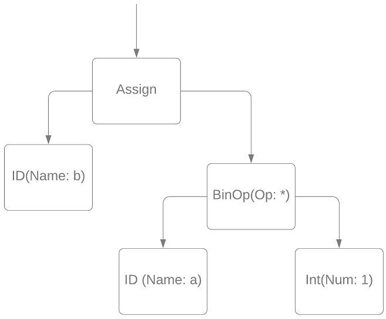
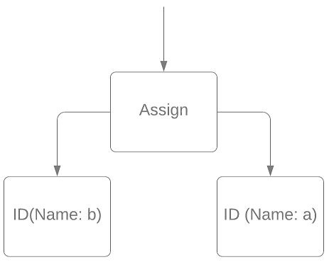
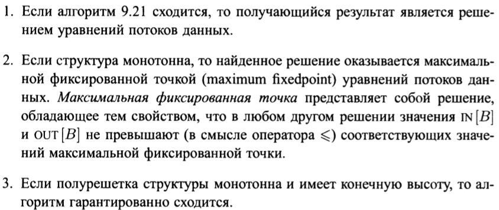

Парсер языка и построение АСТ
-----------------------------

### Постановка задачи

Написать лексер и парсер языка, используя GPLex и Yacc. Реализовать
построение абстрактного синтаксического дерева (АСТ).

### Команда

А. Татарова, Т. Шкуро, А. Пацеев

### Зависимые и предшествующие задачи

Зависимые:

-   Базовые визиторы

-   Генерация трехадресного кода

-   Оптимизации по АСТ

### Теоретическая часть

Решением этой задачи является реализация двух составляющих: лексера и
парсера.

**Лексический анализатор** (или лексер, токенизатор) --- это часть
программы, выполняющая разбор входной последовательности символов на
токены.

**Синтаксический анализатор** (или парсер) --- это часть программы,
преобразующая входной текст (поток токенов) в структурированный формат,
в данном случае происходит преобразование в АСТ.

**Абстрактное синтаксическое дерево** (АСТ) --- это ориентированное
дерево, внутренние вершины сопоставлены с операторами языка, а листья
--- с соответствующими операндами.

### Практическая часть

Для реализации лексера и парсера был выбран Yacc+Lex, создающий
front-end компилятора по описанию грамматики. Для этого генератора
создаются два файла: SimpleLex.lex (описание лексера) и SimpleYacc.y
(описание парсера). Далее генератор на основании этих файлов строит
лексер и парсер на языке C\#.

### Парсер языка

Парсер был реализован для языка со следующим синтаксисом:

``` {.csharp}
var a, b, c, d; // определение переменных
```

``` {.csharp}
// присваивание
a = 10;
d = true;
```

``` {.csharp}
// операторы сравнения
d = a > 5;
d = b < a;
d = b != c;
d = a == b;
```

``` {.csharp}
// бинарные операции
a = a + 1;
b = a - 5;
c = b * a;
b = c / 2;
d = d or false;
d = d and true;
```

``` {.csharp}
// унарные операции
a = -b;
d = !(a < b);
```

``` {.csharp}
// полная форма условного оператора
if c > a
    a = c;
else {
    b = 1;
    a = b;
}
// Сокращенная форма условного оператора
if a < 1 
    c = 5 + 6 + 7; 
```

``` {.csharp}
// цикл while
while x < 25 { 
    x = x + 1; 
    x = x * 2; 
}
// цикл for - всегда идет на увеличение с шагом == 1
for i=2,7 
    a = a + i;
```

``` {.csharp}
input(a); // оператор ввода
print(a,b,c,d); // оператор вывода
```

``` {.csharp}
goto 777; // оператор безусловного перехода
//переход по метке
777: while (b < 20) 
    b = a + 5; 
```

Пример файла описания лексического анализатора (SimpleLex.lex)

``` {.csharp}
{INTNUM} { 
  yylval.iVal = int.Parse(yytext); 
  return (int)Tokens.INUM; 
}

"=" { return (int)Tokens.ASSIGN; }
";"  { return (int)Tokens.SEMICOLON; }
"+" {return (int)Tokens.PLUS; }
```

Пример файла описания синтаксического анализатора (SimpleYacc.y)

``` {.csharp}
%token <iVal> INUM
%token <bVal> BOOL
%token <sVal> ID

%type <eVal> expr ident A B C E T F exprlist
%type <stVal> assign statement for while if input print varlist var labelstatement goto block

stlist  : statement { $$ = new StListNode($1); }
        | stlist statement 
            { 
                $1.Add($2); 
                $$ = $1; 
            }
        ;
statement: assign SEMICOLON { $$ = $1; }
        | for { $$ = $1; }
        | while { $$ = $1; }
        | if { $$ = $1; }
        | block { $$ = $1; }
        | input SEMICOLON { $$ = $1; }
        | print SEMICOLON { $$ = $1; }
        | var SEMICOLON { $$ = $1; }
        | goto SEMICOLON { $$ = $1; }
        | labelstatement { $$ = $1; }
        ;
```

Здесь в фигурных скобках указываются семантические действия (действия,
происходящие для каждого распознанного правила грамматики и придающие
смысл переводу программы в промежуточное представление).

### Абстрактное синтаксическое дерево

В АСТ включаются узлы, соответствующие всем конструкциям языка. В узел
записываются его существенные атрибуты. Например, для узла унарной
операции `UnOpNode` такими атрибутами являются `Expr` и `Op` -
соответственно выражение и операция, применяющаяся к этому выражению.

``` {.csharp}
public class UnOpNode : ExprNode
    {
        public ExprNode Expr
        {
            get { return ExprChildren[0]; }
            set { ExprChildren[0] = value; }
        }
        public OpType Op { get; set; }
        public UnOpNode(ExprNode expr, OpType op)
        {
            Op = op;
            ExprChildren.Add(expr);
        }
    }
```

### Место в общем проекте (Интеграция)

Создание грамматики и парсера и построение АСТ являются первыми шагами в
работе компилятора.

### Пример работы

1.  

``` {.charp}
a = 5;
```

 2.

``` {.charp}
if a > 10
    b = a / 2;
else {
    b = a + b;
    a = b;
}
```


Pretty printer
--------------

### Постановка задачи

Создать визитор, которой по AST-дереву восстанавливает исходный код
программы в отформатированном виде.

### Команда

А. Татарова, Т. Шкуро

### Зависимые и предшествующие задачи

Предшествующие задачи:

-   AST-дерево

### Теоретическая часть

Для восстановления кода программы по AST необходимо совершить обход по
дереву, сохраняя код в поле визитора Text. Класс визитора
PrettyPrintVistor является наследником Visitor. Отступы создаются с
помощью переменной Indent, увеличиваемую на 2 при входе в блок и
уменьшаемую на 2 перед выходом из него.

### Практическая часть

Список методов визитора для обхода узлов:

``` {.csharp}
void VisitBinOpNode(BinOpNode binop) 
void VisitUnOpNode(UnOpNode unop)
void VisitBoolValNode(BoolValNode b)
void VisitAssignNode(AssignNode a)
void VisitBlockNode(BlockNode bl)
void VisitStListNode(StListNode bl)
void VisitVarListNode(VarListNode v)
void VisitForNode(ForNode f)
void VisitWhileNode(WhileNode w)
void VisitLabelstatementNode(LabelStatementNode l)
void VisitGotoNode(GotoNode g)
void VisitIfElseNode(IfElseNode i)
void VisitExprListNode(ExprListNode e)
void VisitPrintNode(PrintNode p)
void VisitInputNode(InputNode i)
```

Примеры реализации методов визитора:

``` {.csharp}
public override void VisitAssignNode(AssignNode a)
{
    Text += IndentStr();
    a.Id.Visit(this);
    Text += " = ";
    a.Expr.Visit(this);
    Text += ";";
}

public override void VisitBlockNode(BlockNode bl)
{
    Text += "{" + Environment.NewLine;
    IndentPlus();
    bl.List.Visit(this);
    IndentMinus();
    Text += Environment.NewLine + IndentStr() + "}";
}
```

### Место в общем проекте (Интеграция)

Визитор используется после создания парсером AST-дерева:

``` {.csharp}
Scanner scanner = new Scanner();
scanner.SetSource(Text, 0);
Parser parser = new Parser(scanner);
var pp = new PrettyPrintVisitor();
parser.root.Visit(pp);
Console.WriteLine(pp.Text);
```

### Пример работы

Исходный код программы:

``` {.csharp}
var a, b, c, d, i; 
a = 5 + 3 - 1;
b = (a - 3) / -b;
if a > b 
{
c = 1;
} else c = 2;
for i=1,5
c = c+1;
d = a <= b;
if c == 6 goto 777;
d = d or a < 10;
777: while c < 25 { 
a = a + 3; 
b = b * 2; 
}
```

Результат работы PrettyPrintVisitor:

``` {.csharp}
var a, b, c, d, i;
a = ((5 + 3) - 1);
b = ((a - 3) / (-b));
if (a > b) {
  c = 1;
}
else
  c = 2;
for i = 1, 5
  c = (c + 1);
d = (a <= b);
if (c == 6)
  goto 777;
d = (d or (a < 10));
777: while (c < 25) {
  a = (a + 3);
  b = (b * 2);
}
```

Создание базового визитора для оптимизаций абстрактного синтаксического дерева
------------------------------------------------------------------------------

### Постановка задачи

Написать базовый визитор, на основе которого будут создаваться визиторы
оптимизаций по абстрактному синтаксическому дереву.

### Команда

Д.Володин, А.Татарова, Т.Шкуро

### Зависимые и предшествующие задачи

Предшествующие:

-   Базовые визиторы
-   Построение AST

Зависимые:

-   Визиторы-оптимизации по AST
-   Общий алгоритм оптимизации по AST

### Теоретическая часть

Для оптимизаций в AST требуется иметь функционал заменяны выражения на
выражение, а также оператора на оператор. Более того, хотелось бы
избежать специфичной обработки каждого вида узлов в дереве.

### Практическая часть

Для обобщения работы со всеми видами узлов в дереве, вместо специфичных
каждому виду элементов (`Left`/`Right` для `BinOpNode` и т.д.) в данном
визиторе используются обобщённые списки
`List<ExprNode> ExprChildren`/`List<StatementNode> StatChildren`,
которые хранятся во всех узлах дерева. Таким образом, замена выражения
`from` на выражение `to` тривиальна: родителем выражения `to` нужно
назначить родителя выражения `from`, а далее заменить `from` на `to` в
списке дочерних выражений родителя `from`. Дополнительно класс имеет
публичное свойство `Changed`, которое равно `true`, когда конкретный
визитор произвёл какую-либо замену.

``` {.csharp}
public void ReplaceExpr(ExprNode from, ExprNode to)
{
    var p = from.Parent;
    to.Parent = p;
    if (p.ExprChildren.Count > 0)
    {
        for (var i = 0; i < p.ExprChildren.Count; ++i)
        {
            if (p.ExprChildren[i] == from)
            {
                p.ExprChildren[i] = to;
                Changed = true;
                break;
            }
        }
    }
    else
    {
        throw new Exception("Parent node doesn't contain expressions.");
    }
}
```

Замена операторов полностью идентична, за исключением отдельной
обработки случая, когда `to` это `BlockNode`. Чтобы избежать ненужных
фигурных скобок, блок заменяется на список своих операторов, а если он
содержит всего лишь один оператор, то на этот оператор.

``` {.csharp}
p.StatChildren[i] = to is BlockNode block
    ? block.List.StatChildren.Count == 1
        ? block.List.StatChildren[0] : block.List
    : to;
```

### Место в общем проекте (Интеграция)

Все визиторы оптимизаций по AST наследуют данный класс.

### Тесты

Тестированию подвергаются наследники данного класса, которые реализуют
конкретные оптимизации на AST.

AST-оптимизация заменой оператора присваивания вида x = x на пустой узел {#ast-оптимизация-заменой-оператора-присваивания-вида-x--x-на-пустой-узел}
------------------------------------------------------------------------

### Постановка задачи

Реализовать оптимизацию по AST дереву вида x = x =\> null

### Команда

Карякин В.В., Карякин Д.В.

### Зависимые и предшествующие задачи

Предшествующие задачи:

-   построение AST дерева
-   базовые визиторы по AST дереву

### Теоретическая часть

Принцип работы данной оптимизации показан с помощью блок-схем,
соответствующих некоторому поддереву абстрактного синтаксического
дерева.

Ниже приведена блок-схема, которая соответствует строчке кода `x = x;` .
Узел `Assign` подлежит оптимизации.


Данный узел `Assign` должен быть заменён на пустой узел `EmptyNode`.
Блок-схема ниже показывает, что происходит после применения этой
оптимизации.


### Практическая часть

Данная оптимизация реализована в виде визитора, унаследованного от
класса `ChangeVisitor`. В визиторе переопределяется метод
`VisitAssignNode`, таким образом, чтобы при присваивании вида `x = x`
данный узел абстрактного синтаксического дерева заменялся на `EmptyNode`
с помощью метода `ReplaceStat` унаследованного от класса
`ChangeVisitor`.

Реализация оптимизации:

``` {.csharp}
/* OptAssignEquality.cs */
public class OptAssignEquality : ChangeVisitor
{
    public override void VisitAssignNode(AssignNode n)
    {
        if (n.Expr is IdNode idn && n.Id.Name == idn.Name)
        {
            ReplaceStat(n, new EmptyNode());
        }
    }
}
```

### Место в общем проекте (Интеграция)

Данная оптимизация выполняется вместе с остальными оптимизациями по
абстрактному синтаксическому дереву.

``` {.csharp}
/* ASTOptimizer.cs */
public static List<ChangeVisitor> Optimizations { get; } = new List<ChangeVisitor>
{
    /* ... */
    new OptAssignEquality(),
    /* ... */
};
```

### Тесты

Метод `BuildAST` используется для создания абстрактного синтаксического
дерева по переданной ему строке кода. Схема тестирования выглядит
следующим образом: сначала по заданному тексту программы генерируется
AST, затем применяется оптимизация, после сравниваются строка ожидаемого
результата и строка полученная с помощью визитора `PrettyPrintVisitor`
по оптимизированному абстрактному дереву. Пустая строчка соответствуют
пустому оператору. Ниже приведён один из тестов.

``` {.csharp}
[Test]
public void RemoveNode() {
    var AST = BuildAST(@"
var a, b;
a = a;
{ b = b; }
");
    var expected = @"var a, b;

{

}";
    var opt = new OptAssignEquality();
    AST.root.Visit(opt);
    var pp = new PrettyPrintVisitor();
    AST.root.Visit(pp);
    Assert.AreEqual(expected, pp.Text);
}
```

AST-оптимизация замены оператора сравнения двух значений на его булево значение
-------------------------------------------------------------------------------

### Постановка задачи

Реализовать оптимизацию по AST дереву вида false == false -\> true, 5 ==
6 -\> false

### Команда

А. Пацеев, И. Ушаков

### Зависимые и предшествующие задачи

Предшествующие задачи:

-   Построение AST дерева

### Теоретическая часть

Реализовать оптимизацию по AST дереву вида false == false -\> true, 5 ==
6 -\> false

-   До

``` {.csharp}
  5 == 5
  5 == 6
  false == false
  true == false
```

-   После

``` {.csharp}
true
false
true
false
```

### Практическая часть

Эта оптимизация представляет собой визитор, унаследованный от
ChangeVisitor. Пример реализации метода:

``` {.csharp}
internal class OptExprEqualBoolNum : ChangeVisitor
    {
        public override void PostVisit(Node n)
        {
            if (n is BinOpNode binop)
            {
                switch (binop.Op)
                {
                    case OpType.EQUAL:
                        if (binop.Left is IntNumNode leftNode2 && binop.Right is IntNumNode rightNode2)
                        {
                            ReplaceExpr(binop, new BoolValNode(leftNode2.Num == rightNode2.Num));
                            break;
                        }
                        if (binop.Left is BoolValNode leftNode3 && binop.Right is BoolValNode rightNode3)
                        {
                            ReplaceExpr(binop, new BoolValNode(leftNode3.Val == rightNode3.Val));
                        }
                        break;
                }
            }
        }
    }
```

### Место в общем проекте (Интеграция)

``` {.csharp}
public static List<ChangeVisitor> Optimizations { get; } = new List<ChangeVisitor>
       {
             /* ... */
           new OptExprEqualBoolNum(),
             /* ... */
       };

       public static void Optimize(Parser parser)
       {
           int optInd = 0;
           do
           {
               parser.root.Visit(Optimizations[optInd]);
               if (Optimizations[optInd].Changed)
                   optInd = 0;
               else
                   ++optInd;
           } while (optInd < Optimizations.Count);
       }
```

### Тесты

``` {.csharp}
[Test]
public void SumNumTest()
{
    var AST = BuildAST(@"
var b, c, d;
b = true == true;
while (5 == 5)
  c = true == false;
d = 7 == 8;");
    var expected = new[] {
        "var b, c, d;",
        "b = true;",
        "while true",
        "  c = false;",
        "d = false;"
    };

    var result = ApplyOpt(AST, new OptExprEqualBoolNum());
    CollectionAssert.AreEqual(expected, result);
}
```

AST-оптимизации свертки и устранения унарных операций
-----------------------------------------------------

### Постановка задачи

Реализовать оптимизации по AST дереву:

1.  Свертка двух унарных операций

-   op a == op a =\> True
-   op a != op a =\> False где op = {!, -}
-   !a == a =\> False
-   a != !a =\> True

2.  Устранение унарной операции

-   Превращение унарной операции «минус» с узлом целых чисел с Num==1 в
    узел целых чисел с Num==-1
-   !True=\> False и !False =\> True
-   !!a=\>a
-   \--a =\> a

### Команда

А. Татарова, Т. Шкуро

### Зависимые и предшествующие задачи

Предшествующие:

-   Построение AST-дерева
-   Базовые визиторы

### Теоретическая часть

Данные оптимизации должны по необходимым условиям преобразовать
поддерево АСТ таким образом:

1.  


2.  


### Практическая часть

1.  Свертка двух унарных операций Данная оптимизация заходит только в
    узлы бинарных операций. Прежде всего проверяются необходимые
    условия: левый и правый операнды представляют собой узлы унарных
    операций и тип бинарной операции \"равно\" или \"неравно\". После
    разбирается, что в этих операндах только одна и так же
    переменная/константа, что тип унарных операций одинаков и т.д. Если
    условия выполняются, в родительском узле происходит замена бинарной
    операции на значение Boolean. В противном случае узел обрабатывается
    по умолчанию.

``` {.csharp}
public override void VisitBinOpNode(BinOpNode binop)
{
    var left = binop.Left as UnOpNode;
    var right = binop.Right as UnOpNode;
    
    if (left != null && right != null && left.Op == right.Op && left.Expr is IdNode idl)
    {
        if (right.Expr is IdNode idr && idl.Name == idr.Name)
        {
            if (binop.Op == OpType.EQUAL)
            {
                ReplaceExpr(binop, new BoolValNode(true));
            }
            if (binop.Op == OpType.NOTEQUAL)
            {
                ReplaceExpr(binop, new BoolValNode(false));
            }
        }
    }
    else
    if (left != null && left.Op == OpType.NOT && left.Expr is IdNode
        && binop.Right is IdNode && (left.Expr as IdNode).Name == (binop.Right as IdNode).Name)
    {
        /*...*/
    }
    else
    if (right != null && right.Op == OpType.NOT && right.Expr is IdNode
        && binop.Left is IdNode && (right.Expr as IdNode).Name == (binop.Left as IdNode).Name)
    {
        /*...*/
    }
    else
    {
        base.VisitBinOpNode(binop);
    }
}
```

2.  Устранение унарных операций Данная оптимизация работает с узлами
    унарных операций. Прежде всего проверяется: выражение должно быть
    переменной или константой. Если условие не выполняется, то узел
    обрабатывается по умолчанию. Если условие выполняется, то
    производятся следующие проверки и действия при их выполнении:

-   если выражение было целочисленной константой, в родительском узле
    происходит замена унарной операции на узел целых чисел со значением,
    умноженным на -1;
-   если выражение было значением Boolean, в родительском узле
    происходит замена унарной операции на значение Boolean, взятое с
    отрицанием (было !true, стало false);
-   если выражение было переменной, то дополнительно проверяется,
    является ли родительский узел так же унарной операцией с тем же
    типом операции. Если является, то в родительском узле второго
    порядка происходит замена выражения на переменную.

``` {.csharp}
public override void VisitUnOpNode(UnOpNode unop)
{
    if (unop.Expr is IntNumNode num)
    {
        if (unop.Op == OpType.UNMINUS)
        {
            ReplaceExpr(unop, new IntNumNode(-1 * num.Num));
        }
        //...
    }
    else if (unop.Expr is BoolValNode b)
    {
        if (unop.Op == OpType.NOT)
        {
            ReplaceExpr(unop, new BoolValNode(!b.Val));
        }
        //...
    }
    else if (unop.Expr is IdNode)
    {
        if (unop.Parent is UnOpNode && (unop.Parent as UnOpNode).Op == unop.Op)
        {
            ReplaceExpr(unop.Parent as UnOpNode, unop.Expr);
        }
    }
    else
    {
        base.VisitUnOpNode(unop);
    }
}
```

### Место в общем проекте (Интеграция)

Данные оптимизации выполняются вместе с остальными АСТ оптимизациями
после построения абстрактного синтаксического дерева, но до генерации
трехадресного кода.

### Тесты

1.  Свертка двух унарных операций

``` {.csharp}
[Test]
public void EqualIDTest() {
    var AST = BuildAST(@"
var a, b;
b = !a == !a;
b = !a != !a;
");
    var expected = new[] {
        "var a, b;",
        "b = true;",
        "b = false;"
    };

    var result = ApplyOpt(AST, new OptExprFoldUnary());
    CollectionAssert.AreEqual(expected, result);
}

[Test]
public void LeftRightUnaryTest()
{
    var AST = BuildAST(@"
var a, b;
b = !a == a;
b = !a != a;
b = a == !a;
b = a != !a;
");
    var expected = new[] {
        "var a, b;",
        "b = false;",
        "b = true;",
        "b = false;",
        "b = true;"
    };

    var result = ApplyOpt(AST, new OptExprFoldUnary());
    CollectionAssert.AreEqual(expected, result);
}
```

2.  Устранение унарных операций

``` {.csharp}
 [Test]
public void TransformToIntTest() {
    var AST = BuildAST(@"
var a, b;
a = (-1);
");
    var expected = new[] {
        "var a, b;",
        "a = -1;"
    };

    var result = ApplyOpt(AST, new OptExprTransformUnaryToValue());
    CollectionAssert.AreEqual(expected, result);
    Assert.IsNotNull((AST.root.StatChildren[1] as AssignNode).Expr is IntNumNode);
}

[Test]
public void TransformToBoolTest()
{
    var AST = BuildAST(@"
var a, b;
a = !true;
b = !false;
");
    var expected = new[] {
        "var a, b;",
        "a = false;",
        "b = true;"
    };
    /*..*/
}

[Test]
public void TransformTwiceUnaryTest()
{
    var AST = BuildAST(@"
var a, b;
a = !!b;
b = --a;
a = --b - ---a;
");
    var expected = new[] {
        "var a, b;",
        "a = b;",
        "b = a;",
        "a = (b - (-a));"
    };
    /*..*/
}
```

AST-оптимизация замены сравнения переменной с собой на true
-----------------------------------------------------------

### Постановка задачи

Реализовать оптимизацию по абстрактному синтаксическому дереву ---
замена сравнения переменной с собой на true:

-   a == a =\> true
-   a \<= a =\> true
-   a \>= a =\> true

### Команда

Д. Володин, Н. Моздоров

### Зависимые и предшествующие задачи

Предшествующие:

-   Построение AST-дерева
-   Базовые визиторы

### Теоретическая часть

Данная оптимизация выполняется на абстрактном синтаксическом дереве,
построенном для данной программы. Необходимо найти в нём узлы,
содержащие операции сравнения (==, \<=, \>=) с одной и той же
переменной, и заменить эти сравнения на True.

### Практическая часть

Нужная оптимизация производится с применением паттерна Visitor, для
этого созданный класс наследует `ChangeVisitor` и переопределяет метод
`PostVisit`.

``` {.csharp}
internal class OptExprEqualToItself : ChangeVisitor
{
    public override void PostVisit(Node n)
    {
        if (n is BinOpNode binop)
        {
            if (binop.Left is IdNode Left && binop.Right is IdNode Right && Left.Name == Right.Name &&
            (binop.Op == OpType.EQUAL || binop.Op == OpType.EQLESS || binop.Op == OpType.EQGREATER))
            {
                ReplaceExpr(binop, new BoolValNode(true));
            }
        }
    }
}
```

### Место в общем проекте (Интеграция)

Данная оптимизация применяется в классе `ASTOptimizer` наряду со всеми
остальными оптимизациями по абстрактному синтаксическому дереву.

### Тесты

В ходе тестирования мы строим абстрактное дерево по исходному коду
программы (`BuildAST(sourceCode)`), затем запускаем оптимизацию на этом
дереве (`ApplyOpt`) и наконец сравниваем полученный результат с
ожидаемым результатом `ExpectedResult`.

``` {.csharp}
[TestCase(@"
var a;
a = a == a;
",
    ExpectedResult = new[]
    {
        "var a;",
        "a = true;"
    },
    TestName = "EQUAL")]
[TestCase(@"
var a;
a = a <= a;
",
    ExpectedResult = new[]
    {
        "var a;",
        "a = true;"
    },
    TestName = "EQLESS")]
[TestCase(@"
var a;
a = a >= a;
",
    ExpectedResult = new[]
    {
        "var a;",
        "a = true;"
    },
    TestName = "EQGREATER")]
public string[] TestOptimization(string sourceCode) => ApplyOpt(BuildAST(sourceCode), new OptExprVarEqualToItself());
```

AST-оптимизация замены сравнения переменной с собой на булевскую константу false
--------------------------------------------------------------------------------

### Постановка задачи

Реализовать оптимизацию по AST дереву вида (a \> a, a != a ) = False

### Команда

К. Галицкий, А. Черкашин

### Зависимые и предшествующие задачи

Предшествующие задачи:

-   AST дерево

### Теоретическая часть

Реализовать оптимизацию по AST дереву вида (a \> a, a != a ) = False:

-   До

``` {.csharp}
#t1 = a > a;
```

-   После

``` {.csharp}
#t1 = False;
```

-   До

``` {.csharp}
#t1 = a != a;
```

-   После

``` {.csharp}
#t1 = False;
```

### Практическая часть

Если в выражениях вида \"\>\", \"\<\", \"!=\" операции сравнения
проводятся с одной и той же переменной, необходимо заменить сравнение на
результат \"False\". Пример реализации метода:

``` {.csharp}
public override void VisitBinOpNode(BinOpNode binop)
{
    if (
        binop.Left is IntNumNode iLeft && binop.Right is IntNumNode iRight && iLeft.Num == iRight.Num 
        && (binop.Op == OpType.GREATER || binop.Op == OpType.LESS || binop.Op == OpType.NOTEQUAL)
        || binop.Left is IdNode idLeft && binop.Right is IdNode idRight && idLeft.Name == idRight.Name 
        && (binop.Op == OpType.GREATER || binop.Op == OpType.LESS || binop.Op == OpType.NOTEQUAL)
        )
    {
        ReplaceExpr(binop, new BoolValNode(false));
    }
    else
    {
        base.VisitBinOpNode(binop);
    }

}
```

### Место в общем проекте (Интеграция)

Данная оптимизация выполняется на AST-дереве, построенном для данной
программы. Применяется в классе `ASTOptimizer`.

``` {.csharp}
public static List<ChangeVisitor> Optimizations { get; } = new List<ChangeVisitor>
       {
             /* ... */
           new OptExprSimilarNotEqual(),
             /* ... */
       };
```

### Тесты

В тестах проверяется работоспособность оптимизации и соответствие
результатов:

``` {.csharp}
public void SimilarNotEqualTest()
{
    var AST = BuildAST(@"
var a, b, d, k, c;
c = a>a;
b = k<k;
d = a != a;
d = 1 > 1;
");

    var expected = new[] {
        "var a, b, d, k, c;",
        "c = false;",
        "b = false;",
        "d = false;",
        "d = false;",
    };

    var result = ApplyOpt(AST, new OptExprSimilarNotEqual());
    CollectionAssert.AreEqual(expected, result);
}
```

AST-оптимизация умножения на единицу слева и справа, деления на единицу справа
------------------------------------------------------------------------------

### Постановка задачи

Реализовать оптимизацию по AST дереву вида a\*1 = a, 1\*a = a, a/1 = a

### Команда

А. Татарова, Т. Шкуро

### Зависимые и предшествующие задачи

Предшествующие:

-   Построение AST-дерева
-   Базовые визиторы
-   ChangeVisitor (?)

### Теоретическая часть

Эта оптимизация представляет собой визитор, унаследованный от
ChangeVisitor и меняющий ссылки между узлами ACT. Рассмотрим некие узлы
АСТ:

 Эта
блок-схема соответствует строчке `b = a * 1`. Данная оптимизация должна
отработать так: `b = a`. Блок-схема ниже показывает, что происходит с
деревом после применения этой оптимизации:



### Практическая часть

Алгоритм заходит только в узлы бинарных операций. Прежде всего
проверяются необходимые условия: тип операции либо умножение, либо
деление и что один из операндов это единица. Если условия выполняются, в
родительском узле происходит замена бинарной операции на переменную. В
противном случае узел обрабатывается по умолчанию.

``` {.csharp}
internal class OptExprMultDivByOne : ChangeVisitor
{
    public override void VisitBinOpNode(BinOpNode binop)
    {
        switch (binop.Op)
        {
            case OpType.MULT:
                if (binop.Left is IntNumNode && (binop.Left as IntNumNode).Num == 1)
                {
                    binop.Right.Visit(this);
                    ReplaceExpr(binop, binop.Right);
                }
                else if (binop.Right is IntNumNode && (binop.Right as IntNumNode).Num == 1)
                {
                    binop.Left.Visit(this);
                    ReplaceExpr(binop, binop.Left);
                }
                else
                {
                    base.VisitBinOpNode(binop);
                }
                break;

            case OpType.DIV:
                if (binop.Right is IntNumNode && (binop.Right as IntNumNode).Num == 1)
                {
                    binop.Left.Visit(this);
                    ReplaceExpr(binop, binop.Left);
                }
                break;

            default:
                base.VisitBinOpNode(binop);
                break;
            }
        }
    }
```

### Место в общем проекте (Интеграция)

Данная оптимизация выполняется вместе с остальными АСТ оптимизациями
после построения абстрактного синтаксического дерева, но до генерации
трехадресного кода.

### Тесты

``` {.csharp}
[Test]
public void MultAndDivByLeftRightOne()
{
    var AST = BuildAST(@"
var a, b;
a = 1 * a * 1 + (1 * b / 1) * 1 / 1;
");

    var expected = new[] {
    "var a, b;",
        "a = (a + b);"
    };

    var result = ApplyOpt(AST, new OptExprMultDivByOne());
    CollectionAssert.AreEqual(expected, result);
}
```

AST-оптимизация заменой условного оператора на пустой оператор
--------------------------------------------------------------

### Постановка задачи

Реализовать оптимизацию по AST дереву вида if (ex) null; else null; =\>
null

### Команда

Карякин В.В., Карякин Д.В.

### Зависимые и предшествующие задачи

Предшествующие задачи:

-   построение AST дерева
-   базовые визиторы по AST дереву

### Теоретическая часть

Принцип работы данной оптимизации показан с помощью блок-схем,
соответствующих некоторому поддереву абстрактного синтаксического
дерева.

Ниже приведена блок-схема, которая соответствует условному оператору с
пустыми узлами по true и false ветке выполнения. Узел `IfNode` подлежит
оптимизации.


Данный узел `IfNode` должен быть заменён на пустой узел `EmptyNode`.
Блок-схема ниже показывает, что происходит после применения этой
оптимизации.


### Практическая часть

Данная оптимизация реализована в виде визитора, унаследованного от
класса `ChangeVisitor`. В визиторе переопределяется метод `PostVisit`,
таким образом, чтобы при значении `EmptyNode` или `null` веток по true и
false условного оператора данный узел абстрактного синтаксического
дерева заменялся на `EmptyNode` с помощью метода `ReplaceStat`
унаследованного от класса `ChangeVisitor`.

Реализация оптимизации:

``` {.csharp}
/* IfNullElseNull.cs */
public class IfNullElseNull : ChangeVisitor
{
    public override void PostVisit(Node n)
    {
        if (n is IfElseNode ifn)
        {
            if ((ifn.FalseStat is EmptyNode || ifn.FalseStat == null)
                && (ifn.TrueStat is EmptyNode || ifn.TrueStat == null))
            {
                ReplaceStat(ifn, new EmptyNode());
            }
        }
    }
}
```

### Место в общем проекте (Интеграция)

Данная оптимизация выполняется вместе с остальными оптимизациями по
абстрактному синтаксическому дереву.

``` {.csharp}
/* ASTOptimizer.cs */
public static List<ChangeVisitor> Optimizations { get; } = new List<ChangeVisitor>
{
    /* ... */
    new IfNullElseNull(),
    /* ... */
};
```

### Тесты

Абстрактное синтаксическое дерево для данной оптимизации создаётся в
тесте. Схема тестирования выглядит следующим образом: сначала создаётся
AST, затем применяется оптимизация, после проверяется AST. Ниже
приведёны несколько тестов.

``` {.csharp}
[Test]
public void RemoveInnerIf1()
{
    // if (a)
    //   if (b) EmptyNode; else EmptyNode;
    var ifInner = new IfElseNode(new IdNode("b"), new EmptyNode(), new EmptyNode());
    var ifOuter = new IfElseNode(new IdNode("a"), ifInner);
    ifInner.Parent = ifOuter;

    var root = new StListNode(ifOuter);
    ifOuter.Parent = root;

    var opt = new IfNullElseNull();
    root.Visit(opt);

    Assert.IsNull(root.Parent);
    Assert.AreEqual(root.ExprChildren.Count, 0);
    Assert.AreEqual(root.StatChildren.Count, 1);
    Assert.IsTrue(root.StatChildren[0].GetType() == typeof(ProgramTree.EmptyNode));
}

[Test]
public void RemoveInBlock()
{
    // { if (a) EmptyNode; }
    // { if (a) EmptyNode; else EmptyNode; }
    var if1 = new IfElseNode(new IdNode("a"), new EmptyNode());
    var if2 = new IfElseNode(new IdNode("a"), new EmptyNode(), new EmptyNode());

    var block1 = new BlockNode(new StListNode(if1));
    var block2 = new BlockNode(new StListNode(if2));
    if1.Parent = block1;
    if2.Parent = block2;

    var root = new StListNode(block1);
    root.Add(block2);
    block1.Parent = block2.Parent = root;

    var opt = new IfNullElseNull();
    root.Visit(opt);

    Assert.IsNull(root.Parent);
    Assert.AreEqual(root.ExprChildren.Count, 0);
    Assert.AreEqual(root.StatChildren.Count, 2);

    foreach (var node in root.StatChildren)
    {
        Assert.IsTrue(node.GetType() == typeof(ProgramTree.BlockNode));
        Assert.AreEqual(node.ExprChildren.Count, 0);
        Assert.AreEqual(node.StatChildren.Count, 1);
        Assert.IsTrue(node.StatChildren[0].GetType() == typeof(ProgramTree.EmptyNode));
    }
}
```

AST-оптимизация замены if(true) на его true ветку
-------------------------------------------------

### Постановка задачи

Реализовать оптимизацию по AST дереву вида if(true) st1 else st2 =\> st1

### Команда

А. Татарова, Т. Шкуро, Д. Володин, Н. Моздоров

### Зависимые и предшествующие задачи

Предшествующие задачи:

-   AST дерево

### Теоретическая часть

Реализовать оптимизацию по AST дереву вида if(true) st1 else st2 =\> st1

-   До

``` {.csharp}
if(true)
  st1;
else
  st2;
```

-   После

``` {.csharp}
st1;
```

### Практическая часть

Примеры реализации метода:

``` {.csharp}
    if (n is IfElseNode ifNode)  // Если это корень if
        if (ifNode.Expr is BoolValNode boolNode && boolNode.Val) // Если выражение == true
        {
            if (ifNode.TrueStat != null)
            {
                ifNode.TrueStat.Visit(this);
            }
            ReplaceStat(ifNode, ifNode.TrueStat);
        }
```

### Место в общем проекте (Интеграция)

``` {.csharp}
public static List<ChangeVisitor> Optimizations { get; } = new List<ChangeVisitor>
       {
             /* ... */
           new OptStatIftrue(),
             /* ... */
       };

       public static void Optimize(Parser parser)
       {
           int optInd = 0;
           do
           {
               parser.root.Visit(Optimizations[optInd]);
               if (Optimizations[optInd].Changed)
                   optInd = 0;
               else
                   ++optInd;
           } while (optInd < Optimizations.Count);
       }
```

### Тесты

В тестах проверяется, что данная оптимизация на месте условного
оператора `if(true)` оставляет только true-ветку

``` {.csharp}
[Test]
public void IfTrueComplexTest()
{
    var AST = BuildAST(@"
var a, b;
if true
if true {
a = b;
b = 1;
}
else
a = 1;

if a > b{
a = b;
if true{
b = b + 1;
b = b / 5;
}
}
");

    var expected = new[] {
        "var a, b;",
        "a = b;",
        "b = 1;",
        "if (a > b) {",
        "  a = b;",
        "  b = (b + 1);",
        "  b = (b / 5);",
        "}"
    };

    var result = ApplyOpt(AST, new OptStatIfTrue());
    CollectionAssert.AreEqual(expected, result);
}
```

AST-оптимизация замены if(false) на его else ветку
--------------------------------------------------

### Постановка задачи

Реализовать оптимизацию по AST дереву вида if(false) st1 else st2 =\>
st2

### Команда

К. Галицкий, А. Черкашин

### Зависимые и предшествующие задачи

Предшествующие задачи:

-   AST дерево

### Теоретическая часть

Реализовать оптимизацию по AST дереву вида if(false) st1 else st2 =\>
st2

-   До

``` {.csharp}
if(false)
  st1;
else
  st2;
```

-   После

``` {.csharp}
st2;
```

### Практическая часть

Если условием выражения \"if\" является константа \"false\" необходимо
заменить все выражение на его \"else ветку\", в случае отсутствия ветки
\"else\" производим замену на пустой оператор. Пример реализации метода:

``` {.csharp}
    if (n is IfElseNode ifNode)  // Если это корень if
        if (ifNode.Expr is BoolValNode boolNode && boolNode.Val == false) // Если выражение == false
        {
            if (ifNode.FalseStat != null)  // Если ветка fasle не NULL
            {
                ifNode.FalseStat.Visit(this);
                ReplaceStat(ifNode, ifNode.FalseStat);  //  Меняем наш корень на ветку else
            }
            else 
            {
                ReplaceStat(ifNode, new EmptyNode());
            }
        }
```

### Место в общем проекте (Интеграция)

Данная оптимизация выполняется на AST-дереве, построенном для данной
программы. Применяется в классе `ASTOptimizer`.

``` {.csharp}
public static List<ChangeVisitor> Optimizations { get; } = new List<ChangeVisitor>
       {
             /* ... */
           new OptStatIfFalse(),
             /* ... */
       };


### Тесты
В тестах проверяется работоспособность оптимизации и соответствие результатов:
```csharp
[Test]
public void IfFalseBlockTest()
{
    var AST = BuildAST(@"
var a, b;
if false {
a = b;
b = 1;
}
else
a = 1;
");

    var expected = new[] {
        "var a, b;",
        "a = 1;"
    };

    var result = ApplyOpt(AST, new OptStatIfFalse());
    CollectionAssert.AreEqual(expected, result);
}
```

AST-оптимизация замены while(false) st ветки на null
----------------------------------------------------

### Постановка задачи

Реализовать оптимизацию по AST дереву вида while (false) st на null

### Команда

А. Пацеев, И. Ушаков

### Зависимые и предшествующие задачи

Предшествующие задачи:

-   AST дерево

### Теоретическая часть

Реализовать оптимизацию по AST дереву вида while(false) st -\> null

-   До

``` {.csharp}
  while (false) 
      a = 5; 
```

-   После

``` {.csharp}
  null
```

### Практическая часть

Эта оптимизация представляет собой визитор, унаследованный от
ChangeVisitor. Пример реализации метода:

``` {.csharp}
internal class OptWhileFalseVisitor : ChangeVisitor
    {
        public override void PostVisit(Node nd)
        {
            if (!(nd is WhileNode n))
            {
                return;
            }

            if (n.Expr is BoolValNode bn && !bn.Val)
            {
                ReplaceStat(n, new EmptyNode());
            }
            else
            {
                n.Expr.Visit(this);
            }
        }
    }
```

### Место в общем проекте (Интеграция)

``` {.csharp}
public static List<ChangeVisitor> Optimizations { get; } = new List<ChangeVisitor>
       {
             /* ... */
           new OptWhileFalseVisitor(),
             /* ... */
       };

       public static void Optimize(Parser parser)
       {
           int optInd = 0;
           do
           {
               parser.root.Visit(Optimizations[optInd]);
               if (Optimizations[optInd].Changed)
                   optInd = 0;
               else
                   ++optInd;
           } while (optInd < Optimizations.Count);
       }
```

### Тесты

``` {.csharp}
[Test]
public void TestShouldCreateNoop()
{
    var AST = BuildAST(@"var a;
while false
a = true;");
    var expected = new[] {
        "var a;"
    };

    var result = ApplyOpt(AST, new OptWhileFalseVisitor());
    CollectionAssert.AreEqual(expected, result);
}

[Test]
public void TestShouldNotCreateNoop()
{
    var AST = BuildAST(@"var a;
a = false;
while a
a = true;");

    var expected = new[] {
        "var a;",
        "a = false;",
        "while a",
        "  a = true;"
    };

    var result = ApplyOpt(AST, new OptWhileFalseVisitor());
    CollectionAssert.AreEqual(expected, result);
}
```

Генерация трехадресного кода
----------------------------

### Постановка задачи

Реализовать генерацию трехадресного кода для всех инструкций языка

### Команда

Д. Володин, А. Татарова, Т. Шкуро

### Зависимые и предшествующие задачи

Предшествующие:

-   Построение АСТ
-   Базовые визиторы

Зависимые:

-   Разбиение на базовые блоки

### Теоретическая часть

**Трехадресный код** (ТАК) --- это линеаризованное абстрактное
синтаксическое дерево, из которого восстановить текст программы уже
нельзя. В трехадресном коде в правой части выражении допускается только
один оператор, т.е. выражение `x+y*z` транслируется как

    t1 = y * z
    t2 = x + t1

где `t1`,`t2` -- временные переменные.

На примере ниже можно увидеть разбор АСТ узлов, соответствующих
выражению `a = a + b * c`


Представление треахдресного кода является четверкой полей (op, arg1,
arg2, res). На рисунке ниже показано, как разбирается выражение
`a = b * (-c) + b * (-c)` в виде треахдресного кода и представляется в
таблице четверками:


Для хранения меток перехода добавляется еще одно поле Label, и тогда
транслируемые инструкции становятся пятерками полей.

### Практическая часть

Для транслирования АСТ в трехадресный код создан класс Instruction, в
котором хранится пятерка полей

``` {.csharp}
public string Label { get; internal set; }
public string Operation { get; }
public string Argument1 { get; }
public string Argument2 { get; }
public string Result { get; }
```

Генератор трехадресного кода представляет собой визитор, обходящий все
узлы и генерирующий определенные инструкции в зависимости от типа узла:

-   для выражений

``` {.csharp}
private string Gen(ExprNode ex)
{
    if (ex.GetType() == typeof(BinOpNode))
    {
        var bin = (BinOpNode)ex;
        var argument1 = Gen(bin.Left);
        var argument2 = Gen(bin.Right);
        var result = ThreeAddressCodeTmp.GenTmpName();
        GenCommand("", bin.Op.ToString(), argument1, argument2, result);
        return result;
    }
    else if (ex.GetType() == typeof(UnOpNode))
    {
        /*..*/
    }
    else if (ex.GetType() == typeof(IdNode))
    {
        var id = (IdNode)ex;
        return id.Name;
    }
    else if (ex.GetType() == typeof(IntNumNode))
    {
        /*..*/
    }
    else if (ex.GetType() == typeof(BoolValNode))
    {
        /*..*/
    }
    return null;
}
```

-   для оператора присваивания

``` {.csharp}
public override void VisitAssignNode(AssignNode a)
{
    var argument1 = Gen(a.Expr);
    GenCommand("", "assign", argument1, "", a.Id.Name);
}
```

-   для условного оператора

``` {.csharp}
public override void VisitIfElseNode(IfElseNode i)
{
    var exprTmpName = Gen(i.Expr);
    var trueLabel = ThreeAddressCodeTmp.GenTmpLabel();
    if (i.TrueStat is LabelStatementNode label)
    {
        trueLabel = label.Label.Num.ToString();
    }
    else
    if (i.TrueStat is BlockNode block
        && block.List.StatChildren[0] is LabelStatementNode labelB)
    {
        trueLabel = labelB.Label.Num.ToString();
    }
    var falseLabel = ThreeAddressCodeTmp.GenTmpLabel();
    GenCommand("", "ifgoto", exprTmpName, trueLabel, "");

    i.FalseStat?.Visit(this);
    GenCommand("", "goto", falseLabel, "", "");
    var instructionIndex = Instructions.Count;
    
    i.TrueStat.Visit(this);
    Instructions[instructionIndex].Label = trueLabel;
    GenCommand(falseLabel, "noop", "", "", "");
}
```

-   для цикла while

``` {.csharp}
 public override void VisitWhileNode(WhileNode w)
{
    var exprTmpName = Gen(w.Expr);
    var whileHeadLabel = ThreeAddressCodeTmp.GenTmpLabel();
    var whileBodyLabel = ThreeAddressCodeTmp.GenTmpLabel();
    var exitLabel = ThreeAddressCodeTmp.GenTmpLabel();

    Instructions[Instructions.Count - 1].Label = whileHeadLabel;
    GenCommand("", "ifgoto", exprTmpName, whileBodyLabel, "");
    GenCommand("", "goto", exitLabel, "", "");
    var instructionIndex = Instructions.Count;
    w.Stat.Visit(this);
    Instructions[instructionIndex].Label = whileBodyLabel;
    GenCommand("", "goto", whileHeadLabel, "", "");
    GenCommand(exitLabel, "noop", "", "", "");
}
```

-   для цикла for (необходимо отметить: здесь делается допущение, что
    for шагает на +1 до границы, не включая ее)

``` {.csharp}
 public override void VisitForNode(ForNode f)
{
    var Id = f.Id.Name;
    var forHeadLabel = ThreeAddressCodeTmp.GenTmpLabel();
    var exitLabel = ThreeAddressCodeTmp.GenTmpLabel();
    var fromTmpName = Gen(f.From);
    GenCommand("", "assign", fromTmpName, "", Id);

    var toTmpName = Gen(f.To);
    var condTmpName = ThreeAddressCodeTmp.GenTmpName();
    GenCommand(forHeadLabel, "EQGREATER", Id, toTmpName, condTmpName);
    GenCommand("", "ifgoto", condTmpName, exitLabel, "");
    f.Stat.Visit(this);
    GenCommand("", "PLUS", Id, "1", Id);
    GenCommand("", "goto", forHeadLabel, "", "");
    GenCommand(exitLabel, "noop", "", "", "");
}
```

-   для input и print

``` {.csharp}
public override void VisitInputNode(InputNode i) => GenCommand("", "input", "", "", i.Ident.Name);
public override void VisitPrintNode(PrintNode p)
{
    foreach (var x in p.ExprList.ExprChildren)
    {
        var exprTmpName = Gen(x);
        GenCommand("", "print", exprTmpName, "", "");
    }
}
```

-   для goto и узла метки перехода

``` {.csharp}
public override void VisitGotoNode(GotoNode g) => GenCommand("", "goto", g.Label.Num.ToString(), "", "");
public override void VisitLabelstatementNode(LabelStatementNode l)
{
    var instructionIndex = Instructions.Count;
    if (l.Stat is WhileNode)
    {
        GenCommand("", "noop", "", "", "");
    }
    l.Stat.Visit(this);
    Instructions[instructionIndex].Label = l.Label.Num.ToString();
}
```

-   для пустого оператора

``` {.csharp}
public override void VisitEmptyNode(EmptyNode w) => GenCommand("", "noop", "", "", "");
```

где `GenCommand` \-\-- функция, создающая инструкцию с заданной пятеркой
полей.

### Место в общем проекте (Интеграция)

Генерация трехадресного кода происходит после построения АСТ дерева и
применения оптимизаций по нему, после генерации происходит разбиение
трехадресного кода на блоки.

``` {.csharp}
ASTOptimizer.Optimize(parser);
/*..*/

var threeAddrCodeVisitor = new ThreeAddrGenVisitor();
parser.root.Visit(threeAddrCodeVisitor);
var threeAddressCode = threeAddrCodeVisitor.Instructions;
/*..*/
```

### Пример работы

-   АСТ дерево после оптимизаций

```{=html}
<!-- -->
```
    var a, b, c, d, x, zz, i;
    goto 777;
    777: while ((x < 25) or (a > 100)) {
      x = (x + 1);
      x = (x * 2);
    }
    for i = 2, 7
      x = (x + 1);
    zz = (((a * (b + 1)) / c) - (b * a));
    input(zz);
    print(zz, a, b);
    if (c > a) {
      a = c;
      a = 1;
    }
    else {
      b = 1;
      a = b;
    }

-   Сгенерированный трехадресный код

```{=html}
<!-- -->
```
    goto 777
    777: noop
    #t1 = x < 25
    #t2 = a > 100
    L1: #t3 = #t1 or #t2
    if #t3 goto L2
    goto L3
    L2: #t4 = x + 1
    x = #t4
    #t5 = x * 2
    x = #t5
    goto L1
    L3: noop
    i = 2
    L4: #t6 = i >= 7
    if #t6 goto L5
    #t7 = x + 1
    x = #t7
    i = i + 1
    goto L4
    L5: noop
    #t8 = b + 1
    #t9 = a * #t8
    #t10 = #t9 / c
    #t11 = b * a
    #t12 = #t10 - #t11
    zz = #t12
    input zz
    print zz
    print a
    print b
    #t13 = c > a
    if #t13 goto L6
    b = 1
    a = b
    goto L7
    L6: a = c
    a = 1
    L7: noop

Def-Use информация и удаление мертвого кода на ее основе
--------------------------------------------------------

### Постановка задачи

Накопление Def-Use информации в пределах ББл и удаление мертвого кода на
основе этой информации.

### Команда

А. Татарова, Т. Шкуро

### Зависимые и предшествующие задачи

Предшествующие задачи:

-   Трехадресный код
-   Разбиение кода на базовые блоки

### Теоретическая часть

В рамках этой задачи переменные делятся на два типа: **def** и **use**.
Def \-\-- это определение переменной, т.е. этой переменной было
присвоено значение в данном ББл. Use \-\-- это использование переменной,
т.е. эта переменная использовалась в каком-либо выражении в данном ББл.
Например, в следующем выражении **a** будет являться def-переменной, а
**b** и **c** - use-переменными:

    a = b + c;

На основе трехадресного кода составляется список Def-Use: список
**def**-переменных, где для каждой **def**-переменной есть список
использований этой переменной, т.е. список **use**. После формирования
Def-Use информации по всему коду ББл производится удаление мертвого кода
\-\-- удаление определений тех переменных, список использования которых
пуст. Для удаления мертвого кода список команд проходится снизу вверх,
при удалении команды производится обновление информации Def-Use.

### Практическая часть

Первым шагом по полученным командам трехадресного кода составляется
список Def-Use:

``` {.csharp}
public class Use
{
    public Def Parent { get; set; } // определение переменной
    public int OrderNum { get; set; } // номер команды в трехадресном коде
}

public class Def
{
    public List<Use> Uses { get; set; } // список использований переменной
    public int OrderNum { get; set; } // номер команды в трехадресном коде
    public string Id { get; set; } // идентификатор переменной
}
    
public static List<Def> DefList;

private static void FillLists(List<Instruction> commands)
{
    DefList = new List<Def>();
    for (int i = 0; i < commands.Count; ++i)
    {
        // если оператор является оператором присваивания, опертором 
        // ариметических или логических операций или оператором ввода,
        // добавляем в список DefList результат этой операции
        if (operations.Contains(commands[i].Operation))
            DefList.Add(new Def(i, commands[i].Result));
        // если в правой части оператора переменные,
        // и их определение есть в списке DefList,
        // добавляем их в соотвествующий список Uses
        AddUse(commands[i].Argument1, commands[i], i);
        AddUse(commands[i].Argument2, commands[i], i);
    }
}
```

Далее производится анализ полученной информации, начиная с последней
команды трехадресного кода. Определение переменной можно удалить, если

1.  список ее использований пуст
2.  если эта переменная не является временной (появившейся в результате
    создания трехадресного кода), то это не должно быть ее последним
    определением в ББл (т.к. эта переменная может использоваться в
    следующих блоках)

``` {.csharp}
for (int i = commands.Count - 1; i >= 0; --i)
{
    // для текущей команды находим ее индекс в списке DefList 
    var c = commands[i];
    var curDefInd = DefList.FindIndex(x => x.OrderNum == i);
    // а также находим индекс ее последнего определения в ББл
    var lastDefInd = DefList.FindLastIndex(x => x.Id == c.Result);
    
    // если для текущей переменной существует определение в ББл,
    // проверяем, можно ли удалить команду
    if (curDefInd != -1 && DefList[curDefInd].Uses.Count == 0
            && (c.Result[0] != '#' ? curDefInd != lastDefInd : true))
    {
        // при удалении команды переменные в ее правой части 
        // удаляются из соответствующих списков Uses
        DeleteUse(commands[i].Argument1, i);
        DeleteUse(commands[i].Argument2, i);
        // вместо удаленной команды добавляется пустой оператор noop
        result.Add(new Instruction(commands[i].Label, "noop", null, null, null));
    }
    // если удалять не нужно, добавляем команду в результирующий список команд
    else result.Add(commands[i]);
}
```

### Место в общем проекте (Интеграция)

Удаление мертвого кода является одной из оптимизаций, применяемых к
трехадресному коду:

``` {.csharp}
/* ThreeAddressCodeOptimizer.cs */
private static List<Optimization> BasicBlockOptimizations => new List<Optimization>()
{
    ThreeAddressCodeDefUse.DeleteDeadCode,
    /* ... */
};
private static List<Optimization> AllCodeOptimizations => new List<Optimization>
{ /* ... */ };

public static List<Instruction> OptimizeAll(List<Instruction> instructions) =>
    Optimize(instructions, BasicBlockOptimizations, AllCodeOptimizations);
    
/* Main.cs */
var threeAddrCodeVisitor = new ThreeAddrGenVisitor();
parser.root.Visit(threeAddrCodeVisitor);
var threeAddressCode = threeAddrCodeVisitor.Instructions;
var optResult = ThreeAddressCodeOptimizer.OptimizeAll(threeAddressCode);
```

### Тесты

В тестах проверяется, что для заданного трехадресного кода ББл
оптимизация возвращает ожидаемый результат:

``` {.csharp}
[Test]
public void VarAssignSimple()
{
    var TAC = GenTAC(@"
    var a, b, x;
    x = a;
    x = b;
    ");
    var optimizations = new List<Optimization> { 
        ThreeAddressCodeDefUse.DeleteDeadCode 
    };
    var expected = new List<string>() 
    {
        "noop",
        "x = b"
    };
    var actual = ThreeAddressCodeOptimizer.Optimize(TAC, optimizations)
        .Select(instruction => instruction.ToString());
    CollectionAssert.AreEqual(expected, actual);
}

[Test]
public void NoDeadCode()
{
    var TAC = GenTAC(@"
    var a, b, c;
    a = 2;
    b = a + 4;
    c = a * b;
    ");
    var optimizations = new List<Optimization> { 
        ThreeAddressCodeDefUse.DeleteDeadCode
    };
    var expected = new List<string>()
    {
        "a = 2",
        "#t1 = a + 4",
        "b = #t1",
        "#t2 = a * b",
        "c = #t2"
    };
    var actual = ThreeAddressCodeOptimizer.Optimize(TAC, optimizations)
        .Select(instruction => instruction.ToString());
    CollectionAssert.AreEqual(expected, actual);
}

[Test]
public void DeadInput()
{
    var TAC = GenTAC(@"
    var a, b;
    input(a);
    input(a);
    b = a + 1;
    ");
    var optimizations = new List<Optimization> { 
        ThreeAddressCodeDefUse.DeleteDeadCode
    };
    var expected = new List<string>()
    {
        "noop",
        "input a",
        "#t1 = a + 1",
        "b = #t1"
    };
    var actual = ThreeAddressCodeOptimizer.Optimize(TAC, optimizations)
        .Select(instruction => instruction.ToString());
    CollectionAssert.AreEqual(expected, actual);
}
```

Живые и мёртвые переменные и удаление мёртвого кода (замена на пустой оператор)
-------------------------------------------------------------------------------

### Постановка задачи

Необходимо в пределах одного базового блока определить живые и мёртвые
переменные, а также заменить на пустой оператор присваивания мёртвым
переменным.

### Команда

Д. Володин, Н. Моздоров

### Зависимые и предшествующие задачи

Предшествующие:

-   Генерация трёхадресного кода

Зависимые:

-   Интеграция оптимизаций трёхадресного кода между собой

### Теоретическая часть

Пусть в трёхадресном коде имеются два оператора присваивания, такие что
в первом некоторая переменная `x` стоит в левой части, а во втором
переменная `x` стоит в правой части, причём первое присваивание стоит
перед вторым. Если среди команд, стоящих между этими двумя
присваиваниями, переменная `x` не переопределяется, то говорят, что на
этом участке кода переменная `x` живая, иначе \-\-- мёртвая.

Анализ того, является ли переменная живой, выполняется снизу вверх,
начиная с последней инструкции в базовом блоке. В конце блока все
переменные объявляются живыми, затем для каждой команды проверяется:
если выполняется присваивание переменной `x`, то она объявляется
мёртвой, а все переменные, стоящие в правой части, объявляются живыми.
Если при проходе снизу вверх встречается команда `x = <выражение>` и
переменная `x` на данный момент является мёртвой, то такое присваивание
является мёртвым кодом, и его можно удалить.

### Практическая часть

Оптимизация выполняется в классе `DeleteDeadCodeWithDeadVars`, в методе
`DeleteDeadCode`. Вначале создаются новый список инструкций, который
будет возвращён методом, и словарь, хранящий состояния переменных.

``` {.csharp}
var newInstructions = new List<Instruction>();
var varStatus = new Dictionary<string, bool>();
```

Затем отдельно обрабатывается последняя инструкция в блоке: переменные,
которые в ней использованы, считаются живыми.

``` {.csharp}
var last = instructions.Last();
newInstructions.Add(last);
varStatus.Add(last.Result, false);
if (!int.TryParse(last.Argument1, out _) && last.Argument1 != "True" && last.Argument1 != "False")
{
    varStatus[last.Argument1] = true;
}
if (!int.TryParse(last.Argument2, out _) && last.Argument2 != "True" && last.Argument2 != "False")
{
    varStatus[last.Argument2] = true;
}
```

Затем выполняется цикл по всем инструкциям, кроме последней, в обратном
порядке. Пустые операторы добавляются в новый список инструкций \"как
есть\". Если переменная, которой выполняется присваивание, отмечена в
словаре как мёртвая, либо является временной и отсутствует в словаре, то
такое присваивание заменяется на пустой оператор.

``` {.csharp}
if (varStatus.ContainsKey(instruction.Result) && !varStatus[instruction.Result]
    || instruction.Result.First() == '#' && !varStatus.ContainsKey(instruction.Result))
{
    newInstructions.Add(new Instruction(instruction.Label, "noop", null, null, null));
    wasChanged = true;
    continue;
}
```

Если присваивание не является мёртвым кодом, то переменная, которой
выполняется присваивание, отмечается как мёртвая, а переменные,
использующиеся в правой части, помечаются как живые, и присваивание
добавляется в новый список.

``` {.csharp}
varStatus[instruction.Result] = false;
if (!int.TryParse(instruction.Argument1, out _) && instruction.Argument1 != "True" && instruction.Argument1 != "False")
{
    varStatus[instruction.Argument1] = true;
}
if (instruction.Operation != "UNMINUS" && instruction.Operation != "NOT"
    && !int.TryParse(instruction.Argument2, out _) && instruction.Argument2 != "True" && instruction.Argument2 != "False")
{
    varStatus[instruction.Argument2] = true;
}
newInstructions.Add(instruction);
```

После цикла по всем инструкциям новый список инструкций переворачивается
и возвращается как результат метода.

### Место в общем проекте (Интеграция)

Данная оптимизация является одной из оптимизаций трёхадресного кода и
используется в общем оптимизаторе `ThreeAddressCodeOptimizer`.

### Тесты

В тестах проверяется содержимое списка инструкций после выполнения
данной оптимизации. Тесты выполняются для следующих примеров:

    var a;
    a = -a;
    a = 1;

    var a;
    a = true;
    a = !a;

    var a, b, c;
    a = 1;
    a = 2;
    b = 11;
    b = 22;
    a = 3;
    a = b;
    c = 1;
    a = b + c;
    b = -c;
    c = 1;
    b = a - c;
    a = -b;

Для последнего теста также проверяется совместная работа данной
оптимизации и удаления пустых операторов.

Устранение переходов через переходы
-----------------------------------

### Постановка задачи

Произвести оптимизацию в трёхадресном коде программы для устранения
переходов через переходы.

### Команда

Карякин В.В., Карякин Д.В.

### Зависимые и предшествующие задачи

Предшествующие задачи:

-   Генерация трехадресного кода

### Теоретическая часть

В рамках данной задачи необходимо реализовать оптимизацию трёхадресного
кода, которая устраняет безусловный оператор перехода. На изображении
ниже показана работа данной оптимизации.


### Практическая часть

Напишите о выбранном алгоритме решения задачи, приведите код с
объяснением.

В алгоритме оптимизации происходит последовательный проход по
трёхадресному коду программы. Если последовательность трёхадресных
комманд удовлетворяет условию, которое позволяет провести оптимизацию,
то она проводится, иначе команды остаются в неизменном виде.

Код оптимизации:

``` {.csharp}
/* ThreeAddressCodeRemoveGotoThroughGoto.cs */
for (var i = 0; i < instructions.Count; ++i)
{
    if (instructions[i].Operation == "ifgoto" && 4 <= (instructions.Count - i))
    {
        var com0 = instructions[i];
        var com1 = instructions[i + 1];
        var com2 = instructions[i + 2];
        var com3 = instructions[i + 3];

        if (com1.Operation == "goto" && com1.Label == "" && com2.Operation != "noop" && com0.Argument2 == com2.Label && com1.Argument1 == com3.Label)
        {
            var tmpName = ThreeAddressCodeTmp.GenTmpName();
            newInstructions.Add(new Instruction(com0.Label, "NOT", com0.Argument1, "", tmpName));
            newInstructions.Add(new Instruction("", "ifgoto", tmpName, com3.Label, ""));
            newInstructions.Add(new Instruction(com2.Label.StartsWith("L") && uint.TryParse(com2.Label.Substring(1), out _) ? "" : com2.Label, com2.Operation, com2.Argument1, com2.Argument2, com2.Result));
            newInstructions.Add(new Instruction(com3.Label, com3.Operation, com3.Argument1, com3.Argument2, com3.Result));

            wasChanged = true;
            i += 3;
            continue;
        }
    }
    newInstructions.Add(new Instruction(instructions[i].Label, instructions[i].Operation, instructions[i].Argument1, instructions[i].Argument2, instructions[i].Result));
            
```

### Место в общем проекте (Интеграция)

Устранение переходов через переходы применяется в списке оптимизаций к
трехадресному коду:

``` {.csharp}
/* ThreeAddressCodeOptimizer.cs */
private static List<Optimization> AllCodeOptimizations => new List<Optimization>
{ 
    /* ... */ 
    ThreeAddressCodeRemoveGotoThroughGoto.RemoveGotoThroughGoto,
    /* ... */
};
```

### Тесты

Метод `GenTAC` используется для генерации трёхадресного кода по
переданному ему коду программы. Схема тестирования выглядит следующим
образом: генерируется TAC; проверяется, что генерация создала ожидаемый
нами результат; затем применяется оптимизация; после построчно
сравниваются строки трёхадресного кода ожидаемого результата и
полученного после оптимизации TAC. Ниже приведён один из тестов.

``` {.csharp}
[Test]
public void ChangeInstructions1()
{
    var TAC = GenTAC(@"
        var a;
        1: if (1 < 2) goto 3;
        2: goto 4;
        3: a = 0;
        4: a = 1;
        666: a = false;
        ");
    var expectedTAC = new List<string>()
    {
        "1: #t1 = 1 < 2",
        "if #t1 goto L1",
        "goto L2",
        "L1: goto 3",
        "L2: noop",
        "2: goto 4",
        "3: a = 0",
        "4: a = 1",
        "666: a = False"
    };
    var expectedOptimize = new List<string>()
    {
        "1: #t1 = 1 < 2",
        "#t2 = !#t1",
        "if #t2 goto L2",
        "goto 3",
        "L2: noop",
        "2: goto 4",
        "3: a = 0",
        "4: a = 1",
        "666: a = False"
    };

    CollectionAssert.AreEqual(TAC.Select(instruction => instruction.ToString()), expectedTAC);

    var optimizations = new List<Optimization> { ThreeAddressCodeRemoveGotoThroughGoto.RemoveGotoThroughGoto };

    CollectionAssert.AreEqual(TAC.Select(instruction => instruction.ToString()), expectedTAC);

    var actual = ThreeAddressCodeOptimizer.Optimize(TAC, allCodeOptimizations: optimizations)
        .Select(instruction => instruction.ToString());

    CollectionAssert.AreEqual(expectedOptimize, actual);
}
```

Устранение переходов к переходам
--------------------------------

### Постановка задачи

Создать оптимизирующий модуль программы устраняющий переходы к
переходам.

### Команда

К. Галицкий, А. Черкашин

### Зависимые и предшествующие задачи

Предшествующие задачи:

-   Трехадресный код

### Теоретическая часть

В рамках этой задачи необходимо было реализовать оптимизацию устранения
переходов к переходам. Если оператор goto ведет на метку, содержащую в
goto переход на следующую метку, необходимо протянуть финальную метку до
начального goto. Были поставлены следующие 3 случая задачи:

-   1 случай

    До

    ``` {.csharp}
    goto L1;
    ...
    L1: goto L2;
    ```

    После

    ``` {.csharp}
    goto L2;
    ...
    L1: goto L2;
    ```

-   2 случай

    До

    ``` {.csharp}
    if (/*усл*/) goto L1;
    ...
    L1: goto L2;
    ```

    После

    ``` {.csharp}
    if (/*усл*/) goto L2;
    ...
    L1: goto L2;
    ```

-   3 случай Если есть ровно один переход к L1 и оператору с L1
    предшествует безусловный переход

    До

    ``` {.csharp}
    goto L1;
    ...
    L1: if (/*усл*/) goto L2;
    L3:
    ```

    После

    ``` {.csharp}
    ...
    if (/*усл*/) goto L2;
    goto L3;
    ...
    L3:
    ```

### Практическая часть

Реализовали метод для удаления переходов к переходам и разделили его на
3 случая:

Простые goto (для случая 1)

``` {.csharp}
if (instr.Operation == "goto")
{
        tmpCommands = StretchTransitions(instr.Argument1, tmpCommands);
}
```

Инструкции вида if(усл) goto (для случая 2)

``` {.csharp}
if (instr.Operation == "ifgoto" && instr.Label == "")
{
        tmpCommands = StretchIFWithoutLabel(instr.Argument2, tmpCommands);
}
```

Инструкции вида l1: if(усл) goto (для случая 3)

``` {.csharp}
if (instr.Operation == "ifgoto" && instr.Label != "") // Инструкции вида l1: if(усл) goto (для случая 3)
{
        tmpCommands = StretchIFWithLabel(instr, tmpCommands);
}
```

Реализовали три вспомогательные функции для каждого случая задачи.

-   Вспомогательная функция реализованная для случая 1:

Если метка инструкции равна метке которую мы ищем, и на ней стоит
опереция вида \"goto\" и метка слева не равна метке справа тогда
необходимо для всех \"goto\" с искомой меткой протянуть необходимую
метку.

-   Вспомогательная функция реализованная для случая 2:

Если метка инструкции равна метке которую мы ищем, и на ней стоит
оперецаия вида \"goto\" и метка слева не равна метке справа, тогда для
всех \"ifgoto\" с искомой меткой, протягиваем необходимую метку.

-   Вспомогательная функция реализованная для случая 3:

Реализовали проверку на наличие только одного перехода по условию для
случая 3. Находим \"ifgoto\" на которую ссылается оператор безусловного
перехода, ставим на место оператора безусловного перехода оператор
\"ifgoto\" без метки на него. На следующей строке вставляем оператор
безусловного перехода на метку где прежде стоял \"ifgoto\". В случае,
если следующая команда после оператора \"ifgoto\" содержала метку, то
оператор \"goto\" будет ссылаться на нее, иначе генирируем временную
метку, которую поместим на прежнее место оператора \"ifgoto\".

Результатом работы программы является пара значений, была ли применена
оптимизация и список инструкций с примененной оптимизацией

``` {.csharp}
    return (wasChanged, tmpcommands);
```

### Место в общем проекте (Интеграция)

Используется после создания трехадресного кода внутри общего
оптимизатора под названием `ThreeAddressCodeOptimizer`.

``` {.csharp}
/* ThreeAddressCodeOptimizer.cs */
private static List<Optimization> BasicBlockOptimizations => new List<Optimization>()
{
    /* ... */
};
private static List<Optimization> AllCodeOptimizations => new List<Optimization>
{
  ThreeAddressCodeGotoToGoto.ReplaceGotoToGoto,
 /* ... */
};

public static List<Instruction> OptimizeAll(List<Instruction> instructions) =>
    Optimize(instructions, BasicBlockOptimizations, AllCodeOptimizations);

/* Main.cs */
var threeAddrCodeVisitor = new ThreeAddrGenVisitor();
parser.root.Visit(threeAddrCodeVisitor);
var threeAddressCode = threeAddrCodeVisitor.Instructions;
var optResult = ThreeAddressCodeOptimizer.OptimizeAll(threeAddressCode);
```

### Тесты

В тестах проверяется, что применение оптимизации устранения переходов к
переходам к заданному трехадресному коду, возвращает ожидаемый
результат:

``` {.csharp}
[Test]
public void MultiGoToTest()
{
    var TAC = GenTAC(@"
        var a, b;
        1: goto 2;
        2: goto 5;
        3: goto 6;
        4: a = 1;
        5: goto 6;
        6: a = b;
        ");
    var optimizations = new List<Optimization> { ThreeAddressCodeGotoToGoto.ReplaceGotoToGoto };

    var expected = new List<string>()
    {
        "1: goto 6",
        "2: goto 6",
        "3: goto 6",
        "4: a = 1",
        "5: goto 6",
        "6: a = b",
    };
    var actual = ThreeAddressCodeOptimizer.Optimize(TAC, allCodeOptimizations: optimizations)
        .Select(instruction => instruction.ToString());

    CollectionAssert.AreEqual(expected, actual);
}

[Test]
public void TestGotoIfElseTACGen1()
{
    var TAC = GenTAC(@"
        var a,b;
        b = 5;
        if(a > b)
        goto 6;
        6: a = 4;
        ");
    var optimizations = new List<Optimization> { ThreeAddressCodeGotoToGoto.ReplaceGotoToGoto };

    var expected = new List<string>()
    {
        "b = 5",
        "#t1 = a > b",
        "if #t1 goto 6",
        "goto L2",
        "L1: goto 6",
        "L2: noop",
        "6: a = 4",
    };
    var actual = ThreeAddressCodeOptimizer.Optimize(TAC, allCodeOptimizations: optimizations)
        .Select(instruction => instruction.ToString());

    CollectionAssert.AreEqual(expected, actual);
}
```

Удаление пустых операторов в трехадресном коде
----------------------------------------------

### Постановка задачи

Необходимо совершить оптимизацию, очищающую трехадресный код от пустых
операторов.

### Команда

А.Пацеев, И.Ушаков

### Зависимые и предшествующие задачи

Предшествующие:

-   Генерация трехадресного кода

Зависимые:

-   Интеграция оптимизаций трехадресного кода между собой

### Теоретическая часть

Пустые операторы могут появиться в трехадресном коде в качестве
результата применения других оптимизирующих операций.\
В ходе данной задачи было реализовано удаление таких операторов.

Пустой оператор может находиться в одной из трех позиций:

    // Вариант 1
    noop // без метки

    // Вариант 2
    L1: noop  
    a = 5 // или любая другая операция без метки  

    // Вариант 3  
    L1: noop
    L2: a = 5 // или любая другая операция с меткой

В первом случае `noop` можно просто удалить. Во втором случае возможно
объединить две операции, получив `L1: a = 5`. Третий случай является
самым сложным, поскольку необходимо удалить операцию `L1: noop`, а затем
совершить изменение всех `goto L1` и `ifgoto L1` на `goto L2` и
`ifgoto L2` в коде, как и в уже просмотренных операциях, так и в тех,
которые только предстоить просмотреть. Оптимизация удаления пустых
операторов является достаточно трудоемкой, потому что она может
требовать нескольких проходов по TAC.

### Практическая часть

Для решения данной задачи используется подход пересоздания TAC. В цикле
совершается проход по исходному TAC и аккумулируется новый
оптимизированный TAC.

``` {.csharp}
var wasChanged = false;
var results = new List<Instruction>();

for (var i = 0; i < commands.Count - 1; i++)  
{  
    var currentCommand = commands[i]; 
    // случай 1, просто удаляем
    if (currentCommand.Operation == "noop" && currentCommand.Label == "")  
        wasChanged = true;  
    // случаи 2 и 3, проверяем следующую операцию на наличие метки
    else if (currentCommand.Operation == "noop")
    {
       var nextCommand = commands[i + 1];
       // случай 2, следующей метки нет, сливаем операции
       if (nextCommand.Label == "")
       {
         var newCommand = ... // создать операцию - объединение текущей и следующей
         results.Add(newCommand);
         i += 1;
       }
       // случай 3, следующая метка есть, 
       // необходимо переименовать goto по всему коду
       else
       {
           result = result.Select(/* переименование */).ToList();
           for (var j = i + 1; j < commands.Count; j++)
               commands[j] = /* переименование */;
       }
    }
    // иначе просто добавляем операцию
    else {
      results.Add(commands[i]);
    }
}
```

### Место в общем проекте (Интеграция)

Данная оптимизация используется в качестве одного из оптимизаторов,
использумых внутри общего оптимизатора под названием
`ThreeAddressCodeOptimizer`. В частности, она используется в
совокупности с оптимизациями под названиями `RemoveGotoThroughGoto` и
`ReplaceGotoToGoto`.

### Тесты

В тестах проверяется корректность раболты алгоритма при всех трех
возможных случаях. Помимо этого реализованы интеграционные тесты с
другими оптимизациями.

Примеры тестовых кейсов:

    6: a = b            ->   6: a = b
    1: noop                  9: b = a
    9: b = a

    L1: noop            ->   L1: b = a
    b = a

    1: noop             ->   a = 1
    2: noop                  b = a
    3: a = 1
    4: noop
    5: noop
    6: b = a

    goto old_label      ->   goto new_label
    old_label: noop          new_label: a = b
    new_label: a = b         goto new_label
    goto old_label

Пример проверки корректности интеграции с `GotoThroughGoto`

    1: if(1 < 2)             1: #t1 = 1 < 2
        a = 4 + 5 * 6;   ->  if #t1 goto L1
       else                  goto 4
        goto 4;              goto L2
                             L1: #t2 = 5 * 6
                             #t3 = 4 + #t2
                             a = #t3
                             L2: noop

Выполняется проверка на не удаление L2: noop, который является последней
операцией в программе.

Создание структуры ББл
----------------------

### Постановка задачи

Реализовать структуру базового блока

### Команда

А. Пацеев, И. Ушаков

### Зависимые и предшествующие задачи

Предшествующие задачи:

-   Трехадресный код

Зависимые задачи:

-   Разбиение на ББл (от лидера до лидера)
-   Def-Use информация и удаление мертвого кода
-   Свертка констант
-   Учет алгебраических тождеств
-   Протяжка констант
-   Протяжка копий
-   Живые и мертвые переменные и удаление мертвого кода
-   Построение CFG. Обход потомков и обход предков для каждого базового
    блока

### Теоретическая часть

В рамках этой задачи необходимо было реализовать структуру базового
блока. Необходимым условием является наличие конструктора, а также
списка инструкций для заданного базового блока.

### Практическая часть

``` {.csharp}
public class BasicBlock
    {
        private readonly List<Instruction> _instructions;

        public BasicBlock() => _instructions = new List<Instruction>();

        public BasicBlock(List<Instruction> instructions) => _instructions = instructions;

        public List<Instruction> GetInstructions() => _instructions.ToList();

        public void InsertInstruction(int index, Instruction instruction) => _instructions.Insert(index, instruction);

        public void AddInstruction(Instruction instruction) => _instructions.Add(instruction);

        public void InsertRangeOfInstructions(int index, List<Instruction> instruction) => _instructions.InsertRange(index, instruction);

        public void AddRangeOfInstructions(List<Instruction> instruction) => _instructions.AddRange(instruction);

        public void RemoveInstructionByIndex(int index) => _instructions.RemoveAt(index);
    }
```

### Место в общем проекте (Интеграция)

Данная структура была задействована во всех задачах, в которых
использовались ББл, например в задаче разбиения на ББл (от лидера до
лидера)

Разбиение на ББл (от лидера до лидера)
--------------------------------------

### Постановка задачи

Реализовать разбиение на базовые блоки от лидера до лидера.

### Команда

К. Галицкий, А. Черкашин

### Зависимые и предшествующие задачи

Предшествующие задачи:

-   Трехадресный код
-   Создание структуры ББл и CFG -- графа ББл Зависимые задачи:
-   Def-Use информация и удаление мертвого кода
-   Свертка констант
-   Учет алгебраических тождеств
-   Протяжка констант
-   Протяжка копий
-   Живые и мертвые переменные и удаление мертвого кода
-   Построение CFG. Обход потомков и обход предков для каждого базового
    блока

### Теоретическая часть

В рамках этой задачи необходимо было реализовать разбиение трехадресного
кода на базовые блоки. Базовый блок -- это блок команд от лидера до
лидера. Команды лидеры:

-   первая команда
-   любая команда, на которую есть переход
-   любая команда, непосредственно следующая за переходом

Пример разбиение трехадресного кода на базовые блоки:\


### Практическая часть

Реализовали задачу следующим способом: заполнили список лидеров
трёхадресного кода, разбили код на блоки от лидера до лидера ( исключая
последнего ), вернули список базовых блоков. Пример создание списка
операций лидеров:

``` {.csharp}
for (int i = 0; i < instructions.Count; i++) // формируем список лидеров
{
    if (i == 0) //Первая команда трехадресного кода
    {
        listOfLeaders.Add(i);
    }

    if (instructions[i].Label != null
        && IsLabelAlive(instructions, instructions[i].Label)) //Команда содержит метку, на которую существует переход
    {
        if (!listOfLeaders.Contains(i)) // проверка на наличие данного лидера в списке лидеров
        {
            listOfLeaders.Add(i);
        }
    }

    if (instructions[i].Operation == "goto"
        || instructions[i].Operation == "ifgoto") //Команда является следующей после операции перехода (goto или ifgoto)
    {
        if (!listOfLeaders.Contains(i + 1)) // проверка на наличие данного лидера в списке лидеров
        {
            listOfLeaders.Add(i + 1);
        }
    }
}
```

Результатом работы является список базовых блоков, состоящий из команд
трехадресного кода, разбитых от лидера до лидера:

``` {.csharp}
    return basicBlockList;
```

### Место в общем проекте (Интеграция)

Используется после создания трехадресного кода. Необходим для разбиение
трехадресного кода на базовые блоки.

``` {.csharp}
/* Main.cs */
var threeAddrCodeVisitor = new ThreeAddrGenVisitor();
parser.root.Visit(threeAddrCodeVisitor);
var threeAddressCode = threeAddrCodeVisitor.Instructions;
var optResult = ThreeAddressCodeOptimizer.OptimizeAll(threeAddressCode);
var divResult = BasicBlockLeader.DivideLeaderToLeader(optResult);
```

### Тесты

В тестах проверяется, что для заданного трехадресного кода разбиение на
ББл возвращает ожидаемый результат:

``` {.csharp}
[Test]
public void LabelAliveTest()
{
var TAC = GenTAC(@"
        var a, b, c;
        goto 3;
        a = 54;
        3: b = 11;
        ");


var expected = new List<BasicBlock>()
        {
            new BasicBlock(new List<Instruction>(){new Instruction("3", "", "", "goto", "")}),
            new BasicBlock(new List<Instruction>(){new Instruction("54", "", "", "assign", "a")}),
            new BasicBlock(new List<Instruction>(){new Instruction("11", "3", "", "assign", "b")}),
        };
var actual = BasicBlockLeader.DivideLeaderToLeader(TAC);

AssertSet(expected, actual);
}

[Test]
public void LabelNotAliveTest()
{
var TAC = GenTAC(@"
        var a, b, c;
        goto 4;
        a = 54;
        3: b = 11;
        ");


var expected = new List<BasicBlock>()
        {
            new BasicBlock(new List<Instruction>(){new Instruction("4", "", "", "goto", "")}),
            new BasicBlock(new List<Instruction>(){new Instruction("54", "", "", "assign", "a"),
                            new Instruction("11", "3", "", "assign", "b")}),
        };
var actual = BasicBlockLeader.DivideLeaderToLeader(TAC);

AssertSet(expected, actual);
}

[Test]
public void OneBlockTest()
{
var TAC = GenTAC(@"
var a, b, c;
a = 54;
b = 11;
");


var expected = new List<BasicBlock>()
        {
            new BasicBlock(new List<Instruction>(){new Instruction("54", "", "", "assign", "a"),
                            new Instruction("11", "", "", "assign", "b")}),
        };
var actual = BasicBlockLeader.DivideLeaderToLeader(TAC);

AssertSet(expected, actual);
}
```

Удаление нидостижимого кода
---------------------------

### Постановка задачи

Необходимо было реализовать оптимизацию удалющую недостижимый код

### Команда

К. Галицкий, А. Черкашин

### Зависимые и предшествующие задачи

Предшествующие задачи:

-   Трехадресный код
-   Построение CFG. Обход потомков и обход предков для каждого ББл
-   Алгоритм упорядочения в глубину с построением глубинного остовного
    дерева

### Теоретическая часть

В рамках этой задачи необходимо было реализовать оптимизацию устранения
недостижимого кода. Такой код чаще всего образуется в случаях написания
программного кода с использованием операторов безусловного прехода.
Например:

-   До оптимизации

``` {.csharp}
var a, b, c;
goto 1;
goto 2;
2: a = 42;
1: b = 3;
c = 5;
```

-   После оптимизации

``` {.csharp}
var a, b, c;
goto 1;
1: b = 3;
c = 5;
```

Пример графа с недостижимым кодом.


### Практическая часть

Оптимальный способ применения: удаление недостижимого кода на этапе
построение графа потока управления. Используя данные обхода графа в
глубинну позволяет определить базовые блоки, которые являются
недостижимыми. Суть метода заключается в проходе по всем ветка графа для
каждого блока и поиск пути из начала графа в конец используя все
допустимые комбинации блоков. Реализовали удаление недостижимых блоков
используя DFS:

``` {.csharp}
private List<BasicBlock> UnreachableCodeElimination()
{
    var tmpBasicBlock = new List<BasicBlock>(_basicBlocks);

    for (var i = 1; i < _dfn.Count - 1; i++)
    {
        if (_dfn[i] == 0)
        {
            tmpBasicBlock[i] = null;
        }
    }
    tmpBasicBlock.RemoveAll(x => x == null);
    return tmpBasicBlock.Skip(1).Take(tmpBasicBlock.Count - 2).ToList();
}
```

Удаление недостижимого кода происходит при каждом построении графа
потока управления. После чего, граф перестраиваться с новым кодом,
полученым после удаления недостижимых частей. Для использования
оптимизации, изменили функции вызова всех оптимизаций трехадресного кода
так, что бы вызвать удаление недостижимого кода до оптимизации и после:

``` {.csharp}
public static List<Instruction> OptimizeAll(List<Instruction> instructions)
{
    var cfg = new ControlFlowGraph(instructions);
    cfg.ReBuildCFG(Optimize(cfg.GetInstructionsFromCFG(), BasicBlockOptimizations, AllCodeOptimizations));
    return cfg.GetInstructionsFromCFG();
}
```

### Место в общем проекте (Интеграция)

Используется при создании графа потока управления и построения DFS по
нему.

``` {.csharp}
    /* ... */
public ControlFlowGraph(List<BasicBlock> basicBlocks)
{
    ConstructedCFG(basicBlocks);
    DFS();
    ConstructedCFG(UnreachableCodeElimination());
    DFS();
}
    /* ... */
```

### Тесты

В тестах проверяется, что применение оптимизации удаления недостижимого
кода, возвращает ожидаемый результат:

``` {.csharp}
[Test]
public void EliminationdMultyBlocksTest1()
{
    var TAC = GenTAC(@"
var a, b, c;

goto 1;
111:a = 1; 
goto 55; 
55: goto 10; 
10: goto 111; 
if a>a goto 10; 
else goto 111; 

c = c; 
if a==b 
b = b; 

a = -1; 
b = -a; 
c = -(a+b); 
a = !b; 
c = !(a == b); 
1: b = 3;
");
    var cfg = new ControlFlowGraph(BasicBlockLeader.DivideLeaderToLeader(TAC));

    var actual = cfg.GetCurrentBasicBlocks().ToList();

    var expected = new List<BasicBlock>()
    {
        new BasicBlock(new List<Instruction>(){new Instruction("", "goto", "1", "", "")}),
        new BasicBlock(new List<Instruction>(){new Instruction("1", "assign", "3", "", "b")}),
    };


    AssertSet(expected, actual.Skip(1).Take(actual.Count - 2).ToList());

}
```

Интеграция оптимизаций трёхадресного кода между собой
-----------------------------------------------------

### Постановка задачи

Необходимо скомбинировать созданные ранее оптимизации трёхадресного кода
так, чтобы они могли выполняться все вместе, друг за другом.

### Команда

Д. Володин, Н. Моздоров

### Зависимые и предшествующие задачи

Предшествующие:

-   Def-Use информация: накопление информации и удаление мертвого кода
    на ее основе
-   Устранение переходов к переходам
-   Очистка кода от пустых операторов
-   Устранение переходов через переходы
-   Учет алгебраических тождеств
-   Живые и мертвые перем и удаление мертвого кода (замена на пустой
    оператор)
-   Оптимизация общих подвыражений
-   Протяжка констант
-   Протяжка копий
-   Разбиение трёхадресного кода на базовые блоки

### Теоретическая часть

Необходимо организовать выполнение оптимизаций трёхадресного кода до тех
пор, пока каждая из созданных оптимизаций перестанет изменять текущий
список инструкций.

### Практическая часть

Для данной задачи был создан статический класс
`ThreeAddressCodeOptimizer`, содержащий два публичных метода: `Optimize`
и `OptimizeAll`. Первый метод на вход получает список инструкций, а
также два списка оптимизаций: те, которые работают в пределах одного
базового блока, и те, которые работают для всего кода программы.
Параметрам - спискам оптимизаций по умолчанию присвоено значение `null`,
что позволяет при вызове указывать только один из списков. Второй метод
на вход получает только список инструкций и использует оптимизации,
хранящиеся в двух приватных списках внутри класса, содержащих все
созданные оптимизации трёхадресного кода.

Оптимизация выполняется следующим образом: сначала список инструкций
делится на базовые блоки, затем для каждого блока отдельно выполняются
все оптимизации в пределах одного блока, затем инструкции в блоках
объединяются и выполняются все глобальные оптимизации. Общая оптимизация
в пределах одного блока и общая оптимизация всего кода выполняются
похожим образом и представляют собой циклы, пока все соответствующие
оптимизации не перестанут изменять список инструкций, и в этих циклах по
очереди выполняется каждая из соответствующих оптимизаций. Если какая-то
из оптимизаций изменила список инструкций, то выполнение всех
оптимизаций происходит заново. Ниже приведён код для общей оптимизации в
пределах одного блока.

``` {.csharp}
private static BasicBlock OptimizeBlock(BasicBlock block, List<Optimization> opts)
{
    var result = block.GetInstructions();
    var currentOpt = 0;
    while (currentOpt < opts.Count)
    {
        var (wasChanged, instructions) = opts[currentOpt++](result);
        if (wasChanged)
        {
            currentOpt = 0;
            result = instructions;
        }
    }
    return new BasicBlock(result);
}
```

### Место в общем проекте (Интеграция)

Данная оптимизация объединяет созданные ранее оптимизации трёхадресного
кода, и в дальнейшем на основе результата выполнения всех оптимизаций
выполняется построение графа потока управления.

### Тесты

Класс `ThreeAddressCodeOptimizer` используется во всех тестах для
проверки оптимизаций трёхадресного кода (в том числе тех оптимизаций,
которые дополняют действие друг друга). Схема тестирования выглядит
следующим образом: сначала по заданному тексту программы генерируется
трёхадресный код, затем задаются списки оптимизаций для проверки, после
этого вызывается метод `Optimize` класса `ThreeAddressCodeOptimizer` и
сравнивается полученный набор инструкций с ожидаемым набором. Ниже
приведён один из тестов.

``` {.csharp}
[Test]
public void VarAssignSimple()
{
    var TAC = GenTAC(@"
var a, b, x;
x = a;
x = b;
");
    var optimizations = new List<Optimization> { ThreeAddressCodeDefUse.DeleteDeadCode };

    var expected = new List<string>()
    {
        "noop",
        "x = b"
    };
    var actual = ThreeAddressCodeOptimizer.Optimize(TAC, optimizations)
        .Select(instruction => instruction.ToString());

    CollectionAssert.AreEqual(expected, actual);
}
```

Альтернативная реализация хранения IN OUT в виде битовых векторов. Интеграция данного представления в существующий итерационный алгоритм. {#альтернативная-реализация-хранения-in-out-в-виде-битовых-векторов-интеграция-данного-представления-в-существующий-итерационный-алгоритм}
-----------------------------------------------------------------------------------------------------------------------------------------

### Постановка задачи

Необходимо реализовать альтернативный способ представления IN/OUT данных
для итерационных алгоритмов, а затем интегрировать данный способ
представления данных в какой-нибудь алгоритм.

### Команда

А.Пацеев, И.Ушаков

### Зависимые и предшествующие задачи

Предшествующие:

-   Построение графа потока управления
-   Вычисление передаточной функции для достигающих определений
-   Итерационный алгоритм в обобщенной структуре

### Теоретическая часть

Множества IN и OUT используются в итеративных алгоритмах над CFG,
например в алгоритме поиска достижимых определений.\
Данные множества вычисляются с помощью операций объединения и разности
над множествами gen и kill. Поэтому представление\
этих множеств в виде битовых массивов крайне удобно для эффективной
реализации.


### Практическая часть

Битовое представление IN и OUT было использовано в алгоритме
ReachingDefinitions, который реализован на основе обобщенного
итерационного алгоритма. По определению данного алгоритма, результатом
его работы должна быть информация вида
`InOutData<IEnumerable<Instruction>>`, а значит необходимо создать
механизм трансляции между битовым и обычным представленим IN-OUT данных.
Для этого перед запуском алгоритма создается индекс идентификаторов
инструкций, с помощью которых в конце работы алгоритма можно будет
преобразовать результат в надлежащий вид.

``` {.csharp}
var idByInstruction = assigns  
    .Select((value, index) => new { value, index })  
    .ToDictionary(x => x.value, x => x.index);  
  
var inOutData = base.Execute(graph); // основная логика алгоритма
  
var modifiedBackData = inOutData  
    .Select(x => new { x.Key, ModifyInOutBack = ModifyInOutBack(x.Value, instructions) })  
    .ToDictionary(x => x.Key, x => x.ModifyInOutBack);

return new InOutData<IEnumerable<Instruction>>(modifiedBackData);
```

При этом `base.Execute` будет работать на основе битовых операций. Для
возможности работы данного метода с битовыми векторами необходимо было
создать реализацию передаточной функции, которая создает множества Gen и
Kill в виде битовых векторов, а затем использует битовы операции `Or` и
`Except` для проведения вычеслений, приведенных в формулах в
теоретической части.

``` {.csharp}
private BitArray ApplyTransferFunc(BitArray @in, BasicBlock block)  
{  
    var gen = gen_block.ContainsKey(block) ? 
        gen_block[block] : new BitArray(@in.Count, false);  
    var kill = kill_block.ContainsKey(block) ? 
        kill_block[block] : new BitArray(@in.Count, false);  
    return gen.Or(BitUtils.Except(@in, kill));  
}
```

Для представления множеств Gen и Kill в виде битовых массивов
используется вспомогательный метод, который на основании
`idByInstruction`, вычисленному в начале работы алгоритма и информации
об определениях формирует битовый массив.

``` {.csharp}
public static Dictionary<BasicBlock, BitArray> 
    GroupByBlockAndTurnIntoInstructions(  
        IEnumerable<DefinitionInfo> defs,  
        Dictionary<Instruction, int> idsByInstruction  
    )  
{  
    var result = defs  
        .ToLookup(x => x.BasicBlock, x => x.Instruction)  
        .ToDictionary(x => x.Key, x => TurnIntoBits(x.ToList(), idsByInstruction));  
  
    return result;  
}
```

### Место в общем проекте (Интеграция)

Реализация битового представления IN-OUT и интеграция в существующий
алгоритм является вспомогательным средством, которое может быть
использовано для анализа потока управления. Интеграция основана на
обобщенном итерационном алгоритме. Для реализации интеграции
потребовалось реализовать вспомогательные методы для операций над
битовыми массивами, а так же создать способ преобразования Gen и Kill
множеств в битовое представление и обратно.

### Тесты

Тестами покрыты как и вспомогательные битовые операции для
преобразование данных, так и непосредственно сам итерационный алгоритм
по поиску достигающих определений. В ходе тестов было содержимое IN и
OUT для каждого базового бока программы. Примеры исходных данных для
тестирования:

    var a;  
    a = 1;  
    a = 2;

    var a;  
    a = 1;  
    input(a);

    var a, b;  
    a = 1;  
    goto 1;  
    1: b = 2;

    var a, b;  
    input(a);  
    if a > 0  
     b = 0;else  
     a = 1;b = a;

    var i, k;  
    for k = 0, 2  
     i = i + 1;

    var a;  
    1: a = 1;  
    goto 1;  
    a = 4;

    var i, m, j, n, a, u1, u2, u3, k;  
    1: i = m - 1;  
    2: j = n;  
    3: a = u1;  
      
    for k = 0, 1 {
     i = i + 1; j = j - 1;  
     if i < j a = u2; i = u3;
    }

Анализ активных переменных
--------------------------

### Постановка задачи

Необходимо накопить IN-OUT информацию для дальнейшей оптимизации «Живые
и мертвые переменные» между базовыми блоками.

### Команда

А. Татарова, Т. Шкуро

### Зависимые и предшествующие задачи

Предшествующие:

-   Построение графа потока управления

Зависимые:

-   Использование информации IN-OUT в удалении мертвого кода (Живые и
    мертвые переменные)

### Теоретическая часть

Для переменной x и точки p анализ выясняет, может ли значение x из точки
p использоваться вдоль некоторого пути в графе потока управления,
начинающемся в точке p. Если может, то переменная x активна(жива) в
точке p, если нет --- неактивна(мертва). **defB** -- множество
переменных, определенных в блоке B до любых их использований в этом
блоке. **useB** - множество переменных, значения которых могут
использоваться в блоке B до любых определений этих переменных. Отсюда
любая переменная из useB рассматривается как активная на входе в блок B,
а переменная из defB рассматривается как мертвая на входе в блок B. И
тогда множества IN и OUT определяются следующими уравнениями

1.  

Это уравнение определяет граничное условие, что активных переменных при
выходе из программы нет.

2.  

Второе уравнение говорит о том, что переменная активна при выходе из
блока тогда и только тогда, когда она активна при входе по крайней мере
в один из дочерних блоков. Здесь оператор сбора является объединением.

3.  

Здесь уравнение гласит, что переменная активна при входе в блок, если
она используется в блоке до переопределения или если она активна на
выходе из блока и не переопределена в нем.

Анализ активных переменных идет обратно направлению потока управления,
поскольку необходимо проследить, что использование переменной x в точке
p передается всем точкам, предшествующим p вдоль путей выполнения.

### Практическая часть

Первым шагом для каждого блока строятся def и use множества переменных.

``` {.csharp}
private (HashSet<string> def, HashSet<string> use) FillDefUse(List<Instruction> block)
{
    Func<string, bool> IsId = ThreeAddressCodeDefUse.IsId;
    var def = new HashSet<string>();
    var use = new HashSet<string>();
    for (var i = 0; i < block.Count; ++i)
    {
        var inst = block[i];
        if (IsId(inst.Argument1) && !def.Contains(inst.Argument1))
        {
            use.Add(inst.Argument1);
        }
        if (IsId(inst.Argument2) && !def.Contains(inst.Argument2))
        {
            use.Add(inst.Argument2);
        }
        if (IsId(inst.Result) && !use.Contains(inst.Result))
        {
            def.Add(inst.Result);
        }
    }
    return (def, use);
}
```

где `IsID` \-\-- функция определения переменной. Далее определяется
передаточная функция по уравнению (3)

``` {.csharp}
public HashSet<string> Transfer(BasicBlock basicBlock, HashSet<string> OUT) =>
    dictDefUse[basicBlock].Use.Union(OUT.Except(dictDefUse[basicBlock].Def)).ToHashSet();
```

где `dictDefUse` - структура для хранения def-use для каждого блока,
`OUT` - множество, вычисленное уже для этого блока.

Сам анализ запускается на графе потока управления и выдает IN-OUT
множества для каждого блока графа.

``` {.csharp}
public void ExecuteInternal(ControlFlowGraph cfg)
{
    var blocks = cfg.GetCurrentBasicBlocks();
    var transferFunc = new LiveVariableTransferFunc(cfg); //определение передаточной функции
    
    //каждый блок в начале работы алгоритма хранит пустые IN и OUT множества
    //в том числе входной и выходной блоки
    foreach (var x in blocks)
    {
        dictInOut.Add(cfg.VertexOf(x), new InOutSet()); 
    }
    //алгоритм вычисляет до тех пор, пока IN-OUT множества меняются на очередной итерации
    bool isChanged = true;
    while (isChanged)
    {
        isChanged = false;
        for (int i = blocks.Count - 1; i >= 0; --i)
        {
            var children = cfg.GetChildrenBasicBlocks(i);
            //здесь собирается информация IN множеств от дочерних узлов
            dictInOut[i].OUT =
                children
                .Select(x => dictInOut[x.Item1].IN)
                .Aggregate(new HashSet<string>(), (a, b) => a.Union(b).ToHashSet());
            var pred = dictInOut[i].IN;
            //Вычисление IN передаточной функцией
            dictInOut[i].IN = transferFunc.Transfer(blocks[i], dictInOut[i].OUT);
            isChanged = !dictInOut[i].IN.SetEquals(pred) || isChanged;
        }
    }
}
```

### Место в общем проекте (Интеграция)

Анализ активных переменных является одним из итерационных алгоритмов по
графу потока управления, преобразующих глобально текст программы. На
данный момент анализ представлен как отдельный метод (`ExecuteInternal`)
и как реализация абстрактного класса, представляющего собой обобщенный
итерационный алгоритм:

``` {.csharp}
    public override Func<HashSet<string>, HashSet<string>, HashSet<string>> CollectingOperator =>
        (a, b) => a.Union(b).ToHashSet();
    public override Func<HashSet<string>, HashSet<string>, bool> Compare =>
        (a, b) => a.SetEquals(b);
    public override HashSet<string> Init { get => new HashSet<string>(); protected set { } }
    public override Func<BasicBlock, HashSet<string>, HashSet<string>> TransferFunction 
        { get; protected set; }
    public override Direction Direction => Direction.Backward;
        /*...*/
    public override InOutData<HashSet<string>> Execute(ControlFlowGraph cfg)
    {
        TransferFunction = new LiveVariableTransferFunc(cfg).Transfer;
        return base.Execute(cfg);
    }
```

### Тесты

В тестах проверяется, что для заданного текста программы (для которого
генерируется трехадресный код и граф потока управления по нему) анализ
активных переменных возвращает ожидаемые IN-OUT множества для каждого
блока:

``` {.csharp}
[Test]
public void WithCycle() {
var TAC = GenTAC(@"
var a,b,c;
input (b);
while a > 5{
    a = b + 1;
    c = 5;
}
print (c);"
);
    List<(HashSet<string> IN, HashSet<string> OUT)> expected =
        new List<(HashSet<string> IN, HashSet<string> OUT)>(){
            (new HashSet<string>(){"a","c"}, new HashSet<string>(){"a","c"}),
            (new HashSet<string>(){"a","c"}, new HashSet<string>(){"a","b","c"}),
            (new HashSet<string>(){"a","b","c"}, new HashSet<string>(){"b", "c"}),
            (new HashSet<string>(){ "c" }, new HashSet<string>(){ "c" }),
            (new HashSet<string>(){"b"}, new HashSet<string>(){ "a", "b", "c"}),
            (new HashSet<string>(){"c"}, new HashSet<string>(){ }),
            (new HashSet<string>(){ }, new HashSet<string>(){ })
        };
    var actual = Execute(TAC);
    AssertSet(expected, actual);
}

[Test]
public void ComplexWithCycleTest() {
    var TAC = GenTAC(@"
var a,b,c,i;
for i = 1,b {
    input (a);
    c = c + a;
    print(c);
    if c < b
        c = c + 1;
    else {
        b = b - 1;
        print(b);
        print(c);
    }
}
print (c+a+b);"
);
    List<(HashSet<string> IN, HashSet<string> OUT)> expected =
        new List<(HashSet<string> IN, HashSet<string> OUT)>(){
            (new HashSet<string>(){"b","c","a"}, new HashSet<string>(){"c","b","a"}),
            (new HashSet<string>(){"b","c","a"}, new HashSet<string>(){"c","b","i","a"}),
            (new HashSet<string>(){"c","b","i","a"}, new HashSet<string>(){"c","b","i","a"}),
            (new HashSet<string>(){"c","a","b"}, new HashSet<string>(){"c","a","b"}),
            (new HashSet<string>(){"c","b","i"}, new HashSet<string>(){"c","b","i","a"}),
            (new HashSet<string>(){"c","b","i","a"}, new HashSet<string>(){"c","b","i","a"}),
            (new HashSet<string>(){"c","b","i","a"}, new HashSet<string>(){"c","b","i","a"}),
            (new HashSet<string>(){"c","b","i","a"}, new HashSet<string>(){"c","b","i","a"}),
            (new HashSet<string>(){"c","a","b"}, new HashSet<string>(){ }),
            (new HashSet<string>(){ }, new HashSet<string>(){ })
        };
    var actual = Execute(TAC);
    AssertSet(expected, actual);
}
```

Анализ достигающих определений
------------------------------

### Постановка задачи

Необходимо накопить IN-OUT информацию по достигающим определениям в
базовых блоках для дальнейшей оптимизации.

### Команда

Д. Володин, Н. Моздоров

### Зависимые и предшествующие задачи

Предшествующие:

-   Построение графа потока управления
-   Вычисление передаточной функции для достигающих определений
-   Итерационный алгоритм в обобщённой структуре

### Теоретическая часть

Определение *d* достигает точки *p*, если существует путь от точки,
непосредственно следующей за *d*, к точке *p*, такой, что *d* не
уничтожается вдоль этого пути. Обозначим *genB* \-\-- множество
определений, генерируемых и не переопределённых базовым блоком *B*, и
*killB* \-\-- множество остальных определений переменных, определяемых в
определениях *genB*, в других базовых блоках. Тогда решить задачу о
достигающих определениях можно с помощью итерационного алгоритма: на
вход ему подаётся граф потока управления с вычисленными для каждого
базового блока множествами *genB* и *killB*, описание алгоритма
представлено ниже.


На каждом шаге IN\[*B*\] и OUT\[*B*\] не уменьшаются для всех *B* и
ограничены сверху, поэтому алгоритм сходится.

### Практическая часть

Для решения задачи использовался обобщённый итерационный алгоритм.
Свойства, использующиеся в нём, задаются следующим образом:

``` {.csharp}
/// оператор сбора
 public override Func<IEnumerable<BasicBlock>, IEnumerable<BasicBlock>, IEnumerable<BasicBlock>> CollectingOperator
     => (a, b) => a.Union(b);

/// оператор сравнения (условие продолжения цикла)
public override Func<IEnumerable<BasicBlock>, IEnumerable<BasicBlock>, bool> Compare
    => (a, b) => !a.Except(b).Any() && !b.Except(a).Any();
    
/// Начальное значение для всех блоков, кроме первого
public override IEnumerable<Instruction> Init { get => Enumerable.Empty<Instruction>(); protected set { } }
    
/// передаточная функция
public override Func<BasicBlock, IEnumerable<Instruction>, IEnumerable<Instruction>> TransferFunction { get; protected set; }
```

Свойство `TransferFunction`, задающее передаточную функцию, зависит от
графа потока управления, и она задаётся во время вызова алгоритма:

``` {.csharp}
TransferFunction = new ReachingTransferFunc(graph).Transfer;
```

Результат возвращается методом `Execute`.

### Место в общем проекте (Интеграция)

Анализ достигающих определений является одним из итерационных алгоритмов
по графу потока управления, анализирующих глобально текст программы. Его
реализация основана на обобщённом итерационном алгоритме, реализованном
другой командой. Передаточная функция для достигающих определений была
изначально реализована в рамках текущей задачи, а затем вынесена как
отдельная задача.

### Тесты

В тестах проверяется содержимое IN и OUT для каждого базового блока
программы. Тестирование проводится на различных примерах:

-   из одного базового блока

```{=html}
<!-- -->
```
    var a, b, c;
    b = 3;
    a = 1;
    a = 2;
    b = a;
    c = a;
    c = b;

-   с ветвлениями

```{=html}
<!-- -->
```
    var a, b;
    input(a);
    if a > 0
        b = 0;
    else
        a = 1;
    b = a;

-   с циклами

```{=html}
<!-- -->
```
    var i, k;
    for k = 0, 2
        i = i + 1;

-   комбинированные тесты

```{=html}
<!-- -->
```
    var i, m, j, n, a, u1, u2, u3, k;
    1: i = m - 1;
    2: j = n;
    3: a = u1;
    for k = 0, 1
    {
        i = i + 1;
        j = j - 1;

        if i < j
            a = u2;
        i = u3;
    }

Итерационный алгоритм в обобщённой структуре
--------------------------------------------

### Постановка задачи

Реализовать итеративный алгоритм в обобщенной структуре.

### Команда

К. Галицкий, А. Черкашин

### Зависимые и предшествующие задачи

Предшествующие задачи:

-   Построение CFG. Обход потомков и обход предков для каждого ББл
    Зависимые задачи:
-   Вычисление передаточной функции для достигающих определений
    композицией передаточных функций команд
-   Активные переменные
-   Доступные выражения
-   Передаточная функция в структуре распространения констант
-   Достигающие определения
-   Итерационный алгоритм в структуре распространения констант

### Теоретическая часть

В рамках этой задачи необходимо было реализовать обобщенный итерационный
алгоритм. Входы итерационного алгоритма:

-   Граф потока данных с помеченными входными и выходными узлами
-   Направление потока данных
-   Множество значений V
-   Оператор сбора ∧
-   Множество функций f где f(b) из F представляет собой передаточную
    функцию для блока b
-   Константное значение v вход или v выход из V, представляющее собой
    граничное условие для прямой и обратной структуры соответсвтвенно.
    Выходы итерационного алгоритма:
-   Значения из V для in(b) и out(b) для каждого блока b в CFG

Алгоритм для решения прямой задачи потока данных:
 Алгоритм для решения
обратной задачи потока данных:
 Служит для избежания
базового итеративного алгоритма для каждой структуры потока данных
используемой на стадии оптимизации. Его задача вычисление in и out для
каждого блока как ряд последовательных приближений. А так же его
использование предоставляет ряд полезных свойств приведенных ниже:


### Практическая часть

Реализовали класс выходных данных:

``` {.csharp}
public class InOutData<T> : Dictionary<BasicBlock, (T In, T Out)> // Вид выходных данных вида (Базовый блок, (его входы, его выходы))
```

Указываем вид прохода алгоритма:

``` {.csharp}
public enum Direction { Forward, Backward }
```

Реализовали обобщенный итерационный алгоритм для прямого и обратного
прохода. Алгоритм реализован в виде абстрактного класса, это предоставит
возможность, каждому итерационному алгоритму самостоятельно
переопределить входные данные, передаточную функцию, верхний или нижний
элемент пула решетки ( относительно прохода алгоритма) и оператор сбора.
Пример реализации:

``` {.csharp}
public abstract class GenericIterativeAlgorithm<T> where T : IEnumerable
    {
        public virtual InOutData<T> Execute(ControlFlowGraph graph)
        {
            GetInitData(graph, out var blocks, out var data,
                out var getPreviousBlocks, out var getDataValue, out var combine);  
                // Заполнение первого элемента верхним или нижним элементом полурешетки в зависимости от прохода

            var outChanged = true;  // Были ли внесены изменения
            while (outChanged)
            {
                outChanged = false;
                foreach (var block in blocks)  //  цикл по блокам
                {
                    var inset = getPreviousBlocks(block).Aggregate(Init, (x, y) => CollectingOperator(x, getDataValue(y)));  // Применение оператора сбора для всей колекции
                    var outset = TransferFunction(block, inset);  // применение передаточной функции

                    if (!Compare(outset, getDataValue(block)))  // Сравнение на равенство множеств методом пересечения
                    {
                        outChanged = true;
                    }
                    data[block] = combine(inset, outset);  // Запись выходных данных
                }
            }
            return data;
        }
```

Переопределение входных данных, передаточной функции, оператора сбора, и
элементов пула решетки, вынесли в вспомогательный алгоритм.

### Место в общем проекте (Интеграция)

Используется для вызова итерационных алгоритмов в единой структуре.

``` {.csharp}
            /* ... */
            var iterativeAlgorithm = new GenericIterativeAlgorithm<IEnumerable<Instruction>>();
            return iterativeAlgorithm.Analyze(graph, new Operation(), new ReachingTransferFunc(graph));
            /* ... */
            /* ... */
            var iterativeAlgorithm = new GenericIterativeAlgorithm<HashSet<string>>(Pass.Backward);
           return iterativeAlgorithm.Analyze(cfg, new Operation(), new LiveVariableTransferFunc(cfg));
           /* ... */

```

### Тесты

В тестах проверяется использование итерационных алгоритмов в обобщенной
структуре, результаты совпадают с ожидаемыми.

``` {.csharp}
public void LiveVariableIterativeTest()
{
    var TAC = GenTAC(@"
var a,b,c;

input (b);
a = b + 1;
if a < c
c = b - a;
else
c = b + a;
print (c);"
);

    var cfg = new ControlFlowGraph(BasicBlockLeader.DivideLeaderToLeader(TAC));
    var activeVariable = new LiveVariableAnalysis();
    var resActiveVariable = activeVariable.Execute(cfg);
    HashSet<string> In = new HashSet<string>();
    HashSet<string> Out = new HashSet<string>();
    List<(HashSet<string> IN, HashSet<string> OUT)> actual = new List<(HashSet<string> IN, HashSet<string> OUT)>();
    foreach (var x in resActiveVariable)
    {
        foreach (var y in x.Value.In)
        {
            In.Add(y);
        }

        foreach (var y in x.Value.Out)
        {
            Out.Add(y);
        }
        actual.Add((new HashSet<string>(In), new HashSet<string>(Out)));
        In.Clear(); Out.Clear();
    }

    List<(HashSet<string> IN, HashSet<string> OUT)> expected =
        new List<(HashSet<string> IN, HashSet<string> OUT)>()
        {
            (new HashSet<string>(){"c"}, new HashSet<string>(){ "c" }),
            (new HashSet<string>(){"c"}, new HashSet<string>(){"a", "b"}),
            (new HashSet<string>(){"a", "b"}, new HashSet<string>(){ "c" }),
            (new HashSet<string>(){"a", "b"}, new HashSet<string>(){"c"}),
            (new HashSet<string>(){"c"}, new HashSet<string>(){ }),
            (new HashSet<string>(){ }, new HashSet<string>(){ })
        };

    AssertSet(expected, actual);
}
```

Классификация рёбер графа: наступающие, отступающие, поперечные (по построенному остовному дереву)
--------------------------------------------------------------------------------------------------

### Постановка задачи

В данной задаче необходимо классифицировать ребра графа по остновму
дереву на три группы: наступающие, отступающие и поперечные.

### Команда

А. Пацеев, И. Ушаков

### Зависимые и предшествующие задачи

Предшествующие:

-   Алгоритм упорядочения в глубину с построением глубинного остовного
    дерева

### Теоретическая часть

Ребра графа классифицируются на три группы:

Наступающие (advancing) -- от m к потомкам в дереве (все рёбра
глубинного остовного дерева + возможно другие -- например, 4 → 8)

Отступающие (retreating) -- от m к предку в дереве (возможно, к самому
m): 4 → 3, 7 → 4, 10 → 7, 8 → 3, 9 → 1

Поперечные (cross) -- рёбра m → n, такие что ни m ни n не являются
предками друг друга: 2 → 3, 5 → 7


### Практическая часть

Были произведены изменения текущего метода нахождения DTFS и самого
класса CFG следующим образом:

Первым шагом были введены новые поля, отвечающие за тот или иной тип к
которому относится ребро:

``` {.csharp}
public enum EdgeType
{
    Advancing,
    Retreating,
    Cross
}

private List<(int from, int to, EdgeType type)> _classifiedEdges;
public IReadOnlyList<(int from, int to, EdgeType type)> ClassifiedEdges => _classifiedEdges;
```

Следующим шагом были введены два новых статуса для каждой из вершин и
модифицирован алгоритм DFS таким образом, чтобы при проходе определять,
к какому классу относится то или иное ребро. Согласно теоретической
части описаной выше мы получаем:

``` {.csharp}
private void DFS()
    {
        /* ... */

        _classifiedEdges = new List<(int, int, EdgeType)>();
        var vertexStatuses = Enumerable.Repeat(VertexStatus.Init, c).ToArray();
        var pre = new int[c];
        var counter = 0;

        void dfs(int vertex)
        {
            vertexStatuses[vertex] = VertexStatus.InProgress;
            pre[vertex] = counter++;
            _nlr.Add(vertex);
            foreach (var (v, _) in _children[vertex])
            {
                switch (vertexStatuses[v])
                {
                    case VertexStatus.Init:
                        _classifiedEdges.Add((vertex, v, EdgeType.Advancing));
                        _dfst.Add((vertex, v));
                        dfs(v);
                        break;
                    case VertexStatus.InProgress:
                        _classifiedEdges.Add((vertex, v, EdgeType.Retreating));
                        break;
                    case VertexStatus.Done:
                        var edgeType = (pre[v] < pre[vertex]) ? EdgeType.Cross : EdgeType.Advancing;
                        _classifiedEdges.Add((vertex, v, edgeType));
                        break;
                }
            }
            vertexStatuses[vertex] = VertexStatus.Done;
            /* ... */
        }
        dfs(0);
    }
```

### Место в общем проекте (Интеграция)

Данный метод был успешно интегрирован в Control Flow Graph, получить все
ребра в остовном дереве и их типы можно при помощи следующей функции:

``` {.csharp}
public IReadOnlyList<(int from, int to, EdgeType type)> ClassifiedEdges => _classifiedEdges;
```

### Тесты

В тестах проверяется работоспособность данного алгоритма, а также его
соответствите заранее заданной структуре:

``` {.csharp}
namespace SimpleLanguage.Tests.CFG
{
    [TestFixture]
    internal class CFGdfs : TACTestsBase
    {
        [Test]
        public void Test1()
        {
            var TAC = GenTAC(@"
var a, b, c, d, x, u, e,g, y,zz,i;
goto 200;
200: a = 10 + 5;
for i=2,7 
    x = 1;
if c > a
{
    a = 1;
}
else 
{
    b = 1;
}
");

            var blocks = BasicBlockLeader.DivideLeaderToLeader(TAC);
            var cfg = new ControlFlowGraph(blocks);

           /* ... */

            var ce = new List<(int from, int to, ControlFlowGraph.EdgeType type)>{
                (0, 1, ControlFlowGraph.EdgeType.Advancing),
                (1, 2, ControlFlowGraph.EdgeType.Advancing),
                (2, 3, ControlFlowGraph.EdgeType.Advancing),
                (3, 5, ControlFlowGraph.EdgeType.Advancing),
                (5, 7, ControlFlowGraph.EdgeType.Advancing),
                (7, 8, ControlFlowGraph.EdgeType.Advancing),
                (8, 9, ControlFlowGraph.EdgeType.Advancing),
                (5, 6, ControlFlowGraph.EdgeType.Advancing),
                (6, 8, ControlFlowGraph.EdgeType.Cross),
                (3, 4, ControlFlowGraph.EdgeType.Advancing),
                (4, 3, ControlFlowGraph.EdgeType.Retreating)
                };
            
            Assert.AreEqual(ce.Count, cfg.ClassifiedEdges.Count);
            Assert.AreEqual(
                ce.FindAll(c => c.type == ControlFlowGraph.EdgeType.Cross).Count, 
                1
            );
            Assert.AreEqual(
                ce.FindAll(c => c.type == ControlFlowGraph.EdgeType.Retreating).Count, 
                1
            );
            Assert.AreEqual(
                ce.FindAll(c => c.type == ControlFlowGraph.EdgeType.Advancing).Count, 
                9
            );
            Assert.IsTrue(ce.Find(x => x.from == 6 && x.to == 8).type == ControlFlowGraph.EdgeType.Cross);
            Assert.IsTrue(ce.Find(x => x.from == 4 && x.to == 3).type == ControlFlowGraph.EdgeType.Retreating);
            foreach (var c in cfg.ClassifiedEdges)
            {
                Assert.Contains(c, ce);
            }
            CollectionAssert.AreEqual(ce, cfg.ClassifiedEdges);
            Console.WriteLine("ClassifiedEdges");
            foreach (var c in cfg.ClassifiedEdges)
            {
                Console.WriteLine(c);
            }
        }
    }
}
```

Построение дерева доминаторов
-----------------------------

### Постановка задачи

Необходимо по ранее созданному графу потока управления программы
определить множество доминаторов для каждого базового блока, и на основе
этой информации построить дерево доминаторов.

### Команда

Д. Володин, Н. Моздоров

### Зависимые и предшествующие задачи

Предшествующие:

-   Построение графа потока управления
-   Итерационный алгоритм в обобщённой структуре

Зависимые:

-   Обратные рёбра и определение того, что CFG является приводимым

### Теоретическая часть

Говорят, что базовый блок *b* доминирует над базовым блоком *d*, если
любой путь от входного узла в графе потока управления от входного узла к
узлу *d* проходит через узел *b*. Множество доминаторов для базовых
блоков программы можно найти с помощью итерационного алгоритма:
множество доминаторов узла (кроме него самого) -- это пересечение
доминаторов всех его предшественников, оператором сбора является
пересечение множеств, а передаточная функция *f\_B*(*x*) = *x* ∪ {*B*}.

Отношение доминирования обладает свойством, что для любого базового
блока его доминаторы образуют линейно упорядоченное множество по данному
отношению. Нетрудно увидеть, что такое упорядоченное множество
представляет собой путь в дереве доминаторов от корня (входного узла) к
данному узлу. Анализируя эти пути, можно легко построить дерево
доминаторов в графе потока управления.

### Практическая часть

Для нахождения доминаторов использовался обобщённый итерационный
алгоритм, созданный ранее. Свойства, использующиеся в нём, задаются
следующим образом:

``` {.csharp}
/// оператор сбора
 public override Func<IEnumerable<BasicBlock>, IEnumerable<BasicBlock>, IEnumerable<BasicBlock>> CollectingOperator
     => (x, y) => x.Intersect(y);

/// оператор сравнения (условие продолжения цикла)
public override Func<IEnumerable<BasicBlock>, IEnumerable<BasicBlock>, bool> Compare
    => (x, y) => !x.Except(y).Any() && !y.Except(x).Any();
    
/// передаточная функция
public override Func<BasicBlock, IEnumerable<BasicBlock>, IEnumerable<BasicBlock>> TransferFunction
{
    get => (block, blockList) => blockList.Union(new[] { block });
    protected set { }
}
```

Свойства `Init` и `InitFirst` зависят от графа потока управления, и они
задаются во время вызова алгоритма:

``` {.csharp}
Init = graph.GetCurrentBasicBlocks();
InitFirst = graph.GetCurrentBasicBlocks().Take(1);
```

Метод `GetDominators` возвращает словарь, в котором ключом является
базовый блок, а значением \-\-- соответствующее OUT-множество из
итерационного алгоритма.

Построение дерева доминаторов основано на том наблюдении, что, поскольку
входной базовый блок доминирует над всеми остальными, базовые блоки с
одинаковым количеством доминаторов будут находиться на одном слое в
дереве доминаторов. Поэтому можно построить это дерево по слоям,
отсортировав узлы по количеству доминаторов, и соединяя каждый
последующий базовый блок с тем блоком из предыдущего слоя, который
доминирует над данным.

``` {.csharp}
var treeLayers = GetDominators(graph)
    .Where(z => z.Key != start)
    .GroupBy(z => z.Value.Count())
    .OrderBy(z => z.Key);
var tree = new Tree(start);
var prevLayer = new List<BasicBlock>(new[] { start });
foreach (var layer in treeLayers)
{
    var currLayer = layer.ToDictionary(z => z.Key, z => z.Value);
    foreach (var block in currLayer)
    {
        var parent = prevLayer.Single(z => block.Value.Contains(z));
        tree.AddNode(block.Key, parent);
    }
    prevLayer = currLayer.Keys.ToList();
}
return tree;
```

### Место в общем проекте (Интеграция)

При построении дерева доминаторов используется обобщённый итерационный
алгоритм, созданный ранее для задач анализа достигающих определений,
активных переменных и доступных выражений. Особенность текущего
алгоритма состоит в том, что OUT-множество для входного блока
инициализируется не так, как для всех остальных блоков, поэтому в
обобщённый алгоритм было добавлено свойство `InitFirst` для
инициализации OUT-множества для входного блока.

### Тесты

В тестах проверяется как построение множества доминаторов для каждого
базового блока программы, так и построение дерева доминаторов.
Тестирование проводится на следующих примерах:

    var a;

    var a;
    a = 1;

    var a, b, c, d, e, f;
    1: a = 1;
    b = 2;
    goto 2;
    2: c = 3;
    d = 4;
    goto 3;
    3: e = 5;
    goto 4;
    4: f = 6;

    var a;
    input(a);
    1: if a == 0
        goto 2;
    a = 2;
    2: a = 3;

    var a;
    input(a);
    1: if a == 0
        goto 2;
    if a == 1
        goto 2;
    a = 2;
    2: a = 3;

    var a, b, c;
    input(a);
    b = a * a;
    if b == 25
        c = 0;
    else
        c = 1;

    var a, b, i;
    input(a);
    for i = 1, 10
    {
        b = b + a * a;
        a = a + 1;
    }

Определение всех естественных циклов
------------------------------------

### Постановка задачи

Необходимо реализовать определение всех естественных циклов программы с
использованием обратных ребр.

### Команда

К. Галицкий, А. Черкашин

### Зависимые и предшествующие задачи

Предшествующие задачи:

-   Обратные рёбра и определение того, что CFG является приводимым
-   Построение CFG. Обход потомков и обход предков для каждого ББл

Зависимые задачи

-   Построение областей

### Теоретическая часть

В рамках этой задачи необходимо было реализовать определение всех
естественных циклов. Циклы в исходной программе могут определятся
различными способами: как циклы for, while или же они могут быть
определены с использованием меток и инструкций goto. С точки зрения
анализа программ, не имеет значения, как именно выглядят циклы в
исходном тексте программы. Важно только то, что они обладают свойствами,
допускающими простую их оптимизацию. В данном случае, нас интересует,
имеется ли у цикла одна точка входа, если это так, то компилятор в ходе
анализа может предпологать выполнение некоторых начальных условий, в
начале каждой итерации цикла. Эта возможность служит причиной
определения \"естественного цикла\".

такие циклы обладают двумя важными свойствами:

-   Цикл должен иметь единственный входной узел, называемый заголовком.
-   Должно существовать обратное ребро, ведущее в заголовок цикла. В
    противном случае поток управления не сможет вернуться в заголовок
    непосредственно из \"цикла\", т.е. даная структура циклом в таком
    случае не является.

Вход алгоритма построения естественного цикла обратной дуги:

-   Граф потока G и обратная дуга n -\> d. Выход:
-   Множество loop, состоящее из всех узлов естественного цикла n -\> d.

### Практическая часть

Реализовали метод для поиска естественных циклов, который отрабатывает
только в случае, если граф является приводимым. Находим все циклы
программы при промощи обратных ребер графа. Проверяем все циклы на
условие естественности: цикл должен содержать только одну точку входа.
Пример реализации метода, возвращающий все естественные циклы:

``` {.csharp}
public class NaturalLoop
foreach (var (From, To) in allEdges.BackEdgesFromGraph) // проход по всем обратным ребрам
{
    if (cfg.VertexOf(To) > 0) // проверка на наличие цикла
    {
        var tmp = new List<BasicBlock>(); // временный список
        for (var i = cfg.VertexOf(To); i < cfg.VertexOf(From) + 1; i++)
        {
            if (!tmp.Contains(ForwardEdges[i])) // содержит ли список данный ББл
            {
                tmp.Add(ForwardEdges[i]);
            }
        }

        natLoops.Add(tmp); // Добавляем все циклы 
    }
}
```

Цикл является естественным если все его ББл не содержат входы извне
цикла. Вспомогательный метод для проверки циклов на естественность:

``` {.csharp}
// если кол-во родителей больше 1, значит есть вероятность, что цикл содержит метку с переходом извне
if (parents.Count > 1)  
{
    foreach (var parent in parents.Select(x => x.block)) // проверяем каждого родителя
    {   // если родитель не принадлежит текущему циклу, этот цикл не является естественным
        if (!loop.Contains(parent))
        {
            return false;
        }
    }
}
```

Результат работы алгоритма :

``` {.csharp}
// Возвращаем только те циклы, которые являются естественными
return natLoops.Where(loop => IsNaturalLoop(loop, cfg)).ToList();
```

### Место в общем проекте (Интеграция)

Используется для вызова итерационных алгоритмов в единой структуре.

``` {.csharp}
            /* ... */
            var natcyc = NaturalLoop.GetAllNaturalLoops(cfg);
           /* ... */
```

### Тесты

В тестах проверяется определение всех естественных циклов.

``` {.csharp}
[Test]
public void IntersectLoopsTest()
{
    var TAC = GenTAC(@"
var a, b;

54: a = 5;
55: a = 6;
b = 6;
goto 54;
goto 55;
");

    var cfg = new ControlFlowGraph(BasicBlockLeader.DivideLeaderToLeader(TAC));
    var actual = NaturalLoop.GetAllNaturalLoops(cfg);
    var expected = new List<List<BasicBlock>>()
    {
        new List<BasicBlock>()
        {
            new BasicBlock(new List<Instruction>(){ TAC[1], TAC[2], TAC[3] }),
            new BasicBlock(new List<Instruction>(){ TAC[4] })
        }
    };

    AssertSet(expected, actual);
}

[Test]
public void NestedLoopsTest()
{
    var TAC = GenTAC(@"
var a, b;

54: a = 5;
55: a = 6;
b = 6;
goto 55;
goto 54;

");

    var cfg = new ControlFlowGraph(BasicBlockLeader.DivideLeaderToLeader(TAC));
    var actual = NaturalLoop.GetAllNaturalLoops(cfg);
    var expected = new List<List<BasicBlock>>()
    {
        new List<BasicBlock>()
        {
            new BasicBlock(new List<Instruction>(){ TAC[1], TAC[2], TAC[3] })
        },
        new List<BasicBlock>()
        {
            new BasicBlock(new List<Instruction>(){ TAC[0] }),
            new BasicBlock(new List<Instruction>(){ TAC[1], TAC[2], TAC[3] }),
            new BasicBlock(new List<Instruction>(){ TAC[4] })
        },


    };

    AssertSet(expected, actual);
}
```
