-   [Проект по разработке оптимизирующего компилятора, ИММиКН им.
    Воровича, весна
    2020](#проект-по-разработке-оптимизирующего-компилятора-иммикн-им-воровича-весна-2020)
    -   [Введение](#введение)
    -   [Парсер языка и построение АСТ](#парсер-языка-и-построение-аст)
        -   [Постановка задачи](#постановка-задачи)
        -   [Команда](#команда)
        -   [Зависимые и предшествующие
            задачи](#зависимые-и-предшествующие-задачи)
        -   [Теоретическая часть](#теоретическая-часть)
        -   [Практическая часть](#практическая-часть)
        -   [Парсер языка](#парсер-языка)
        -   [Абстрактное синтаксическое
            дерево](#абстрактное-синтаксическое-дерево)
        -   [Место в общем проекте
            (Интеграция)](#место-в-общем-проекте-интеграция)
        -   [Пример работы](#пример-работы)
    -   [Pretty printer](#pretty-printer)
        -   [Постановка задачи](#постановка-задачи-1)
        -   [Команда](#команда-1)
        -   [Зависимые и предшествующие
            задачи](#зависимые-и-предшествующие-задачи-1)
        -   [Теоретическая часть](#теоретическая-часть-1)
        -   [Практическая часть](#практическая-часть-1)
        -   [Место в общем проекте
            (Интеграция)](#место-в-общем-проекте-интеграция-1)
        -   [Тесты](#тесты)
    -   [Создание базового визитора для оптимизаций абстрактного
        синтаксического
        дерева](#создание-базового-визитора-для-оптимизаций-абстрактного-синтаксического-дерева)
        -   [Постановка задачи](#постановка-задачи-2)
        -   [Команда](#команда-2)
        -   [Зависимые и предшествующие
            задачи](#зависимые-и-предшествующие-задачи-2)
        -   [Теоретическая часть](#теоретическая-часть-2)
        -   [Практическая часть](#практическая-часть-2)
        -   [Место в общем проекте
            (Интеграция)](#место-в-общем-проекте-интеграция-2)
        -   [Тесты](#тесты-1)
    -   [AST-оптимизация заменой оператора присваивания вида x = x на
        пустой
        узел](#ast-оптимизация-заменой-оператора-присваивания-вида-x--x-на-пустой-узел)
        -   [Постановка задачи](#постановка-задачи-3)
        -   [Команда](#команда-3)
        -   [Зависимые и предшествующие
            задачи](#зависимые-и-предшествующие-задачи-3)
        -   [Теоретическая часть](#теоретическая-часть-3)
        -   [Практическая часть](#практическая-часть-3)
        -   [Место в общем проекте
            (Интеграция)](#место-в-общем-проекте-интеграция-3)
        -   [Тесты](#тесты-2)
    -   [AST-оптимизация замены оператора сравнения двух значений на его
        булево
        значение](#ast-оптимизация-замены-оператора-сравнения-двух-значений-на-его-булево-значение)
        -   [Постановка задачи](#постановка-задачи-4)
        -   [Команда](#команда-4)
        -   [Зависимые и предшествующие
            задачи](#зависимые-и-предшествующие-задачи-4)
        -   [Теоретическая часть](#теоретическая-часть-4)
        -   [Практическая часть](#практическая-часть-4)
        -   [Место в общем проекте
            (Интеграция)](#место-в-общем-проекте-интеграция-4)
        -   [Тесты](#тесты-3)
    -   [AST-оптимизации свертки и устранения унарных
        операций](#ast-оптимизации-свертки-и-устранения-унарных-операций)
        -   [Постановка задачи](#постановка-задачи-5)
        -   [Команда](#команда-5)
        -   [Зависимые и предшествующие
            задачи](#зависимые-и-предшествующие-задачи-5)
        -   [Теоретическая часть](#теоретическая-часть-5)
        -   [Практическая часть](#практическая-часть-5)
        -   [Место в общем проекте
            (Интеграция)](#место-в-общем-проекте-интеграция-5)
        -   [Тесты](#тесты-4)
    -   [AST-оптимизация замены сравнения переменной с собой на
        true](#ast-оптимизация-замены-сравнения-переменной-с-собой-на-true)
        -   [Постановка задачи](#постановка-задачи-6)
        -   [Команда](#команда-6)
        -   [Зависимые и предшествующие
            задачи](#зависимые-и-предшествующие-задачи-6)
        -   [Теоретическая часть](#теоретическая-часть-6)
        -   [Практическая часть](#практическая-часть-6)
        -   [Место в общем проекте
            (Интеграция)](#место-в-общем-проекте-интеграция-6)
        -   [Тесты](#тесты-5)
    -   [AST-оптимизация замены сравнения переменной с собой на
        булевскую константу
        false](#ast-оптимизация-замены-сравнения-переменной-с-собой-на-булевскую-константу-false)
        -   [Постановка задачи](#постановка-задачи-7)
        -   [Команда](#команда-7)
        -   [Зависимые и предшествующие
            задачи](#зависимые-и-предшествующие-задачи-7)
        -   [Теоретическая часть](#теоретическая-часть-7)
        -   [Практическая часть](#практическая-часть-7)
        -   [Место в общем проекте
            (Интеграция)](#место-в-общем-проекте-интеграция-7)
        -   [Тесты](#тесты-6)
    -   [AST-оптимизация умножения на единицу слева и справа, деления на
        единицу
        справа](#ast-оптимизация-умножения-на-единицу-слева-и-справа-деления-на-единицу-справа)
        -   [Постановка задачи](#постановка-задачи-8)
        -   [Команда](#команда-8)
        -   [Зависимые и предшествующие
            задачи](#зависимые-и-предшествующие-задачи-8)
        -   [Теоретическая часть](#теоретическая-часть-8)
        -   [Практическая часть](#практическая-часть-8)
        -   [Место в общем проекте
            (Интеграция)](#место-в-общем-проекте-интеграция-8)
        -   [Тесты](#тесты-7)
    -   [AST-оптимизация выражений, в которых есть умножение на
        ноль](#ast-оптимизация-выражений-в-которых-есть-умножение-на-ноль)
        -   [Постановка задачи](#постановка-задачи-9)
        -   [Команда](#команда-9)
        -   [Зависимые и предшествующие
            задачи](#зависимые-и-предшествующие-задачи-9)
        -   [Теоретическая часть](#теоретическая-часть-9)
        -   [Практическая часть](#практическая-часть-9)
        -   [Место в общем проекте
            (Интеграция)](#место-в-общем-проекте-интеграция-9)
        -   [Тесты](#тесты-8)
    -   [AST - оптимизация выражений, в которых есть суммирование с
        нулем](#ast---оптимизация-выражений-в-которых-есть-суммирование-с-нулем)
        -   [Постановка задачи](#постановка-задачи-10)
        -   [Команда](#команда-10)
        -   [Зависимые и предшествующие
            задачи](#зависимые-и-предшествующие-задачи-10)
        -   [Теоретическая часть](#теоретическая-часть-10)
        -   [Практическая часть](#практическая-часть-10)
        -   [Место в общем проекте
            (Интеграция)](#место-в-общем-проекте-интеграция-10)
        -   [Тесты](#тесты-9)
    -   [AST-оптимизация заменой условного оператора на пустой
        оператор](#ast-оптимизация-заменой-условного-оператора-на-пустой-оператор)
        -   [Постановка задачи](#постановка-задачи-11)
        -   [Команда](#команда-11)
        -   [Зависимые и предшествующие
            задачи](#зависимые-и-предшествующие-задачи-11)
        -   [Теоретическая часть](#теоретическая-часть-11)
        -   [Практическая часть](#практическая-часть-11)
        -   [Место в общем проекте
            (Интеграция)](#место-в-общем-проекте-интеграция-11)
        -   [Тесты](#тесты-10)
    -   [AST-оптимизация неравенства
        констант](#ast-оптимизация-неравенства-констант)
        -   [Постановка задачи](#постановка-задачи-12)
        -   [Команда](#команда-12)
        -   [Зависимые и предшествующие
            задачи](#зависимые-и-предшествующие-задачи-12)
        -   [Теоретическая часть](#теоретическая-часть-12)
        -   [Практическая часть](#практическая-часть-12)
        -   [Место в общем проекте
            (Интеграция)](#место-в-общем-проекте-интеграция-12)
        -   [Тесты](#тесты-11)
    -   [AST-оптимизация замены if (true) на его true
        ветку](#ast-оптимизация-замены-if-true-на-его-true-ветку)
        -   [Постановка задачи](#постановка-задачи-13)
        -   [Команда](#команда-13)
        -   [Зависимые и предшествующие
            задачи](#зависимые-и-предшествующие-задачи-13)
        -   [Теоретическая часть](#теоретическая-часть-13)
        -   [Практическая часть](#практическая-часть-13)
        -   [Место в общем проекте
            (Интеграция)](#место-в-общем-проекте-интеграция-13)
        -   [Тесты](#тесты-12)
    -   [AST-оптимизация замены if (false) на его else
        ветку](#ast-оптимизация-замены-if-false-на-его-else-ветку)
        -   [Постановка задачи](#постановка-задачи-14)
        -   [Команда](#команда-14)
        -   [Зависимые и предшествующие
            задачи](#зависимые-и-предшествующие-задачи-14)
        -   [Теоретическая часть](#теоретическая-часть-14)
        -   [Практическая часть](#практическая-часть-14)
        -   [Место в общем проекте
            (Интеграция)](#место-в-общем-проекте-интеграция-14)
        -   [Тесты](#тесты-13)
    -   [AST-оптимизация замены while (false) st ветки на
        null](#ast-оптимизация-замены-while-false-st-ветки-на-null)
        -   [Постановка задачи](#постановка-задачи-15)
        -   [Команда](#команда-15)
        -   [Зависимые и предшествующие
            задачи](#зависимые-и-предшествующие-задачи-15)
        -   [Теоретическая часть](#теоретическая-часть-15)
        -   [Практическая часть](#практическая-часть-15)
        -   [Место в общем проекте
            (Интеграция)](#место-в-общем-проекте-интеграция-15)
        -   [Тесты](#тесты-14)
    -   [AST-оптимизация замены выражений вида 2 \* 3 =\>
        6](#ast-оптимизация-замены-выражений-вида-2--3--6)
        -   [Постановка задачи](#постановка-задачи-16)
        -   [Команда](#команда-16)
        -   [Зависимые и предшествующие
            задачи](#зависимые-и-предшествующие-задачи-16)
        -   [Теоретическая часть](#теоретическая-часть-16)
        -   [Практическая часть](#практическая-часть-16)
        -   [Место в общем проекте
            (Интеграция)](#место-в-общем-проекте-интеграция-16)
        -   [Тесты](#тесты-15)
    -   [AST-оптимизация замены выражений вида a - a =\>
        0](#ast-оптимизация-замены-выражений-вида-a---a--0)
        -   [Постановка задачи](#постановка-задачи-17)
        -   [Команда](#команда-17)
        -   [Зависимые и предшествующие
            задачи](#зависимые-и-предшествующие-задачи-17)
        -   [Теоретическая часть](#теоретическая-часть-17)
        -   [Практическая часть](#практическая-часть-17)
        -   [Место в общем проекте
            (Интеграция)](#место-в-общем-проекте-интеграция-17)
        -   [Тесты](#тесты-16)
    -   [Интеграция оптимизаций абстрактного синтаксического дерева
        между
        собой](#интеграция-оптимизаций-абстрактного-синтаксического-дерева-между-собой)
        -   [Постановка задачи](#постановка-задачи-18)
        -   [Команда](#команда-18)
        -   [Зависимые и предшествующие
            задачи](#зависимые-и-предшествующие-задачи-18)
        -   [Теоретическая часть](#теоретическая-часть-18)
        -   [Практическая часть](#практическая-часть-18)
        -   [Место в общем проекте
            (Интеграция)](#место-в-общем-проекте-интеграция-18)
        -   [Тесты](#тесты-17)
    -   [Генерация трёхадресного кода](#генерация-трёхадресного-кода)
        -   [Постановка задачи](#постановка-задачи-19)
        -   [Команда](#команда-19)
        -   [Зависимые и предшествующие
            задачи](#зависимые-и-предшествующие-задачи-19)
        -   [Теоретическая часть](#теоретическая-часть-19)
        -   [Практическая часть](#практическая-часть-19)
        -   [Место в общем проекте
            (Интеграция)](#место-в-общем-проекте-интеграция-19)
        -   [Тесты](#тесты-18)
    -   [Создание структуры базового
        блока](#создание-структуры-базового-блока)
        -   [Постановка задачи](#постановка-задачи-20)
        -   [Команда](#команда-20)
        -   [Зависимые и предшествующие
            задачи](#зависимые-и-предшествующие-задачи-20)
        -   [Теоретическая часть](#теоретическая-часть-20)
        -   [Практическая часть](#практическая-часть-20)
        -   [Место в общем проекте
            (Интеграция)](#место-в-общем-проекте-интеграция-20)
    -   [Разбиение на базовые блоки (от лидера до
        лидера)](#разбиение-на-базовые-блоки-от-лидера-до-лидера)
        -   [Постановка задачи](#постановка-задачи-21)
        -   [Команда](#команда-21)
        -   [Зависимые и предшествующие
            задачи](#зависимые-и-предшествующие-задачи-21)
        -   [Теоретическая часть](#теоретическая-часть-21)
        -   [Практическая часть](#практическая-часть-21)
        -   [Место в общем проекте
            (Интеграция)](#место-в-общем-проекте-интеграция-21)
        -   [Тесты](#тесты-19)
    -   [Def-Use информация и удаление мёртвого кода на её
        основе](#def-use-информация-и-удаление-мёртвого-кода-на-её-основе)
        -   [Постановка задачи](#постановка-задачи-22)
        -   [Команда](#команда-22)
        -   [Зависимые и предшествующие
            задачи](#зависимые-и-предшествующие-задачи-22)
        -   [Теоретическая часть](#теоретическая-часть-22)
        -   [Практическая часть](#практическая-часть-22)
        -   [Место в общем проекте
            (Интеграция)](#место-в-общем-проекте-интеграция-22)
        -   [Тесты](#тесты-20)
    -   [Живые и мёртвые переменные и удаление мёртвого кода (замена на
        пустой
        оператор)](#живые-и-мёртвые-переменные-и-удаление-мёртвого-кода-замена-на-пустой-оператор)
        -   [Постановка задачи](#постановка-задачи-23)
        -   [Команда](#команда-23)
        -   [Зависимые и предшествующие
            задачи](#зависимые-и-предшествующие-задачи-23)
        -   [Теоретическая часть](#теоретическая-часть-23)
        -   [Практическая часть](#практическая-часть-23)
        -   [Место в общем проекте
            (Интеграция)](#место-в-общем-проекте-интеграция-23)
        -   [Тесты](#тесты-21)
    -   [Удаление недостижимого кода](#удаление-недостижимого-кода)
        -   [Постановка задачи](#постановка-задачи-24)
        -   [Команда](#команда-24)
        -   [Зависимые и предшествующие
            задачи](#зависимые-и-предшествующие-задачи-24)
        -   [Теоретическая часть](#теоретическая-часть-24)
        -   [Практическая часть](#практическая-часть-24)
        -   [Место в общем проекте
            (Интеграция)](#место-в-общем-проекте-интеграция-24)
        -   [Тесты](#тесты-22)
    -   [Оптимизация общих
        подвыражений](#оптимизация-общих-подвыражений)
        -   [Постановка задачи](#постановка-задачи-25)
        -   [Команда](#команда-25)
        -   [Зависимые и предшествующие
            задачи](#зависимые-и-предшествующие-задачи-25)
        -   [Теоретическая часть](#теоретическая-часть-25)
        -   [Практическая часть](#практическая-часть-25)
        -   [Место в общем проекте
            (Интеграция)](#место-в-общем-проекте-интеграция-25)
        -   [Примеры работы](#примеры-работы)
        -   [Тесты](#тесты-23)
    -   [Устранение переходов через
        переходы](#устранение-переходов-через-переходы)
        -   [Постановка задачи](#постановка-задачи-26)
        -   [Команда](#команда-26)
        -   [Зависимые и предшествующие
            задачи](#зависимые-и-предшествующие-задачи-26)
        -   [Теоретическая часть](#теоретическая-часть-26)
        -   [Практическая часть](#практическая-часть-26)
        -   [Место в общем проекте
            (Интеграция)](#место-в-общем-проекте-интеграция-26)
        -   [Тесты](#тесты-24)
    -   [Устранение переходов к
        переходам](#устранение-переходов-к-переходам)
        -   [Постановка задачи](#постановка-задачи-27)
        -   [Команда](#команда-27)
        -   [Зависимые и предшествующие
            задачи](#зависимые-и-предшествующие-задачи-27)
        -   [Теоретическая часть](#теоретическая-часть-27)
        -   [Практическая часть](#практическая-часть-27)
        -   [Место в общем проекте
            (Интеграция)](#место-в-общем-проекте-интеграция-27)
        -   [Тесты](#тесты-25)
    -   [Удаление алгебраических
        тождеств](#удаление-алгебраических-тождеств)
        -   [Постановка задачи](#постановка-задачи-28)
        -   [Команда](#команда-28)
        -   [Зависимые и предшествующие
            задачи](#зависимые-и-предшествующие-задачи-28)
        -   [Теоретическая часть](#теоретическая-часть-28)
        -   [Практическая часть](#практическая-часть-28)
        -   [Место в общем проекте
            (Интеграция)](#место-в-общем-проекте-интеграция-28)
        -   [Тесты](#тесты-26)
    -   [Удаление пустых операторов в трёхадресном
        коде](#удаление-пустых-операторов-в-трёхадресном-коде)
        -   [Постановка задачи](#постановка-задачи-29)
        -   [Команда](#команда-29)
        -   [Зависимые и предшествующие
            задачи](#зависимые-и-предшествующие-задачи-29)
        -   [Теоретическая часть](#теоретическая-часть-29)
        -   [Практическая часть](#практическая-часть-29)
        -   [Место в общем проекте
            (Интеграция)](#место-в-общем-проекте-интеграция-29)
        -   [Тесты](#тесты-27)
    -   [Протяжка констант](#протяжка-констант)
        -   [Постановка задачи](#постановка-задачи-30)
        -   [Команда](#команда-30)
        -   [Зависимые и предшествующие
            задачи](#зависимые-и-предшествующие-задачи-30)
        -   [Теоретическая часть](#теоретическая-часть-30)
        -   [Практическая часть](#практическая-часть-30)
        -   [Место в общем проекте
            (Интеграция)](#место-в-общем-проекте-интеграция-30)
        -   [Тесты](#тесты-28)
    -   [Протяжка копий](#протяжка-копий)
        -   [Постановка задачи](#постановка-задачи-31)
        -   [Команда](#команда-31)
        -   [Зависимые и предшествующие
            задачи](#зависимые-и-предшествующие-задачи-31)
        -   [Теоретическая часть](#теоретическая-часть-31)
        -   [Практическая часть](#практическая-часть-31)
        -   [Место в общем проекте
            (Интеграция)](#место-в-общем-проекте-интеграция-31)
        -   [Тесты](#тесты-29)
    -   [Интеграция оптимизаций трёхадресного кода между
        собой](#интеграция-оптимизаций-трёхадресного-кода-между-собой)
        -   [Постановка задачи](#постановка-задачи-32)
        -   [Команда](#команда-32)
        -   [Зависимые и предшествующие
            задачи](#зависимые-и-предшествующие-задачи-32)
        -   [Теоретическая часть](#теоретическая-часть-32)
        -   [Практическая часть](#практическая-часть-32)
        -   [Место в общем проекте
            (Интеграция)](#место-в-общем-проекте-интеграция-32)
        -   [Тесты](#тесты-30)
    -   [Построение графа потока
        управления](#построение-графа-потока-управления)
        -   [Постановка задачи](#постановка-задачи-33)
        -   [Команда](#команда-33)
        -   [Зависимые и предшествующие
            задачи](#зависимые-и-предшествующие-задачи-33)
        -   [Теоретическая часть](#теоретическая-часть-33)
        -   [Практическая часть](#практическая-часть-33)
        -   [Место в общем проекте
            (Интеграция)](#место-в-общем-проекте-интеграция-33)
        -   [Тесты](#тесты-31)
    -   [Анализ активных переменных](#анализ-активных-переменных)
        -   [Постановка задачи](#постановка-задачи-34)
        -   [Команда](#команда-34)
        -   [Зависимые и предшествующие
            задачи](#зависимые-и-предшествующие-задачи-34)
        -   [Теоретическая часть](#теоретическая-часть-34)
        -   [Практическая часть](#практическая-часть-34)
        -   [Место в общем проекте
            (Интеграция)](#место-в-общем-проекте-интеграция-34)
        -   [Тесты](#тесты-32)
    -   [Удаление мёртвого кода, используя InOut из активных
        переменных](#удаление-мёртвого-кода-используя-inout-из-активных-переменных)
        -   [Постановка задачи](#постановка-задачи-35)
        -   [Команда](#команда-35)
        -   [Зависимые и предшествующие
            задачи](#зависимые-и-предшествующие-задачи-35)
        -   [Теоретическая часть](#теоретическая-часть-35)
        -   [Практическая часть](#практическая-часть-35)
        -   [Место в общем проекте
            (Интеграция)](#место-в-общем-проекте-интеграция-35)
        -   [Тесты](#тесты-33)
    -   [Итерационный алгоритм в структуре распространения
        констант](#итерационный-алгоритм-в-структуре-распространения-констант)
        -   [Постановка задачи](#постановка-задачи-36)
        -   [Команда](#команда-36)
        -   [Зависимые и предшествующие
            задачи](#зависимые-и-предшествующие-задачи-36)
        -   [Теоретическая часть](#теоретическая-часть-36)
        -   [Практическая часть](#практическая-часть-36)
        -   [Место в общем проекте
            (Интеграция)](#место-в-общем-проекте-интеграция-36)
        -   [Тесты](#тесты-34)
    -   [Передаточная функция в структуре распространения
        констант](#передаточная-функция-в-структуре-распространения-констант)
        -   [Постановка задачи](#постановка-задачи-37)
        -   [Команда](#команда-37)
        -   [Зависимые и предшествующие
            задачи](#зависимые-и-предшествующие-задачи-37)
        -   [Теоретическая часть](#теоретическая-часть-37)
        -   [Практическая часть](#практическая-часть-37)
        -   [Место в общем проекте
            (Интеграция)](#место-в-общем-проекте-интеграция-37)
        -   [Тесты](#тесты-35)
    -   [Вычисление передаточной функции для достигающих определений
        композицией передаточных функций
        команд](#вычисление-передаточной-функции-для-достигающих-определений-композицией-передаточных-функций-команд)
        -   [Постановка задачи](#постановка-задачи-38)
        -   [Команда](#команда-38)
        -   [Зависимые и предшествующие
            задачи](#зависимые-и-предшествующие-задачи-38)
        -   [Теоретическая часть](#теоретическая-часть-38)
        -   [Практическая часть](#практическая-часть-38)
        -   [Место в общем проекте
            (Интеграция)](#место-в-общем-проекте-интеграция-38)
        -   [Тесты](#тесты-36)
    -   [Анализ достигающих
        определений](#анализ-достигающих-определений)
        -   [Постановка задачи](#постановка-задачи-39)
        -   [Команда](#команда-39)
        -   [Зависимые и предшествующие
            задачи](#зависимые-и-предшествующие-задачи-39)
        -   [Теоретическая часть](#теоретическая-часть-39)
        -   [Практическая часть](#практическая-часть-39)
        -   [Место в общем проекте
            (Интеграция)](#место-в-общем-проекте-интеграция-39)
        -   [Тесты](#тесты-37)
    -   [Удаление мёртвого кода, используя InOut информацию из
        Достигающих
        определений](#удаление-мёртвого-кода-используя-inout-информацию-из-достигающих-определений)
        -   [Постановка задачи](#постановка-задачи-40)
        -   [Команда](#команда-40)
        -   [Зависимые и предшествующие
            задачи](#зависимые-и-предшествующие-задачи-40)
        -   [Теоретическая часть](#теоретическая-часть-40)
        -   [Практическая часть](#практическая-часть-40)
        -   [Место в общем проекте
            (Интеграция)](#место-в-общем-проекте-интеграция-40)
        -   [Тесты](#тесты-38)
    -   [Доступные выражения](#доступные-выражения)
        -   [Постановка задачи](#постановка-задачи-41)
        -   [Команда](#команда-41)
        -   [Зависимые и предшествующие
            задачи](#зависимые-и-предшествующие-задачи-41)
        -   [Теоретическая часть](#теоретическая-часть-41)
        -   [Практическая часть](#практическая-часть-41)
        -   [Место в общем проекте
            (Интеграция)](#место-в-общем-проекте-интеграция-41)
        -   [Тесты](#тесты-39)
    -   [Оптимизация «Доступные
        выражения»](#оптимизация-доступные-выражения)
        -   [Постановка задачи](#постановка-задачи-42)
        -   [Команда](#команда-42)
        -   [Зависимые и предшествующие
            задачи](#зависимые-и-предшествующие-задачи-42)
        -   [Теоретическая часть](#теоретическая-часть-42)
        -   [Практическая часть](#практическая-часть-42)
        -   [Место в общем проекте
            (Интеграция)](#место-в-общем-проекте-интеграция-42)
        -   [Тесты](#тесты-40)
    -   [Итерационный алгоритм в обобщённой
        структуре](#итерационный-алгоритм-в-обобщённой-структуре)
        -   [Постановка задачи](#постановка-задачи-43)
        -   [Команда](#команда-43)
        -   [Зависимые и предшествующие
            задачи](#зависимые-и-предшествующие-задачи-43)
        -   [Теоретическая часть](#теоретическая-часть-43)
        -   [Практическая часть](#практическая-часть-43)
        -   [Место в общем проекте
            (Интеграция)](#место-в-общем-проекте-интеграция-43)
        -   [Тесты](#тесты-41)
    -   [Итерационный алгоритм с оптимальной скоростью работы после
        перенумерации
        блоков](#итерационный-алгоритм-с-оптимальной-скоростью-работы-после-перенумерации-блоков)
        -   [Постановка задачи](#постановка-задачи-44)
        -   [Команда](#команда-44)
        -   [Зависимые и предшествующие
            задачи](#зависимые-и-предшествующие-задачи-44)
        -   [Теоретическая часть](#теоретическая-часть-44)
        -   [Практическая часть](#практическая-часть-44)
        -   [Место в общем проекте
            (Интеграция)](#место-в-общем-проекте-интеграция-44)
        -   [Тесты](#тесты-42)
    -   [Альтернативная реализация хранения IN OUT в виде битовых
        векторов. Интеграция данного представления в существующий
        итерационный
        алгоритм.](#альтернативная-реализация-хранения-in-out-в-виде-битовых-векторов-интеграция-данного-представления-в-существующий-итерационный-алгоритм)
        -   [Постановка задачи](#постановка-задачи-45)
        -   [Команда](#команда-45)
        -   [Зависимые и предшествующие
            задачи](#зависимые-и-предшествующие-задачи-45)
        -   [Теоретическая часть](#теоретическая-часть-45)
        -   [Практическая часть](#практическая-часть-45)
        -   [Место в общем проекте
            (Интеграция)](#место-в-общем-проекте-интеграция-45)
        -   [Тесты](#тесты-43)
    -   [Классификация рёбер графа: наступающие, отступающие, поперечные
        (по построенному остовному
        дереву)](#классификация-рёбер-графа-наступающие-отступающие-поперечные-по-построенному-остовному-дереву)
        -   [Постановка задачи](#постановка-задачи-46)
        -   [Команда](#команда-46)
        -   [Зависимые и предшествующие
            задачи](#зависимые-и-предшествующие-задачи-46)
        -   [Теоретическая часть](#теоретическая-часть-46)
        -   [Практическая часть](#практическая-часть-46)
        -   [Место в общем проекте
            (Интеграция)](#место-в-общем-проекте-интеграция-46)
        -   [Тесты](#тесты-44)
    -   [Упорядочение CFG в глубину с построением глубинного остовного
        дерева](#упорядочение-cfg-в-глубину-с-построением-глубинного-остовного-дерева)
        -   [Постановка задачи](#постановка-задачи-47)
        -   [Команда](#команда-47)
        -   [Зависимые и предшествующие
            задачи](#зависимые-и-предшествующие-задачи-47)
        -   [Теоретическая часть](#теоретическая-часть-47)
        -   [Практическая часть](#практическая-часть-47)
        -   [Место в общем проекте
            (Интеграция)](#место-в-общем-проекте-интеграция-47)
        -   [Тесты](#тесты-45)
    -   [Построение дерева доминаторов](#построение-дерева-доминаторов)
        -   [Постановка задачи](#постановка-задачи-48)
        -   [Команда](#команда-48)
        -   [Зависимые и предшествующие
            задачи](#зависимые-и-предшествующие-задачи-48)
        -   [Теоретическая часть](#теоретическая-часть-48)
        -   [Практическая часть](#практическая-часть-48)
        -   [Место в общем проекте
            (Интеграция)](#место-в-общем-проекте-интеграция-48)
        -   [Тесты](#тесты-46)
    -   [Определение всех естественных
        циклов](#определение-всех-естественных-циклов)
        -   [Постановка задачи](#постановка-задачи-49)
        -   [Команда](#команда-49)
        -   [Зависимые и предшествующие
            задачи](#зависимые-и-предшествующие-задачи-49)
        -   [Теоретическая часть](#теоретическая-часть-49)
        -   [Практическая часть](#практическая-часть-49)
        -   [Место в общем проекте
            (Интеграция)](#место-в-общем-проекте-интеграция-49)
        -   [Тесты](#тесты-47)
    -   [Построение областей](#построение-областей)
        -   [Постановка задачи](#постановка-задачи-50)
        -   [Команда](#команда-50)
        -   [Зависимые и предшествующие
            задачи](#зависимые-и-предшествующие-задачи-50)
        -   [Теоретическая часть](#теоретическая-часть-50)
        -   [Практическая часть](#практическая-часть-50)
        -   [Место в общем проекте
            (Интеграция)](#место-в-общем-проекте-интеграция-50)
    -   [Обратные рёбра и определение того, что граф является
        приводимым](#обратные-рёбра-и-определение-того-что-граф-является-приводимым)
        -   [Постановка задачи](#постановка-задачи-51)
        -   [Команда](#команда-51)
        -   [Зависимые и предшествующие
            задачи](#зависимые-и-предшествующие-задачи-51)
        -   [Теоретическая часть](#теоретическая-часть-51)
        -   [Практическая часть](#практическая-часть-51)
        -   [Место в общем проекте
            (Интеграция)](#место-в-общем-проекте-интеграция-51)
        -   [Тесты](#тесты-49)

Проект по разработке оптимизирующего компилятора, ИММиКН им. Воровича, весна 2020 {#проект-по-разработке-оптимизирующего-компилятора-иммикн-им-воровича-весна-2020}
=================================================================================

Введение
--------

В данном проекте была поставлена задача разработки оптимизирующего
компилятора для языка, описываемого заданной грамматикой.

Для реализации проекта был выбран язык C\#, так как существующие на
сегодняшний момент генератор лексического анализатора Lex и генератор
синтаксического анализатора Yacc позволят быстро создать основу для
парсера языка.

Парсер языка и построение АСТ
-----------------------------

### Постановка задачи

Написать лексер и парсер языка, используя GPLex и Yacc. Реализовать
построение абстрактного синтаксического дерева (АСТ).

### Команда

А. Татарова, Т. Шкуро, А. Пацеев

### Зависимые и предшествующие задачи

Зависимые:

-   Базовые визиторы

-   Генерация трёхадресного кода

-   Оптимизации по АСТ

### Теоретическая часть

Решением этой задачи является реализация двух составляющих: лексера и
парсера.

**Лексический анализатор** (или лексер, токенизатор) --- это часть
программы, выполняющая разбор входной последовательности символов на
токены.

**Синтаксический анализатор** (или парсер) --- это часть программы,
преобразующая входной текст (поток токенов) в структурированный формат,
в данном случае происходит преобразование в АСТ.

**Абстрактное синтаксическое дерево** (АСТ) --- это ориентированное
дерево, внутренние вершины сопоставлены с операторами языка, а листья
--- с соответствующими операндами.

### Практическая часть

Для реализации лексера и парсера был выбран Yacc+Lex, создающий
front-end компилятора по описанию грамматики. Для этого генератора
создаются два файла: SimpleLex.lex (описание лексера) и SimpleYacc.y
(описание парсера). Далее генератор на основании этих файлов строит
лексер и парсер на языке C\#.

### Парсер языка

Парсер был реализован для языка со следующим синтаксисом:

``` {.csharp}
var a, b, c, d; // определение переменных
```

``` {.csharp}
// присваивание
a = 11;
d = true;
```

``` {.csharp}
// операторы сравнения
d = a > 5;
d = b < a;
d = b != c;
d = a == b;
```

``` {.csharp}
// бинарные операции
a = a + 1;
b = a - 5;
c = b * a;
b = c / 2;
d = d or false;
d = d and true;
```

``` {.csharp}
// унарные операции
a = -b;
d = !(a < b);
```

``` {.csharp}
// полная форма условного оператора
if c > a
    a = c;
else {
    b = 1;
    a = b;
}
// Сокращенная форма условного оператора
if a < 1 
    c = 5 + 6 + 7; 
```

``` {.csharp}
// цикл while
while x < 25 { 
    x = x + 1; 
    x = x * 2; 
}
// цикл for - всегда идёт на увеличение с шагом == 1
for i=2,7 
    a = a + i;
```

``` {.csharp}
input(a); // оператор ввода
print(a,b,c,d); // оператор вывода
```

``` {.csharp}
goto 777; // оператор безусловного перехода
//переход по метке
777: while (b < 20) 
    b = a + 5; 
```

Пример файла описания лексического анализатора (SimpleLex.lex)

``` {.csharp}
{INTNUM} { 
  yylval.iVal = int.Parse(yytext); 
  return (int)Tokens.INUM; 
}

"=" { return (int)Tokens.ASSIGN; }
";"  { return (int)Tokens.SEMICOLON; }
"+" {return (int)Tokens.PLUS; }
```

Пример файла описания синтаксического анализатора (SimpleYacc.y)

``` {.csharp}
%token <iVal> INUM
%token <bVal> BOOL
%token <sVal> ID

%type <eVal> expr ident A B C E T F exprlist
%type <stVal> assign statement for while if input print varlist var labelstatement goto block

stlist  : statement { $$ = new StListNode($1); }
        | stlist statement 
            { 
                $1.Add($2); 
                $$ = $1; 
            }
        ;
statement: assign SEMICOLON { $$ = $1; }
        | for { $$ = $1; }
        | while { $$ = $1; }
        | if { $$ = $1; }
        | block { $$ = $1; }
        | input SEMICOLON { $$ = $1; }
        | print SEMICOLON { $$ = $1; }
        | var SEMICOLON { $$ = $1; }
        | goto SEMICOLON { $$ = $1; }
        | labelstatement { $$ = $1; }
        ;
```

Здесь в фигурных скобках указываются семантические действия (действия,
происходящие для каждого распознанного правила грамматики и придающие
смысл переводу программы в промежуточное представление).

### Абстрактное синтаксическое дерево

В АСТ включаются узлы, соответствующие всем конструкциям языка. В узел
записываются его существенные атрибуты. Например, для узла унарной
операции `UnOpNode` такими атрибутами являются `Expr` и `Op` -
соответственно выражение и операция, применяющаяся к этому выражению.

``` {.csharp}
public class UnOpNode : ExprNode
{
    public ExprNode Expr
    {
        get => ExprChildren[0];
        set => ExprChildren[0] = value;
    }

    public OpType Op { get; set; }

    public UnOpNode(ExprNode expr, OpType op)
    {
        Op = op;
        ExprChildren.Add(expr);
    }

    public override void Visit(Visitor v) => v.VisitUnOpNode(this);
}
```

### Место в общем проекте (Интеграция)

Создание грамматики и парсера и построение АСТ являются первыми шагами в
работе компилятора.

### Пример работы

1.  

``` {.charp}
a = 5;
```


2.  

``` {.charp}
if a > 10
    b = a / 2;
else {
    b = a + b;
    a = b;
}
```


Pretty printer
--------------

### Постановка задачи

Создать визитор, которой по AST-дереву восстанавливает исходный код
программы в отформатированном виде.

### Команда

А. Татарова, Т. Шкуро

### Зависимые и предшествующие задачи

Предшествующие задачи:

-   AST-дерево

### Теоретическая часть

Для восстановления кода программы по AST необходимо совершить обход по
дереву, сохраняя код в поле визитора Text. Класс визитора
PrettyPrintVistor является наследником Visitor. Отступы создаются с
помощью переменной Indent, увеличиваемую на 4 при входе в блок и
уменьшаемую на 4 перед выходом из него.

### Практическая часть

Список методов визитора для обхода узлов:

``` {.csharp}
void VisitBinOpNode(BinOpNode binop) 
void VisitUnOpNode(UnOpNode unop)
void VisitBoolValNode(BoolValNode b)
void VisitAssignNode(AssignNode a)
void VisitBlockNode(BlockNode bl)
void VisitStListNode(StListNode bl)
void VisitVarListNode(VarListNode v)
void VisitForNode(ForNode f)
void VisitWhileNode(WhileNode w)
void VisitLabelstatementNode(LabelStatementNode l)
void VisitGotoNode(GotoNode g)
void VisitIfElseNode(IfElseNode i)
void VisitExprListNode(ExprListNode e)
void VisitPrintNode(PrintNode p)
void VisitInputNode(InputNode i)
```

Примеры реализации методов визитора:

``` {.csharp}
public override void VisitAssignNode(AssignNode a)
{
    Text += IndentStr();
    a.Id.Visit(this);
    Text += " = ";
    a.Expr.Visit(this);
    Text += ";";
}

public override void VisitBlockNode(BlockNode bl)
{
    Text += "{" + Environment.NewLine;
    IndentPlus();
    bl.List.Visit(this);
    IndentMinus();
    Text += Environment.NewLine + IndentStr() + "}";
}
```

### Место в общем проекте (Интеграция)

Визитор используется после создания парсером AST-дерева:

``` {.csharp}
Scanner scanner = new Scanner();
scanner.SetSource(Text, 0);
Parser parser = new Parser(scanner);
var pp = new PrettyPrintVisitor();
parser.root.Visit(pp);
Console.WriteLine(pp.Text);
```

### Тесты

Исходный код программы:

``` {.csharp}
var a, b, c, d, i; 
a = 5 + 3 - 1;
b = (a - 3) / -b;
if a > b 
{
c = 1;
} else c = 2;
for i=1,5
c = c+1;
d = a <= b;
if c == 6 goto 777;
d = d or a < 10;
777: while c < 25 { 
a = a + 3; 
b = b * 2; 
}
```

Результат работы `PrettyPrintVisitor`:

``` {.csharp}
var a, b, c, d, i;
a = ((5 + 3) - 1);
b = ((a - 3) / (-b));
if (a > b) {
    c = 1;
}
else
    c = 2;
for i = 1, 5
    c = (c + 1);
d = (a <= b);
if (c == 6)
    goto 777;
d = (d or (a < 10));
777: while (c < 25) {
    a = (a + 3);
    b = (b * 2);
}
```

Создание базового визитора для оптимизаций абстрактного синтаксического дерева
------------------------------------------------------------------------------

### Постановка задачи

Написать базовый визитор, на основе которого будут создаваться визиторы
оптимизаций по абстрактному синтаксическому дереву.

### Команда

Д.Володин, А.Татарова, Т.Шкуро

### Зависимые и предшествующие задачи

Предшествующие:

-   Базовые визиторы
-   Построение AST

Зависимые:

-   Визиторы-оптимизации по AST
-   Общий алгоритм оптимизации по AST

### Теоретическая часть

Для оптимизаций в AST требуется иметь функционал замены выражения на
выражение, а также оператора на оператор. Более того, хотелось бы
избежать специфичной обработки каждого вида узлов в дереве.

### Практическая часть

Для обобщения работы со всеми видами узлов в дереве, вместо специфичных
каждому виду элементов (`Left`/`Right` для `BinOpNode` и т.д.) в данном
визиторе используются обобщённые списки
`List<ExprNode> ExprChildren`/`List<StatementNode> StatChildren`,
которые хранятся во всех узлах дерева. Таким образом, замена выражения
`from` на выражение `to` тривиальна: родителем выражения `to` нужно
назначить родителя выражения `from`, а далее заменить `from` на `to` в
списке дочерних выражений родителя `from`. Дополнительно класс имеет
публичное свойство `Changed`, которое равно `true`, когда конкретный
визитор произвёл какую-либо замену.

``` {.csharp}
public void ReplaceExpr(ExprNode from, ExprNode to)
{
    var p = from.Parent;
    to.Parent = p;
    if (p.ExprChildren.Count > 0)
    {
        for (var i = 0; i < p.ExprChildren.Count; ++i)
        {
            if (p.ExprChildren[i] == from)
            {
                p.ExprChildren[i] = to;
                Changed = true;
                break;
            }
        }
    }
    else
    {
        throw new Exception("Parent node doesn't contain expressions.");
    }
}
```

Замена операторов полностью идентична, за исключением отдельной
обработки случая, когда `to` это `BlockNode`. Чтобы избежать ненужных
фигурных скобок, блок заменяется на список своих операторов, а если он
содержит всего лишь один оператор, то на этот оператор.

``` {.csharp}
p.StatChildren[i] = to is BlockNode block
    ? block.List.StatChildren.Count == 1
        ? block.List.StatChildren[0] : block.List
    : to;
```

### Место в общем проекте (Интеграция)

Все визиторы оптимизаций по AST наследуют данный класс.

### Тесты

Тестированию подвергаются наследники данного класса, которые реализуют
конкретные оптимизации на AST.

AST-оптимизация заменой оператора присваивания вида x = x на пустой узел {#ast-оптимизация-заменой-оператора-присваивания-вида-x--x-на-пустой-узел}
------------------------------------------------------------------------

### Постановка задачи

Реализовать оптимизацию по AST дереву вида x = x =\> null

### Команда

Карякин В.В., Карякин Д.В.

### Зависимые и предшествующие задачи

Предшествующие:

-   Построение AST-дерева
-   Базовые визиторы
-   ChangeVisitor

### Теоретическая часть

Принцип работы данной оптимизации показан с помощью блок-схем,
соответствующих некоторому поддереву абстрактного синтаксического
дерева.

Ниже приведена блок-схема, которая соответствует строчке кода `x = x;` .
Узел `Assign` подлежит оптимизации.


Данный узел `Assign` должен быть заменён на пустой узел `EmptyNode`.
Блок-схема ниже показывает, что происходит после применения этой
оптимизации.


### Практическая часть

Данная оптимизация реализована в виде визитора, унаследованного от
класса `ChangeVisitor`. В визиторе переопределяется метод `PostVisit`,
таким образом, чтобы при присваивании вида `x = x` данный узел
абстрактного синтаксического дерева заменялся на `EmptyNode` с помощью
метода `ReplaceStat` унаследованного от класса `ChangeVisitor`.

Реализация оптимизации:

``` {.csharp}
/* OptAssignEquality.cs */
public class OptAssignEquality : ChangeVisitor
{
    public override void PostVisit(Node n)
    {
        if (n is AssignNode assignNode && assignNode.Expr is IdNode idn && assignNode.Id.Name == idn.Name)
        {
            ReplaceStat(assignNode, new EmptyNode());
        }
    }
}
```

### Место в общем проекте (Интеграция)

Данная оптимизация выполняется вместе с остальными оптимизациями по
абстрактному синтаксическому дереву.

``` {.csharp}
/* ASTOptimizer.cs */
private static IReadOnlyList<ChangeVisitor> ASTOptimizations { get; } = new List<ChangeVisitor>
{
    /* ... */
    new OptAssignEquality(),
    /* ... */
};
```

### Тесты

Метод `BuildAST` используется для создания абстрактного синтаксического
дерева по переданной ему строке кода. Схема тестирования выглядит
следующим образом: сначала по заданному тексту программы генерируется
AST, затем применяется оптимизация, после сравниваются строка ожидаемого
результата и строка полученная с помощью визитора `PrettyPrintVisitor`
по оптимизированному абстрактному дереву. Пустая строчка соответствуют
пустому оператору. Ниже приведён один из тестов.

``` {.csharp}
[TestCase(@"
var a, b;
a = a;
{ b = b; }
",
    ExpectedResult = new[]
    {
        "var a, b;",
        "{",
        "}"
    },
    TestName = "RemoveNode")]

public string[] TestOptAssignEquality(string sourceCode) =>
    TestASTOptimization(sourceCode, new OptAssignEquality());
```

AST-оптимизация замены оператора сравнения двух значений на его булево значение
-------------------------------------------------------------------------------

### Постановка задачи

Реализовать оптимизацию по AST дереву вида false == false -\> true, 5 ==
6 -\> false

### Команда

А. Пацеев, И. Ушаков

### Зависимые и предшествующие задачи

Предшествующие:

-   Построение AST-дерева
-   Базовые визиторы
-   ChangeVisitor

### Теоретическая часть

Реализовать оптимизацию по AST дереву вида false == false -\> true, 5 ==
6 -\> false

-   До

``` {.csharp}
5 == 5
5 == 6
false == false
true == false
```

-   После

``` {.csharp}
true
false
true
false
```

### Практическая часть

Эта оптимизация представляет собой визитор, унаследованный от
`ChangeVisitor`. Пример реализации метода:

``` {.csharp}
public class OptExprEqualBoolNum : ChangeVisitor
{
    public override void PostVisit(Node n)
    {
        if (n is BinOpNode binop && binop.Op == OpType.EQUAL)
        {
            if (binop.Left is IntNumNode intValLeft && binop.Right is IntNumNode intValRight)
            {
                ReplaceExpr(binop, new BoolValNode(intValLeft.Num == intValRight.Num));
            }
            else if (binop.Left is BoolValNode boolValLeft && binop.Right is BoolValNode boolValRight)
            {
                ReplaceExpr(binop, new BoolValNode(boolValLeft.Val == boolValRight.Val));
            }
        }
    }
}
```

### Место в общем проекте (Интеграция)

Данная оптимизация выполняется вместе с остальными оптимизациями по
абстрактному синтаксическому дереву.

``` {.csharp}
private static IReadOnlyList<ChangeVisitor> ASTOptimizations { get; } = new List<ChangeVisitor>
{
    /* ... */
    new OptExprEqualBoolNum(),
    /* ... */
};

public static void Optimize(Parser parser, IReadOnlyList<ChangeVisitor> Optimizations = null)
{
    Optimizations = Optimizations ?? ASTOptimizations;
    var optInd = 0;
    do
    {
        parser.root.Visit(Optimizations[optInd]);
        if (Optimizations[optInd].Changed)
        {
            optInd = 0;
        }
        else
        {
            ++optInd;
        }
    } while (optInd < Optimizations.Count);
}
```

### Тесты

``` {.csharp}
[TestCase(@"
var b, c, d;
b = true == true;
while (5 == 5)
    c = true == false;
d = 7 == 8;
",
    ExpectedResult = new[]
    {
        "var b, c, d;",
        "b = true;",
        "while true",
        "    c = false;",
        "d = false;"
    },
    TestName = "SumNum")]

public string[] TestOptExprEqualBoolNum(string sourceCode) =>
    TestASTOptimization(sourceCode, new OptExprEqualBoolNum());
```

AST-оптимизации свертки и устранения унарных операций
-----------------------------------------------------

### Постановка задачи

Реализовать оптимизации по AST дереву:

1.  Свёртка двух унарных операций

-   op a == op a =\> True
-   op a != op a =\> False где op = {!, -}
-   !a == a =\> False
-   a != !a =\> True

2.  Устранение унарной операции

-   Превращение унарной операции «минус» с узлом целых чисел с Num==1 в
    узел целых чисел с Num==-1
-   !True=\> False и !False =\> True
-   !!a=\>a
-   \--a =\> a

### Команда

А. Татарова, Т. Шкуро

### Зависимые и предшествующие задачи

Предшествующие:

-   Построение AST-дерева
-   Базовые визиторы
-   ChangeVisitor

### Теоретическая часть

Данные оптимизации должны по необходимым условиям преобразовать
поддерево АСТ таким образом (Fig.5, Fig.6):


### Практическая часть

1.  Свёртка двух унарных операций Данная оптимизация заходит только в
    узлы бинарных операций. Прежде всего проверяются необходимые
    условия: левый и правый операнды представляют собой узлы унарных
    операций и тип бинарной операции \"равно\" или \"неравно\". После
    разбирается, что в этих операндах только одна и та же
    переменная/константа, что тип унарных операций одинаков и т.д. Если
    условия выполняются, в родительском узле происходит замена бинарной
    операции на значение Boolean. В противном случае узел обрабатывается
    по умолчанию.

``` {.csharp}
public override void PostVisit(Node n)
{
    if (n is BinOpNode binOpNode)
    {
        var left = binOpNode.Left as UnOpNode;
        var right = binOpNode.Right as UnOpNode;

        if (left != null && right != null && left.Op == right.Op
            && left.Op == OpType.NOT && left.Expr is IdNode idl)
        {
            if (right.Expr is IdNode idr && idl.Name == idr.Name)
            {
                if (binOpNode.Op == OpType.EQUAL)
                {
                    ReplaceExpr(binOpNode, new BoolValNode(true));
                }
                else if (binOpNode.Op == OpType.NOTEQUAL)
                {
                    ReplaceExpr(binOpNode, new BoolValNode(false));
                }
            }
        }
        else
        if (left != null && left.Op == OpType.NOT && left.Expr is IdNode idl2
            && binOpNode.Right is IdNode idr2 && idl2.Name == idr2.Name)
        {
            /*...*/
        }
        else 
        if (right != null && right.Op == OpType.NOT && right.Expr is IdNode idr3 
            && binOpNode.Left is IdNode idl3 && idr3.Name == idl3.Name)
        {
            /*...*/
        }
    }
}
```

2.  Устранение унарных операций Данная оптимизация работает с узлами
    унарных операций. Прежде всего проверяется: выражение должно быть
    переменной или константой. Если условие не выполняется, то узел
    обрабатывается по умолчанию. Если условие выполняется, то
    производятся следующие проверки и действия при их выполнении:

-   если выражение было целочисленной константой, в родительском узле
    происходит замена унарной операции на узел целых чисел со значением,
    умноженным на -1;
-   если выражение было значением Boolean, в родительском узле
    происходит замена унарной операции на значение Boolean, взятое с
    отрицанием (было !true, стало false);
-   если выражение было переменной, то дополнительно проверяется,
    является ли родительский узел также унарной операцией с тем же типом
    операции. Если является, то в родительском узле второго порядка
    происходит замена выражения на переменную.

``` {.csharp}
public override void PostVisit(Node n)
{
    if (n is UnOpNode unOpNode)
    {
        if (unOpNode.Expr is IntNumNode num)
        {
            var vForNum = unOpNode.Op == OpType.UNMINUS ? -1 * num.Num
                : throw new ArgumentException("IntNumNode linked with UNMINUS");
            ReplaceExpr(unOpNode, new IntNumNode(vForNum));
        }
        else
        if (unOpNode.Expr is BoolValNode b)
        {
            var vForBool = unOpNode.Op == OpType.NOT ? !b.Val
                : throw new ArgumentException("BoolValNode linked with NOT");
            ReplaceExpr(unOpNode, new BoolValNode(vForBool));
        }
        else
        if (unOpNode.Expr is IdNode
                && unOpNode.Parent is UnOpNode && (unOpNode.Parent as UnOpNode).Op == unOpNode.Op)
        {
            if (unOpNode.Parent is UnOpNode parent && parent.Op == unOpNode.Op)
            {
                ReplaceExpr(parent, unOpNode.Expr);
            }
        }
    }
}
```

### Место в общем проекте (Интеграция)

Данные оптимизации выполняются вместе с остальными АСТ оптимизациями
после построения абстрактного синтаксического дерева, но до генерации
трёхадресного кода.

### Тесты

1.  Свёртка двух унарных операций

``` {.csharp}
[TestCase(@"
var a, b;
b = !a == !a;
b = !a != !a;
",
    ExpectedResult = new[]
    {
        "var a, b;",
        "b = true;",
        "b = false;"
    },
    TestName = "EqualID")]

[TestCase(@"
var a, b;
b = !a == a;
b = !a != a;
b = a == !a;
b = a != !a;
",
    ExpectedResult = new[]
    {
        "var a, b;",
        "b = false;",
        "b = true;",
        "b = false;",
        "b = true;"
    },
    TestName = "LeftRightUnary")]

public string[] TestOptExprFoldUnary(string sourceCode) =>
    TestASTOptimization(sourceCode, new OptExprFoldUnary());
```

2.  Устранение унарных операций

``` {.csharp}
public void TransformToInt()
{
    var AST = BuildAST(@"
var a, b;
a = (-1);
");
    var expected = new[]
    {
        "var a, b;",
        "a = -1;"
    };

    var result = ApplyAstOpt(AST, new OptExprTransformUnaryToValue());
    CollectionAssert.AreEqual(expected, result);
    Assert.IsTrue((AST.root.StatChildren[1] as AssignNode).Expr is IntNumNode);
}

[Test]
public void TransformToBool()
{
    var AST = BuildAST(@"
var a, b;
a = !true;
b = !false;
");
    var expected = new[]
    {
        "var a, b;",
        "a = false;",
        "b = true;"
    };

    var result = ApplyAstOpt(AST, new OptExprTransformUnaryToValue());
    CollectionAssert.AreEqual(expected, result);
    Assert.IsTrue((AST.root.StatChildren[1] as AssignNode).Expr is BoolValNode);
    Assert.IsTrue((AST.root.StatChildren[2] as AssignNode).Expr is BoolValNode);
}

[TestCase(@"
var a, b;
a = !!b;
b = --a;
a = --b - ---a;
",
    ExpectedResult = new[]
    {
        "var a, b;",
        "a = b;",
        "b = a;",
        "a = (b - (-a));"
    },
    TestName = "TransformTwiceUnary")]

public string[] TestOptExprTransformUnaryToValue(string sourceCode) =>
    TestASTOptimization(sourceCode, new OptExprTransformUnaryToValue());
```

AST-оптимизация замены сравнения переменной с собой на true
-----------------------------------------------------------

### Постановка задачи

Реализовать оптимизацию по абстрактному синтаксическому дереву ---
замена сравнения переменной с собой на true:

-   a == a =\> true
-   a \<= a =\> true
-   a \>= a =\> true

### Команда

Д. Володин, Н. Моздоров

### Зависимые и предшествующие задачи

Предшествующие:

-   Построение AST-дерева
-   Базовые визиторы
-   ChangeVisitor

### Теоретическая часть

Данная оптимизация выполняется на абстрактном синтаксическом дереве,
построенном для данной программы. Необходимо найти в нём узлы,
содержащие операции сравнения (==, \<=, \>=) с одной и той же
переменной, и заменить эти сравнения на True.

### Практическая часть

Нужная оптимизация производится с применением паттерна Visitor, для
этого созданный класс наследует `ChangeVisitor` и переопределяет метод
`PostVisit`.

``` {.csharp}
public class OptExprVarEqualToItself : ChangeVisitor
{
    public override void PostVisit(Node n)
    {
        // Equality to itself   a == a, a <= a, a >= a
        if (n is BinOpNode binop && binop.Left is IdNode Left && binop.Right is IdNode Right &&
            Left.Name == Right.Name &&
            (binop.Op == OpType.EQUAL || binop.Op == OpType.EQLESS || binop.Op == OpType.EQGREATER))
        {
            ReplaceExpr(binop, new BoolValNode(true));
        }
    }
}
```

### Место в общем проекте (Интеграция)

Данная оптимизация применяется в классе `ASTOptimizer` наряду со всеми
остальными оптимизациями по абстрактному синтаксическому дереву.

### Тесты

``` {.csharp}
[TestCase(@"
var a;
a = a == a;
",
    ExpectedResult = new[]
    {
        "var a;",
        "a = true;"
    },
    TestName = "EQUAL")]
[TestCase(@"
var a;
a = a <= a;
",
    ExpectedResult = new[]
    {
        "var a;",
        "a = true;"
    },
    TestName = "EQLESS")]
[TestCase(@"
var a;
a = a >= a;
",
    ExpectedResult = new[]
    {
        "var a;",
        "a = true;"
    },
    TestName = "EQGREATER")]
public string[] TestOptExprVarEqualToItself(string sourceCode) =>
    TestASTOptimization(sourceCode, new OptExprVarEqualToItself());
```

AST-оптимизация замены сравнения переменной с собой на булевскую константу false
--------------------------------------------------------------------------------

### Постановка задачи

Реализовать оптимизацию по AST дереву вида (a \> a, a != a ) = False

### Команда

К. Галицкий, А. Черкашин

### Зависимые и предшествующие задачи

Предшествующие:

-   Построение AST-дерева
-   Базовые визиторы
-   ChangeVisitor

### Теоретическая часть

Реализовать оптимизацию по AST дереву вида (a \> a, a != a ) = False:

-   До

``` {.csharp}
#t1 = a > a;
```

-   После

``` {.csharp}
#t1 = False;
```

-   До

``` {.csharp}
#t1 = a != a;
```

-   После

``` {.csharp}
#t1 = False;
```

### Практическая часть

Если в выражениях вида \"\>\", \"\<\", \"!=\" операции сравнения
проводятся с одной и той же переменной, необходимо заменить сравнение на
результат \"False\". Пример реализации метода:

``` {.csharp}
public override void PostVisit(Node n)
{
    if (n is BinOpNode binOpNode &&
        (binOpNode.Op == OpType.GREATER || binOpNode.Op == OpType.LESS || binOpNode.Op == OpType.NOTEQUAL)
        &&
        // Для цифр и значений bool:
        (binOpNode.Left is IntNumNode inl && binOpNode.Right is IntNumNode inr && inl.Num == inr.Num
        || binOpNode.Left is BoolValNode bvl && binOpNode.Right is BoolValNode bvr && bvl.Val == bvr.Val
        // Для переменных:
        || binOpNode.Left is IdNode idl && binOpNode.Right is IdNode idr && idl.Name == idr.Name))
    {
        ReplaceExpr(binOpNode, new BoolValNode(false));
    }
}
```

### Место в общем проекте (Интеграция)

Данная оптимизация выполняется на AST-дереве, построенном для данной
программы. Применяется в классе `ASTOptimizer`.

``` {.csharp}
private static IReadOnlyList<ChangeVisitor> ASTOptimizations { get; } = new List<ChangeVisitor>
{
    /* ... */
    new OptExprSimilarNotEqual(),
    /* ... */
};
```

### Тесты

В тестах проверяется работоспособность оптимизации и соответствие
результатов:

``` {.csharp}
[TestCase(@"
var a, b, d, k, c;
c = a>a;
b = k<k;
d = a != a;
d = 1 > 1;
",
    ExpectedResult = new[]
    {
        "var a, b, d, k, c;",
        "c = false;",
        "b = false;",
        "d = false;",
        "d = false;",
    },
    TestName = "SimilarNotEqual")]

public string[] TestOptExprSimilarNotEqual(string sourceCode) =>
    TestASTOptimization(sourceCode, new OptExprSimilarNotEqual());
```

AST-оптимизация умножения на единицу слева и справа, деления на единицу справа
------------------------------------------------------------------------------

### Постановка задачи

Реализовать оптимизацию по AST дереву вида a\*1 = a, 1\*a = a, a/1 = a

### Команда

А. Татарова, Т. Шкуро

### Зависимые и предшествующие задачи

Предшествующие:

-   Построение AST-дерева
-   Базовые визиторы
-   ChangeVisitor

### Теоретическая часть

Эта оптимизация представляет собой визитор, унаследованный от
ChangeVisitor и меняющий ссылки между узлами ACT. Рассмотрим некие узлы
АСТ:


Эта блок-схема соответствует строчке `b = a * 1`. Данная оптимизация
должна отработать так: `b = a`. Блок-схема ниже показывает, что
происходит с деревом после применения этой оптимизации:


### Практическая часть

Алгоритм заходит только в узлы бинарных операций. Прежде всего
проверяются необходимые условия: тип операции либо умножение, либо
деление и что один из операндов это единица. Если условия выполняются, в
родительском узле происходит замена бинарной операции на переменную.

``` {.csharp}
public class OptExprMultDivByOne : ChangeVisitor
{
    public override void PostVisit(Node n)
    {
        if (n is BinOpNode binOpNode && (binOpNode.Op == OpType.MULT || binOpNode.Op == OpType.DIV))
        {
            if (binOpNode.Left is IntNumNode intNumNodeLeft && intNumNodeLeft.Num == 1 &&
                binOpNode.Op != OpType.DIV) // Do not replace "1 / a"
            {
                ReplaceExpr(binOpNode, binOpNode.Right);
            }
            else
            if (binOpNode.Right is IntNumNode intNumNodeRight && intNumNodeRight.Num == 1)
            {
                ReplaceExpr(binOpNode, binOpNode.Left);
            }
        }
    }
}
```

### Место в общем проекте (Интеграция)

Данная оптимизация выполняется вместе с остальными АСТ оптимизациями
после построения абстрактного синтаксического дерева, но до генерации
трёхадресного кода.

### Тесты

``` {.csharp}
[TestCase(@"
var a, b;
a = 1 * a * 1 + (1 * b / 1) * 1 / 1;
",
    ExpectedResult = new[]
    {
        "var a, b;",
        "a = (a + b);"
    },
    TestName = "MultAndDivByLeftRightOne")]

public string[] TestOptExprMultDivByOne(string sourceCode) =>
    TestASTOptimization(sourceCode, new OptExprMultDivByOne());
```

AST-оптимизация выражений, в которых есть умножение на ноль
-----------------------------------------------------------

### Постановка задачи

Реализовать оптимизацию по AST - дереву --- в случае, если один из
аргументов выражения умножается на ноль, то данное выражение заменить на
ноль:

-   a = b \* 0 =\> a = 0
-   a = 0 \* b =\> a = 0

### Команда

С. Рыженков, А.Евсеенко

### Зависимые и предшествующие задачи

Предшествующие:

-   Построение AST-дерева
-   Базовые визиторы
-   ChangeVisitor

### Теоретическая часть

Данная оптимизация выполняется на AST - дереве, построенном для
программы. Необходимо найти выражения, в которых происходит умножение на
ноль и заменить, например, выражение типа a = b \* 0 на a = 0.

### Практическая часть

Оптимизация реализуется с применением паттерна Visitor, для этого
созданный класс (реализующий оптимизацию) наследует `ChangeVisitor` и
переопределяет метод `PostVisit`.

``` {.csharp}
public class OptExprMultZero : ChangeVisitor
{
    public override void PostVisit(Node n)
    {
        if (n is BinOpNode binOpNode && binOpNode.Op == OpType.MULT &&
            (binOpNode.Left is IntNumNode intNumLeft && intNumLeft.Num == 0 ||
            binOpNode.Right is IntNumNode intNumRight && intNumRight.Num == 0))
        {
            {
                ReplaceExpr(binOpNode, new IntNumNode(0));
            }
        }
    }
}
```

### Место в общем проекте (Интеграция)

Данная оптимизация применяется в классе `ASTOptimizer` наряду со всеми
остальными оптимизациями по AST-дереву.

### Тесты

``` {.csharp}
[TestCase(@"
var a, b;
a = 0 * b + b * a * 0 + 5;
",
    ExpectedResult = new[]
    {
        "var a, b;",
        "a = ((0 + 0) + 5);"
    },
    TestName = "MultWithRightLeftZero")]

public string[] TestOptExprMultZero(string sourceCode) =>
    TestASTOptimization(sourceCode, new OptExprMultZero());
```

AST - оптимизация выражений, в которых есть суммирование с нулем
----------------------------------------------------------------

### Постановка задачи

Реализовать оптимизацию по AST - дереву --- в случае, если один из
аргументов выражения с суммированием равен нулю, то данное выражение
заменить на аргумент отличный от нуля:

-   a = b + 0 =\> a = b
-   a = 0 + b =\> a = b

### Команда

С. Рыженков, А.Евсеенко

### Зависимые и предшествующие задачи

Предшествующие:

-   Построение AST-дерева
-   Базовые визиторы
-   ChangeVisitor

### Теоретическая часть

Данная оптимизация выполняется на AST - дереве, построенном для
программы. Необходимо найти выражения, одним аргументом которого
является 0, которые содержат бинарную операцию \"+\", и заменить
выражение типа a = b + 0 на a = b.

### Практическая часть

Оптимизация реализуется с применением паттерна Visitor, для этого
созданный класс (реализующий оптимизацию) наследует `ChangeVisitor` и
переопределяет метод `PostVisit`.

``` {.csharp}
public class OptExprSumZero : ChangeVisitor
{
    public override void PostVisit(Node n)
    {
        if (n is BinOpNode binOpNode && binOpNode.Op == OpType.PLUS)
        {
            if (binOpNode.Left is IntNumNode intNodeLeft && intNodeLeft.Num == 0)
            {
                ReplaceExpr(binOpNode, binOpNode.Right);
            }
            else if (binOpNode.Right is IntNumNode intNodeRight && intNodeRight.Num == 0)
            {
                ReplaceExpr(binOpNode, binOpNode.Left);
            }
        }
    }
}
```

### Место в общем проекте (Интеграция)

Данная оптимизация применяется в классе `ASTOptimizer` наряду со всеми
остальными оптимизациями по AST-дереву.

### Тесты

``` {.csharp}
[TestCase(@"
var a, b;
a = 0 + (0 + b + b * a + 0);
",
    ExpectedResult = new[]
    {
        "var a, b;",
        "a = (b + (b * a));"
    },
    TestName = "SumWithRightLeftZero")]

public string[] TestOptExprSumZero(string sourceCode) =>
    TestASTOptimization(sourceCode, new OptExprSumZero());
```

AST-оптимизация заменой условного оператора на пустой оператор
--------------------------------------------------------------

### Постановка задачи

Реализовать оптимизацию по AST дереву вида if (ex) null; else null; =\>
null

### Команда

Карякин В.В., Карякин Д.В.

### Зависимые и предшествующие задачи

Предшествующие:

-   Построение AST-дерева
-   Базовые визиторы
-   ChangeVisitor

### Теоретическая часть

Принцип работы данной оптимизации показан с помощью блок-схем,
соответствующих некоторому поддереву абстрактного синтаксического
дерева.

Ниже приведена блок-схема, которая соответствует условному оператору с
пустыми узлами по true и false ветке выполнения. Узел `IfNode` подлежит
оптимизации.


Данный узел `IfNode` должен быть заменён на пустой узел `EmptyNode`.
Блок-схема ниже показывает, что происходит после применения этой
оптимизации.


### Практическая часть

Данная оптимизация реализована в виде визитора, унаследованного от
класса `ChangeVisitor`. В визиторе переопределяется метод `PostVisit`,
таким образом, чтобы при значении `EmptyNode` или `null` веток по true и
false условного оператора данный узел абстрактного синтаксического
дерева заменялся на `EmptyNode` с помощью метода `ReplaceStat`
унаследованного от класса `ChangeVisitor`.

Реализация оптимизации:

``` {.csharp}
/* IfNullElseNull.cs */
public class IfNullElseNull : ChangeVisitor
{
    public override void PostVisit(Node n)
    {
        if (n is IfElseNode ifn &&
            (ifn.FalseStat is EmptyNode || ifn.FalseStat == null) &&
            (ifn.TrueStat is EmptyNode || ifn.TrueStat == null))
        {
            ReplaceStat(ifn, new EmptyNode());
        }
    }
}
```

### Место в общем проекте (Интеграция)

Данная оптимизация выполняется вместе с остальными оптимизациями по
абстрактному синтаксическому дереву.

``` {.csharp}
/* ASTOptimizer.cs */
private static IReadOnlyList<ChangeVisitor> ASTOptimizations { get; } = new List<ChangeVisitor>
{
    /* ... */
    new IfNullElseNull(),
    /* ... */
};
```

### Тесты

Абстрактное синтаксическое дерево для данной оптимизации создаётся в
тесте. Схема тестирования выглядит следующим образом: сначала создаётся
AST, затем применяется оптимизация, после проверяется AST. Ниже
приведены несколько тестов.

``` {.csharp}
[Test]
public void RemoveInnerIf1()
{
    // if (a)
    //   if (b) EmptyNode; else EmptyNode;
    var ifInner = new IfElseNode(new IdNode("b"), new EmptyNode(), new EmptyNode());
    var ifOuter = new IfElseNode(new IdNode("a"), ifInner);
    ifInner.Parent = ifOuter;

    var root = new StListNode(ifOuter);
    ifOuter.Parent = root;

    var opt = new IfNullElseNull();
    root.Visit(opt);

    Assert.IsNull(root.Parent);
    Assert.AreEqual(root.ExprChildren.Count, 0);
    Assert.AreEqual(root.StatChildren.Count, 1);
    Assert.IsTrue(root.StatChildren[0] is EmptyNode);
}

[Test]
public void RemoveInBlock()
{
    // { if (a) EmptyNode; }
    // { if (a) EmptyNode; else EmptyNode; }
    var if1 = new IfElseNode(new IdNode("a"), new EmptyNode());
    var if2 = new IfElseNode(new IdNode("a"), new EmptyNode(), new EmptyNode());

    var block1 = new BlockNode(new StListNode(if1));
    var block2 = new BlockNode(new StListNode(if2));
    if1.Parent = block1;
    if2.Parent = block2;

    var root = new StListNode(block1);
    root.Add(block2);
    block1.Parent = block2.Parent = root;

    var opt = new IfNullElseNull();
    root.Visit(opt);

    Assert.IsNull(root.Parent);
    Assert.AreEqual(root.ExprChildren.Count, 0);
    Assert.AreEqual(root.StatChildren.Count, 2);

    foreach (var node in root.StatChildren)
    {
        Assert.IsTrue(node is BlockNode);
        Assert.AreEqual(node.ExprChildren.Count, 0);
        Assert.AreEqual(node.StatChildren.Count, 1);
        Assert.IsTrue(node.StatChildren[0] is EmptyNode);
    }
}
```

AST-оптимизация неравенства констант
------------------------------------

### Постановка задачи

Реализовать оптимизацию по AST дереву вида:


### Команда

Д. Лутченко, М. Письменский

### Зависимые и предшествующие задачи

Предшествующие:

-   Построение AST-дерева
-   Базовые визиторы
-   ChangeVisitor

### Теоретическая часть

Реализовать оптимизацию по AST дереву вида 3 \< 4 -\> true, 3 \< 2 -\>
false и т.п.

-   До оптимизации

``` {.csharp}
c = 3 < 4;
b = 2 >= 5;
```

-   После оптимизации

``` {.csharp}
c = true;
b = false;
```

Подход к решению задачи был следующий: если при обходе AST-дерева
встречаем узел `BinOpNode`, то проверяем его левый и правый операнды и
операцию в BinOpNode. Если узлы - константы, то проверяем неравенство с
приведённой операцией.

### Практическая часть

Эта оптимизация представляет собой визитор, унаследованный от
ChangeVisitor. Пример реализации метода:

``` {.csharp}
public class OptExprWithOperationsBetweenConsts : ChangeVisitor
{
    public override void PostVisit(Node n)
    {
        if (n is BinOpNode binop)
        {
            if (binop.Left is IntNumNode lbn && binop.Right is IntNumNode rbn)
            {
                switch (binop.Op)
                {
                    case OpType.LESS:
                        ReplaceExpr(binop, new BoolValNode(lbn.Num < rbn.Num));
                        break;

                    case OpType.GREATER:
                        ReplaceExpr(binop, new BoolValNode(lbn.Num > rbn.Num));
                        break;

                    case OpType.EQGREATER:
                        ReplaceExpr(binop, new BoolValNode(lbn.Num >= rbn.Num));
                        break;

                    case OpType.EQLESS:
                        ReplaceExpr(binop, new BoolValNode(lbn.Num <= rbn.Num));
                        break;
                    case OpType.NOTEQUAL:
                        ReplaceExpr(binop, new BoolValNode(lbn.Num != rbn.Num));
                        break;
                }
            }
            else
            if (binop.Left is BoolValNode left && binop.Right is BoolValNode right
                && binop.Op == OpType.NOTEQUAL)
            {
                ReplaceExpr(binop, new BoolValNode(left.Val != right.Val));
            }
        }
    }
}
```

### Место в общем проекте (Интеграция)

Данная оптимизация входит в состав оптимизаций по AST-дереву

``` {.csharp}
public static class ASTOptimizer
{
    private static IReadOnlyList<ChangeVisitor> ASTOptimizations { get; } = new List<ChangeVisitor>
    {
        /* ... */
        new OptExprWithOperationsBetweenConsts(),
        /* ... */
    };

    public static void Optimize(Parser parser, IReadOnlyList<ChangeVisitor> Optimizations = null)
    {
        Optimizations = Optimizations ?? ASTOptimizations;
        var optInd = 0;
        do
        {
            parser.root.Visit(Optimizations[optInd]);
            if (Optimizations[optInd].Changed)
            {
                optInd = 0;
            }
            else
            {
                ++optInd;
            }
        } while (optInd < Optimizations.Count);
    }
}
```

### Тесты

Тест для проверки операции \"\<\":

``` {.csharp}
[TestCase(@"
var c;
c = 3 < 15;
",
    ExpectedResult = new[]
    {
        "var c;",
        "c = true;"
    },
    TestName = "OpLessTrue")]
```

Тест для проверки операции \"\<\":

``` {.csharp}
[TestCase(@"
var c;
c = 3 < 2;
",
    ExpectedResult = new[]
    {
        "var c;",
        "c = false;"
    },
    TestName = "OpLessFalse")]
```

Тест для проверки операции \"\>=\":

``` {.csharp}
[TestCase(@"
var c;
c = 3 >= 2;
",
    ExpectedResult = new[]
    {
        "var c;",
        "c = true;"
    },
    TestName = "OpEQGREATERTrue1")]
```

AST-оптимизация замены if (true) на его true ветку
--------------------------------------------------

### Постановка задачи

Реализовать оптимизацию по AST дереву вида if (true) st1 else st2 =\>
st1

### Команда

А. Татарова, Т. Шкуро, Д. Володин, Н. Моздоров

### Зависимые и предшествующие задачи

Предшествующие:

-   Построение AST-дерева
-   Базовые визиторы
-   ChangeVisitor

### Теоретическая часть

Реализовать оптимизацию по AST дереву вида if (true) st1 else st2 =\>
st1

-   До

``` {.csharp}
if (true)
  st1;
else
  st2;
```

-   После

``` {.csharp}
st1;
```

### Практическая часть

Примеры реализации метода:

``` {.csharp}
public class OptStatIfTrue : ChangeVisitor
{
    public override void PostVisit(Node n)
    {
        // if (true) st1; else st2
        if (n is IfElseNode ifNode && ifNode.Expr is BoolValNode boolNode && boolNode.Val)
        {
            ReplaceStat(ifNode, ifNode.TrueStat);
        }
    }
}
```

### Место в общем проекте (Интеграция)

``` {.csharp}
public static class ASTOptimizer
{
    private static IReadOnlyList<ChangeVisitor> ASTOptimizations { get; } = new List<ChangeVisitor>
    {
        /* ... */
        new OptStatIfTrue(),
        /* ... */
    };

    public static void Optimize(Parser parser, IReadOnlyList<ChangeVisitor> Optimizations = null)
    {
        Optimizations = Optimizations ?? ASTOptimizations;
        var optInd = 0;
        do
        {
            parser.root.Visit(Optimizations[optInd]);
            if (Optimizations[optInd].Changed)
            {
                optInd = 0;
            }
            else
            {
                ++optInd;
            }
        } while (optInd < Optimizations.Count);
    }
}
```

### Тесты

В тестах проверяется, что данная оптимизация на месте условного
оператора `if (true)` оставляет только true-ветку

``` {.csharp}
[TestCase(@"
var a, b;
if true
if true {
    a = b;
    b = 1;
}
else
    a = 1;

if a > b{
    a = b;
    if true{
        b = b + 1;
        b = b / 5;
    }
}
",
    ExpectedResult = new[]
    {
        "var a, b;",
        "a = b;",
        "b = 1;",
        "if (a > b) {",
        "    a = b;",
        "    b = (b + 1);",
        "    b = (b / 5);",
        "}"
    },
    TestName = "IfTrueComplex")]

public string[] TestOptStatIfTrue(string sourceCode) =>
    TestASTOptimization(sourceCode, new OptStatIfTrue());
```

AST-оптимизация замены if (false) на его else ветку
---------------------------------------------------

### Постановка задачи

Реализовать оптимизацию по AST дереву вида if (false) st1 else st2 =\>
st2

### Команда

К. Галицкий, А. Черкашин

### Зависимые и предшествующие задачи

Предшествующие:

-   Построение AST-дерева
-   Базовые визиторы
-   ChangeVisitor

### Теоретическая часть

Реализовать оптимизацию по AST дереву вида if (false) st1 else st2 =\>
st2

-   До

``` {.csharp}
if (false)
  st1;
else
  st2;
```

-   После

``` {.csharp}
st2;
```

### Практическая часть

Если условием выражения \"if\" является константа \"false\" необходимо
заменить все выражение на его \"else ветку\", в случае отсутствия ветки
\"else\" производим замену на пустой оператор. Пример реализации метода:

``` {.csharp}
public class OptStatIfFalse : ChangeVisitor
{
    public override void PostVisit(Node n)
    {
        // if (false) st1; else st2; => st2;
        if (n is IfElseNode ifNode &&
            ifNode.Expr is BoolValNode boolNode && boolNode.Val == false) // Если выражение == false
        {
            if (ifNode.FalseStat != null) // Если ветка false не null
            {
                ReplaceStat(ifNode, ifNode.FalseStat); // Меняем наш корень на ветку else
            }
            else
            {
                ReplaceStat(ifNode, new EmptyNode());
            }
        }
    }
}
```

### Место в общем проекте (Интеграция)

Данная оптимизация выполняется на AST-дереве, построенном для данной
программы. Применяется в классе `ASTOptimizer`.

``` {.csharp}
private static IReadOnlyList<ChangeVisitor> ASTOptimizations { get; } = new List<ChangeVisitor>
{
    /* ... */
    new OptStatIfFalse(),
    /* ... */
};
```

### Тесты

В тестах проверяется работоспособность оптимизации и соответствие
результатов:

``` {.csharp}
[TestCase(@"
var a, b;
if false {
    a = b;
    b = 1;
}
else
    a = 1;
",
    ExpectedResult = new[]
    {
        "var a, b;",
        "a = 1;"
    },
    TestName = "IfFalseBlock")]

public string[] TestOptStatIfFalse(string sourceCode) =>
    TestASTOptimization(sourceCode, new OptStatIfFalse());
```

AST-оптимизация замены while (false) st ветки на null
-----------------------------------------------------

### Постановка задачи

Реализовать оптимизацию по AST дереву вида while (false) st на null

### Команда

А. Пацеев, И. Ушаков

### Зависимые и предшествующие задачи

Предшествующие:

-   Построение AST-дерева
-   Базовые визиторы
-   ChangeVisitor

### Теоретическая часть

Реализовать оптимизацию по AST дереву вида while (false) st -\> null

-   До

``` {.csharp}
  while (false) 
      a = 5; 
```

-   После

``` {.csharp}
  null
```

### Практическая часть

Эта оптимизация представляет собой визитор, унаследованный от
`ChangeVisitor`. Пример реализации метода:

``` {.csharp}
public class OptWhileFalseVisitor : ChangeVisitor
{
    public override void PostVisit(Node nd)
    {
        if (!(nd is WhileNode n))
        {
            return;
        }

        if (n.Expr is BoolValNode bn && !bn.Val)
        {
            ReplaceStat(n, new EmptyNode());
        }
    }
}
```

### Место в общем проекте (Интеграция)

``` {.csharp}
private static IReadOnlyList<ChangeVisitor> ASTOptimizations { get; } = new List<ChangeVisitor>
{
    /* ... */
    new OptWhileFalseVisitor(),
    /* ... */
};

public static void Optimize(Parser parser, IReadOnlyList<ChangeVisitor> Optimizations = null)
{
    Optimizations = Optimizations ?? ASTOptimizations;
    var optInd = 0;
    do
    {
        parser.root.Visit(Optimizations[optInd]);
        if (Optimizations[optInd].Changed)
        {
            optInd = 0;
        }
        else
        {
            ++optInd;
        }
    } while (optInd < Optimizations.Count);
}
```

### Тесты

``` {.csharp}
[TestCase(@"
var a;
while false
    a = true;
",
    ExpectedResult = new[]
    {
        "var a;"
    },
    TestName = "ShouldCreateNoop")]

[TestCase(@"
var a;
a = false;
while a
    a = true;
",
    ExpectedResult = new[]
    {
        "var a;",
        "a = false;",
        "while a",
        "    a = true;"
    },
    TestName = "ShouldNotCreateNoop")]

public string[] TestOptWhileFalse(string sourceCode) =>
    TestASTOptimization(sourceCode, new OptWhileFalseVisitor());
```

AST-оптимизация замены выражений вида 2 \* 3 =\> 6 {#ast-оптимизация-замены-выражений-вида-2--3--6}
--------------------------------------------------

### Постановка задачи

Реализовать оптимизацию по AST дереву вида 2 \* 3 =\> 6

### Команда

И. Потапов

### Зависимые и предшествующие задачи

Предшествующие:

-   Построение AST-дерева
-   Базовые визиторы
-   ChangeVisitor

### Теоретическая часть

Данная оптимизация выполняется на AST-дереве, построенном для данной
программы. Необходимо найти в нём узлы вида `b = 2 * 3` и заменить их на
`b = 6`.

### Практическая часть

Нужная оптимизация производится с применением паттерна Visitor, для
этого созданный класс наследует `ChangeVisitor` и переопределяет метод
`PostVisit`.

``` {.csharp}
public class OptExprAlgebraic : ChangeVisitor
{
    public override void PostVisit(Node n)
    {
        // Algebraic expressions of the form: 2 * 3 => 6
        if (n is BinOpNode binop && binop.Left is IntNumNode intNumLeft && binop.Right is IntNumNode intNumRight)
        {
            var result = new IntNumNode(0);
            switch (binop.Op)
            {
                case OpType.PLUS:
                    result.Num = intNumLeft.Num + intNumRight.Num;
                    break;
                case OpType.MINUS:
                    result.Num = intNumLeft.Num - intNumRight.Num;
                    break;
                case OpType.DIV:
                    result.Num = intNumLeft.Num / intNumRight.Num;
                    break;
                case OpType.MULT:
                    result.Num = intNumLeft.Num * intNumRight.Num;
                    break;
                default:
                    return;
            }
            ReplaceExpr(binop, result);
        }
    }
}
```

### Место в общем проекте (Интеграция)

Данная оптимизация применяется в классе `ASTOptimizer` наряду со всеми
остальными оптимизациями по AST-дереву.

### Тесты

``` {.csharp}
[TestCase(@"
var a, b;
a = 1 + 41;
",
    ExpectedResult = new[]
    {
        "var a, b;",
        "a = 42;"
    },
    TestName = "SumNum")]

[TestCase(@"
var a, b;
a = 6 * 7;
",
    ExpectedResult = new[]
    {
        "var a, b;",
        "a = 42;"
    },
    TestName = "MultNum")]

public string[] TestOptExprAlgebraic(string sourceCode) =>
    TestASTOptimization(sourceCode, new OptExprAlgebraic());
```

AST-оптимизация замены выражений вида a - a =\> 0 {#ast-оптимизация-замены-выражений-вида-a---a--0}
-------------------------------------------------

### Постановка задачи

Реализовать оптимизацию по AST дереву вида a - a =\> 0

### Команда

И. Потапов

### Зависимые и предшествующие задачи

Предшествующие:

-   Построение AST-дерева
-   Базовые визиторы
-   ChangeVisitor

### Теоретическая часть

Данная оптимизация выполняется на AST-дереве, построенном для данной
программы. Необходимо найти в нём узлы вида `b = a - a` и заменить их на
`b = 0`.

### Практическая часть

Нужная оптимизация производится с применением паттерна Visitor, для
этого созданный класс наследует `ChangeVisitor` и переопределяет метод
`PostVisit`.

``` {.csharp}
public class OptExprSubEqualVar : ChangeVisitor
{
    public override void PostVisit(Node n)
    {
        if (n is BinOpNode binop && binop.Op == OpType.MINUS
            && binop.Left is IdNode id1 && binop.Right is IdNode id2 && id1.Name == id2.Name)
        {
            if (id1.Name == id2.Name)
            {
                ReplaceExpr(binop, new IntNumNode(0));
            }
        }
    }
}
```

### Место в общем проекте (Интеграция)

Данная оптимизация применяется в классе `ASTOptimizer` наряду со всеми
остальными оптимизациями по AST-дереву.

### Тесты

``` {.csharp}
[TestCase(@"
var a, b;
a = b - b;
",
    ExpectedResult = new[]
    {
        "var a, b;",
        "a = 0;"
    },
    TestName = "SubID")]

[TestCase(@"
var a, b;
print(a - a, b - b, b - a, a - a - b);
",
    ExpectedResult = new[]
    {
        "var a, b;",
        "print(0, 0, (b - a), (0 - b));"
    },
    TestName = "SubIDInPrint")]

public string[] TestOptExprSubEqualVar(string sourceCode) =>
    TestASTOptimization(sourceCode, new OptExprSubEqualVar());
```

Интеграция оптимизаций абстрактного синтаксического дерева между собой
----------------------------------------------------------------------

### Постановка задачи

Необходимо скомбинировать созданные ранее оптимизации абстрактного
синтаксического дерева так, чтобы они могли выполняться все вместе, друг
за другом.

### Команда

Д. Володин, Н. Моздоров

### Зависимые и предшествующие задачи

Предшествующие:

-   все оптимизации абстрактного синтаксического дерева

### Теоретическая часть

Необходимо организовать выполнение оптимизаций абстрактного
синтаксического дерева до тех пор, пока каждая из созданных оптимизаций
не перестанет изменять дерево.

### Практическая часть

Для данной задачи был создан статический класс `ASTOptimizer`,
содержащий единственный публичный метод `Optimize`, который получает на
вход `Parser` - наше представление AST, а также, опционально, список
оптимизаций для применения. По умолчанию применяются все оптимизации.
Приватное свойство `ASTOptimizations` хранит список экземпляров всех
оптимизаций по AST `List<ChangeVisitor>`. Оптимизация выполняется
следующим образом: выполняется первая оптимизация из списка оптимизаций,
если не было произведено никаких изменений, то выполняется вторая
оптимизация из списка, если AST было изменено в ходе оптимизации, то
снова выполняется первая оптимизация. Данный процесс повторяется, пока
не будет применён весь список оптимизаций и каждая из этих оптимизаций
не перестанет менять абстрактное синтаксическое дерево.

``` {.csharp}
public static void Optimize(Parser parser, IReadOnlyList<ChangeVisitor> Optimizations = null)
{
    Optimizations = Optimizations ?? ASTOptimizations;
    var optInd = 0;
    do
    {
        parser.root.Visit(Optimizations[optInd]);
        if (Optimizations[optInd].Changed)
        {
            optInd = 0;
        }
        else
        {
            ++optInd;
        }
    } while (optInd < Optimizations.Count);
}
```

### Место в общем проекте (Интеграция)

Данная оптимизация объединяет созданные ранее оптимизации абстрактного
синтаксического дерева.

### Тесты

Тестирование устроено следующим образом: сначала по исходному коду
программы генерируется абстрактное синтаксическое дерево, затем задаётся
список оптимизаций для проверки, после этого вызывается метод `Optimize`
класса `ThreeAddressCodeOptimizer`, полученное AST переводится обратно в
массив строк-инструкций, а этот массив сравнивается с ожидаемым
результатом. Ниже приведён один из тестов.

``` {.csharp}
[Test]
public void SubItselfSumZero()
{
    var AST = BuildAST(@"
var a;
a = a - ((a - a) + a);
");
    var optimizations = new List<ChangeVisitor>
    {
        new OptExprSumZero(),
        new OptExprSubEqualVar()
    };

    var result = ApplyOptimizations(AST, optimizations);
    var expected = new[]
    {
        "var a;",
        "a = 0;"
    };

    CollectionAssert.AreEqual(expected, result);
}
```

Генерация трёхадресного кода
----------------------------

### Постановка задачи

Реализовать генерацию трёхадресного кода для всех инструкций языка

### Команда

Д. Володин, А. Татарова, Т. Шкуро

### Зависимые и предшествующие задачи

Предшествующие:

-   Построение АСТ
-   Базовые визиторы

Зависимые:

-   Разбиение на базовые блоки

### Теоретическая часть

**Трёхадресный код** (ТАК) --- это линеаризованное абстрактное
синтаксическое дерево, из которого восстановить текст программы уже
нельзя. В трёхадресном коде в правой части выражении допускается только
один оператор, т.е. выражение `x + y * z` транслируется как

    t1 = y * z
    t2 = x + t1

где `t1`, `t2` -- временные переменные.

На примере ниже можно увидеть разбор АСТ узлов, соответствующих
выражению `a = a + b * c`


Представление трёхадресного кода является четвёркой полей (op, arg1,
arg2, res). На рисунке ниже показано, как разбирается выражение
`a = b * (-c) + b * (-c)` в виде трёхадресного кода и представляется в
таблице четвёрками:


Для хранения меток перехода добавляется ещё одно поле Label, и тогда
транслируемые инструкции становятся пятёрками полей.

### Практическая часть

Для транслирования АСТ в трёхадресный код создан класс Instruction, в
котором хранится пятёрка полей

``` {.csharp}
public string Label { get; internal set; }
public string Operation { get; }
public string Argument1 { get; }
public string Argument2 { get; }
public string Result { get; }
```

Генератор трёхадресного кода представляет собой визитор, обходящий все
узлы и генерирующий определённые инструкции в зависимости от типа узла:

-   для выражений

``` {.csharp}
private string Gen(ExprNode ex)
{
    if (ex is BinOpNode binOp)
    {
        var argument1 = Gen(binOp.Left);
        var argument2 = Gen(binOp.Right);
        var result = ThreeAddressCodeTmp.GenTmpName();
        GenCommand("", binOp.Op.ToString(), argument1, argument2, result);
        return result;
    }
    else if (ex is UnOpNode unOp)
    {
        /*..*/
    }
    else if (ex is IdNode id)
    {
        return id.Name;
    }
    else if (ex is IntNumNode intNum)
    {
        return intNum.Num.ToString();
    }
    else if (ex is BoolValNode bl)
    {
        return bl.Val.ToString();
    }

    return null;
}
```

-   для оператора присваивания

``` {.csharp}
public override void VisitAssignNode(AssignNode a)
{
    var argument1 = Gen(a.Expr);
    GenCommand("", "assign", argument1, "", a.Id.Name);
}
```

-   для условного оператора

``` {.csharp}
public override void VisitIfElseNode(IfElseNode i)
{
    string endLabel, exprTmpName;

    if (i.FalseStat == null) // краткая форма if else
    {
        /*..*/
    }
    else // полная форма if else
    {
        /*..*/
    }
    /*..*/
}
```

-   для цикла while

``` {.csharp}
 public override void VisitWhileNode(WhileNode w)
{
    var exprTmpName = Gen(w.Expr);
    var whileHeadLabel = ThreeAddressCodeTmp.GenTmpLabel();
    var whileBodyLabel = w.Stat is LabelStatementNode label
        ? label.Label.Num.ToString()
        : w.Stat is BlockNode block
                        && block.List.StatChildren[0] is LabelStatementNode labelB
            ? labelB.Label.Num.ToString()
            : ThreeAddressCodeTmp.GenTmpLabel();

    var exitLabel = ThreeAddressCodeTmp.GenTmpLabel();

    Instructions[Instructions.Count - 1].Label = whileHeadLabel;

    GenCommand("", "ifgoto", exprTmpName, whileBodyLabel, "");
    GenCommand("", "goto", exitLabel, "", "");

    var instructionIndex = Instructions.Count;
    w.Stat.Visit(this);
    Instructions[instructionIndex].Label = whileBodyLabel;
    GenCommand("", "goto", whileHeadLabel, "", "");
    GenCommand(exitLabel, "noop", "", "", "");
}
```

-   для цикла for (необходимо отметить: здесь делается допущение, что
    for шагает на +1 до границы, не включая её)

``` {.csharp}
 public override void VisitForNode(ForNode f)
{
    var Id = f.Id.Name;
    var forHeadLabel = ThreeAddressCodeTmp.GenTmpLabel();
    var exitLabel = ThreeAddressCodeTmp.GenTmpLabel();

    var fromTmpName = Gen(f.From);
    GenCommand("", "assign", fromTmpName, "", Id);

    var toTmpName = Gen(f.To);
    // Делаем допущение, что for шагает на +1 до границы, не включая её
    var condTmpName = ThreeAddressCodeTmp.GenTmpName();
    GenCommand(forHeadLabel, "EQGREATER", Id, toTmpName, condTmpName);
    GenCommand("", "ifgoto", condTmpName, exitLabel, "");

    f.Stat.Visit(this);

    GenCommand("", "PLUS", Id, "1", Id);
    GenCommand("", "goto", forHeadLabel, "", "");
    GenCommand(exitLabel, "noop", "", "", "");
}
```

-   для input и print

``` {.csharp}
public override void VisitInputNode(InputNode i) => GenCommand("", "input", "", "", i.Ident.Name);
public override void VisitPrintNode(PrintNode p)
{
    foreach (var x in p.ExprList.ExprChildren)
    {
        var exprTmpName = Gen(x);
        GenCommand("", "print", exprTmpName, "", "");
    }
}
```

-   для goto и узла метки перехода

``` {.csharp}
public override void VisitGotoNode(GotoNode g) => GenCommand("", "goto", g.Label.Num.ToString(), "", "");
public override void VisitLabelstatementNode(LabelStatementNode l)
{
    var instructionIndex = Instructions.Count;
    // Чтобы не затиралась временная метка у while
    if (l.Stat is WhileNode)
    {
        GenCommand("", "noop", "", "", "");
    }
    l.Stat.Visit(this);
    Instructions[instructionIndex].Label = l.Label.Num.ToString();
}
```

-   для пустого оператора

``` {.csharp}
public override void VisitEmptyNode(EmptyNode w) => GenCommand("", "noop", "", "", "");
```

где `GenCommand` \-\-- функция, создающая инструкцию с заданной пятеркой
полей.

### Место в общем проекте (Интеграция)

Генерация трёхадресного кода происходит после построения АСТ дерева и
применения оптимизаций по нему, после генерации происходит разбиение
трёхадресного кода на блоки.

``` {.csharp}
ASTOptimizer.Optimize(parser);
/*..*/

var threeAddrCodeVisitor = new ThreeAddrGenVisitor();
parser.root.Visit(threeAddrCodeVisitor);
var threeAddressCode = threeAddrCodeVisitor.Instructions;
/*..*/
```

### Тесты

-   АСТ дерево после оптимизаций

```{=html}
<!-- -->
```
    var a, b, c, d, x, zz, i;
    goto 777;
    777: while ((x < 25) or (a > 100)) {
      x = (x + 1);
      x = (x * 2);
    }
    for i = 2, 7
      x = (x + 1);
    zz = (((a * (b + 1)) / c) - (b * a));
    input(zz);
    print(zz, a, b);
    if (c > a) {
      a = c;
      a = 1;
    }
    else {
      b = 1;
      a = b;
    }

-   Сгенерированный трёхадресный код

```{=html}
<!-- -->
```
    goto 777
    777: noop
    #t1 = x < 25
    #t2 = a > 100
    L1: #t3 = #t1 or #t2
    if #t3 goto L2
    goto L3
    L2: #t4 = x + 1
    x = #t4
    #t5 = x * 2
    x = #t5
    goto L1
    L3: noop
    i = 2
    L4: #t6 = i >= 7
    if #t6 goto L5
    #t7 = x + 1
    x = #t7
    i = i + 1
    goto L4
    L5: noop
    #t8 = b + 1
    #t9 = a * #t8
    #t10 = #t9 / c
    #t11 = b * a
    #t12 = #t10 - #t11
    zz = #t12
    input zz
    print zz
    print a
    print b
    #t13 = c > a
    if #t13 goto L6
    b = 1
    a = b
    goto L7
    L6: a = c
    a = 1
    L7: noop

Создание структуры базового блока
---------------------------------

### Постановка задачи

Реализовать структуру базового блока.

### Команда

А. Пацеев, И. Ушаков

### Зависимые и предшествующие задачи

Предшествующие задачи:

-   Трёхадресный код

Зависимые задачи:

-   Разбиение на базовые блоки (от лидера до лидера)
-   Def-Use информация и удаление мёртвого кода
-   Свёртка констант
-   Учет алгебраических тождеств
-   Протяжка констант
-   Протяжка копий
-   Живые и мёртвые переменные и удаление мёртвого кода
-   Построение CFG. Обход потомков и обход предков для каждого базового
    блока

### Теоретическая часть

В рамках этой задачи необходимо было реализовать структуру базового
блока. Необходимым условием является наличие конструктора, а также
списка инструкций для заданного базового блока.

### Практическая часть

``` {.csharp}
public class BasicBlock
{
    private readonly List<Instruction> _instructions;

    public BasicBlock() => _instructions = new List<Instruction>();

    public BasicBlock(List<Instruction> instructions) => _instructions = instructions;
    public BasicBlock(IEnumerable<Instruction> instructions) => _instructions = instructions.ToList();

    public IReadOnlyList<Instruction> GetInstructions() => _instructions;

    public void InsertInstruction(int index, Instruction instruction) => _instructions.Insert(index, instruction);

    public void AddInstruction(Instruction instruction) => _instructions.Add(instruction);

    public void InsertRangeOfInstructions(int index, IEnumerable<Instruction> instruction) => _instructions.InsertRange(index, instruction);

    public void AddRangeOfInstructions(IEnumerable<Instruction> instruction) => _instructions.AddRange(instruction);

    public void RemoveInstructionByIndex(int index) => _instructions.RemoveAt(index);

    public void ClearInstructions() => _instructions.Clear();
}
```

### Место в общем проекте (Интеграция)

Данная структура была задействована во всех задачах, в которых
использовались базовые блоки, например в задаче разбиения на базовые
блоки (от лидера до лидера).

Разбиение на базовые блоки (от лидера до лидера)
------------------------------------------------

### Постановка задачи

Реализовать разбиение на базовые блоки от лидера до лидера.

### Команда

К. Галицкий, А. Черкашин

### Зависимые и предшествующие задачи

Предшествующие задачи:

-   Трёхадресный код
-   Создание структуры базового блока и CFG -- графа базовых блоков

Зависимые задачи:

-   Def-Use информация и удаление мёртвого кода
-   Свёртка констант
-   Учет алгебраических тождеств
-   Протяжка констант
-   Протяжка копий
-   Живые и мёртвые переменные и удаление мёртвого кода
-   Построение CFG. Обход потомков и обход предков для каждого базового
    блока

### Теоретическая часть

В рамках этой задачи необходимо было реализовать разбиение трёхадресного
кода на базовые блоки. Базовый блок -- это блок команд от лидера до
лидера. Команды лидеры:

-   первая команда
-   любая команда, на которую есть переход
-   любая команда, непосредственно следующая за переходом

Пример разбиения трёхадресного кода на базовые блоки:


### Практическая часть

Реализовали задачу следующим способом: заполнили список лидеров
трёхадресного кода, разбили код на блоки от лидера до лидера (исключая
последнего), вернули список базовых блоков. Пример создания списка
операций лидеров:

``` {.csharp}
for (var i = 0; i < instructions.Count; i++) // формируем список лидеров
{
    if (i == 0) // Первая команда трёхадресного кода
    {
        listOfLeaders.Add(i);
    }

    if (instructions[i].Label != null &&
        IsLabelAlive(instructions, instructions[i].Label) && // Команда содержит метку, на которую существует переход
        !listOfLeaders.Contains(i)) // проверка на наличие данного лидера в списке лидеров
    {
        listOfLeaders.Add(i);
    }

    if ((instructions[i].Operation == "goto" ||
        instructions[i].Operation == "ifgoto") && // Команда является следующей после операции перехода (goto или ifgoto)
        !listOfLeaders.Contains(i + 1)) // проверка на наличие данного лидера в списке лидеров
    {
        listOfLeaders.Add(i + 1);
    }
}
```

Результатом работы является список базовых блоков, состоящий из команд
трёхадресного кода, разбитых от лидера до лидера:

``` {.csharp}
return basicBlockList;
```

### Место в общем проекте (Интеграция)

Используется после создания трёхадресного кода. Необходим для разбиения
трёхадресного кода на базовые блоки.

``` {.csharp}
/* Main.cs */
var threeAddrCodeVisitor = new ThreeAddrGenVisitor();
parser.root.Visit(threeAddrCodeVisitor);
var threeAddressCode = threeAddrCodeVisitor.Instructions;
var optResult = ThreeAddressCodeOptimizer.OptimizeAll(threeAddressCode);
var divResult = BasicBlockLeader.DivideLeaderToLeader(optResult);
```

### Тесты

В тестах проверяется, что для заданного трёхадресного кода разбиение на
базовые блоки возвращает ожидаемый результат:

``` {.csharp}
[Test]
public void LabelAliveTest()
{
    var TAC = GenTAC(@"
var a, b, c;
goto 3;
a = 54;
3: b = 11;
");

    var expected = new List<BasicBlock>()
    {
        new BasicBlock(new List<Instruction>()
        {
            new Instruction("", "goto", "3", "", "")
        }),
        new BasicBlock(new List<Instruction>()
        {
            new Instruction("", "assign", "54", "", "a")
        }),
        new BasicBlock(new List<Instruction>()
        {
            new Instruction("3", "assign", "11", "", "b")
        }),
    };
    var actual = BasicBlockLeader.DivideLeaderToLeader(TAC);

    AssertSet(expected, actual);
}

[Test]
public void LabelNotAliveTest()
{
    var TAC = GenTAC(@"
var a, b, c;
goto 4;
a = 54;
3: b = 11;
");

    var expected = new List<BasicBlock>()
    {
        new BasicBlock(new List<Instruction>()
        {
            new Instruction("", "goto", "4", "", "")
        }),
        new BasicBlock(new List<Instruction>()
        {
            new Instruction("", "assign", "54", "", "a"),
            new Instruction("3", "assign", "11", "", "b")
        }),
    };
    var actual = BasicBlockLeader.DivideLeaderToLeader(TAC);

    AssertSet(expected, actual);
}

[Test]
public void OneBlockTest()
{
    var TAC = GenTAC(@"
var a, b, c;
a = 54;
b = 11;
");

    var expected = new List<BasicBlock>()
    {
        new BasicBlock(new List<Instruction>()
        {
            new Instruction("", "assign", "54", "", "a"),
            new Instruction("", "assign", "11", "", "b")
        }),
    };
    var actual = BasicBlockLeader.DivideLeaderToLeader(TAC);

    AssertSet(expected, actual);
}
```

Def-Use информация и удаление мёртвого кода на её основе
--------------------------------------------------------

### Постановка задачи

Накопление Def-Use информации в пределах базового блока (ББл) и удаление
мёртвого кода на основе этой информации.

### Команда

А. Татарова, Т. Шкуро

### Зависимые и предшествующие задачи

Предшествующие задачи:

-   Трёхадресный код
-   Разбиение кода на базовые блоки

### Теоретическая часть

В рамках этой задачи переменные делятся на два типа: **def** и **use**.
Def \-\-- это определение переменной, т.е. этой переменной было
присвоено значение в данном ББл. Use \-\-- это использование переменной,
т.е. эта переменная использовалась в каком-либо выражении в данном ББл.
Например, в следующем выражении **a** будет являться def-переменной, а
**b** и **c** - use-переменными:

    a = b + c;

На основе трёхадресного кода составляется список Def-Use: список
**def**-переменных, где для каждой **def**-переменной есть список
использований этой переменной, т.е. список **use**. После формирования
Def-Use информации по всему коду ББл производится удаление мёртвого кода
\-\-- удаление определений тех переменных, список использования которых
пуст. Для удаления мёртвого кода список команд проходится снизу вверх,
при удалении команды производится обновление информации Def-Use.

### Практическая часть

Первым шагом по полученным командам трёхадресного кода составляется
список Def-Use:

``` {.csharp}
public class Use
{
    public Def Parent { get; set; } // определение переменной
    public int OrderNum { get; set; } // номер команды в трёхадресном коде
}

public class Def
{
    public List<Use> Uses { get; set; } // список использований переменной
    public int OrderNum { get; set; } // номер команды в трёхадресном коде
    public string Id { get; set; } // идентификатор переменной
}
    
public static List<Def> DefList;

private static void FillLists(List<Instruction> commands)
{
    DefList = new List<Def>();
    for (int i = 0; i < commands.Count; ++i)
    {
        // если оператор является оператором присваивания, оператором 
        // арифметических или логических операций или оператором ввода,
        // добавляем в список DefList результат этой операции
        if (operations.Contains(commands[i].Operation))
            DefList.Add(new Def(i, commands[i].Result));
        // если в правой части оператора переменные,
        // и их определение есть в списке DefList,
        // добавляем их в соответствующий список Uses
        AddUse(commands[i].Argument1, commands[i], i);
        AddUse(commands[i].Argument2, commands[i], i);
    }
}
```

Далее производится анализ полученной информации, начиная с последней
команды трёхадресного кода. Определение переменной можно удалить, если

1.  список её использований пуст
2.  если эта переменная не является временной (появившейся в результате
    создания трёхадресного кода), то это не должно быть её последним
    определением в ББл (т.к. эта переменная может использоваться в
    следующих блоках)

``` {.csharp}
for (int i = commands.Count - 1; i >= 0; --i)
{
    // для текущей команды находим её индекс в списке DefList 
    var c = commands[i];
    var curDefInd = DefList.FindIndex(x => x.OrderNum == i);
    // а также находим индекс её последнего определения в ББл
    var lastDefInd = DefList.FindLastIndex(x => x.Id == c.Result);
    
    // если для текущей переменной существует определение в ББл,
    // проверяем, можно ли удалить команду
    if (curDefInd != -1 && DefList[curDefInd].Uses.Count == 0
            && (c.Result[0] != '#' ? curDefInd != lastDefInd : true))
    {
        // при удалении команды переменные в её правой части 
        // удаляются из соответствующих списков Uses
        DeleteUse(commands[i].Argument1, i);
        DeleteUse(commands[i].Argument2, i);
        // вместо удаленной команды добавляется пустой оператор noop
        result.Add(new Instruction(commands[i].Label, "noop", null, null, null));
    }
    // если удалять не нужно, добавляем команду в результирующий список команд
    else result.Add(commands[i]);
}
```

### Место в общем проекте (Интеграция)

Удаление мёртвого кода является одной из оптимизаций, применяемых к
трёхадресному коду:

``` {.csharp}
/* ThreeAddressCodeOptimizer.cs */
private static List<Optimization> BasicBlockOptimizations => new List<Optimization>()
{
    ThreeAddressCodeDefUse.DeleteDeadCode,
    /* ... */
};
private static List<Optimization> AllCodeOptimizations => new List<Optimization>
{ /* ... */ };

public static List<Instruction> OptimizeAll(List<Instruction> instructions) =>
    Optimize(instructions, BasicBlockOptimizations, AllCodeOptimizations);
    
/* Main.cs */
var threeAddrCodeVisitor = new ThreeAddrGenVisitor();
parser.root.Visit(threeAddrCodeVisitor);
var threeAddressCode = threeAddrCodeVisitor.Instructions;
var optResult = ThreeAddressCodeOptimizer.OptimizeAll(threeAddressCode);
```

### Тесты

В тестах проверяется, что для заданного трёхадресного кода ББл
оптимизация возвращает ожидаемый результат:

``` {.csharp}
[TestCase(@"
var a, b, x;
x = a;
x = b;
",
    ExpectedResult = new string[]
    {
        "noop",
        "x = b"
    },
    TestName = "VarAssignSimple")]

[TestCase(@"
var a, b, c;
a = 2;
b = a + 4;
c = a * b;
",
    ExpectedResult = new string[]
    {
        "a = 2",
        "#t1 = a + 4",
        "b = #t1",
        "#t2 = a * b",
        "c = #t2"
    },
    TestName = "NoDeadCode")]

[TestCase(@"
var a, b;
input(a);
input(a);
b = a + 1;
",
    ExpectedResult = new string[]
    {
        "noop",
        "input a",
        "#t1 = a + 1",
        "b = #t1"
    },
    TestName = "DeadInput")]

public IEnumerable<string> TestDefUse(string sourceCode) =>
    TestTACOptimization(sourceCode, ThreeAddressCodeDefUse.DeleteDeadCode);
```

Живые и мёртвые переменные и удаление мёртвого кода (замена на пустой оператор)
-------------------------------------------------------------------------------

### Постановка задачи

Необходимо в пределах одного базового блока определить живые и мёртвые
переменные, а также заменить на пустой оператор присваивания мёртвым
переменным.

### Команда

Д. Володин, Н. Моздоров

### Зависимые и предшествующие задачи

Предшествующие:

-   Генерация трёхадресного кода

Зависимые:

-   Интеграция оптимизаций трёхадресного кода между собой

### Теоретическая часть

Пусть в трёхадресном коде имеются два оператора присваивания, такие что
в первом некоторая переменная `x` стоит в левой части, а во втором
переменная `x` стоит в правой части, причём первое присваивание стоит
перед вторым. Если среди команд, стоящих между этими двумя
присваиваниями, переменная `x` не переопределяется, то говорят, что на
этом участке кода переменная `x` живая, иначе \-\-- мёртвая.

Анализ того, является ли переменная живой, выполняется снизу вверх,
начиная с последней инструкции в базовом блоке. В конце блока все
переменные объявляются живыми, затем для каждой команды проверяется:
если выполняется присваивание переменной `x`, то она объявляется
мёртвой, а все переменные, стоящие в правой части, объявляются живыми.
Если при проходе снизу вверх встречается команда `x = <выражение>` и
переменная `x` на данный момент является мёртвой, то такое присваивание
является мёртвым кодом, и его можно удалить.

### Практическая часть

Оптимизация выполняется в классе `DeleteDeadCodeWithDeadVars`, в методе
`DeleteDeadCode`. Вначале создаются новый список инструкций, который
будет возвращён методом, и словарь, хранящий состояния переменных.

``` {.csharp}
var newInstructions = new List<Instruction>();
var varStatus = new Dictionary<string, bool>();
```

Затем отдельно обрабатывается последняя инструкция в блоке: переменные,
которые в ней использованы, считаются живыми.

``` {.csharp}
var last = instructions.Last();
newInstructions.Add(last);
varStatus.Add(last.Result, false);
if (!int.TryParse(last.Argument1, out _) && last.Argument1 != "True" && last.Argument1 != "False")
{
    varStatus[last.Argument1.StartsWith("!") ? last.Argument1.Substring(1) : last.Argument1] = true;
}
if (!int.TryParse(last.Argument2, out _) && last.Argument2 != "True" && last.Argument2 != "False")
{
    varStatus[last.Argument2] = true;
}
```

Затем выполняется цикл по всем инструкциям, кроме последней, в обратном
порядке. Пустые операторы добавляются в новый список инструкций \"как
есть\". Если переменная, которой выполняется присваивание, отмечена в
словаре как мёртвая, либо является временной и отсутствует в словаре, то
такое присваивание заменяется на пустой оператор.

``` {.csharp}
if (varStatus.ContainsKey(instruction.Result) && !varStatus[instruction.Result]
    || instruction.Result.First() == '#' && !varStatus.ContainsKey(instruction.Result))
{
    newInstructions.Add(new Instruction(instruction.Label, "noop", null, null, null));
    wasChanged = true;
    continue;
}
```

Если присваивание не является мёртвым кодом, то переменная, которой
выполняется присваивание, отмечается как мёртвая, а переменные,
использующиеся в правой части, помечаются как живые, и присваивание
добавляется в новый список.

``` {.csharp}
varStatus[instruction.Result] = false;
if (!int.TryParse(instruction.Argument1, out _) && instruction.Argument1 != "True" && instruction.Argument1 != "False")
{
    varStatus[instruction.Argument1] = true;
}
if (instruction.Operation != "UNMINUS" && instruction.Operation != "NOT"
    && !int.TryParse(instruction.Argument2, out _) && instruction.Argument2 != "True" && instruction.Argument2 != "False")
{
    varStatus[instruction.Argument2] = true;
}
newInstructions.Add(instruction);
```

После цикла по всем инструкциям новый список инструкций переворачивается
и возвращается как результат метода.

### Место в общем проекте (Интеграция)

Данная оптимизация является одной из оптимизаций трёхадресного кода и
используется в общем оптимизаторе `ThreeAddressCodeOptimizer`.

### Тесты

В тестах проверяется содержимое списка инструкций после выполнения
данной оптимизации. Тесты выполняются для следующих примеров:

    var a;
    a = -a;
    a = 1;

    var a;
    a = true;
    a = !a;

    var a, b, c;
    a = 1;
    a = 2;
    b = 11;
    b = 22;
    a = 3;
    a = b;
    c = 1;
    a = b + c;
    b = -c;
    c = 1;
    b = a - c;
    a = -b;

Для последнего теста также проверяется совместная работа данной
оптимизации и удаления пустых операторов.

Удаление недостижимого кода
---------------------------

### Постановка задачи

Необходимо реализовать оптимизацию, удаляющую недостижимый код.

### Команда

К. Галицкий, А. Черкашин

### Зависимые и предшествующие задачи

Предшествующие задачи:

-   Трёхадресный код
-   Построение CFG. Обход потомков и обход предков для каждого базового
    блока
-   Алгоритм упорядочения в глубину с построением глубинного остовного
    дерева

### Теоретическая часть

В рамках этой задачи необходимо было реализовать оптимизацию устранения
недостижимого кода. Такой код чаще всего образуется в случаях написания
программного кода с использованием операторов безусловного перехода.
Например:

-   До оптимизации

``` {.csharp}
var a, b, c;
goto 1;
goto 2;
2: a = 42;
1: b = 3;
c = 5;
```

-   После оптимизации

``` {.csharp}
var a, b, c;
goto 1;
1: b = 3;
c = 5;
```

Пример графа с недостижимым кодом. 

### Практическая часть

Оптимальный способ применения: удаление недостижимого кода на этапе
построение графа потока управления. Используя данные обхода графа в
глубину, позволяет определить базовые блоки, которые являются
недостижимыми. Суть метода заключается в проходе по всем веткам графа
для каждого блока, ища путь из начала графа в конец, используя все
допустимые комбинации блоков. Реализовали удаление недостижимых блоков
используя DFS:

``` {.csharp}
private IReadOnlyCollection<BasicBlock> UnreachableCodeElimination()
{
    var tmpBasicBlock = new List<BasicBlock>(_basicBlocks);

    for (var i = 1; i < _dfn.Count - 1; i++)
    {
        if (_dfn[i] == 0)
        {
            tmpBasicBlock[i] = null;
        }
    }
    tmpBasicBlock.RemoveAll(x => x == null);
    return tmpBasicBlock.Skip(1).Take(tmpBasicBlock.Count - 2).ToList();
}
```

Удаление недостижимого кода происходит при каждом построении графа
потока управления. После чего граф перестраивается с новым кодом,
полученным после удаления недостижимых частей. Для использования
оптимизации изменили функции вызова всех оптимизаций трёхадресного кода
так, чтобы вызвать удаление недостижимого кода до оптимизации и после:

``` {.csharp}
public static IReadOnlyList<Instruction> OptimizeAll(List<Instruction> instructions)
{
    var cfg = new ControlFlowGraph(instructions);
    cfg.ReBuildCFG(Optimize(cfg.GetInstructions(), BasicBlockOptimizations, AllCodeOptimizations));
    return cfg.GetInstructions();
}
```

### Место в общем проекте (Интеграция)

Используется при создании графа потока управления и проходе DFS по нему.

``` {.csharp}
    /* ... */
public ControlFlowGraph(IReadOnlyCollection<BasicBlock> basicBlocks)
{
    ConstructedCFG(basicBlocks);
    DFS();
    ConstructedCFG(UnreachableCodeElimination());
    DFS();
}
    /* ... */
```

### Тесты

В тестах проверяется, что применение оптимизации удаления недостижимого
кода возвращает ожидаемый результат:

``` {.csharp}
[Test]
public void MultipleBlocks1()
{
    var program = @"
var a, b, c;

goto 1;
111:a = 1;
goto 55;
55: goto 10;
10: goto 111;
if a>a goto 10;
else goto 111;

c = c;
if a==b
    b = b;

a = -1;
b = -a;
c = -(a+b);
a = !b;
c = !(a == b);
1: b = 3;
";
    var cfg = GenCFG(program);

    var actual = cfg.GetCurrentBasicBlocks();

    var expected = new[]
    {
        new BasicBlock(new[]
        {
            new Instruction("", "goto", "1", "", "")
        }),
        new BasicBlock(new[]
        {
            new Instruction("1", "assign", "3", "", "b")
        }),
    };

    AssertSet(expected, actual.Skip(1).Take(actual.Count - 2).ToArray());
}
```

Оптимизация общих подвыражений
------------------------------

### Постановка задачи

Реализовать оптимизацию по трёхадресному коду вида:

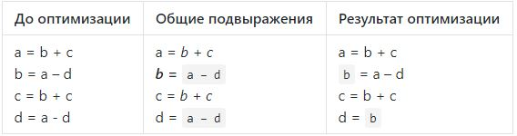

### Команда

Д. Лутченко, М. Письменский

### Зависимые и предшествующие задачи

Предшествующие задачи:

-   AST дерево

### Теоретическая часть

a = `b + c`\
`b =` a -- d\
c = `b + c`\
d = a - d

1.  Было ли использовано в правой части `b + c` раньше в этом блоке?
2.  Если да, то ***в промежутке между этими определениями менялось ли b
    или c?***\
    `Да` =\> не подлежит оптимизации

a = b + c\
b = `a - d`\
c = b + c\
d = `a - d`

1.  Было ли использовано в правой части `a - d` раньше в этом блоке?
2.  Если да, то ***в промежутке между этими определениями менялось ли a
    или d?***\
    `Нет` =\> можно оптимизировать

a = b + c\
`b` = a -- d\
c = b + c\
d = `b`

### Практическая часть

Метод поддерживает проверку коммутативности, что позволяет выполнять
оптимизации вида

``` {.csharp}
public static bool IsCommutative(Instruction instr)
{
    switch (instr.Operation)
    {
        case "OR":
        case "AND":
        case "EQUAL":
        case "NOTEQUAL":
        case "PLUS":
        case "MULT":
            return true;
    }
    return false;
}
```

Что позволяет выполнять оптимизации вида:

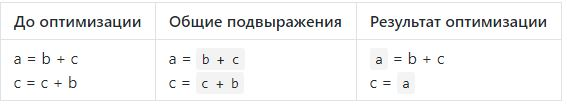

Ориентированный граф связей подвыражений представлен следующим образом:

``` {.csharp}
var exprToResults = new StringToStrings();
var argToExprs = new StringToStrings();
var resultToExpr = new Dictionary<string, string>();
```

Где:

-   `exprToResults` связи выражений к результатам (один ко многим)
-   `argToExprs` связи операнд к выражениям (один ко многим)
-   `resultToExpr` связь результата с выражением (один к одному)

Для построения общего ключа для выражений с коммутативной операцией
применяется сортировка операнд:

    string uniqueExpr(Instruction instr) =>
        string.Format(IsCommutative(instr) && string.Compare(instr.Argument1, instr.Argument2) > 0 ?
            "{2}{1}{0}" : "{0}{1}{2}", instr.Argument1, instr.Operation, instr.Argument2);

Основной алгоритм представляет из себя цикл по входным инструкциям,\
на каждой итерации которого, происходят следующие действия для каждой
инструкции:

-   создание ключа по выражению
-   если для выражения есть связь с результатом
    -   то - выполняем оптимизацию
    -   иначе - добавляем связи операнд к выражению
-   обновляем связи результата и выражения
-   если результат имеет связь с выражениями как операнд - удаляем все
    зависимые связи

``` {.csharp}
foreach (var instruction in instructions)
{
    if (instruction.Operation == "noop")
    {
        continue;
    }

    var expr = uniqueExpr(instruction);
    if (instruction.Operation != "assign" && exprToResults.TryGetValue(expr, out var results) && results.Count != 0)
    {
        wasChanged = true;

        newInstructions.Add(new Instruction(instruction.Label, "assign", results.First(), "", instruction.Result));
    }
    else
    {
        newInstructions.Add(instruction.Copy());
        addLink(argToExprs, instruction.Argument1, expr);
        addLink(argToExprs, instruction.Argument2, expr);
    }

    if (resultToExpr.TryGetValue(instruction.Result, out var oldExpr) &&
        exprToResults.ContainsKey(oldExpr))
    {
        exprToResults[oldExpr].Remove(instruction.Result);
    }

    resultToExpr[instruction.Result] = expr;
    addLink(exprToResults, expr, instruction.Result);

    if (argToExprs.ContainsKey(instruction.Result))
    {
        foreach (var delExpr in argToExprs[instruction.Result])
        {
            if (exprToResults.ContainsKey(delExpr))
            {
                foreach (var res in exprToResults[delExpr])
                {
                    resultToExpr.Remove(res);
                }
            }
            exprToResults.Remove(delExpr);
        }
    }
}
```

### Место в общем проекте (Интеграция)

Используется после создания трёхадресного кода:

``` {.csharp}
/* ThreeAddressCodeOptimizer.cs */
private static List<Optimization> BasicBlockOptimizations => new List<Optimization>()
{
    /* ... */
};
private static List<Optimization> AllCodeOptimizations => new List<Optimization>
{
  ThreeAddressCodeCommonExprElimination.CommonExprElimination,
 /* ... */
};

public static List<Instruction> OptimizeAll(List<Instruction> instructions) =>
    Optimize(instructions, BasicBlockOptimizations, AllCodeOptimizations);

/* Main.cs */
var threeAddrCodeVisitor = new ThreeAddrGenVisitor();
parser.root.Visit(threeAddrCodeVisitor);
var threeAddressCode = threeAddrCodeVisitor.Instructions;
var optResult = ThreeAddressCodeOptimizer.OptimizeAll(threeAddressCode);
```

### Примеры работы

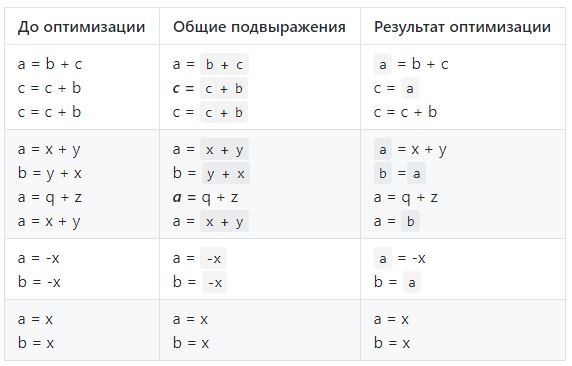

### Тесты

#### Проверка несрабатывания оптимизации:

``` {.csharp}
[TestCase(@"
var a, b, c, g, k;
a = b + c;
c = a + g;
k = b + c;
",
    ExpectedResult = new string[]
    {
        "#t1 = b + c",
        "a = #t1",
        "#t2 = a + g",
        "c = #t2",
        "#t3 = b + c",
        "k = #t3"
    },
    TestName = "NoCommonExpressions")]
```

#### Проверка срабатывания оптимизации:

``` {.csharp}
[TestCase(@"
var a, b, c, k;
a = b + c;
k = b + c;
",
    ExpectedResult = new string[]
    {
        "#t1 = b + c",
        "a = #t1",
        "#t2 = #t1",
        "k = #t2"
    },
    TestName = "SimplestCase")]
```

#### Корректность проверки коммутативности:

``` {.csharp}
[TestCase(@"
var a, b, c, k;
a = b + c;
k = c + b;
",
    ExpectedResult = new string[]
    {
        "#t1 = b + c",
        "a = #t1",
        "#t2 = #t1",
        "k = #t2"
    },
    TestName = "CommutativeOperation")]
```

#### Корректность проверки некоммутативности:

``` {.csharp}
[TestCase(@"
var a, b, c, k;
a = b - c;
k = c - b;
",
    ExpectedResult = new string[]
    {
        "#t1 = b - c",
        "a = #t1",
        "#t2 = c - b",
        "k = #t2"
    },
    TestName = "NotCommutativeOperation")]
```

#### Проверка сброса связи:

``` {.csharp}
[TestCase(@"
var a, b, c, k;
a = b * c;
b = b * c;
k = b * c;
",
    ExpectedResult = new string[]
    {
        "#t1 = b * c",
        "a = #t1",
        "#t2 = #t1",
        "b = #t2",
        "#t3 = b * c",
        "k = #t3"
    },
    TestName = "UsingItselfInExpression")]
```

#### С унарными операциями:

``` {.csharp}
[TestCase(@"
var a, b, c, k;
a = -b;
k = -b;
",
    ExpectedResult = new string[]
    {
        "#t1 = -b",
        "a = #t1",
        "#t2 = #t1",
        "k = #t2"
    },
    TestName = "UnaryOperation")]
```

Устранение переходов через переходы
-----------------------------------

### Постановка задачи

Произвести оптимизацию в трёхадресном коде программы для устранения
переходов через переходы.

### Команда

Карякин В.В., Карякин Д.В.

### Зависимые и предшествующие задачи

Предшествующие задачи:

-   Генерация трёхадресного кода

### Теоретическая часть

В рамках данной задачи необходимо реализовать оптимизацию трёхадресного
кода, которая устраняет безусловный оператор перехода. На изображении
ниже показана работа данной оптимизации.


### Практическая часть

В алгоритме оптимизации происходит последовательный проход по
трёхадресному коду программы. Если последовательность трёхадресных
команд удовлетворяет условию, которое позволяет провести оптимизацию, то
она проводится, иначе команды остаются в неизменном виде.

Код оптимизации:

``` {.csharp}
/* ThreeAddressCodeRemoveGotoThroughGoto.cs */
for (var i = 0; i < instructions.Count; ++i)
{
    if (instructions[i].Operation == "ifgoto" && 4 <= (instructions.Count - i))
    {
        var com0 = instructions[i];
        var com1 = instructions[i + 1];
        var com2 = instructions[i + 2];
        var com3 = instructions[i + 3];

        if (com1.Operation == "goto" && com1.Label == "" && com2.Operation != "noop" && com0.Argument2 == com2.Label && com1.Argument1 == com3.Label)
        {
            var tmpName = ThreeAddressCodeTmp.GenTmpName();
            newInstructions.Add(new Instruction(com0.Label, "NOT", com0.Argument1, "", tmpName));
            newInstructions.Add(new Instruction("", "ifgoto", tmpName, com3.Label, ""));

            var label = com2.Label.StartsWith("L") && uint.TryParse(com2.Label.Substring(1), out _) ? "" : com2.Label;
            newInstructions.Add(new Instruction(label, com2.Operation, com2.Argument1, com2.Argument2, com2.Result));
            newInstructions.Add(com3.Copy());

            wasChanged = true;
            i += 3;
            continue;
        }
    }
    newInstructions.Add(instructions[i].Copy());
            
```

### Место в общем проекте (Интеграция)

Устранение переходов через переходы применяется в списке оптимизаций к
трёхадресному коду:

``` {.csharp}
/* ThreeAddressCodeOptimizer.cs */
private static List<Optimization> AllCodeOptimizations => new List<Optimization>
{ 
    /* ... */ 
    ThreeAddressCodeRemoveGotoThroughGoto.RemoveGotoThroughGoto,
    /* ... */
};
```

### Тесты

Схема тестирования выглядит следующим образом: создаётся TAC; затем
применяется оптимизация; после построчно сравниваются строки
трёхадресного кода ожидаемого результата и полученного после оптимизации
TAC. Ниже приведён один из тестов.

``` {.csharp}
[TestCase(@"
var a;
if (1 < 2)
    goto 3;
2: goto 4;
3: a = 0;
4: a = 1;
666: a = false;
",
    ExpectedResult = new string[]
    {
        "#t1 = 1 >= 2",
        "#t2 = !#t1",
        "if #t2 goto 3",
        "2: goto 4",
        "3: a = 0",
        "4: a = 1",
        "666: a = False"
    },
    TestName = "Optimization")]

public IEnumerable<string> TestGotoThroughGoto(string sourceCode) =>
    TestTACOptimization(sourceCode, allCodeOptimization: ThreeAddressCodeRemoveGotoThroughGoto.RemoveGotoThroughGoto);
```

Устранение переходов к переходам
--------------------------------

### Постановка задачи

Создать оптимизирующий модуль программы устраняющий переходы к
переходам.

### Команда

К. Галицкий, А. Черкашин

### Зависимые и предшествующие задачи

Предшествующие задачи:

-   Трёхадресный код

### Теоретическая часть

В рамках этой задачи необходимо было реализовать оптимизацию устранения
переходов к переходам. Если оператор goto ведёт на метку, содержащую в
goto переход на следующую метку, необходимо протянуть финальную метку до
начального goto. Были поставлены следующие 3 случая задачи:

-   1 случай

    До

    ``` {.csharp}
    goto L1;
    ...
    L1: goto L2;
    ```

    После

    ``` {.csharp}
    goto L2;
    ...
    L1: goto L2;
    ```

-   2 случай

    До

    ``` {.csharp}
    if (/*усл*/) goto L1;
    ...
    L1: goto L2;
    ```

    После

    ``` {.csharp}
    if (/*усл*/) goto L2;
    ...
    L1: goto L2;
    ```

-   3 случай

    Если есть ровно один переход к L1, а оператору с L1 предшествует
    безусловный переход

    До

    ``` {.csharp}
    goto L1;
    ...
    L1: if (/*усл*/) goto L2;
    L3:
    ```

    После

    ``` {.csharp}
    ...
    if (/*усл*/) goto L2;
    goto L3;
    ...
    L3:
    ```

### Практическая часть

Реализовали метод для удаления переходов к переходам и разделили его на
3 случая:

Простые goto (для случая 1)

``` {.csharp}
if (instr.Operation == "goto")
{
    tmpCommands = PropagateTransitions(instr.Argument1, tmpCommands);
}
```

Инструкции вида \[label\] if (усл) goto (для случая 2 и 3)

``` {.csharp}
else if (instr.Operation == "ifgoto")
{
    tmpCommands = instr.Label == "" ?
        PropagateIfWithoutLabel(instr.Argument2, tmpCommands) : // случай 2
        PropagateIfWithLabel(instr, tmpCommands); // случай 3
}
```

Реализовали три вспомогательные функции для каждого случая задачи.

-   Вспомогательная функция, реализованная для случая 1:

Если метка инструкции равна метке которую мы ищем, и на ней стоит
опереция вида \"goto\" и метка слева не равна метке справа тогда
необходимо для всех \"goto\" с искомой меткой протянуть необходимую
метку.

-   Вспомогательная функция, реализованная для случая 2:

Если метка инструкции равна метке которую мы ищем, и на ней стоит
операция вида \"goto\" и метка слева не равна метке справа, тогда для
всех \"ifgoto\" с искомой меткой протягиваем необходимую метку.

-   Вспомогательная функция, реализованная для случая 3:

Реализовали проверку на наличие только одного перехода по условию для
случая 3. Находим \"ifgoto\" на которую ссылается оператор безусловного
перехода, ставим на место оператора безусловного перехода оператор
\"ifgoto\" без метки на него. На следующей строке вставляем оператор
безусловного перехода на метку где прежде стоял \"ifgoto\". В случае,
если следующая команда после оператора \"ifgoto\" содержала метку, то
оператор \"goto\" будет ссылаться на неё, иначе генерируем временную
метку, которую поместим на прежнее место оператора \"ifgoto\".

Результатом работы программы является пара значений, была ли применена
оптимизация и список инструкций с примененной оптимизацией

``` {.csharp}
return (wasChanged, tmpCommands);
```

### Место в общем проекте (Интеграция)

Используется после создания трёхадресного кода внутри общего
оптимизатора под названием `ThreeAddressCodeOptimizer`.

``` {.csharp}
/* ThreeAddressCodeOptimizer.cs */
private static List<Optimization> BasicBlockOptimizations => new List<Optimization>()
{
    /* ... */
};
private static List<Optimization> AllCodeOptimizations => new List<Optimization>
{
  ThreeAddressCodeGotoToGoto.ReplaceGotoToGoto,
 /* ... */
};

public static List<Instruction> OptimizeAll(List<Instruction> instructions) =>
    Optimize(instructions, BasicBlockOptimizations, AllCodeOptimizations);

/* Main.cs */
var threeAddrCodeVisitor = new ThreeAddrGenVisitor();
parser.root.Visit(threeAddrCodeVisitor);
var threeAddressCode = threeAddrCodeVisitor.Instructions;
var optResult = ThreeAddressCodeOptimizer.OptimizeAll(threeAddressCode);
```

### Тесты

В тестах проверяется, что применение оптимизации устранения переходов к
переходам к заданному трёхадресному коду возвращает ожидаемый результат:

``` {.csharp}
[TestCase(@"
var a, b;
1: goto 2;
2: goto 5;
3: goto 6;
4: a = 1;
5: goto 6;
6: a = b;
",
    true,
    ExpectedResult = new string[]
    {
        "1: goto 6",
        "6: a = b",
    },
    TestName = "MultiGoTo")]

[TestCase(@"
var a, b;
b = 5;
if (a > b)
    goto 6;
else
    goto 4;
6: a = 4;
4: a = 6;
",
    ExpectedResult = new string[]
    {
        "b = 5",
        "#t1 = a > b",
        "if #t1 goto 6",
        "goto 4",
        "6: a = 4",
        "4: a = 6",
    },
    TestName = "GotoIfElseTACGen")]

public IEnumerable<string> TestGotoToGoto(
    string sourceCode,
    bool unreachableCodeElimination = false) =>
    TestTACOptimization(
        sourceCode,
        allCodeOptimization: ThreeAddressCodeGotoToGoto.ReplaceGotoToGoto,
        unreachableCodeElimination: unreachableCodeElimination);
```

Удаление алгебраических тождеств
--------------------------------

### Постановка задачи

Создать оптимизирующий модуль программы для устранения вычислений
относительно следующих алгебраических тождеств:

-   a = b - b =\> a = 0
-   a = 0 / b =\> a = 0
-   a = b \* 0 =\> a = 0
-   a = b \* 1 =\> a = b
-   a = b + 0 =\> a = b
-   a = b - 0 =\> a = b
-   a = b / 1 =\> a = b
-   a = b / b =\> a = 1

### Команда

С. Рыженков, А.Евсеенко

### Зависимые и предшествующие задачи

Предшествующие задачи:

-   Трёхадресный код
-   Разбиение кода на базовые блоки

### Теоретическая часть

Данная задача относится к локальной оптимизации внутри каждого блока.
Задача заключается в поиске алгебраических выражений для устранения
вычислений из базового блока. Примеры работы до применения оптимизации и
после:

1)  `a = b * 1;` =\> `a = b;`
2)  `a = b + 0;` =\> `a = b;`
3)  `a = b - 0;` =\> `a = b;`
4)  `a = b / 1;` =\> `a = b;`
5)  `a = b / b;` =\> `a = 1;`
6)  `a = b - b;` =\> `a = 0;`
7)  `a = 0 / b;` =\> `a = 0;`
8)  `a = b * 0;` =\> `a = 0;`

Для случаев 1, 2, 8 оптимизация работает и в случае инверсии мест
аргументов.

### Практическая часть

Статический метод
`RemoveAlgebraicIdentities(List<Instruction> commands)` принимает список
инструкций. Список `var result = new List<Instruction>();` служит для
накапливания инструкций (упрощённых и исходных). Т.к. данная задача
относится только к алгебраическим тождествам, то в данном методе также
присутствует переменная: `variablesAreNotBool`, значение которой равно -
`!bool.TryParse(commands[i].Argument1, out _) && !bool.TryParse(commands[i].Argument2, out _)`
- true в случае если оба аргумента - числа. Переменная
`var wasChanged = false;` нужна для фиксации изменения инструкции.

-   Разность равных аргументов: ` a = b - b`

``` {.csharp}
if (variablesAreNotBool && command.Argument1 == command.Argument2 && command.Operation == "MINUS")
{
    result.Add(new Instruction(command.Label, "assign", "0", "", command.Result));
    wasChanged = true;
    continue;
}
```

-   Значение делимого равно нулю: `a = 0 / b`

``` {.csharp}
if (command.Operation == "DIV" && variablesAreNotBool && arg1IsNumber && arg1 == 0 && (arg2IsNumber && arg2 != 0 || !arg2IsNumber))
{
    result.Add(new Instruction(command.Label, "assign", "0", "", command.Result));
    wasChanged = true;
    continue;
}
```

-   Умножение на ноль: `a = 0 * b`

``` {.csharp}
if (command.Operation == "MULT" && variablesAreNotBool && (arg1IsNumber && arg1 == 0 || arg2IsNumber && arg2 == 0))
{
    result.Add(new Instruction(command.Label, "assign", "0", "", command.Result));
    wasChanged = true;
    continue;
}
```

-   Умножение на единицу: `a = 1 * b`

``` {.csharp}
var arg1IsNumber = double.TryParse(command.Argument1, out var arg1);
if (command.Operation == "MULT" && variablesAreNotBool && arg1IsNumber && arg1 == 1)
{
    result.Add(new Instruction(command.Label, "assign", command.Argument2, "", command.Result));
    wasChanged = true;
    continue;
}
var arg2IsNumber = double.TryParse(command.Argument2, out var arg2);
if (command.Operation == "MULT" && variablesAreNotBool && arg2IsNumber && arg2 == 1)
{
    result.Add(new Instruction(command.Label, "assign", command.Argument1, "", command.Result));
    wasChanged = true;
    continue;
}
```

-   Суммирование и вычитание с нулем: `a = b + 0` и `a = b - 0`

``` {.csharp}
if ((command.Operation == "PLUS" || command.Operation == "MINUS") && variablesAreNotBool && arg1IsNumber && arg1 == 0)
{
    var sign = command.Operation == "PLUS" ? "" : "-";
    result.Add(new Instruction(command.Label, "assign", sign + command.Argument2, "", command.Result));
    wasChanged = true;
    continue;
}
if ((command.Operation == "PLUS" || command.Operation == "MINUS") && variablesAreNotBool && arg2IsNumber && arg2 == 0)
{
    result.Add(new Instruction(command.Label, "assign", command.Argument1, "", command.Result));
    wasChanged = true;
    continue;
}
```

-   Деление на единицу: `a = b / 1`

``` {.csharp}
if (command.Operation == "DIV" && variablesAreNotBool && arg2IsNumber && arg2 == 1)
{
    result.Add(new Instruction(command.Label, "assign", command.Argument1, "", command.Result));
    wasChanged = true;
    continue;
}
```

-   Деление равных аргументов: `a = b / b`

``` {.csharp}
if (command.Operation == "DIV" && variablesAreNotBool && arg1 == arg2)
{
    result.Add(new Instruction(command.Label, "assign", "1", "", command.Result));
    wasChanged = true;
    continue;
}
```

Результат работы - кортеж, где первое значение - логическая переменная,
отвечающая за фиксацию применения оптимизации, а вторая - список
инструкций:

``` {.csharp}
return (wasChanged, result);
```

### Место в общем проекте (Интеграция)

Используется после создания трёхадресного кода:

``` {.csharp}
//ThreeAddressCodeOptimizer.cs
private static List<Optimization> BasicBlockOptimizations => new List<Optimization>()
{
    //...
    ThreeAddressCodeRemoveAlgebraicIdentities.RemoveAlgebraicIdentities,
    //...
};
private static List<Optimization> AllCodeOptimizations => new List<Optimization>
{
    //...
};

//Main.cs
var threeAddrCodeVisitor = new ThreeAddrGenVisitor();
parser.root.Visit(threeAddrCodeVisitor);
var threeAddressCode = threeAddrCodeVisitor.Instructions;
var optResult = ThreeAddressCodeOptimizer.OptimizeAll(threeAddressCode);
```

### Тесты

``` {.csharp}
[Test]
public void ComplexTest()
{
    var TAC = GenTAC(@"var a, b;
b = a - a;
b = a * 0;
b = 0 * a;
b = 1 * a;
b = a * 1;
b = a / 1;
b = a + 0;
b = 0 + a;
b = a - 0;
b = 0 - a;
b = b / b;
");
    var expected = new List<string>() 
    {
        "#t1 = 0", "b = #t1", "#t2 = 0", "b = #t2", "#t3 = 0", "b = #t3", "#t4 = a", "b = #t4",
        "#t5 = a", "b = #t5", "#t6 = a", "b = #t6", "#t7 = a", "b = #t7", "#t8 = a", "b = #t8",
        "#t9 = a", "b = #t9", "#t10 = -a", "b = #t10", "#t11 = 1", "b = #t11"
    };
    var optimizations = new List<Func<List<Instruction>, 
    (bool, List<Instruction>)>>
    {
        ThreeAddressCodeRemoveAlgebraicIdentities.RemoveAlgebraicIdentities
    };
    var actual = ThreeAddressCodeOptimizer.Optimize(TAC, optimizations)
        .Select(instruction => instruction.ToString());
    CollectionAssert.AreEqual(expected, actual);
}
```

Удаление пустых операторов в трёхадресном коде
----------------------------------------------

### Постановка задачи

Необходимо совершить оптимизацию, очищающую трёхадресный код от пустых
операторов.

### Команда

А.Пацеев, И.Ушаков

### Зависимые и предшествующие задачи

Предшествующие:

-   Генерация трёхадресного кода

Зависимые:

-   Интеграция оптимизаций трёхадресного кода между собой

### Теоретическая часть

Пустые операторы могут появиться в трёхадресном коде в качестве
результата применения других оптимизирующих операций.\
В ходе данной задачи было реализовано удаление таких операторов.

Пустой оператор может находиться в одной из трёх позиций:

    // Вариант 1
    noop // без метки

    // Вариант 2
    L1: noop  
    a = 5 // или любая другая операция без метки  

    // Вариант 3  
    L1: noop
    L2: a = 5 // или любая другая операция с меткой

В первом случае `noop` можно просто удалить. Во втором случае возможно
объединить две операции, получив `L1: a = 5`. Третий случай является
самым сложным, поскольку необходимо удалить операцию `L1: noop`, а затем
совершить изменение всех `goto L1` и `ifgoto L1` на `goto L2` и
`ifgoto L2` в коде, как и в уже просмотренных операциях, так и в тех,
которые только предстоить просмотреть. Оптимизация удаления пустых
операторов является достаточно трудоемкой, потому что она может
требовать нескольких проходов по TAC.

### Практическая часть

Для решения данной задачи используется подход пересоздания TAC. В цикле
совершается проход по исходному TAC и аккумулируется новый
оптимизированный TAC.

``` {.csharp}
var commandsTmp = new List<Instruction>(commands);
if (commands.Count == 0)
{
    return (false, commandsTmp);
}
var results = new List<Instruction>();
var wasChanged = false;
var toAddLast = true;

for (var i = 0; i < commandsTmp.Count - 1; i++)  
{  
    var currentCommand = commandsTmp[i];
    // случай 1, просто удаляем
    if (currentCommand.Operation == "noop" && currentCommand.Label == "")
    {
        wasChanged = true;
    }
    // случаи 2 и 3, проверяем следующую операцию на наличие метки
    else if (currentCommand.Operation == "noop")
    {
       // случай 2, следующей метки нет, сливаем операции
       if (commandsTmp[i + 1].Label == "")
       {
           var nextCommand = commandsTmp[i + 1];
           wasChanged = true;
            result.Add(
                new Instruction(
                    currentCommand.Label,
                    nextCommand.Operation,
                    nextCommand.Argument1,
                    nextCommand.Argument2,
                    nextCommand.Result
                )
            );
            i += 1;
            if (i == commandsTmp.Count - 1)
            {
                toAddLast = false;
            }
       }
       // случай 3, следующая метка есть, 
       // необходимо переименовать goto по всему коду
       else
       {
            var nextCommand = commandsTmp[i + 1];
            wasChanged = true;
            var currentLabel = currentCommand.Label;
            var nextLabel = nextCommand.Label;
            result = result.Select(/* переименование */).ToList();
            for (var j = i + 1; j < commandsTmp.Count; j++)
                commands[j] = /* переименование */;
       }
    }
    // иначе просто добавляем операцию
    else {
      results.Add(commandsTmp[i]);
    }
}
```

### Место в общем проекте (Интеграция)

Данная оптимизация используется в качестве одного из оптимизаторов,
используемых внутри общего оптимизатора под названием
`ThreeAddressCodeOptimizer`. В частности, она используется в
совокупности с оптимизациями под названиями `RemoveGotoThroughGoto` и
`ReplaceGotoToGoto`.

### Тесты

В тестах проверяется корректность работы алгоритма при всех трёх
возможных случаях. Помимо этого реализованы интеграционные тесты с
другими оптимизациями.

Примеры тестовых кейсов:

    6: a = b              ->    6: a = b
    1: noop                     9: b = a
    9: b = a

    L1: noop              ->    L1: b = a
    b = a

    1: noop               ->    a = 1
    2: noop                     b = a
    3: a = 1
    4: noop
    5: noop
    6: b = a

    goto old_label        ->    goto new_label
    old_label: noop             new_label: a = b
    new_label: a = b            goto new_label
    goto old_label

Пример проверки корректности интеграции с `GotoThroughGoto`:

    1: if (1 < 2)               1: #t1 = 1 < 2
        a = 4 + 5 * 6;    ->    if #t1 goto L1
    else                        goto 4
        goto 4;                 goto L2
                                L1: #t2 = 5 * 6
                                #t3 = 4 + #t2
                                a = #t3
                                L2: noop

Выполняется проверка на не удаление `L2: noop`, который является
последней операцией в программе.

Протяжка констант
-----------------

### Постановка задачи

Создать оптимизирующий модуль программы, который выполняет протяжку
констант

### Команда

И. Потапов

### Зависимые и предшествующие задачи

Предшествующие:

-   Трёхадресный код

### Теоретическая часть

В рамках этой задачи необходимо было реализовать оптимизацию протяжка
констант. Суть данной оптимизации заключается в том, чтобы подставить
величины известных констант в выражениях:

-   До

``` {.csharp}
a = 6;
с = 2;
b = (a-c)/c;
```

-   После

``` {.csharp}
a = 6;
с = 2;
b = (6-2)/2;
```

### Практическая часть

Примеры реализации метода:

``` {.csharp}
public static class ThreeAddressCodeConstantPropagation
{
    public static (bool wasChanged, IReadOnlyList<Instruction> instructions) PropagateConstants(IReadOnlyCollection<Instruction> instructions)
    {
        var count = 0;
        var wasChanged = false;
        var result = new List<Instruction>();
        foreach (var instruction in instructions)
        {
            string currentArg1 = instruction.Argument1, currentArg2 = instruction.Argument2;
            int arg1;
            var currentOp = instruction.Operation;
            if (instruction.Operation == "assign"
                && instructions.Take(count).ToList().FindLast(x => x.Result == instruction.Argument1) is Instruction cmnd)
            {
                if (cmnd.Operation == "assign"
                    && int.TryParse(cmnd.Argument1, out arg1))
                {
                    currentArg1 = cmnd.Argument1;
                    wasChanged = true;
                }
                result.Add(new Instruction(instruction.Label, currentOp,  currentArg1, currentArg2, instruction.Result));
            }
            else if (instruction.Operation != "assign")
            {
                if (instructions.Take(count).ToList().FindLast(x => x.Result ==         instruction.Argument1) is Instruction cmnd1
                    && cmnd1.Operation == "assign"
                    && int.TryParse(cmnd1.Argument1, out arg1))
                {
                    currentArg1 = cmnd1.Argument1;
                    wasChanged = true;
                }
                if (instructions.Take(count).ToList().FindLast(x => x.Result ==         instruction.Argument2) is Instruction cmnd2
                    && cmnd2.Operation == "assign"
                    && int.TryParse(cmnd2.Argument1, out var arg2))
                {
                    currentArg2 = cmnd2.Argument1;
                    wasChanged = true;
                }
                result.Add(new Instruction(instruction.Label, currentOp,
                    currentArg1, currentArg2, instruction.Result));
            }
            else
            {
                result.Add(instruction);
            }
            ++count;
        }

        return (wasChanged, result);
    }
}
```

### Место в общем проекте (Интеграция)

Данная оптимизация применяется в классе `ThreeAddressCodeOptimizer`
наряду со всеми остальными TAC - оптимизациями.

### Тесты

``` {.csharp}
[TestCase(@"
var x, y;
x = 14;
y = 7 - x;
x = x + x;
",
    ExpectedResult = new string[]
    {
        "x = 14",
        "#t1 = 7 - 14",
        "y = #t1",
        "#t2 = 14 + 14",
        "x = #t2"
    },
    TestName = "Test1")]

[TestCase(@"
var x, y, b;
y = 5;
x = b;
y = 7;
x = y + y;
",
    ExpectedResult = new string[]
    {
        "y = 5",
        "x = b",
        "y = 7",
        "#t1 = 7 + 7",
        "x = #t1"
    },
    TestName = "Test2")]

public IEnumerable<string> TestPropagateConstants(string sourceCode) =>
    TestTACOptimization(sourceCode, ThreeAddressCodeConstantPropagation.PropagateConstants);
```

Протяжка копий
--------------

### Постановка задачи

Создать оптимизирующий модуль программы, который выполняет протяжку
копий

### Команда

И. Потапов

### Зависимые и предшествующие задачи

Предшествующие:

-   Трёхадресный код

### Теоретическая часть

В рамках этой задачи необходимо было реализовать оптимизацию протяжка
копий. Суть данной оптимизации заключается в том, чтобы заменить в
выражениях переменные их значениями:

-   До

``` {.csharp}
a = 3;
с = a+a;
b = c;
```

-   После

``` {.csharp}
a = 3;
с = a+a;
b = a+a;
```

### Практическая часть

Примеры реализации метода:

``` {.csharp}
public static class ThreeAddressCodeCopyPropagation
{
    public static (bool wasChanged, IReadOnlyList<Instruction> instructions) PropagateCopies(IReadOnlyList<Instruction> instructions)
    {
        var count = 0;
        var wasChanged = false;
        var result = new List<Instruction>();
        foreach (var instruction in instructions)
        {
            string currentArg1 = instruction.Argument1, currentArg2 = instruction.Argument2;
            var currentOp = instruction.Operation;
            if (!int.TryParse(instruction.Argument1, out var arg))
            {
                var index1 = instructions.Take(count).ToList().FindLastIndex(x => x.Result == instruction.Argument1);
                if (index1 != -1
                    && instructions[index1].Operation == "assign"
                    && !int.TryParse(instructions[index1].Argument1, out arg)
                    && instructions.Skip(index1).Take(count - index1).ToList().FindLastIndex(x => x.Result == instructions[index1].Argument1) == -1)
                {
                    currentArg1 = instructions[index1].Argument1;
                    wasChanged = true;
                }

            }
            if (!int.TryParse(instruction.Argument2, out arg))
            {
                var index2 = instructions.Take(count).ToList().FindLastIndex(x => x.Result == instruction.Argument2);
                if (index2 != -1
                    && instructions[index2].Operation == "assign"
                    && !int.TryParse(instructions[index2].Argument1, out arg)
                    && instructions.Skip(index2).Take(count - index2).ToList().FindLastIndex(x => x.Result == instructions[index2].Argument1) == -1)
                {
                    currentArg2 = instructions[index2].Argument1;
                    wasChanged = true;
                }
            }
            result.Add(new Instruction(instruction.Label, instruction.Operation, currentArg1, currentArg2, instruction.Result));
            ++count;
        }
        return (wasChanged, result);
    }
}
```

### Место в общем проекте (Интеграция)

Данная оптимизация применяется в классе `ThreeAddressCodeOptimizer`
наряду со всеми остальными TAC - оптимизациями.

### Тесты

``` {.csharp}
[TestCase(@"
var a, b, c, d, e, x, y, k;
a = b;
c = b - a;
d = c + 1;
e = d * a;
a = x - y;
k = c + a;
",
    ExpectedResult = new string[]
    {
        "a = b",
        "#t1 = b - b",
        "c = #t1",
        "#t2 = #t1 + 1",
        "d = #t2",
        "#t3 = #t2 * b",
        "e = #t3",
        "#t4 = x - y",
        "a = #t4",
        "#t5 = #t1 + #t4",
        "k = #t5"
    },
    TestName = "Test1")]

[TestCase(@"
var a, b, c, d, e, x, y, k;
b = x;
x = 5;
c = b + 5;
d = c;
e = d;
",
    ExpectedResult = new string[]
    {
        "b = x",
        "x = 5",
        "#t1 = b + 5",
        "c = #t1",
        "d = #t1",
        "e = #t1"
    },
    TestName = "Test2")]

public IEnumerable<string> TestPropagateConstants(string sourceCode) =>
    TestTACOptimization(sourceCode, ThreeAddressCodeCopyPropagation.PropagateCopies);
```

Интеграция оптимизаций трёхадресного кода между собой
-----------------------------------------------------

### Постановка задачи

Необходимо скомбинировать созданные ранее оптимизации трёхадресного кода
так, чтобы они могли выполняться все вместе, друг за другом.

### Команда

Д. Володин, Н. Моздоров

### Зависимые и предшествующие задачи

Предшествующие:

-   Def-Use информация: накопление информации и удаление мёртвого кода
    на её основе
-   Устранение переходов к переходам
-   Очистка кода от пустых операторов
-   Устранение переходов через переходы
-   Учет алгебраических тождеств
-   Живые и мёртвые переменные и удаление мёртвого кода (замена на
    пустой оператор)
-   Оптимизация общих подвыражений
-   Протяжка констант
-   Протяжка копий
-   Разбиение трёхадресного кода на базовые блоки

### Теоретическая часть

Необходимо организовать выполнение оптимизаций трёхадресного кода до тех
пор, пока каждая из созданных оптимизаций перестанет изменять текущий
список инструкций.

### Практическая часть

Для данной задачи был создан статический класс
`ThreeAddressCodeOptimizer`, содержащий два публичных метода: `Optimize`
и `OptimizeAll`. Первый метод на вход получает список инструкций, а
также два списка оптимизаций: те, которые работают в пределах одного
базового блока, и те, которые работают для всего кода программы.
Параметрам - спискам оптимизаций по умолчанию присвоено значение `null`,
что позволяет при вызове указывать только один из списков. Второй метод
на вход получает только список инструкций и использует оптимизации,
хранящиеся в двух приватных списках внутри класса, содержащих все
созданные оптимизации трёхадресного кода.

Оптимизация выполняется следующим образом: сначала список инструкций
делится на базовые блоки, затем для каждого блока отдельно выполняются
все оптимизации в пределах одного блока, затем инструкции в блоках
объединяются и выполняются все глобальные оптимизации. Общая оптимизация
в пределах одного блока и общая оптимизация всего кода выполняются
похожим образом и представляют собой циклы, пока все соответствующие
оптимизации не перестанут изменять список инструкций, и в этих циклах по
очереди выполняется каждая из соответствующих оптимизаций. Если какая-то
из оптимизаций изменила список инструкций, то выполнение всех
оптимизаций происходит заново. Ниже приведён код для общей оптимизации в
пределах одного блока.

``` {.csharp}
private static BasicBlock OptimizeBlock(BasicBlock block, List<Optimization> opts)
{
    var result = block.GetInstructions();
    var currentOpt = 0;
    while (currentOpt < opts.Count)
    {
        var (wasChanged, instructions) = opts[currentOpt++](result);
        if (wasChanged)
        {
            currentOpt = 0;
            result = instructions;
        }
    }
    return new BasicBlock(result);
}
```

### Место в общем проекте (Интеграция)

Данная оптимизация объединяет созданные ранее оптимизации трёхадресного
кода, и в дальнейшем на основе результата выполнения всех оптимизаций
выполняется построение графа потока управления.

### Тесты

Класс `ThreeAddressCodeOptimizer` используется во всех тестах для
проверки оптимизаций трёхадресного кода (в том числе тех оптимизаций,
которые дополняют действие друг друга). Схема тестирования выглядит
следующим образом: сначала по заданному тексту программы генерируется
трёхадресный код, затем задаются списки оптимизаций для проверки, после
этого вызывается метод `Optimize` класса `ThreeAddressCodeOptimizer` и
сравнивается полученный набор инструкций с ожидаемым набором. Ниже
приведён один из тестов.

``` {.csharp}
[TestCase(@"
var a, b, x;
x = a;
x = b;
",
    ExpectedResult = new string[]
    {
        "noop",
        "x = b"
    },
    TestName = "VarAssignSimple")]

public IEnumerable<string> TestDefUse(string sourceCode) =>
    TestTACOptimization(sourceCode, ThreeAddressCodeDefUse.DeleteDeadCode);
```

Построение графа потока управления
----------------------------------

### Постановка задачи

Реализовать алгоритм построения графа потока управления из списка
базовых блоков (ББл).

### Команда

Д. Лутченко, М. Письменский

### Зависимые и предшествующие задачи

Зависимые задачи:

-   Упорядочение CFG в глубину с построением глубинного остовного дерева
-   Итерационный алгоритм в обобщённой структуре
-   Анализ достигающих определений
-   Альтернативная реализация хранения IN OUT в виде битовых векторов.
    Интеграция данного представления в существующий итерационный
    алгоритм.

Предшествующие задачи:

-   Разбиение на ББл (от лидера до лидера)

### Теоретическая часть

В графе потока управления каждый узел (вершина) графа соответствует
базовому блоку --- прямолинейному участку кода, не содержащему в себе ни
операций передачи управления, ни точек, на которые управление передаётся
из других частей программы. Имеется лишь два исключения:

-   точка, на которую выполняется переход, является первой инструкцией в
    базовом блоке
-   базовый блок завершается инструкцией перехода

Направленные дуги используются в графе для представления инструкций
перехода. Также, добавлены два специализированных блока:

-   входной блок, через который управление входит в граф
-   выходной блок, который завершает все пути в данном графе

### Практическая часть

Граф потока управлений представляет из себя следующие структуры данных:

``` {.csharp}
List<BasicBlock> _basicBlocks; // список базовых блоков
List<List<(int vertex, BasicBlock block)>> _children; // списки потомков каждого блока
List<List<(int vertex, BasicBlock block)>> _parents;  // списки предков каждого блока
```

Для определения номера вершины графа по блоку используется
соответствующий словарь:

``` {.csharp}
Dictionary<BasicBlock, int> _blockToVertex;
```

Алгоритм построения графа заключается в последовательном обходе входного
списка базовых блоков, на каждой итерации которого происходит анализ
последней инструкция текущего блока, заключающийся в определении её
типа, и последующем определении потомков этого блока.

Определены три типа перехода:

1.  Безусловный: `goto`\
    Осуществляется поиск блока на который происходит переход, который и
    будет являться его потомком.
2.  Условный: `ifgoto`\
    Как и в случае безусловного перехода одним из потомков будет
    являться блок, на который происходит переход, однако, также потомком
    будет являться следующий блок в списке, переход на который будет
    осуществлен в случае невыполнения условия.
3.  Последовательный: (отсутствие предыдущих)\
    Случай, в котором единственным потомком является следующий в списке
    блок.

``` {.csharp}
for (var i = 0; i < _basicBlocks.Count; ++i)
{
    var instructions = _basicBlocks[i].GetInstructions();
    var instr = instructions.Last();
    switch (instr.Operation)
    {
        case "goto":
            var gotoOutLabel = instr.Argument1;
            var gotoOutBlock = _basicBlocks.FindIndex(block =>
                    string.Equals(block.GetInstructions().First().Label, gotoOutLabel));

            if (gotoOutBlock == -1)
            {
                throw new Exception($"label {gotoOutLabel} not found");
            }

            _children[i].Add((gotoOutBlock, _basicBlocks[gotoOutBlock]));
            _parents[gotoOutBlock].Add((i, _basicBlocks[i]));
            break;

        case "ifgoto":
            var ifgotoOutLabel = instr.Argument2;
            var ifgotoOutBlock = _basicBlocks.FindIndex(block =>
                    string.Equals(block.GetInstructions().First().Label, ifgotoOutLabel));

            if (ifgotoOutBlock == -1)
            {
                throw new Exception($"label {ifgotoOutLabel} not found");
            }

            _children[i].Add((ifgotoOutBlock, _basicBlocks[ifgotoOutBlock]));
            _parents[ifgotoOutBlock].Add((i, _basicBlocks[i]));

            _children[i].Add((i + 1, _basicBlocks[i + 1]));
            _parents[i + 1].Add((i, _basicBlocks[i]));
            break;

        default:
            if (i < _basicBlocks.Count - 1)
            {
                _children[i].Add((i + 1, _basicBlocks[i + 1]));
                _parents[i + 1].Add((i, _basicBlocks[i]));
            }
            break;
    }
}
```

### Место в общем проекте (Интеграция)

Граф потока управления является одной из фундаментальных частей,
структура которого крайне важна для многих оптимизаций.

### Тесты

Тест заключается в тщательной проверке потомков каждого блока в
построенном графе потока управления для программы, включающей в себя все
типы переходов.

``` {.csharp}
var blocks = GenBlocks(@"
var a, b, c, x, i;
goto 200;

200: a = 10 + 5;

for i = 2, 7
    x = 1;

if c > a
{
    a = 1;
}
else
{
    b = 1;
}
");

var cfg = new ControlFlowGraph(blocks);

var vertexCount = cfg.GetCurrentBasicBlocks().Count;

Assert.AreEqual(vertexCount, blocks.Count + 2); // standard blocks, in and out
Assert.AreEqual(cfg.GetChildrenBasicBlocks(0).Count, 1); // inblock has 1 child
Assert.AreEqual(cfg.GetParentsBasicBlocks(0).Count, 0);  // inblock does not have parents
Assert.AreEqual(cfg.GetChildrenBasicBlocks(vertexCount - 1).Count, 0); // outblock does not have children
Assert.AreEqual(cfg.GetParentsBasicBlocks(vertexCount - 1).Count, 1); // outblock has 1 parent


var graphBlocks = cfg.GetCurrentBasicBlocks();

var vertex1 = cfg.VertexOf(graphBlocks[1]); // goto 200;
Assert.AreEqual(vertex1, 1);
Assert.AreEqual(cfg.GetChildrenBasicBlocks(vertex1).Count, 1);

var vertex2 = cfg.VertexOf(graphBlocks[2]); // 200: a = 10 + 5;
Assert.AreEqual(vertex2, 2);
Assert.AreEqual(cfg.GetChildrenBasicBlocks(vertex2).Count, 1);
//
var vertex3 = cfg.VertexOf(graphBlocks[3]); // for i = 2, 7
Assert.AreEqual(vertex3, 3);
var children3 = cfg.GetChildrenBasicBlocks(vertex3);
Assert.AreEqual(children3.Count, 2); // for and next block

Assert.AreEqual(children3[0].vertex, 5); // for body
var forBody = children3[0].block.GetInstructions();
Assert.AreEqual(forBody[0].ToString(), "L2: noop");
Assert.AreEqual(cfg.GetChildrenBasicBlocks(children3[0].vertex).Count, 2);

Assert.AreEqual(children3[1].vertex, 4); // next
///
var vertex6 = cfg.VertexOf(graphBlocks[6]); // if
Assert.AreEqual(vertex6, 6);
var children6 = cfg.GetChildrenBasicBlocks(vertex6);
Assert.AreEqual(children6.Count, 1);
```

Анализ активных переменных
--------------------------

### Постановка задачи

Необходимо накопить IN-OUT информацию для дальнейшей оптимизации «Живые
и мёртвые переменные» между базовыми блоками.

### Команда

А. Татарова, Т. Шкуро

### Зависимые и предшествующие задачи

Предшествующие:

-   Построение графа потока управления

Зависимые:

-   Использование информации IN-OUT в удалении мёртвого кода (Живые и
    мёртвые переменные)

### Теоретическая часть

Для переменной x и точки p анализ выясняет, может ли значение x из точки
p использоваться вдоль некоторого пути в графе потока управления,
начинающемся в точке p. Если может, то переменная x активна (жива) в
точке p, если нет --- неактивна (мертва). **defB** -- множество
переменных, определённых в блоке B до любых их использований в этом
блоке. **useB** - множество переменных, значения которых могут
использоваться в блоке B до любых определений этих переменных. Отсюда
любая переменная из useB рассматривается как активная на входе в блок B,
а переменная из defB рассматривается как мёртвая на входе в блок B. И
тогда множества IN и OUT определяются следующими уравнениями

1.  

Это уравнение определяет граничное условие, что активных переменных при
выходе из программы нет.

2.  

Второе уравнение говорит о том, что переменная активна при выходе из
блока тогда и только тогда, когда она активна при входе по крайней мере
в один из дочерних блоков. Здесь оператор сбора является объединением.

3.  

Здесь уравнение гласит, что переменная активна при входе в блок, если
она используется в блоке до переопределения или если она активна на
выходе из блока и не переопределена в нём.

Анализ активных переменных идёт обратно направлению потока управления,
поскольку необходимо проследить, что использование переменной x в точке
p передаётся всем точкам, предшествующим p вдоль путей выполнения.

### Практическая часть

Первым шагом для каждого блока строятся def и use множества переменных.

``` {.csharp}
private (HashSet<string> def, HashSet<string> use) FillDefUse(List<Instruction> block)
{
    Func<string, bool> IsId = ThreeAddressCodeDefUse.IsId;
    var def = new HashSet<string>();
    var use = new HashSet<string>();
    foreach (var instruction in block)
    {
        if (IsId(instruction.Argument1) && !def.Contains(instruction.Argument1))
        {
            use.Add(instruction.Argument1);
        }
        if (IsId(instruction.Argument2) && !def.Contains(instruction.Argument2))
        {
            use.Add(instruction.Argument2);
        }
        if (IsId(instruction.Result) && !use.Contains(instruction.Result))
        {
            def.Add(instruction.Result);
        }
    }
    
    return (def, use);
}
```

где `IsID` \-\-- функция определения переменной. Далее определяется
передаточная функция по уравнению (3)

``` {.csharp}
public HashSet<string> Transfer(BasicBlock basicBlock, HashSet<string> OUT) =>
    dictDefUse[basicBlock].Use.Union(OUT.Except(dictDefUse[basicBlock].Def)).ToHashSet();
```

где `dictDefUse` - структура для хранения def-use для каждого блока,
`OUT` - множество, вычисленное уже для этого блока.

Сам анализ запускается на графе потока управления и выдает IN-OUT
множества для каждого блока графа.

``` {.csharp}
public void ExecuteInternal(ControlFlowGraph cfg)
{
    var blocks = cfg.GetCurrentBasicBlocks();
    var transferFunc = new LiveVariablesTransferFunc(cfg); // определение передаточной функции

    // каждый блок в начале работы алгоритма хранит пустые IN и OUT множества
    // в том числе входной и выходной блоки
    foreach (var x in blocks)
    {
        dictInOut.Add(cfg.VertexOf(x), new InOutSet());
    }

    // алгоритм вычисляет до тех пор, пока IN-OUT множества меняются на очередной итерации
    var isChanged = true;
    while (isChanged)
    {
        isChanged = false;
        for (var i = blocks.Count - 1; i >= 0; --i)
        {
            var children = cfg.GetChildrenBasicBlocks(i);

            // здесь собирается информация IN множеств от дочерних узлов
            dictInOut[i].OUT =
                children
                .Select(x => dictInOut[x.vertex].IN)
                .Aggregate(new HashSet<string>(), (a, b) => a.Union(b).ToHashSet());

            var pred = dictInOut[i].IN;
            // вычисление IN передаточной функцией
            dictInOut[i].IN = transferFunc.Transfer(blocks[i], dictInOut[i].OUT);
            isChanged = !dictInOut[i].IN.SetEquals(pred) || isChanged;
        }
    }
}
```

### Место в общем проекте (Интеграция)

Анализ активных переменных является одним из итерационных алгоритмов по
графу потока управления, преобразующих глобально текст программы. На
данный момент анализ представлен как отдельный метод (`ExecuteInternal`)
и как реализация абстрактного класса, представляющего собой обобщённый
итерационный алгоритм:

``` {.csharp}
public override Func<HashSet<string>, HashSet<string>, HashSet<string>> CollectingOperator =>
    (a, b) => a.Union(b).ToHashSet();
public override Func<HashSet<string>, HashSet<string>, bool> Compare =>
    (a, b) => a.SetEquals(b);
public override HashSet<string> Init { get => new HashSet<string>(); protected set { } }
public override Func<BasicBlock, HashSet<string>, HashSet<string>> TransferFunction { get; protected set; }
public override Direction Direction => Direction.Backward;
/*...*/
public override InOutData<HashSet<string>> Execute(ControlFlowGraph cfg, bool useRenumbering = true)
{
    TransferFunction = new LiveVariablesTransferFunc(cfg).Transfer;
    return base.Execute(cfg);
}
```

### Тесты

В тестах проверяется, что для заданного текста программы (для которого
генерируется трёхадресный код и граф потока управления по нему) анализ
активных переменных возвращает ожидаемые IN-OUT множества для каждого
блока:

``` {.csharp}
[Test]
public void WithLoop()
{
    var TAC = GenTAC(@"
var a, b, c;

input(b);

while a > 5
{
    a = b + 1;
    c = 5;
}

print(c);
");

    var expected =
        new List<(HashSet<string> IN, HashSet<string> OUT)>()
        {
            (new HashSet<string>(){ "a", "c" }, new HashSet<string>(){ "a", "c" }),
            (new HashSet<string>(){ "a", "c" }, new HashSet<string>(){ "a", "b", "c" }),
            (new HashSet<string>(){ "a", "b", "c" }, new HashSet<string>(){ "b", "c" }),
            (new HashSet<string>(){ "c" }, new HashSet<string>(){ "c" }),
            (new HashSet<string>(){ "b" }, new HashSet<string>(){ "a", "b", "c" }),
            (new HashSet<string>(){ "c" }, new HashSet<string>(){ }),
            (new HashSet<string>(){ }, new HashSet<string>(){ })
        };
    var actual = Execute(TAC);

    AssertSet(expected, actual);
}

[Test]
public void ComplexWithLoop()
{
    var TAC = GenTAC(@"
var a, b, c, i;

for i = 1, b
{
    input(a);
    c = c + a;
    print(c);
    if c < b
        c = c + 1;
    else
    {
        b = b - 1;
        print(b);
        print(c);
    }
}

print(c + a + b);
");

    var expected =
        new List<(HashSet<string> IN, HashSet<string> OUT)>()
        {
            (new HashSet<string>(){ "b", "c", "a" }, new HashSet<string>(){ "c", "b", "a" }),
            (new HashSet<string>(){ "b", "c", "a" }, new HashSet<string>(){ "c", "i", "b", "a" }),
            (new HashSet<string>(){ "c", "b", "i", "a" }, new HashSet<string>(){ "c", "b", "i", "a" }),
            (new HashSet<string>(){ "c", "i", "b" }, new HashSet<string>(){ "c", "a", "b", "i" }),
            (new HashSet<string>(){ "c", "b", "i", "a" }, new HashSet<string>(){ "c", "b", "i", "a" }),
            (new HashSet<string>(){ "c", "b", "i", "a" }, new HashSet<string>(){ "c", "b", "i", "a" }),
            (new HashSet<string>(){ "c", "b", "i", "a" }, new HashSet<string>(){ "c", "b", "i", "a" }),
            (new HashSet<string>(){ "c", "a", "b" }, new HashSet<string>(){ }),
            (new HashSet<string>(){ }, new HashSet<string>(){ })
        };
    var actual = Execute(TAC);

    AssertSet(expected, actual);
}
```

Удаление мёртвого кода, используя InOut из активных переменных
--------------------------------------------------------------

### Постановка задачи

Создать оптимизирующий модуль программы, который удаляет мёртвый код,
используя InOut из активных переменных

### Команда

И. Потапов

### Зависимые и предшествующие задачи

Предшествующие:

-   Построение графа потока управления
-   Анализ активных переменных

### Теоретическая часть

В рамках этой задачи необходимо было реализовать оптимизацию удаление
мёртвого кода, причём данная оптимизация применяется ко всему коду. Суть
данной оптимизации заключается в том, чтобы удалить мёртвый код,
используя информацию об Активных переменных:

### Практическая часть

Примеры реализации метода:

``` {.csharp}
public class LiveVariablesOptimization
{
    public static void DeleteDeadCode(ControlFlowGraph cfg)
    {
        var info = new LiveVariables().Execute(cfg);
        foreach (var block in cfg.GetCurrentBasicBlocks())
        {
            var blockInfo = info[block].Out;
            (var wasChanged, var newInstructions) = DeleteDeadCodeWithDeadVars.DeleteDeadCode(block.GetInstructions(), blockInfo);
            if (wasChanged)
            {
                block.ClearInstructions();
                block.AddRangeOfInstructions(newInstructions);
            }
        }
    }
}
```

### Место в общем проекте (Интеграция)

Оптимизация живых переменных использует главным образом граф потока
управления и вычисленную информацию о живых переменных в соответствующих
классах.

### Тесты

``` {.csharp}
[TestCase(@"
var a, b, c;
input(b);
a = b + 1;
c = 6;
if a < b
    c = b - a;
else
    c = b + a;
print(c);
",
    ExpectedResult = new[]
    {
        "input b",
        "#t1 = b + 1",
        "a = #t1",
        "noop",
        "#t2 = a < b",
        "if #t2 goto L1",
        "#t3 = b + a",
        "c = #t3",
        "goto L2",
        "L1: #t4 = b - a",
        "c = #t4",
        "L2: noop",
        "print c",
    },
    TestName = "Simple")]

public IEnumerable<string> TestLiveVariablesOptimization(string sourceCode)
{
    var cfg = GenCFG(sourceCode);
    LiveVariablesOptimization.DeleteDeadCode(cfg);
    return cfg.GetInstructions().Select(x => x.ToString());
}
```

Итерационный алгоритм в структуре распространения констант
----------------------------------------------------------

### Постановка задачи

Необходимо в вершинах потока управления накопить IN-OUT информацию,
реализовав итерационный алгоритм в структуре распространения констант.

### Команда

Карякин В.В., Карякин Д.В.

### Зависимые и предшествующие задачи

Предшествующие:

-   Построение графа потока управления
-   Вычисление передаточной функции для распространения констант

### Теоретическая часть

Распространение констант является прямой задачей потока данных. Алгоритм
позволяет найти переменные, которые имеют константные значения на входе
в блоки, что позволит в дальнейшем подставить их для повышения
эффективности программы. Множество значений потока данных представляет
собой решётку произведения, в которой имеется по одному компоненту для
каждой переменной программы. В решетку для переменной входит следующее:

1.  Все константы подходящего для данной переменной типа;
2.  Значение NAC, означающее \"не константу\". Переменная отображается
    на это значение, если выяснится, что она не имеет константного
    значения;
3.  Значение UNDEF, которое означает \"не определена\".

Сбор двух значений представляет собой их наибольшую нижнюю границу.
Таким образом:


Итеративный алгоритм для прямой задачи потока данных имеет следующий
вид:


На каждом шаге вычисляются множества IN и OUT для каждого блока.

### Практическая часть

Сначала определяется множество используемых в программе переменных
проходом по всем блокам графа потока управления. Далее задаются
начальные значения IN и OUT для всех блоков. Значение UNDEF ставится в
соответствие всем переменным при инициализации входного узла и
инициализации внутренних точек программы перед итерациями.

``` {.csharp}
var temp = new Dictionary<string, LatticeValue>();
foreach (var elem in variables)
{
    temp.Add(elem, new LatticeValue(LatticeTypeData.UNDEF));
}

foreach (var block in blocks)
{
    INs.Add(block, temp.ToDictionary(entry => entry.Key, entry => entry.Value));
    OUTs.Add(block, temp.ToDictionary(entry => entry.Key, entry => entry.Value));
}
```

Сбор в структуре распространения констант выполняется следующим образом:

``` {.csharp}
public static Dictionary<string, LatticeValue> Collect(Dictionary<string, LatticeValue> first, Dictionary<string, LatticeValue> second)
{
    var result = new Dictionary<string, LatticeValue>(first.Count, first.Comparer);
    foreach (var elem in second)
    {
        result[elem.Key] = first[elem.Key].Collecting(elem.Value);
    }

    return result;
}
```

Передаточная функция реализована в рамках задачи другой команды.
Применяется следующим образом:

``` {.csharp}
var newOut = Transfer(block, INs[block]);
```

Реализация итерационного алгоритма:

``` {.csharp}
var Changed = true;
while (Changed)
{
    Changed = false;
    foreach (var block in blocks)
    {
        var parents = g.GetParentsBasicBlocks(g.VertexOf(block)).Select(x => x.block);
        INs[block] = parents.Select(x => OUTs[x])
            .Aggregate(temp.ToDictionary(entry => entry.Key, entry => entry.Value), (x, y) => Collect(x, y));
        var newOut = Transfer(block, INs[block]);
        if (OUTs[block].Where(entry => newOut[entry.Key] != entry.Value).Any())
        {
            Changed = true;
            OUTs[block] = newOut;
        }
    }
}
```

### Место в общем проекте (Интеграция)

Данный итерационный алгоритм является одним из итерационных алгоритмов,
вычисляющих IN-OUT информацию для последующих оптимизаций. Для
унифицированного применения в проекте реализован итерационный алгоритм в
обобщённом виде. Он представлен в виде абстрактного класса, который
наследуется классом, реализующим задачу.

Свойства и методы абстрактного класса:

``` {.csharp}
public abstract Func<T, T, T> CollectingOperator { get; }
public abstract Func<T, T, bool> Compare { get; }
public abstract T Init { get; protected set; }
public virtual T InitFirst { get => Init; protected set { } }
public abstract Func<BasicBlock, T, T> TransferFunction { get; protected set; }
public virtual Direction Direction => Direction.Forward;
public virtual InOutData<T> Execute(ControlFlowGraph graph);
```

### Тесты

Тесты проверяют соответствие IN-OUT значений для графа потока
управления, полученного по указываемому тексту программы. Некоторые
примеры:

``` {.csharp}
// Проверяет недистрибутивность структуры распространения констант
[Test]
public void TransfNotDistr()
{
    var blocks = GenBlocks(@"
var a, b, c;
if c > 5
{
    a = 2;
    b = 3;
}
else
{
    a = 3;
    b = 2;
}
c = a + b;
");
    Assert.AreEqual(4, blocks.Count);
    var cfg = new ControlFlowGraph(blocks);
    var InOut = new ConstantPropagation().ExecuteNonGeneric(cfg);
    var actual = InOut.OUT[blocks.Last()];

    Assert.AreEqual(LatticeTypeData.NAC, actual["a"].Type);
    Assert.AreEqual(LatticeTypeData.NAC, actual["b"].Type);
    Assert.AreEqual(LatticeTypeData.NAC, actual["c"].Type);
}
```

``` {.csharp}
// Распространение констант из различных блоков
[Test]
public void PropagateTwoVariants()
{
    var blocks = GenBlocks(@"
var a, x, c;
if c > 10
    x = 10;
else
    a = 20;
c = a + x;
");
    var cfg = new ControlFlowGraph(blocks);
    var InOut = new ConstantPropagation().ExecuteNonGeneric(cfg);
    var actual = InOut.OUT[blocks.Last()];

    Assert.AreEqual(LatticeTypeData.CONST, actual["a"].Type);
    Assert.AreEqual(LatticeTypeData.CONST, actual["x"].Type);
    Assert.AreEqual(LatticeTypeData.CONST, actual["c"].Type);

    Assert.AreEqual("10", actual["x"].ConstValue);
    Assert.AreEqual("20", actual["a"].ConstValue);
    Assert.AreEqual("30", actual["c"].ConstValue);
}
```

``` {.csharp}
// Случай с двумя достигающими константами
[Test]
public void TwoConstValues()
{
    var blocks = GenBlocks(@"
var a, x, c;
input(c);
if c > 5
    x = 10;
else
    input(c);
if c > 5
    x = 20;
a = x;
");
    var cfg = new ControlFlowGraph(blocks);
    var InOut = new ConstantPropagation().ExecuteNonGeneric(cfg);
    var actual = InOut.OUT[blocks.Last()];

    Assert.AreEqual(LatticeTypeData.NAC, actual["a"].Type);
    Assert.AreEqual(LatticeTypeData.NAC, actual["x"].Type);
    Assert.AreEqual(LatticeTypeData.NAC, actual["c"].Type);
}
```

``` {.csharp}
// Распространение переменных из одного предшествующего блока
[Test]
public void PropagateTwoVariants2()
{
    var blocks = GenBlocks(@"
var a, x, c;
x = 10;
a = 20;
goto 666;
666: c = a + x;
");
    var cfg = new ControlFlowGraph(blocks);
    var InOut = new ConstantPropagation().ExecuteNonGeneric(cfg);
    var actual = InOut.OUT[blocks.Last()];
    Assert.AreEqual(LatticeTypeData.CONST, actual["a"].Type);
    Assert.AreEqual(LatticeTypeData.CONST, actual["x"].Type);
    Assert.AreEqual(LatticeTypeData.CONST, actual["c"].Type);

    Assert.AreEqual("20", actual["a"].ConstValue);
    Assert.AreEqual("30", actual["c"].ConstValue);
    Assert.AreEqual("10", actual["x"].ConstValue);
}
```

Передаточная функция в структуре распространения констант
---------------------------------------------------------

### Постановка задачи

Построить передаточную функцию для задачи распространения констант. На
вход функции подаётся базовый блок (ББл) и таблица значений потока
данных, которая представлена словарём. На выходе получается
модифицированная таблица значений.

### Команда

Д. Лутченко, М. Письменский

### Зависимые и предшествующие задачи

Предшествующие задачи:

-   Разбиение на базовые блоки (от лидера до лидера)
-   Построение Control Flow Graph

Зависимые задачи:

-   Итерационный алгоритм в структуре распространения констант

### Теоретическая часть

Задача распространения констант основывается на полурешётках.

Полурешётка -- это пара `(V, ^)`, где `V` − множество, на котором
определён оператор `^: V → V` и для любого x, y, z из V выполняются
следующие условия:

-   `x ^ x` = x (идемпотентность)
-   `x ^ y` = `y ^ x` (коммутативность)
-   `x ^ y ^ z` = `x ^ y ^ z` (ассоциативность)

Далее вводится понятие частичного порядка: отношение ≤ представляет
собой частичный порядок на множестве `V` если для любого x, y, z из V
выполняется:

-   x ≤ x (рефлексивность)
-   Если x ≤ y и y ≤ x, то x = y (антисимметричность)
-   Если x ≤ y и y ≤ z, то x ≤ z (транзитивность)

Теперь введём определение операции \< на полурешётке:

`x < y` \<=\> `x ≤ y` и `x ≠ y`

Определим, какие значения могут быть у переменной на полурешётке, а
также дадим определение оператора сбора на полурешётке: 

Теперь рассмотрим случай с `n` переменными. Для него введём понятие
области определения потока данных и значений потока данных: 

Теперь определим оператор сбора (передаточную функцию) для случая
нескольких переменных: 

В рамках задачи построения передаточной функции рассматривается не одна
команда, а все из Базового Блока, поступающего на вход функции. Для всех
операций присваивания проверяется возможность протянуть константы. Эта
проверка основывается на значениях потока данных, представленных
таблицей и подаваемых на вход передаточной функции.

### Практическая часть

На вход передаточной функции передаётся Базовый Блок и словарь(таблица
потока данных) значений переменных:

``` {.csharp}
public Dictionary<string, LatticeValue> Transfer(BasicBlock basicBlock, Dictionary<string, LatticeValue> IN)
```

Далее создаётся вспомогательный словарь, который включает значения
исходных переменных и в который мы дополнительно записываем временные
переменные из трёхадресного кода, и список инструкций Базового Блока.

``` {.csharp}
var OUT = IN.ToDictionary(entry => entry.Key, entry => entry.Value);
var instrs = basicBlock.GetInstructions();
```

Далее в цикле обходятся все инструкции ББл.

``` {.csharp}
foreach (var instruction in basicBlock.GetInstructions())
{
    if (instruction.Result.StartsWith("#"))
    {
        OUT.Add(instruction.Result, new LatticeValue(LatticeTypeData.UNDEF));

        string first, second, operation;

        first = instruction.Argument1;
        second = instruction.Argument2;
        operation = instruction.Operation;
        /*...*/
    }
}
```

В трёхадресном коде все операции имеют не более 2 аргументов,
результирующую переменную и операцию. Рассмотрим следующий пример:

``` {.csharp}
var a, b, c;
a = 5;
b = 4;
c = a + b;
```

Трёхадресный код для него будет выглядеть:

``` {.csharp}
a = 5
b = 4
#t1 = a + b
c = #t1
```

Таким образом, видно, что временные переменные в трёхадресном всегда
предшествуют результирующей (переменной `c` в данном случае), поэтому
сначала мы анализируем те переменные, которые начинаются с решётки(`#`),
т.е. временные переменные трёхадресного кода. Сохраняем операнды и
операцию в переменные. Далее начинаем проверять операнды согласно
правилам, приведённым в теоретической части. Bool-переменные не
участвуют в протяжке констант, а также все операции, связанные с ними.
Для таких операций было введено специально множество `untreatedTypes`:

``` {.csharp}
public HashSet<string> untreatedTypes = new HashSet<string>() {
    "OR",
    "AND",
    "EQUAL",
    "NOTEQUAL",
    "GREATER",
    "LESS",
    "EQGREATER",
    "EQLESS",
    "NOT",
    "UNMINUS"
};
```

Таким образом, сначала мы проверяем, участвуют ли bool-переменные в
операции и является ли операция допустимой. Если она не является
допустимой, то значение переменной полагается NAC.

``` {.csharp}
if (first == "True" || second == "True" || first == "False" 
    || second == "False" || untreatedTypes.Contains(operation)) //проверка на bool и недопустимые операции
{
    OUT[instruction.Result] = new LatticeValue(LatticeTypeData.NAC);
}
```

Далее проверяется, является ли выражение во временной переменной
выражением вида `2 + b` и `b + 2`, где `b`-константа. Здесь под `+`
понимается любая базовая бинарная операция между константами. Для
уточнения операции была написана вспомогательная функция
`FindOperations`:

``` {.csharp}
public int FindOperations(int v1, int v2, string op)
{
    switch (op)
    {
    case "PLUS":
        return v1 + v2;
    case "MULT":
        return v1 * v2;
    case "DIV":
        return v1 / v2;
    case "MINUS":
        return v1 - v2;
    }
    return 0;
}
```

Проверка на выражения вида `2 + b` и `b + 2`:

``` {.csharp}
else if (int.TryParse(first, out var v2) && OUT[second].Type == LatticeTypeData.CONST)
{
    int.TryParse(OUT[second].ConstValue, out var val2);
    OUT[instruction.Result] = new LatticeValue
                            (LatticeTypeData.CONST, FindOperations(val2, v2, operation).ToString());
}
else if (OUT[first].Type == LatticeTypeData.CONST && int.TryParse(second, out var v1))
{
    int.TryParse(OUT[first].ConstValue, out var val1);
    OUT[instruction.Result] = new LatticeValue
                            (LatticeTypeData.CONST, FindOperations(val1, v1, operation).ToString());
}
```

Далее проверяется, является ли выражение во временной переменной
выражением вида `a + b`, где `a, b`-константы:

``` {.csharp}
else if (OUT[first].Type == LatticeTypeData.CONST && OUT[second].Type == LatticeTypeData.CONST)
{
    int.TryParse(OUT[first].ConstValue, out var val1);
    int.TryParse(OUT[second].ConstValue, out var val2);
    OUT[instruction.Result] = new LatticeValue
                            (LatticeTypeData.CONST, FindOperations(val1, val2, operation).ToString());
}
```

Наконец, если в выражении содержится что-то, помимо констант, то
временной переменной присваивается значение, согласно описанному в
теории определению передаточной функции.

``` {.csharp}
else
{
    OUT[instruction.Result] =
    OUT[first].Type == LatticeTypeData.UNDEF
    ? new LatticeValue(LatticeTypeData.UNDEF)
    : OUT[first].Type == LatticeTypeData.NAC || OUT[second].Type == LatticeTypeData.NAC
    ? new LatticeValue(LatticeTypeData.NAC)
    : new LatticeValue(LatticeTypeData.UNDEF);
}
```

Дав значение временной переменной трёхадресного кода, мы можем
определиться с результирующей переменной, которая в трёхадресном коде
идёт следующей:

    #t1 = a + b
    c = #t1

В результирующей переменной могут быть записаны не только выражения вида
`a = #t1`, но также и выражения

вида `a = true` и т.п. Поэтому производится повторная проверка, согласно
правилам построения передаточной функции из теоретической части.

``` {.csharp}
if (instruction.Operation == "assign")
{
    if (int.TryParse(instruction.Argument1, out var s))
    {
        OUT[instruction.Result] = new LatticeValue(LatticeTypeData.CONST, s);
    }
    else
    {
    var operation = instruction.Operation;
    var first = instruction.Argument1;

    OUT[instruction.Result] =
        untreatedTypes.Contains(operation)
        ? new LatticeValue(LatticeTypeData.NAC)
        :first == "True" || first == "False"
        ? new LatticeValue(LatticeTypeData.NAC)
        : OUT[first].Type == LatticeTypeData.CONST
        ? new LatticeValue(LatticeTypeData.CONST, OUT[first].ConstValue)
        : OUT[first].Type == LatticeTypeData.NAC
        ? new LatticeValue(LatticeTypeData.NAC)
        : new LatticeValue(LatticeTypeData.UNDEF);
    }
}
```

Далее из вспомогательного словаря убираются временные переменные
трёхадресного кода, и он подаётся на выход функции.

``` {.csharp}
var temp_keys = OUT.Keys.Where(x => x.StartsWith("#")).ToList();
foreach (var k in temp_keys)
{
    OUT.Remove(k);
}

return OUT;
```

### Место в общем проекте (Интеграция)

Данная функция входит в состав алгоритма распространения констант и
является оператором сбора в этом алгоритме.

### Тесты

Тест, проверяющий, что значение переменной `a` в выражении `a = 2 * b`,
где `b = 3`, станет равным 6:

``` {.csharp}
[Test]
public void ConstAndVariable()
{
    var TAC = GenTAC(@"
var a,b,c;
b = 3;
a = 2 * b;
    ");
    var blocks = BasicBlockLeader.DivideLeaderToLeader(TAC);
    var cfg = new ControlFlowGraph(blocks);
    var InOut = new ConstPropagation().ExecuteNonGeneric(cfg);
    Assert.AreEqual(InOut.OUT[blocks[0]]["b"].Type, LatticeTypeData.CONST);
    Assert.AreEqual(InOut.OUT[blocks[0]]["a"].Type, LatticeTypeData.CONST);

    Assert.AreEqual("3", InOut.OUT[blocks[0]]["b"].ConstValue);
    Assert.AreEqual("6", InOut.OUT[blocks[0]]["a"].ConstValue);
}
```

Тест проверки работоспособности для меток:

``` {.csharp}
[Test]
public void PropagateTwoVariants2()
{
    var TAC = GenTAC(@"
var a, x, c;
x = 10;
a = 20;
goto 666;
666: c = a + x;
");

    var blocks = BasicBlockLeader.DivideLeaderToLeader(TAC);
    var cfg = new ControlFlowGraph(blocks);
    var InOut = new ConstPropagation().ExecuteNonGeneric(cfg);
    Assert.AreEqual(InOut.OUT[blocks[1]]["c"].Type, LatticeTypeData.CONST);
    Assert.AreEqual(InOut.OUT[blocks[1]]["c"].ConstValue, "30");
}
```

Тест для проверки протяжки константы `u = 3`:

``` {.csharp}
[Test]
public void VariableAndConst()
{
    var TAC = GenTAC(@"
var u,p,v;
u = 3;
p = u + 2;
");
    var blocks = BasicBlockLeader.DivideLeaderToLeader(TAC);
    var cfg = new ControlFlowGraph(blocks);
    var InOut = new ConstPropagation().ExecuteNonGeneric(cfg);
    Assert.AreEqual(InOut.OUT[blocks[0]]["u"].Type, LatticeTypeData.CONST);
    Assert.AreEqual(InOut.OUT[blocks[0]]["p"].Type, LatticeTypeData.CONST);

    Assert.AreEqual("3", InOut.OUT[blocks[0]]["u"].ConstValue);
    Assert.AreEqual("5", InOut.OUT[blocks[0]]["p"].ConstValue);
}
```

Вычисление передаточной функции для достигающих определений композицией передаточных функций команд
---------------------------------------------------------------------------------------------------

### Постановка задачи

Реализовать передаточную функцию в задаче анализа достигающих
определений.

### Команда

Карякин В.В., Карякин Д.В.

### Зависимые и предшествующие задачи

Предшествующие задачи:

-   Построение Control Flow Graph

Зависимые задачи:

-   Анализ достигающих определений

### Теоретическая часть

Информация в данной задаче распространяется в прямом направлении вдоль
пути выполнения. Обозначим значения потока данных непосредственно перед
и непосредственно после каждого базового блока B как IN\[B\] и OUT\[B\]
соответственно.

Соотношение между началом блока и его концом имеет вид:
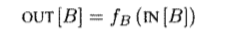

Рассмотрим определение: 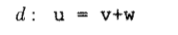

Эта инструкция \"генерирует\" определение переменной и \"уничтожает\"
все другие определения этой переменной в программе.

Передаточная функция определения d может быть записана как:


где gen = {d} - мн-во определений, генерируемых инструкцией, а kill -
мн-во всех прочих определений u в программе.

Передаточная функция базового блока может быть получена путем композиции
передаточных функций, содержащихся в нём инструкций:
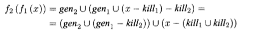


Таким образом, базовый блок, как и инструкция, с одной стороны,
генерирует множество определений, с другой - уничтожает множество
определений.

### Практическая часть

По графу потока управления для каждого блока вычисляются множества gen и
kill следующими методами:

``` {.csharp}
private void GetDefs(IReadOnlyCollection<BasicBlock> blocks)
{
    var defs = new List<Instruction>();
    foreach (var block in blocks)
    {
        foreach (var instruction in block.GetInstructions())
        {
            if (instruction.Operation == "assign" ||
                instruction.Operation == "input" ||
                instruction.Operation == "PLUS" && !instruction.Result.StartsWith("#"))
            {
                defs.Add(instruction);
            }
        }
    }
    defs_groups = defs.ToLookup(x => x.Result, x => x);
}

private void GetGenKill(IReadOnlyCollection<BasicBlock> blocks)
{
    var gen = new List<DefinitionInfo>();
    var kill = new List<DefinitionInfo>();
    foreach (var block in blocks)
    {
        var used = new HashSet<string>();
        foreach (var instruction in block.GetInstructions().Reverse<Instruction>())
        {
            if (!used.Contains(instruction.Result) &&
                (instruction.Operation == "assign" ||
                instruction.Operation == "input" ||
                instruction.Operation == "PLUS" && !instruction.Result.StartsWith("#")))
            {
                gen.Add(new DefinitionInfo { BasicBlock = block, Instruction = instruction });
                used.Add(instruction.Result);
            }
            foreach (var killed_def in defs_groups[instruction.Result].Where(x => x != instruction))
            {
                kill.Add(new DefinitionInfo { BasicBlock = block, Instruction = killed_def });
            }
        }
    }
    gen_block = gen.ToLookup(x => x.BasicBlock, x => x.Instruction);            
    kill = kill.Distinct().ToList();
    kill_block = kill.ToLookup(x => x.BasicBlock, x => x.Instruction);
}
```

Применение передаточной функции к блоку:

``` {.csharp}
public IEnumerable<Instruction> ApplyTransferFunc(IEnumerable<Instruction> In, BasicBlock block) =>
    gen_block[block].Union(In.Except(kill_block[block]));
```

### Место в общем проекте (Интеграция)

Данный метод используется в анализе достигающих определений

``` {.csharp}
TransferFunction = new ReachingTransferFunc(graph).Transfer;
```

### Тесты

Тестируется на тестах из реализации задачи анализа достигающих
определений. См. Анализ достигающих определений.

Анализ достигающих определений
------------------------------

### Постановка задачи

Необходимо накопить IN-OUT информацию по достигающим определениям в
базовых блоках для дальнейшей оптимизации.

### Команда

Д. Володин, Н. Моздоров

### Зависимые и предшествующие задачи

Предшествующие:

-   Построение графа потока управления
-   Вычисление передаточной функции для достигающих определений
-   Итерационный алгоритм в обобщённой структуре

### Теоретическая часть

Определение *d* достигает точки *p*, если существует путь от точки,
непосредственно следующей за *d*, к точке *p*, такой, что *d* не
уничтожается вдоль этого пути. Обозначим *genB* \-\-- множество
определений, генерируемых и не переопределённых базовым блоком *B*, и
*killB* \-\-- множество остальных определений переменных, определяемых в
определениях *genB*, в других базовых блоках. Тогда решить задачу о
достигающих определениях можно с помощью итерационного алгоритма: на
вход ему подаётся граф потока управления с вычисленными для каждого
базового блока множествами *genB* и *killB*, описание алгоритма
представлено ниже.

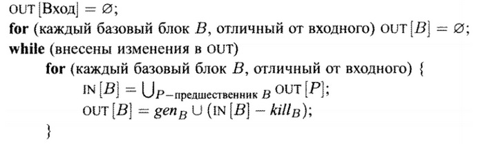

На каждом шаге IN\[*B*\] и OUT\[*B*\] не уменьшаются для всех *B* и
ограничены сверху, поэтому алгоритм сходится.

### Практическая часть

Для решения задачи использовался обобщённый итерационный алгоритм.
Свойства, использующиеся в нём, задаются следующим образом:

``` {.csharp}
/// оператор сбора
 public override Func<IEnumerable<BasicBlock>, IEnumerable<BasicBlock>, IEnumerable<BasicBlock>> CollectingOperator
     => (a, b) => a.Union(b);

/// оператор сравнения (условие продолжения цикла)
public override Func<IEnumerable<BasicBlock>, IEnumerable<BasicBlock>, bool> Compare
    => (a, b) => !a.Except(b).Any() && !b.Except(a).Any();
    
/// Начальное значение для всех блоков, кроме первого
public override IEnumerable<Instruction> Init { get => Enumerable.Empty<Instruction>(); protected set { } }
    
/// передаточная функция
public override Func<BasicBlock, IEnumerable<Instruction>, IEnumerable<Instruction>> TransferFunction { get; protected set; }
```

Свойство `TransferFunction`, задающее передаточную функцию, зависит от
графа потока управления, и она задаётся во время вызова алгоритма:

``` {.csharp}
TransferFunction = new ReachingTransferFunc(graph).Transfer;
```

Результат возвращается методом `Execute`.

### Место в общем проекте (Интеграция)

Анализ достигающих определений является одним из итерационных алгоритмов
по графу потока управления, анализирующих глобально текст программы. Его
реализация основана на обобщённом итерационном алгоритме, реализованном
другой командой. Передаточная функция для достигающих определений была
изначально реализована в рамках текущей задачи, а затем вынесена как
отдельная задача.

### Тесты

В тестах проверяется содержимое IN и OUT для каждого базового блока
программы. Тестирование проводится на различных примерах:

-   из одного базового блока

```{=html}
<!-- -->
```
    var a, b, c;
    b = 3;
    a = 1;
    a = 2;
    b = a;
    c = a;
    c = b;

-   с ветвлениями

```{=html}
<!-- -->
```
    var a, b;
    input(a);
    if a > 0
        b = 0;
    else
        a = 1;
    b = a;

-   с циклами

```{=html}
<!-- -->
```
    var i, k;
    for k = 0, 2
        i = i + 1;

-   комбинированные тесты

```{=html}
<!-- -->
```
    var i, m, j, n, a, u1, u2, u3, k;
    1: i = m - 1;
    2: j = n;
    3: a = u1;
    for k = 0, 1
    {
        i = i + 1;
        j = j - 1;

        if i < j
            a = u2;
        i = u3;
    }

Удаление мёртвого кода, используя InOut информацию из Достигающих определений
-----------------------------------------------------------------------------

### Постановка задачи

Необходимо удалить мёртвый код в пределах всех программы с
использованием информации из Достигающих определений.

### Команда

Д. Володин, Н. Моздоров

### Зависимые и предшествующие задачи

Предшествующие:

-   Анализ достигающих определений
-   Построение графа потока управления

### Теоретическая часть

После выполнения анализа достигающих определений мы получаем на выходе
IN-OUT информацию о каждом базовом блоке программы: какие определения
являются достигающими в начале блока и какие в конце. Если какое-то
определение входит в IN-множество некоторого блока, но не входит в его
OUT-множество, то это означает, что такое определение затирается в
данном базовом блоке. Тогда необходимо проанализировать граф потока
управления и найти места, где данное определение используется. Если
таких мест нет, то такое определение является мёртвым кодом, и его можно
удалить.

### Практическая часть

Для данной оптимизации был создан класс
`ReachingDefinitionsOptimization` с основным методом `DeleteDeadCode`,
который выполняет данную оптимизацию. Вначале выполняется анализ
достигающих переменных, и результат записывается в переменную `info`,
затем создаются множества используемых переменных для каждого блока
`usedVars` и множество `usedDefinitions` определений, которые
используются в коде. Далее следует цикл, пока находятся определения для
удаления, перебираются все базовые блоки, для каждого находятся
определения-кандидаты на удаление как разность множеств IN и OUT, и для
каждого кандидата выполняется проверка:

-   что определение не было добавлено в `usedDefinitions`
-   что определение не используется в текущем блоке до своего затирания
-   что определение не используется в блоке, в котором оно находится,
    после его объявления
-   что определение не используется в других блоках

Если все эти условия выполняются, определение удаляется из своего
базового блока, и `info` находится заново.

Последний пункт реализуется с помощью обхода графа потока управления в
ширину с использованием очереди `queue`. Основной цикл этой проверки
выглядит так:

``` {.csharp}
while (queue.Count != 0)
{
    var block = queue.Dequeue();
    foreach (var child in graph.GetChildrenBasicBlocks(graph.VertexOf(block)).Select(z => z.block))
    {
        var isRewritten = !info[child].Out.Contains(definitionToCheck);
        var isUsed = usedVars[block].Contains(definitionToCheck.Result);

        if (!isRewritten)
        {
            if (isUsed)
            {
                return true;
            }
            else
            {
                queue.Enqueue(child);
            }
        }
        else
        {
            if (!isUsed)
            {
                continue;
            }
            else
            {
                // we need to check instructions before definitionToCheck is rewritten
                foreach (var instruction in child.GetInstructions())
                {
                    if (instruction.Argument1 == definitionToCheck.Result
                        || instruction.Argument2 == definitionToCheck.Result)
                    {
                        return true;
                    }

                    if (instruction.Result == definitionToCheck.Result)
                    {
                        break;
                    }
                }
            }
        }
    }
}
```

### Место в общем проекте (Интеграция)

Данная оптимизация использует результат работы анализа Доступных
выражений и выполняет изменение списков инструкций в базовых блоках.
Использование данной оптимизации доступно в IDE.

### Тесты

В тестах проверяется результат выполнения оптимизации для различных
тестовых случаев. Имеются тесты на оптимизацию простых программ,
программ с циклами и условиями. Самый объёмный тест выглядит следующим
образом:

    var a, b, c, d, i, j;
    a = 1;
    b = 2;
    i = 100;
    while i > 0
    {
        i = i / 2;
        a = a + 1;
        b = b - 1;
        if i > 20
        {
            a = 10;
            b = 20;
        }
        else
            b = 10;
        d = a * b;
        if (d > 100)
            d = a * a;
        else
            d = b * b;
        for j = 1, 5
            d = d * 2;
    }

Доступные выражения
-------------------

### Постановка задачи

Реализовать поиск доступных выражений между блоками графа потока
управления.

### Команда

С. Рыженков, А. Евсеенко

### Зависимые и предшествующие задачи

Предшествующие задачи:

-   Построение графа потока управления
-   Построение класса, реализующего итерационных алгоритм

### Теоретическая часть

Определение: выражение x + y доступно в точке p, если любой путь от
входного узла к p вычисляет x + y, и после последнего такого вычисления
до достижения p нет последующих присваиваний переменным x и y.


Рассмотрим пример, показанный на первом рисунке. На нём изображена часть
графа потока управления. Мы видим, что блок 1 является родителем блоков
2 и 3, а блок 2 является родителем блока 3. Выражение 4 \* i будет
доступно в блоке 3 в следующих случаях:

-   в блоке 2 переменной i не присваивается значение;
-   в блоке 2 вычисляется выражение 4 \* i, а после последнего такого
    вычисления до входа в блок 3 переменной i не присваивается новое
    значение. Пример такой ситуации показан на втором рисунке.

Требуется отыскать множество доступных выражений между блоками
компилируемой программы. Для этого для каждого блока B графа потока
управления нам необходимо было определить множество доступных выражений
на входе блока B и на его выходе. Обозначим эти множества `IN[B]` и
`OUT[B]`.

Для этого введём вспомогательные термины, применяемые только для поиска
доступных выражений.

Определение: блок генерирует выражение `x + y`, если он вычисляет
`x + y` и не выполняет последующих переопределений x и(или) y.

Множество выражений, генерируемых каждым блоком, можно вычислить для
каждой точки блока, проходя от начала до конца блока. Пусть множество
`S` будет содержать множество доступных выражений от точки входа в блок
до некоторой точки `p`. В точке, предшествующей блоку сгенерированных
выражений нет. Поэтому на входе в блок `S = ∅`. Если при дальнейшем
проходе от начала к концу в некоторой точке p стоит выражение
`x = y + z`, то для того, чтобы найти множество `S` для рассматриваемой
точки `p`, мы должны:

-   Добавить в `S` выражение `y + z`;
-   Удалить из `S` все выражения, содержащие переменную `x`.

Таким образом, для того, чтобы найти множество всех выражений,
генерируемых блоком, необходимо найти множество `S`, идя от первой
инструкции блока до последней. После обработки последней инструкции
блока мы получим множество выражений, генерируемых всем блоком. Оно
обозначается `e_gen[B]`.

Было создано универсальное множество `U`. Оно включает в себя множество
всех выражений, встречающихся в компилируемой программе.

Определение: блок уничтожает выражение `x + y`, если он присваивает (или
может присваивать) x и (или) y, и после этого не вычисляет `x + y`
заново.

Рассмотрим ещё одно множество, обозначаемое `e_kill[B]`. Оно
представляет собой множество выражений из `U`, уничтожаемых в B. Для
того, чтобы найти `e_kill[B]` необходимо завести пустое множество `K`.
Затем пройтись от начала блока до его конца. Для каждой арифметической
операции или оператора присваивания необходимо в `К` добавить те
выражения, в которых встречается переменная, указанная в рассматриваемой
инструкции слева от знака равенства. По завершении прохода по блоку
необходимо из `К` удалить те выражения, которые содержатся в множестве
`e_gen[B]`. То есть -- генерируются блоком B.

Таким образом, после выполнения указанных процедур по каждому базовому
блоку компилируемой программы у нас для каждого базового блока B будет
известно множество выражений, генерируемых блоком B -- `e_gen[B]`,
уничтожаемых блоком B -- `e_kill[B]`, а также универсальное множество
`U` всех выражений, встречающихся справа от знака равенства в программе.

Для того, чтобы найти для каждого блока множество выражений, доступных
на его входе и выходе, т.е. `IN[B]` и `OUT[B]` необходимо действовать по
следующему алгоритму.

    Вход: граф потока управления, у которого для каждого блока вычислены e_kill[B] и e_gen[B], универсальное множество U. Начальный блок – В1
    Выход: IN[B] и OUT[B] - множества выражений, доступных на входе и выходе из каждого базового блока B
    Метод: выполняется следующий алгоритм.
    OUT[Вход] = ∅;
    for (каждый базовый блок B, отличный от входного) OUT[B] = U;
    while (внесены изменения в OUT)
        for (каждый базовый блок B, отличный от входного) {
            IN[B] = ∩_(P-предшественник B) OUT[P];
            OUT[B] = e_gen[B]∪(IN[B] - e_kill[B]);
    } 

### Практическая часть

Вычисление доступных выражений между базовыми блоками основано на
применении абстрактного класса, реализующего итерационный алгоритм. Для
этого сначала был реализован класс `OneExpression`, который отвечает за
хранения информации об одном выражении. Его объекты имеют следующие
свойства:

``` {.csharp}
public string Operation { get; }
public string Argument1 { get; }
public string Argument2 { get; }
```

Первое отвечает за хранение знака операции, а два других -- за хранение
аргументов.

С помощью метода `Equals` можно сравнить два выражения. Причём два
выражения считаются равными, если равны их операции, а также первые и
вторые аргументы равны друг другу, или же первый аргумент одного
выражения равен второму аргументу другого и первый аргумент другого
выражения равен второму аргументу исходного выражения. То есть:

``` {.csharp}
public bool Equals(OneExpression expr1, OneExpression expr2)
    => expr1.Operation == expr2.Operation
    && (expr1.Argument1 == expr2.Argument1 && expr1.Argument2 == expr2.Argument2
    || expr1.Argument1 == expr2.Argument2 && expr1.Argument2 == expr2.Argument1);
```

Метод `ToString` позволяет преобразовать выражение к строковому типу, а
`ContainsVariable` -- проверить, содержит ли выражение искомую
переменную.

Для того, чтобы реализовать передаточную функцию, а также вычисление
множества `U`, а также множеств `e_gen` и `e_kill` для каждого блока,
отличного от входного, был реализован класс
`AvailableExpressionTransferFunc`. Он имеет четыре свойства. Одно -- для
хранения `U`, а два других -- для хранения `e_gen` и `e_kill` для
каждого базового блока и четвёртое -- для хранения списка операций,
которые могут участвовать в доступных выражениях.

``` {.csharp}
public static List<OneExpression> UniversalSet;
private readonly Dictionary<BasicBlock, List<OneExpression>> e_gen;
private readonly Dictionary<BasicBlock, List<OneExpression>> e_kill;
private static readonly List<string> operationTypes = new List<string> { /*...*/ };
```

Метод `GetU` указанного класса отвечает за создание списка всех
выражений, встречающихся в компилируемой программе. Оно получается путём
прохода по всем блокам программы. В случае, если, выражение, стоящее в
правой части от знака равенства, не встречается в результирующем
множестве, оно добавляется в него.

Методы `Get_e_gen` и `Get_e_kill` отвечают соответственно за получение
множеств `e_gen` и `e_kill` для каждого базового блока программы. Они
работают в точности так, как было описано ранее в теоретической части.

Для обеспечения функциональности рассматриваемого класса конструктор по
очереди запускает методы `GetU`, `Get_e_gen` и `Get_e_kill`. Полученные
значения присваиваются соответствующим свойствам.

Для реализации передаточной функции используются следующие методы:

-   `Transfer`, который запускает работу передаточной функции для
    рассматриваемого базового блока
-   `In_minus_e_kill`, который находит множество, равное
    `IN[B] – e_kill[B]`
-   `E_gen_join`, который находит множество, равное объединению `e_genB`
    и множеству, полученному в результате работы метода
    `In_minus_e_kill`.

Второй метод просматривает все выражения, содержащиеся в множестве
`IN[B]`, и в случае, если рассматриваемое выражение присутствует в
множестве `e_kill[B]`, данный метод удаляет его из данного множества.

Третий метод копирует в результирующий список выражения из `e_gen[B]`, а
затем проверяет каждое выражение из результата работы метода
`In_minus_e_kill`. Если выражение не содержится в результирующем списке,
то он добавляет его в этот список.

Класс `AvailableExpressions` является потомком абстрактного класса
`GenericIterativeAlgorithm<List<OneExpression>>`, реализующий
итерационный алгоритм. При инициализации объектов сначала задаётся
оператор сбора. В случае доступных выражений таковым является
пересечение.

Свойству `InitFirst` присваивается пустое множество, поскольку, согласно
алгоритму, `OUT[B]` равен пустому множеству.

Свойству `Init` присваивается универсальное множество `UniversalSet`.
Оно получено в результате вызова метода `GetU` класса
`AvailableExpressionTransferFunc`.

Кроме того, был определён делегат, реализующий передаточную функцию. Он
указывает на метод `Transfer` вспомогательного класса
`AvailableExpressionTransferFunc`. Для того, чтобы запустить работу
созданного алгоритма используется метод `Execute`, который реализует
итерационный алгоритм. Сам алгоритм реализован в абстрактном классе
`GenericIterativeAlgorithm`, который на выходе даёт кортеж `InOutData`.

### Место в общем проекте (Интеграция)

Поиск доступных выражений применяется наряду с другими итерационными
алгоритмами, которые могут быть реализованы с помощью абстрактного
класса `GenericIterativeAlgorithm`. Работа описанного алгоритма основана
на работе с графом потока управления и поиске блоков -- предков на
данном графе.

### Тесты

Для проверки работоспособности программы был написан ряд разнообразных
тестов, охватывающих всевозможные случаи. Вспомогательный метод
`AssertSet` - сравнивает ожидаемый и полученный результаты.

``` {.csharp}
private void AssertSet(
    List<(IEnumerable<OneExpression> In, IEnumerable<OneExpression> Out)> expected,
    List<(IEnumerable<OneExpression> In, IEnumerable<OneExpression> Out)> actual)
{
    Assert.AreEqual(expected.Count, actual.Count);
    for (var i = 0; i < expected.Count; i++)
    {
        CollectionAssert.AreEquivalent(expected[i].In, actual[i].In, $"In: i = {i}");
        CollectionAssert.AreEquivalent(expected[i].Out, actual[i].Out, $"Out: i = {i}");
    }
}
```

``` {.csharp}
[Test]
public void SimpleProgramWithUnreachableCode2()
{
    var actual = GetActualInOutData(@"
var b, c, d, x, e, g, zz, i;
1: g = c + d;
b = c + x;
goto 1;
e = zz + i;
");
    var expected = new List<(IEnumerable<OneExpression> In, IEnumerable<OneExpression> Out)>()
    {
        // 0
        (In: new List<OneExpression>(),
        Out: new List<OneExpression>()),

        // 1
        (In: new List<OneExpression>(),
        Out: new List<OneExpression>()
        {
            new OneExpression("PLUS", "c", "d"),
            new OneExpression("PLUS", "c", "x")
        }),

        // 2
        (In: new List<OneExpression>(),
        Out: new List<OneExpression>())
    };
    Assert.AreEqual(expected.Count, actual.Count);
    AssertSet(expected, actual);
}
```

Оптимизация «Доступные выражения»
---------------------------------

### Постановка задачи

Реализовать применение оптимизации «Доступные выражения» на графе потока
управления, имея информацию о выражениях, доступных на входе и выходе
каждого базового блока.

### Команда

С. Рыженков, А. Евсеенко

### Зависимые и предшествующие задачи

Предшествующие задачи:

-   Построение графа потока управления
-   Построение класса, реализующего итерационных алгоритм
-   Применение итерационного алгоритма для поиска доступных выражений на
    входе и выходе каждого базового блока
-   Удаление недостижимого кода

### Теоретическая часть

До начала работы описываемого алгоритма необходимо проверить граф потока
управления на приводимость. Если он неприводим, то данная оптимизация не
применяется. Для простоты изложения поясним суть алгоритма на конкретном
примере, изображённом на рисунке. Отметим сразу, что данная оптимизация
программы применяется к каждому блоку только один раз. В противном
случае мы получим бессмысленные повторные присваивания значений.
Рассмотрим часть графа потока управления, изображённую на рисунке. Она
получается после компилирования программы, указанной в листинге 1.

    x = y + z;
    if (a < b)
    {
        p = y + z;
    }
    q = y + z;

Листинг 1. Компилируемая программа

Для простоты были умышленно исключены входной и выходной блоки графа
потока управления, поскольку они нам в рассмотрении не понадобятся.


Пусть у нас имеются множества выражений, доступных на входе и выходе
каждого базового блока. Предположим, что мы хотим применить оптимизацию
к базовому блоку 4, изображённому на рисунке. Для этого последовательно
перебираем все доступные выражения, содержащиеся в множестве IN\[4\].
Возьмём, например, первое доступное выражение из IN\[4\] -- «y + z».
Проходим по списку всех инструкций данного блока и ищем инструкцию,
содержащую выражение "y + z". Действительно, такая инструкция содержится
в блоке 4. Тогда запоминаем её номер, а также сам блок. Блок 4, будем
называть целевым блоком, а первую инструкцию в целевом блоке, содержащую
искомое доступное выражение, -- целевой инструкцией.

Теперь наша цель -- найти все инструкции в блоках -- предках целевого
блока, содержащие выражение 'y + z", которые последними выполняются до
выполнения целевой инструкции.

Для того, чтобы это сделать мы находим все блоки -- предки целевого
блока по графу потока управления. Пусть первым из них оказался блок 3.
Проходим по списку инструкций блока 3 снизу вверх. Ищем в нём
инструкцию, содержащую выражение "y + z". Такая инструкция действительно
содержится в данном блоке. Она имеет вид: "L1: \#t3 = y + z". Запоминаем
этот блок и номер найденной инструкции в списке инструкций блока. Берём
теперь второго предка целевого блока -- блок 2. Опять проходимся по
списку инструкций данного блока снизу вверх в поисках инструкции,
содержащей выражение "y + z". Такая инструкция в данном блоке
отсутствует. Теперь мы должны найти все последние инструкции, содержащие
выражение "y + z" в блоках -- предках блока 2.

Блок 2 имеет только одного предка -- это базовый блок 1. Проходим по
списку всех его инструкций снизу вверх. Ищем необходимую нам инструкцию.
Такая инструкция действительно содержится в данном блоке и имеет вид:
"\#t1 = y + z;". Проверяем, что данный блок не содержится среди тех,
которые мы запомнили ранее. Действительно, ранее нами был запомнен блок
3. Запоминаем блок 1 и номер указанной инструкции.

Теперь возвращаемся к блоку 2. У него мы рассмотрели всех предков.
Возвращаемся к целевому блоку. У него также рассмотрены все предки.
Значит мы должны закончить поиск инструкций и произвести необходимую
замену.

Для этого мы генерируем новую временную переменную. Пусть это будем
переменная "\#t5". Тогда во всех запомненных блоках мы запоминаем метку
инструкции, которая подлежит замене, и имя переменной, в которую
записывался результат вычисления. После этого мы удаляем указанную
инструкцию. Далее мы на её место вставляем две инструкции. Первая
содержит присваивание результату удалённой инструкции значения созданной
временной переменной "\#t5". Вторая содержит присваивание созданной
временной переменной значение выражения "y + z".

Далее мы запоминаем метку целевой инструкции и имя результирующей
переменной из неё. Удаляем целевую инструкцию и на её место вставляем
новую инструкцию, содержащую запомненную метку, а также представляющую
собой присваивание запомненной результирующей переменной значения
переменной "\#t5".

Таким образом мы завершаем работу с доступным выражением для блока 4.
Далее мы переходим к новому выражению из множества IN\[4\]. Таковым
является "a \< b". Проверяем, есть ли инструкция в блоке 4, содержащая
данное выражение. Такой не оказалось. Поскольку в IN\[4\] больше не
содержится доступных выражений, то для блока 4 оптимизация завершена.
Переходим к следующему блоку. Результат применения данной оптимизации
только для блока 4 представлен на рисунке.


Стоит отметить, что при наличии циклов существует ряд ограничений.
Первой ограничение состоит в том, что если мы переходили от потомка к
родителям и по какой-либо ветке пришли в целевой блок, то оптимизация
для данного доступного выражения в данном блоке не применяется.
Рассмотрим программу, код которой представлен в листинге 2.

    var x, y, z, p, q, i;
    p = y + z;
    for i = 1, 5
    {
        x = y + z;
    }
    q = y + z;

Листинг 2. Программа с циклом

Данная программа содержит цикл. Рассмотрим то, как она разбивается на
базовые блоки. Схема разбиения приведена на рисунке. На данной схеме
умышленно не показаны входной и выходной блок для компактности и
наглядности.

Предположим, что мы хотим применить оптимизацию Доступные выражения к
базовому блоку 3. IN\[3\] содержит выражение "y + z". Кроме того, сам
целевой блок содержит в одной из инструкций данное выражение. Но
перебирая родителей по описанному выше алгоритму мы придём в целевой
блок. Получается, что мы в результате оптимизации должны будем заменить
выражение "y + z" само на себя, что бессмысленно. Поэтому в случае, если
в ходе перебора родителей мы пришли в целевой базовый блок, работа по
сбору данных для оптимизации прекращается, и оптимизация для данного
выражения данного базового блока не производится.


Рассмотрим второе ограничение. Пусть у нас есть программа,
представленная в листинге 3.

    var x, y, z, p, q, r, s, i;
    p = y + z;
    for i = 1, 5
    {
        p = r + s;
    }
    q = y + z;

Листинг 3. Программа с циклом

Компилятором она разбивается на блоки так, как показано на рисунке.
Пусть мы хотим применить оптимизацию Доступные выражения для выражения
"y + z" базового блока 4. Если мы будем проходить по предкам данного
базового блока, мы по одной ветке из блока 2, в котором нет выражения "y
+ z", попадём в блок 3, являющийся телом цикла, в котором также нет
указанного выражения. После этого мы опять по рассматриваемой ветке
придём в блок 2. Получается, что мы обошли контур, в котором нет
искомого доступного выражения. Проходить по нему ещё раз бессмысленно.
Поэтому в случае, если мы пришли в блок, который уже встречался по пути
данной ветки, мы не должны ничего делать с этой веткой пути, а просто
перейти к рассмотрению другого предка блока 2, т.е. блока 1.


Таким образом, мы должны пропустить тело цикла, не содержащее искомого
доступного выражения. Для того, чтобы это сделать мы должны создать
пустой список блоков для каждого предка целевого блока. При переходе к
предкам предков и т.д. мы копируем пройденный путь и добавляем в него
раскрываемый блок.

### Практическая часть

Работа данного алгоритма основана на использовании стека. Рассмотрим по
порядку, как он работает. Как уже было сказано ранее, в начале мы
проверяем, является ли граф приводимым. В случае, если он неприводим, мы
не делаем никаких оптимизаций, связанных с доступными выражениями. Для
этого используется свойство приводимости графа. В случае успешной
проверки на приводимость мы переходим в метод `GraphTraversing`. В
данном методе организован цикл, который перебирает все блоки графа
потока управления от первого до последнего. При выборе некоторого блока
производится по описанному выше алгоритму поиск выражения из множества
IN выбранного блока. Если оно найдено, с помощью метода OpenBlock
запускается поиск описанных инструкций, содержащих рассматриваемое
выражение. При инициализации мы кладём в стек информацию о предках
целевого блока, включающую сам блок и путь до него. После входа в цикл
мы снимаем элемент со стека. Если инструкция в нём содержит искомое
выражение, мы запоминаем информацию о данном блоке в описанных выше
случаях. В противном случае мы добавляем в стек информацию о предках
раскрываемого блока. Код метода OpenBlock представлен ниже в листинге 4.
Случай, когда мы должны прекратить поиск инструкций, а также выхода из
исследуемой ветки также реализованы в данном методе.

``` {.csharp}
private bool OpenBlock(BasicBlock block, OneExpression expression)
{
    var stack = new Stack<(BasicBlock block, List<BasicBlock> way)>();
    foreach (var bblock in graph.GetParentsBasicBlocks(graph.VertexOf(block)))
    {
        var way = new List<BasicBlock>() { bblock.block };
        stack.Push((bblock.block, way));
    }
    while (stack.Count != 0)
    {
        var element = stack.Pop();
        if (!IsContainedInListOfInstr(element.block.GetInstructions(), expression, element.block))
        {
            foreach (var parent in graph.GetParentsBasicBlocks(graph.VertexOf(element.block)))
            {
                if (parent.block == targetBlock)
                {
                    return false;
                }
                if (!element.way.Contains(parent.block))
                {
                    stack.Push((parent.block, new List<BasicBlock>(element.way) { parent.block }));
                }
            }
        }
    }
    return true;
}
```

Метод `IsContainedInListOfInstr` проходит по инструкциям блока снизу
вверх и ищет первую инструкцию снизу, которая содержит исследуемое
доступное выражение. Если он находит такую инструкцию, он возвращает
true. В противном случае -- false. Кроме того, в случае обнаружения
такой инструкции он добавляет данные о блоке и номере инструкции в
список `listOfPointsInBlock` в случае отсутствия таковой в указанном
списке.

### Место в общем проекте (Интеграция)

Оптимизация Доступные выражения использует главным образом граф потока
управления и вычисленную информацию о доступных выражениях в
соответствующих классах. Применяется только один раз для всего графа
потока управления.

### Тесты

Для проверки работоспособности программы был написан ряд разнообразных
тестов, охватывающих всевозможные случаи.

``` {.csharp}
[TestCase(@"
var a, b, x, y, z, p, q;
x = y + z;
if (a < b)
{
    p = y + z;
}
q = y + z;
",
    ExpectedResult = new[]
    {
        "#t6 = y + z",
        "#t5 = #t6",
        "#t1 = #t5",
        "x = #t1",
        "#t2 = a >= b",
        "if #t2 goto L1",
        "#t3 = #t5",
        "p = #t3",
        "L1: noop",
        "#t4 = #t6",
        "q = #t4",
    },
    TestName = "SimpleProgram")]

[TestCase(@"
var a, b, d, x, e, zz, i;
e = x + d;
zz = i + x;
for i = 2, 7
{
    x = x + d;
    a = a + b;
}
",
    ExpectedResult = new[]
    {
        "#t1 = x + d",
        "e = #t1",
        "#t2 = i + x",
        "zz = #t2",
        "i = 2",
        "L1: #t3 = i >= 7",
        "if #t3 goto L2",
        "#t4 = x + d",
        "x = #t4",
        "#t5 = a + b",
        "a = #t5",
        "i = i + 1",
        "goto L1",
        "L2: noop",
    },
    TestName = "ProgramWithLoopForNoOptimization2")]

public IEnumerable<string> TestAvailableExpressionsOptimization(string sourceCode, bool optimizeAll = false)
{
    var cfg = optimizeAll ? BuildTACOptimizeCFG(sourceCode) : GenCFG(sourceCode);
    AvailableExpressionsOptimization.Execute(cfg, new AvailableExpressions().Execute(cfg));
    return cfg.GetInstructions().Select(x => x.ToString());
}
```

Итерационный алгоритм в обобщённой структуре
--------------------------------------------

### Постановка задачи

Реализовать итеративный алгоритм в обобщённой структуре.

### Команда

К. Галицкий, А. Черкашин

### Зависимые и предшествующие задачи

Предшествующие задачи:

-   Построение CFG. Обход потомков и обход предков для каждого базового
    блока

Зависимые задачи:

-   Вычисление передаточной функции для достигающих определений
    композицией передаточных функций команд

-   Активные переменные

-   Доступные выражения

-   Передаточная функция в структуре распространения констант

-   Достигающие определения

-   Итерационный алгоритм в структуре распространения констант

### Теоретическая часть

В рамках этой задачи необходимо было реализовать обобщённый итерационный
алгоритм.

Входы итерационного алгоритма:

-   Граф потока данных с помеченными входными и выходными узлами
-   Направление потока данных
-   Множество значений V
-   Оператор сбора /\\
-   Множество функций f где f(b) из F представляет собой передаточную
    функцию для блока b
-   Константное значение V вход или V выход из V, представляющее собой
    граничное условие для прямой и обратной структуры соответственно.

Выходы итерационного алгоритма:

-   Значения из V для in(b) и out(b) для каждого блока b в CFG

Алгоритм для решения прямой задачи потока данных:


Алгоритм для решения обратной задачи потока данных:


Служит для избежания базового итеративного алгоритма для каждой
структуры потока данных используемой на стадии оптимизации. Его задача
вычисление in и out для каждого блока как ряд последовательных
приближений. А также его использование предоставляет ряд полезных
свойств приведённых ниже:


### Практическая часть

Реализовали класс выходных данных:

``` {.csharp}
public class InOutData<T> : Dictionary<BasicBlock, (T In, T Out)> // Вид выходных данных вида (Базовый блок, (его входы, его выходы))
```

Указываем вид прохода алгоритма:

``` {.csharp}
public enum Direction { Forward, Backward }
```

Реализовали обобщённый итерационный алгоритм для прямого и обратного
прохода. Алгоритм реализован в виде абстрактного класса, это предоставит
возможность каждому итерационному алгоритму самостоятельно
переопределить входные данные, передаточную функцию, верхний или нижний
элемент пула решётки (относительно прохода алгоритма) и оператор сбора.
Пример реализации:

``` {.csharp}
public abstract class GenericIterativeAlgorithm<T> where T : IEnumerable
{
    public virtual InOutData<T> Execute(ControlFlowGraph graph, bool useRenumbering = true)
    {
        GetInitData(graph, useRenumbering, out var blocks, out var data,
            out var getPreviousBlocks, out var getDataValue, out var combine);

        var outChanged = true;
        Iterations = 0;
        while (outChanged)
        {
            outChanged = false;
            foreach (var block in blocks)
            {
                var inset = getPreviousBlocks(block).Aggregate(Init, (x, y) => CollectingOperator(x, getDataValue(y)));
                var outset = TransferFunction(block, inset);

                if (!Compare(outset, getDataValue(block)))
                {
                    outChanged = true;
                }
                data[block] = combine(inset, outset);
            }
            ++Iterations;
        }
        return data;
    }
}
```

Переопределение входных данных, передаточной функции, оператора сбора и
элементов пула решётки вынесли во вспомогательный алгоритм.

### Место в общем проекте (Интеграция)

Используется для вызова итерационных алгоритмов в единой структуре.

### Тесты

В тестах проверяется использование итерационных алгоритмов в обобщённой
структуре, результаты совпадают с ожидаемыми. Ниже приведён тест
проверки работы алгоритма живых переменных.

``` {.csharp}
[Test]
public void LiveVariables()
{
    var program = @"
var a, b, c;

input(b);
a = b + 1;
if a < c
    c = b - a;
else
    c = b + a;
print(c);
";

    var cfg = GenCFG(program);
    var resActiveVariable = new LiveVariables().Execute(cfg);
    var actual = cfg.GetCurrentBasicBlocks()
        .Select(z => resActiveVariable[z])
        .Select(p => ((IEnumerable<string>)p.In, (IEnumerable<string>)p.Out))
        .ToList();

    var expected =
        new List<(IEnumerable<string>, IEnumerable<string>)>()
        {
            (new HashSet<string>(){ "c" }, new HashSet<string>(){ "c" }),
            (new HashSet<string>(){ "c" }, new HashSet<string>(){ "a", "b" }),
            (new HashSet<string>(){ "a", "b" }, new HashSet<string>(){ "c" }),
            (new HashSet<string>(){ "a", "b" }, new HashSet<string>(){ "c" }),
            (new HashSet<string>(){ "c" }, new HashSet<string>(){ }),
            (new HashSet<string>(){ }, new HashSet<string>(){ })
        };

    AssertSet(expected, actual);
}
```

Итерационный алгоритм с оптимальной скоростью работы после перенумерации блоков
-------------------------------------------------------------------------------

### Постановка задачи

Необходимо улучшить сходимость итерационного алгоритма, посещая узлы
графа в соответствии с их упорядочением в глубину.

### Команда

Д. Володин, Н. Моздоров

### Зависимые и предшествующие задачи

Предшествующие:

-   Алгоритм упорядочения в глубину
-   Итерационный алгоритм в обобщённой структуре

Зависимые:

-   Анализ активных переменных
-   Анализ достигающих определений
-   Анализ доступных выражений

### Теоретическая часть

Максимальное количество итераций итеративного алгоритма равно высоте
полурешётки, умноженной на количество узлов графа. Во многих анализах
вычисления можно упорядочить так, что алгоритм будет сходиться за
существенно меньшее количество итераций. В частности, если события
распространяются вдоль некоторого ациклического пути и пути с циклами
ничего не добавляют, то сходимость можно существенно улучшить.

Если информация распространяется только вдоль ациклических путей, то
можно подобрать порядок посещения узлов (базовых блоков) так, чтобы
после небольшого количества проходов алгоритм сходился. Для задач в
прямом направлении необходимо посещать узлы в соответствии с их
упорядочением в глубину.

### Практическая часть

Данная задача была выполнена следующим образом. В сигнатуру метода
`Execute` обобщённого итерационного алгоритма был добавлен параметр
`useRenumbering` типа `bool`, и если этот параметр равняется `true`, то
в самом начале итеративного алгоритма базовые блоки сортируются по
глубине в графе потока управления. Если алгоритм выполняется в обратном
направлении, то блоки сортируются в обратном порядке.

``` {.csharp}
if (useRenumbering)
{
    blocks = Direction == Direction.Backward
      ? blocks.OrderByDescending(z => graph.DepthFirstNumeration[graph.VertexOf(z)])
      : blocks.OrderBy(z => graph.DepthFirstNumeration[graph.VertexOf(z)]);
}
```

Также в класс обобщённого алгоритма было добавлено поле `Iterations` для
оценки количества итераций, выполненных алгоритмом.

### Место в общем проекте (Интеграция)

Данная оптимизация встроена в обобщённый итеративный алгоритм и
используется по умолчанию (чтобы отказаться от обхода блоков графа с
упорядочением по глубине, нужно явно указать параметр
`useRenumbering = false`).

### Тесты

В тестах проверяется, что для созданных ранее итерационных алгоритмов
количество итераций, совершённое с упорядочением блоков, не превосходит
количество итераций без упорядочения. Ниже представлен тест для
алгоритма анализа достигающих определений.

``` {.csharp}
[Test]
public void ReachingDefinitions()
{
    var program = @"
var i, m, j, n, a, u1, u2, u3, k;
1: i = m - 1;
2: j = n;
3: a = u1;

for k = 0, 1
{
    i = i + 1;
    j = j - 1;

    if i < j
        a = u2;
    i = u3;
}
";
    var graph = GenCFG(program);
    var algorithm = new LiveVariables();

    algorithm.Execute(graph);
    var iterationsFast = algorithm.Iterations;
    algorithm.Execute(graph, false);
    var iterationsSlow = algorithm.Iterations;

    Assert.LessOrEqual(iterationsFast, iterationsSlow);
}
```

Альтернативная реализация хранения IN OUT в виде битовых векторов. Интеграция данного представления в существующий итерационный алгоритм. {#альтернативная-реализация-хранения-in-out-в-виде-битовых-векторов-интеграция-данного-представления-в-существующий-итерационный-алгоритм}
-----------------------------------------------------------------------------------------------------------------------------------------

### Постановка задачи

Необходимо реализовать альтернативный способ представления IN/OUT данных
для итерационных алгоритмов, а затем интегрировать данный способ
представления данных в какой-нибудь алгоритм.

### Команда

А.Пацеев, И.Ушаков

### Зависимые и предшествующие задачи

Предшествующие:

-   Построение графа потока управления
-   Вычисление передаточной функции для достигающих определений
-   Итерационный алгоритм в обобщённой структуре

### Теоретическая часть

Множества IN и OUT используются в итеративных алгоритмах над CFG,
например в алгоритме поиска достижимых определений.\
Данные множества вычисляются с помощью операций объединения и разности
над множествами gen и kill. Поэтому представление\
этих множеств в виде битовых массивов крайне удобно для эффективной
реализации.


### Практическая часть

Битовое представление IN и OUT было использовано в алгоритме
ReachingDefinitions, который реализован на основе обобщённого
итерационного алгоритма. По определению данного алгоритма, результатом
его работы должна быть информация вида
`InOutData<IEnumerable<Instruction>>`, а значит необходимо создать
механизм трансляции между битовым и обычным представлением IN-OUT
данных. Для этого перед запуском алгоритма создается индекс
идентификаторов инструкций, с помощью которых в конце работы алгоритма
можно будет преобразовать результат в надлежащий вид.

``` {.csharp}
var idByInstruction = assigns  
    .Select((value, index) => new { value, index })  
    .ToDictionary(x => x.value, x => x.index);  
  
var inOutData = base.Execute(graph, useRenumbering); // основная логика алгоритма
  
var modifiedBackData = inOutData  
    .Select(x => new { x.Key, ModifyInOutBack = ModifyInOutBack(x.Value, instructions) })  
    .ToDictionary(x => x.Key, x => x.ModifyInOutBack);

return new InOutData<IEnumerable<Instruction>>(modifiedBackData);
```

При этом `base.Execute` будет работать на основе битовых операций. Для
возможности работы данного метода с битовыми векторами необходимо было
создать реализацию передаточной функции, которая создает множества Gen и
Kill в виде битовых векторов, а затем использует битовые операции `Or` и
`Except` для проведения вычислений, приведённых в формулах в
теоретической части.

``` {.csharp}
private BitArray ApplyTransferFunc(BitArray @in, BasicBlock block)  
{  
    var gen = gen_block.ContainsKey(block) ? 
        gen_block[block] : new BitArray(@in.Count, false);  
    var kill = kill_block.ContainsKey(block) ? 
        kill_block[block] : new BitArray(@in.Count, false);  
    return gen.Or(BitUtils.Except(@in, kill));  
}
```

Для представления множеств Gen и Kill в виде битовых массивов
используется вспомогательный метод, который на основании
`idByInstruction`, вычисленному в начале работы алгоритма и информации
об определениях, формирует битовый массив.

``` {.csharp}
public static Dictionary<BasicBlock, BitArray> 
    GroupByBlockAndTurnIntoInstructions(  
        IEnumerable<DefinitionInfo> defs,  
        Dictionary<Instruction, int> idsByInstruction  
    )  
{  
    var result = defs  
        .ToLookup(x => x.BasicBlock, x => x.Instruction)  
        .ToDictionary(x => x.Key, x => TurnIntoBits(x.ToList(), idsByInstruction));  
  
    return result;  
}
```

### Место в общем проекте (Интеграция)

Реализация битового представления IN-OUT и интеграция в существующий
алгоритм является вспомогательным средством, которое может быть
использовано для анализа потока управления. Интеграция основана на
обобщённом итерационном алгоритме. Для реализации интеграции
потребовалось реализовать вспомогательные методы для операций над
битовыми массивами, а также создать способ преобразования Gen и Kill
множеств в битовое представление и обратно.

### Тесты

Тестами покрыты как и вспомогательные битовые операции для
преобразование данных, так и непосредственно сам итерационный алгоритм
по поиску достигающих определений. Примеры исходных данных для
тестирования:

    var a;
    a = 1;
    a = 2;

    var a;
    a = 1;
    input(a);

    var a, b;
    a = 1;
    goto 1;
    1: b = 2;

    var a, b;
    input(a);
    if a > 0
        b = 0;
    else
        a = 1;
    b = a;

    var i, k;
    for k = 0, 2
        i = i + 1;

    var a;
    1: a = 1;
    goto 1;
    a = 4;

    var i, m, j, n, a, u1, u2, u3, k;
    1: i = m - 1;
    2: j = n;
    3: a = u1;

    for k = 0, 1
    {
        i = i + 1; j = j - 1;
        if i < j
            a = u2;
        i = u3;
    }

Классификация рёбер графа: наступающие, отступающие, поперечные (по построенному остовному дереву)
--------------------------------------------------------------------------------------------------

### Постановка задачи

В данной задаче необходимо классифицировать рёбра графа по остовному
дереву на три группы: наступающие, отступающие и поперечные.

### Команда

А. Пацеев, И. Ушаков

### Зависимые и предшествующие задачи

Предшествующие:

-   Алгоритм упорядочения в глубину с построением глубинного остовного
    дерева

### Теоретическая часть

Рёбра графа классифицируются на три группы:

Наступающие (advancing) -- от m к потомкам в дереве (все рёбра
глубинного остовного дерева + возможно другие -- например, 4 → 8)

Отступающие (retreating) -- от m к предку в дереве (возможно, к самому
m): 4 → 3, 7 → 4, 10 → 7, 8 → 3, 9 → 1

Поперечные (cross) -- рёбра m → n, такие что ни m ни n не являются
предками друг друга: 2 → 3, 5 → 7

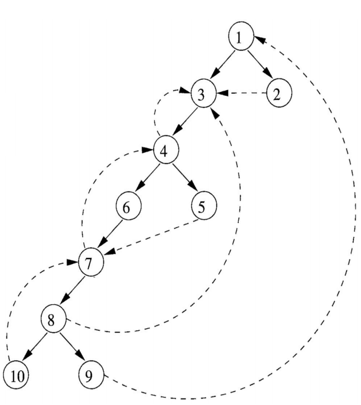

### Практическая часть

Были произведены изменения текущего метода нахождения DTFS и самого
класса CFG следующим образом:

Первым шагом были введены новые поля, отвечающие за тот или иной тип к
которому относится ребро:

``` {.csharp}
public enum EdgeType
{
    Advancing,
    Retreating,
    Cross
}

private List<(int from, int to, EdgeType type)> _classifiedEdges;
public IReadOnlyList<(int from, int to, EdgeType type)> ClassifiedEdges => _classifiedEdges;
```

Следующим шагом были введены два новых статуса для каждой из вершин и
модифицирован алгоритм DFS таким образом, чтобы при проходе определять,
к какому классу относится то или иное ребро. Согласно описанной выше
теоретической части мы получаем:

``` {.csharp}
private void DFS()
    {
        /* ... */

        _classifiedEdges = new List<(int, int, EdgeType)>();
        var vertexStatuses = Enumerable.Repeat(VertexStatus.Init, c).ToArray();
        var pre = new int[c];
        var counter = 0;

        void dfs(int vertex)
        {
            vertexStatuses[vertex] = VertexStatus.InProgress;
            pre[vertex] = counter++;
            _nlr.Add(vertex);
            foreach (var (v, _) in _children[vertex])
            {
                switch (vertexStatuses[v])
                {
                    case VertexStatus.Init:
                        _classifiedEdges.Add((vertex, v, EdgeType.Advancing));
                        _dfst.Add((vertex, v));
                        dfs(v);
                        break;
                    case VertexStatus.InProgress:
                        _classifiedEdges.Add((vertex, v, EdgeType.Retreating));
                        break;
                    case VertexStatus.Done:
                        var edgeType = (pre[v] < pre[vertex]) ? EdgeType.Cross : EdgeType.Advancing;
                        _classifiedEdges.Add((vertex, v, edgeType));
                        break;
                }
            }
            vertexStatuses[vertex] = VertexStatus.Done;
            /* ... */
        }
        dfs(0);
    }
```

### Место в общем проекте (Интеграция)

Данный метод был успешно интегрирован в Control Flow Graph, получить все
рёбра в остовном дереве и их типы можно при помощи следующей функции:

``` {.csharp}
public IReadOnlyList<(int from, int to, EdgeType type)> ClassifiedEdges => _classifiedEdges;
```

### Тесты

В тестах проверяется работоспособность данного алгоритма, а также его
соответствие заранее заданной структуре:

``` {.csharp}
namespace SimpleLanguage.Tests.CFG
{
    [TestFixture]
    internal class CFGdfs : TACTestsBase
    {
        [Test]
        public void Test1()
        {
            var TAC = GenTAC(@"
var a, b, c, d, x, u, e,g, y,zz,i;
goto 200;
200: a = 10 + 5;
for i=2,7 
    x = 1;
if c > a
{
    a = 1;
}
else 
{
    b = 1;
}
");

            var blocks = BasicBlockLeader.DivideLeaderToLeader(TAC);
            var cfg = new ControlFlowGraph(blocks);

           /* ... */

            var ce = new List<(int from, int to, ControlFlowGraph.EdgeType type)>{
                (0, 1, ControlFlowGraph.EdgeType.Advancing),
                (1, 2, ControlFlowGraph.EdgeType.Advancing),
                (2, 3, ControlFlowGraph.EdgeType.Advancing),
                (3, 5, ControlFlowGraph.EdgeType.Advancing),
                (5, 7, ControlFlowGraph.EdgeType.Advancing),
                (7, 8, ControlFlowGraph.EdgeType.Advancing),
                (8, 9, ControlFlowGraph.EdgeType.Advancing),
                (5, 6, ControlFlowGraph.EdgeType.Advancing),
                (6, 8, ControlFlowGraph.EdgeType.Cross),
                (3, 4, ControlFlowGraph.EdgeType.Advancing),
                (4, 3, ControlFlowGraph.EdgeType.Retreating)
                };
            
            Assert.AreEqual(ce.Count, cfg.ClassifiedEdges.Count);
            Assert.AreEqual(
                ce.FindAll(c => c.type == ControlFlowGraph.EdgeType.Cross).Count, 
                1
            );
            Assert.AreEqual(
                ce.FindAll(c => c.type == ControlFlowGraph.EdgeType.Retreating).Count, 
                1
            );
            Assert.AreEqual(
                ce.FindAll(c => c.type == ControlFlowGraph.EdgeType.Advancing).Count, 
                9
            );
            Assert.IsTrue(ce.Find(x => x.from == 6 && x.to == 8).type == ControlFlowGraph.EdgeType.Cross);
            Assert.IsTrue(ce.Find(x => x.from == 4 && x.to == 3).type == ControlFlowGraph.EdgeType.Retreating);
            foreach (var c in cfg.ClassifiedEdges)
            {
                Assert.Contains(c, ce);
            }
            CollectionAssert.AreEqual(ce, cfg.ClassifiedEdges);
            Console.WriteLine("ClassifiedEdges");
            foreach (var c in cfg.ClassifiedEdges)
            {
                Console.WriteLine(c);
            }
        }
    }
}
```

Упорядочение CFG в глубину с построением глубинного остовного дерева
--------------------------------------------------------------------

### Постановка задачи

Реализовать алгоритм упорядочения графа потока управления в глубину с
построением глубинного остовного дерева.

### Команда

Д. Лутченко, М. Письменский

### Зависимые и предшествующие задачи

Зависимые задачи:

-   Классификация рёбер графа

Предшествующая задача:

-   Построение графа потока управления

### Теоретическая часть

Поиск в глубину --- один из методов обхода графа. Стратегия поиска в
глубину, как и следует из названия, состоит в том, чтобы идти «вглубь»
графа, насколько это возможно.

Применение поиска в глубину на графе потока управления, начиная с
входного блока, позволяет получить глубинное остовное дерево.
Упорядочение узлов в глубину представляет собой обращенный обратный
порядок обхода.

### Практическая часть

``` {.csharp}
List<int> NLR; // прямой порядок обхода
List<int> LRN; // обратный порядок обхода
List<(int, int)> DFST; // список рёбер глубинного остовного дерева
List<int> DFN; // нумерация в глубину
```

Алгоритм поиска описывается рекурсивно: перебираем все исходящие из
рассматриваемой вершины рёбра. Если ребро ведёт в вершину, которая не
была рассмотрена ранее, то запускаем алгоритм от этой нерассмотренной
вершины, а после возвращаемся и продолжаем перебирать рёбра. Возврат
происходит в том случае, если в рассматриваемой вершине не осталось
рёбер, которые ведут в нерассмотренную вершину.

``` {.csharp}
var used = new bool[c];

dfs = (int vertex) =>
{
    used[vertex] = true;
    NLR.Add(vertex);
    foreach ((var v, _) in children[vertex])
      if (!used[v])
      {
          DFST.Add((vertex, v));
          dfs(v);
      }
    LRN.Add(vertex);
    DFN[vertex] = --c;
};

dfs(0);
```

### Место в общем проекте (Интеграция)

Используется в изменённых итерационных алгоритмах для оптимальной
скорости работы.

### Тесты

Тест заключается в проверке корректности построений:

-   прямого и обратного обходов
-   упорядочения в глубину
-   глубинного остовного дерева

``` {.csharp}
var cfg = GenCFG(@"
var a, b, c, x, i;
goto 200;
200: a = 10 + 5;
for i = 2, 7
    x = 1;
if c > a
{
    a = 1;
}
else
{
    b = 1;
}
");

//            0
//            ↓
//            1
//            ↓
//            2
//            ↓
//        → → 3
//        ↑  / \
//        ← 4   \
//              ↓
//              5
//             / \
//            7   6
//            ↓   ↓
//            8 ← ←
//            ↓
//            9

var nlr = new List<int>() { 0, 1, 2, 3, 5, 7, 8, 9, 6, 4 };
CollectionAssert.AreEqual(nlr, cfg.PreOrderNumeration);

var lrn = new List<int>() { 9, 8, 7, 6, 5, 4, 3, 2, 1, 0 };
CollectionAssert.AreEqual(lrn, cfg.PostOrderNumeration);

lrn.Reverse();

for (var i = 0; i < lrn.Count; ++i)
{
    Assert.AreEqual(cfg.DepthFirstNumeration[lrn[i]], i);
}

var check = new bool[cfg.GetCurrentBasicBlocks().Count];
foreach ((var u, var v) in cfg.DepthFirstSpanningTree)
{
    check[u] = true;
    check[v] = true;
}

foreach (var c in check)
{
    Assert.IsTrue(c);
}

Assert.AreEqual(check.Length - 1, cfg.DepthFirstSpanningTree.Count);
```

Построение дерева доминаторов
-----------------------------

### Постановка задачи

Необходимо по ранее созданному графу потока управления программы
определить множество доминаторов для каждого базового блока, и на основе
этой информации построить дерево доминаторов.

### Команда

Д. Володин, Н. Моздоров

### Зависимые и предшествующие задачи

Предшествующие:

-   Построение графа потока управления
-   Итерационный алгоритм в обобщённой структуре

Зависимые:

-   Обратные рёбра и определение того, что CFG является приводимым

### Теоретическая часть

Говорят, что базовый блок *B* доминирует над базовым блоком *D*, если
любой путь от входного узла в графе потока управления от входного узла к
узлу *D* проходит через узел *B*. Множество доминаторов для базовых
блоков программы можно найти с помощью итерационного алгоритма:
множество доминаторов узла (кроме него самого) -- это пересечение
доминаторов всех его предшественников, оператором сбора является
пересечение множеств, а передаточная функция *f_B*(*x*) = *x* ∪ {*B*}.

Отношение доминирования обладает свойством, что для любого базового
блока его доминаторы образуют линейно упорядоченное множество по данному
отношению. Нетрудно увидеть, что такое упорядоченное множество
представляет собой путь в дереве доминаторов от корня (входного узла) к
данному узлу. Анализируя эти пути, можно легко построить дерево
доминаторов в графе потока управления.

### Практическая часть

Для нахождения доминаторов использовался обобщённый итерационный
алгоритм, созданный ранее. Свойства, использующиеся в нём, задаются
следующим образом:

``` {.csharp}
/// оператор сбора
 public override Func<IEnumerable<BasicBlock>, IEnumerable<BasicBlock>, IEnumerable<BasicBlock>> CollectingOperator
     => (x, y) => x.Intersect(y);

/// оператор сравнения (условие продолжения цикла)
public override Func<IEnumerable<BasicBlock>, IEnumerable<BasicBlock>, bool> Compare
    => (x, y) => !x.Except(y).Any() && !y.Except(x).Any();
    
/// передаточная функция
public override Func<BasicBlock, IEnumerable<BasicBlock>, IEnumerable<BasicBlock>> TransferFunction
{
    get => (block, blockList) => blockList.Union(new[] { block });
    protected set { }
}
```

Свойства `Init` и `InitFirst` зависят от графа потока управления, и они
задаются во время вызова алгоритма:

``` {.csharp}
Init = graph.GetCurrentBasicBlocks();
InitFirst = graph.GetCurrentBasicBlocks().Take(1);
```

Метод `GetDominators` возвращает словарь, в котором ключом является
базовый блок, а значением \-\-- соответствующее OUT-множество из
итерационного алгоритма.

Построение дерева доминаторов основано на том наблюдении, что, поскольку
входной базовый блок доминирует над всеми остальными, базовые блоки с
одинаковым количеством доминаторов будут находиться на одном слое в
дереве доминаторов. Поэтому можно построить это дерево по слоям,
отсортировав узлы по количеству доминаторов, и соединяя каждый
последующий базовый блок с тем блоком из предыдущего слоя, который
доминирует над данным.

``` {.csharp}
var treeLayers = GetDominators(graph, useRenumbering)
    .Where(z => z.Key != start)
    .GroupBy(z => z.Value.Count())
    .OrderBy(z => z.Key);
var tree = new Tree(start);
var prevLayer = new List<BasicBlock>(new[] { start });
foreach (var layer in treeLayers)
{
    var currLayer = layer.ToDictionary(z => z.Key, z => z.Value);
    foreach (var block in currLayer)
    {
        var parent = prevLayer.Single(z => block.Value.Contains(z));
        tree.AddNode(block.Key, parent);
    }
    prevLayer = currLayer.Keys.ToList();
}
return tree;
```

### Место в общем проекте (Интеграция)

При построении дерева доминаторов используется обобщённый итерационный
алгоритм, созданный ранее для задач анализа достигающих определений,
активных переменных и доступных выражений. Особенность текущего
алгоритма состоит в том, что OUT-множество для входного блока
инициализируется не так, как для всех остальных блоков, поэтому в
обобщённый алгоритм было добавлено свойство `InitFirst` для
инициализации OUT-множества для входного блока.

### Тесты

В тестах проверяется как построение множества доминаторов для каждого
базового блока программы, так и построение дерева доминаторов.
Тестирование проводится на следующих примерах:

    var a;

    var a;
    a = 1;

    var a, b, c, d, e, f;
    1: a = 1;
    b = 2;
    goto 2;
    2: c = 3;
    d = 4;
    goto 3;
    3: e = 5;
    goto 4;
    4: f = 6;

    var a;
    input(a);
    1: if a == 0
        goto 2;
    a = 2;
    2: a = 3;

    var a;
    input(a);
    1: if a == 0
        goto 2;
    if a == 1
        goto 2;
    a = 2;
    2: a = 3;

    var a, b, c;
    input(a);
    b = a * a;
    if b == 25
        c = 0;
    else
        c = 1;

    var a, b, i;
    input(a);
    for i = 1, 10
    {
        b = b + a * a;
        a = a + 1;
    }

Определение всех естественных циклов
------------------------------------

### Постановка задачи

Необходимо реализовать определение всех естественных циклов программы с
использованием обратных рёбер.

### Команда

К. Галицкий, А. Черкашин

### Зависимые и предшествующие задачи

Предшествующие задачи:

-   Обратные рёбра и определение того, что CFG является приводимым
-   Построение CFG. Обход потомков и обход предков для каждого базового
    блока

Зависимые задачи

-   Построение областей

### Теоретическая часть

В рамках этой задачи необходимо было реализовать определение всех
естественных циклов. Циклы в исходной программе могут определятся
различными способами: как циклы `for`, `while` или же они могут быть
определены с использованием меток и инструкций `goto`. С точки зрения
анализа программ не имеет значения, как именно выглядят циклы в исходном
тексте программы. Важно только то, что они обладают свойствами,
допускающими простую их оптимизацию. В данном случае нас интересует,
имеется ли у цикла одна точка входа, если это так, то компилятор в ходе
анализа может предполагать выполнение некоторых начальных условий в
начале каждой итерации цикла. Эта возможность служит причиной
определения \"естественного цикла\".

Такие циклы обладают двумя важными свойствами:

-   Цикл должен иметь единственный входной узел, называемый заголовком.
-   Должно существовать обратное ребро, ведущее в заголовок цикла. В
    противном случае поток управления не сможет вернуться в заголовок
    непосредственно из \"цикла\", т.е. данная структура циклом в таком
    случае не является.

Вход алгоритма построения естественного цикла обратной дуги:

-   Граф потока G и обратная дуга n -\> d. Выход:

-   Множество loop, состоящее из всех узлов естественного цикла n -\> d.

### Практическая часть

Реализовали метод для поиска естественных циклов, который отрабатывает
только в случае, если граф является приводимым. Находим все циклы
программы при помощи обратных рёбер графа. Проверяем все циклы на
условие естественности: цикл должен содержать только одну точку входа.
Пример реализации метода, возвращающий все естественные циклы:

``` {.csharp}
<public class NaturalLoop>
foreach (var (From, To) in cfg.GetBackEdges()) // проход по всем обратным рёбрам
{
    if (cfg.VertexOf(To) > 0) // проверка на наличие цикла
    {
        var tmp = new List<BasicBlock>(); // временный список
        for (var i = cfg.VertexOf(To); i < cfg.VertexOf(From) + 1; i++)
        {
            if (!tmp.Contains(ForwardEdges[i])) // содержит ли список данный ББл
            {
                tmp.Add(ForwardEdges[i]);
            }
        }

        natLoops.Add(tmp);
    }
}
```

Цикл является естественным, если все его ББл не содержат входы извне
цикла. Вспомогательный метод для проверки циклов на естественность:

``` {.csharp}
// если кол-во родителей больше 1, значит есть вероятность, что цикл содержит метку с переходом извне
if (parents.Count > 1)
{
    foreach (var parent in parents.Select(x => x.block)) // проверяем каждого родителя
    { // если родитель не принадлежит текущему циклу, этот цикл не является естественным
        if (!loop.Contains(parent))
        {
            return false;
        }
    }
}
```

Результат работы алгоритма :

``` {.csharp}
// Возвращаем только те циклы, которые являются естественными
return natLoops.Where(loop => IsNaturalLoop(loop, cfg)).ToList();
```

### Место в общем проекте (Интеграция)

Используется для определения всех естественных циклов программы:

``` {.csharp}
/* ... */
var natLoops = NaturalLoop.GetAllNaturalLoops(cfg);
/* ... */
```

### Тесты

В тестах проверяется определение всех естественных циклов.

``` {.csharp}
[Test]
public void IntersectingLoops()
{
    var TAC = GenTAC(@"
var a, b;

54: a = 5;
55: a = 6;
b = 6;
goto 54;
goto 55;
");
    var cfg = GenCFG(TAC);

    var actual = NaturalLoop.GetAllNaturalLoops(cfg);
    var expected = new List<List<BasicBlock>>()
    {
        new List<BasicBlock>()
        {
            new BasicBlock(new List<Instruction>(){ TAC[0] }),
            new BasicBlock(new List<Instruction>(){ TAC[1], TAC[2], TAC[3] }),

        }
    };

    AssertSet(expected, actual);
}

[Test]
public void NestedLoops()
{
    var TAC = GenTAC(@"
var a, b;

54: a = 5;
55: a = 6;
b = 6;
goto 55;
goto 54;
");
    var cfg = GenCFG(TAC);

    var actual = NaturalLoop.GetAllNaturalLoops(cfg);
    var expected = new List<List<BasicBlock>>()
    {
        new List<BasicBlock>()
        {
            new BasicBlock(new List<Instruction>(){ TAC[1], TAC[2], TAC[3] })
        }

    };

    AssertSet(expected, actual);
}
```

Построение областей
-------------------

### Постановка задачи

В данной задаче необходимо построить иерархию областей графа потока
управления.

### Команда

Карякин В.В., Карякин Д.В.

### Зависимые и предшествующие задачи

Предшествующие:

-   Построение потока графа управления
-   Определение всех естественных циклов

### Теоретическая часть

В процессе анализа на основе областей программа рассматривается как
иерархия областей, которые грубо можно считать частями графа потока,
имеющими единственную точку входа. Дадим формальное определение области:

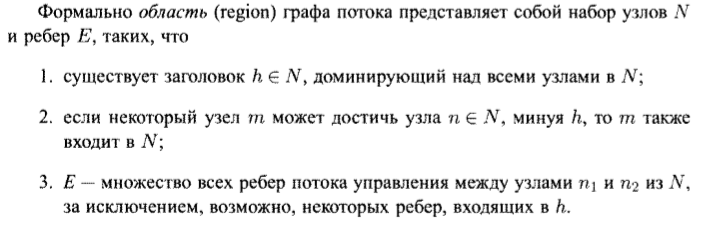

В рассматриваемом разбиении предполагается, что граф потока приводим.
Для построения областей мы идентифицируем естественные циклы. Любые два
из которых либо не пересекаются, либо один из них вложен в другой.
Приведём используемый алгоритм построения восходящего порядка областей
приводимого графа потока.

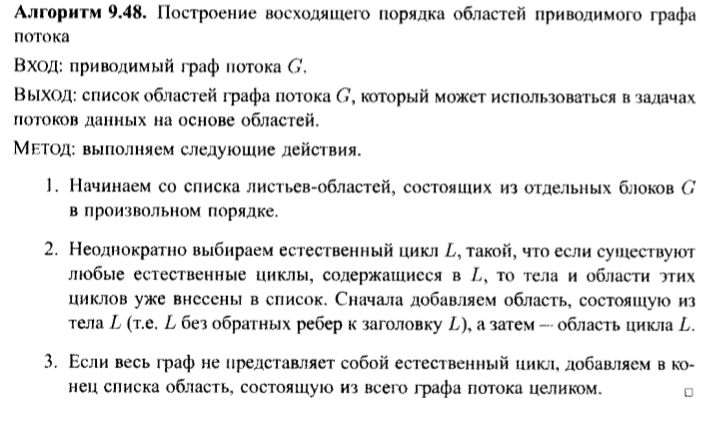

### Практическая часть

Для представления региона использовался класс Region, где поле Initial
используется для хранения блока графа, соответствующего
областям-листьям.

``` {.csharp}
public class Region
{
    public IReadOnlyCollection<Region> IncludedRegions;
    public IReadOnlyCollection<(Region, Region)> Edges;
    public BasicBlock Initial;

    public Region(IReadOnlyCollection<Region> regions = null, IReadOnlyCollection<(Region, Region)> edges = null, BasicBlock initial = null)
    {
        IncludedRegions = regions;
        Edges = edges;
        Initial = initial;
    }
}
```

При построении иерархии областей применяются два метода. `FindRegions`
добавляет в список регионов области-листья, затем отсортированные по
вложенности циклы поочередно сводятся к отдельным узлам. После обхода
всех естественных циклов добавляем в конец списка область, состоящую из
всего графа потока целиком.

``` {.csharp}
private void FindRegions()
{
    foreach (var item in blocks)
    {
        regions.Add(new Region(initial: item));
        BlockToRegion.Add(item, regions.Count - 1);
        curID++;
    }
    for (var i = 0; i < cycles.Count; ++i)
    {
        CollapseCycle(cycles[i]);
    }
    var tempEdges = new List<(Region, Region)>();
    foreach (var entry in children)
    {
        foreach (var second in entry.Value)
        {
            tempEdges.Add((regions[BlockToRegion[entry.Key]], regions[BlockToRegion[second]]));
        }
    }
    regions.Add(new Region(blocks.Select(x => regions[BlockToRegion[x]]).ToList(), tempEdges));
}
```

Метод `CollapseCycle` замещает новым узлом переданный естественный цикл
на графе потока управления. Добавляя новый узел, мы перенаправляем рёбра
на заголовок цикла, из цикла во внешнюю область. Узлы и ребра внутри
цикла будут соответствовать новому региону.

``` {.csharp}
private void CollapseCycle(IReadOnlyCollection<BasicBlock> cycle)
{
    /* ... */
    foreach (var curVertex in blocks)
    {
        if (!cycle.Contains(curVertex))
        {
            var temp = children[curVertex].ToList();
            foreach (var child in temp)
            {
                if (child == cycle.First())
                {
                    children[curVertex].Remove(child);
                    children[curVertex].Add(bodyBlock);
                }
            }
    /* ... */
    var innerRegions = cycle.Select(x => regions[BlockToRegion[x]]).ToList();
    var innerEdged = cycleEdges.Select(x => (regions[BlockToRegion[x.Item1]], regions[BlockToRegion[x.Item2]])).ToList();

    regions.Add(new Region(innerRegions, innerEdged));
    BlockToRegion.Add(bodyBlock, regions.Count - 1);
    /* ... */
}
```

### Место в общем проекте (Интеграция)

Данный метод был успешно интегрирован в проект оптимизирующего
компилятора. Использовать предлагаемое решение можно, создав объект
класса `CFGRegions`, используя в качестве параметра граф потока
управления.

``` {.csharp}
var blocks = BasicBlockLeader.DivideLeaderToLeader(TAC);
var cfg = new ControlFlowGraph(blocks);
var regions = new CFGregions(cfg);
```

#### Тесты

-   Разбиение на регионы графа потока управления без цикла

``` {.csharp}
[Test]
public void WithoutCycles()
{
    var cfg = GenCFG(@"
var a, b;
a = 5;
if b != 2
{
    a = 6;
}
a = 8;
");
    var result = new CFGRegions(cfg);

    var actual = result.Regions.Select(x => (x.Edges?.Count ?? 0, x.IncludedRegions?.Count ?? 0));
    var expected = new[]
    {
        (0, 0),
        (0, 0),
        (0, 0),
        (0, 0),
        (0, 0),
        (5, 5),
    };

    Assert.AreEqual(6, result.Regions.Count);
    CollectionAssert.AreEquivalent(expected, actual);
}
```

-   Разбиение на регионы графа потока управления с одним естественным
    циклом

``` {.csharp}
[Test]
public void OneCycle()
{
    var cfg = GenCFG(@"
var a, b, x, c;
for x = 1, 10
{
    a = 2;
}
c = a + b;
");
    var result = new CFGRegions(cfg);

    var actual = result.Regions.Select(x => (x.Edges?.Count ?? 0, x.IncludedRegions?.Count ?? 0));
    var expected = new []
    {
        (0, 0),
        (0, 0),
        (0, 0),
        (0, 0),
        (0, 0),
        (0, 0),                
        (1, 1),
        (1, 2),
        (4, 5)
    };

    Assert.AreEqual(9, result.Regions.Count);
    CollectionAssert.AreEquivalent(expected, actual);
}
```

-   Разбиение на регионы графа потока управления с двумя естественными
    циклами

``` {.csharp}
[Test]
public void TwoCycles()
{
    var cfg = GenCFG(@"
var a, b, x, c;
for x = 1, 10
{
    a = 2;
}
for x = 1, 10
{
    b = 55;
}
c = a + b;
");
    var result = new CFGRegions(cfg);

    var actual = result.Regions.Select(x => (x.Edges?.Count ?? 0, x.IncludedRegions?.Count ?? 0));
    var expected = new[]
    {
        (0, 0),
        (0, 0),
        (0, 0),
        (0, 0),
        (1, 1),
        (1, 2),
        (0, 0),
        (0, 0),
        (0, 0),
        (0, 0),
        (0, 0),
        (1, 1),
        (1, 2),
        (6, 7)
    };

    Assert.AreEqual(14, result.Regions.Count);
    CollectionAssert.AreEquivalent(expected, actual);
}
```

-   Разбиение на регионы графа потока управления с двумя вложенными
    циклами

``` {.csharp}
[Test]
public void TwoNestedCycles()
{
    var cfg = GenCFG(@"
var a, b, c, x;
for x = 1, 10
{
    for a = 1, 10
    {
        c = 2;
    }
    for b = 1, 10
    {
        c = 4;        
    }
}
");
    var loops = NaturalLoop.GetAllNaturalLoops(cfg);
    Assert.AreEqual(3, loops.Count);
    var result = new CFGRegions(cfg);

    var actual = result.Regions.Select(x => (x.Edges?.Count ?? 0, x.IncludedRegions?.Count ?? 0));
    var expected = new[]
    {
        (0, 0),
        (0, 0),
        (0, 0),
        (0, 0),
        (0, 0),
        (0, 0),
        (0, 0),
        (0, 0),
        (0, 0),
        (0, 0),
        (0, 0),
        (0, 0),
        (1, 2),
        (1, 1),
        (1, 2),
        (1, 1),
        (5, 6),
        (1, 1),
        (4, 5)
    };

    Assert.AreEqual(19, result.Regions.Count);
    CollectionAssert.AreEquivalent(expected, actual);
}
```

Обратные рёбра и определение того, что граф является приводимым
---------------------------------------------------------------

### Постановка задачи

Реализовать поиск обратных рёбер и определение того, что граф является
приводимым.

### Команда

С. Рыженков, А. Евсеенко

### Зависимые и предшествующие задачи

Предшествующие задачи:

-   Построение графа потока управления
-   Построение дерева доминаторов

Зависимые задачи:

-   Поиск естественных циклов

### Теоретическая часть

Предположим, что у нас есть граф потока управления, изображённый на
рисунке. Напомним, что дерево доминаторов строится при помощи
соответствующего итерационного алгоритма.

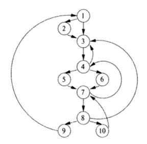


Далее путём обхода в глубину мы можем построить глубинное остовное
дерево. Оно изображено на рисунке жирными стрелочками. Введём теперь
классификацию рёбер в глубинном остовном дереве.

**Определение**: рёбра глубинного остовного дерева называются
наступающими, если они идут от некоторого узла m к истинным приемникам в
дереве. Все рёбра в глубинном остовном дереве являются наступающими.
Других наступающих рёбер на рисунке нет. Но если бы имелось ребро из 4 в
8, то оно также попадало в эту категорию.

**Определение**: рёбра графа потока управления, идущие от узла m к
предку m в глубинном остовном дереве (возможно к самому m) называются
отступающими. Например, на рисунке отступающими рёбрами являются рёбра
из 4 в 3, из 7 в 4, из 10 в 7, из 8 в 3 и из 9 в 1.

**Определение**: рёбра графа потока управления, ведущие из m в n, такие,
что в глубинном остовном дереве ни m, ни n не являются предками друг
друга называются поперечными.

**Определение**: обратным ребром называется ребро графа потока
управления из a в b, у которого b доминирует над a.


Заметим, что каждое обратное ребро графа потока управления является
отступающим. Но не всякое отступающее ребро является обратным. Приведём
пример, показанный на следующем рисунке. В данном графе не все
отступающие рёбра являются обратными. Построим глубинное остовное дерево
данного графа. Оно изображено на Рис. 5.

!\[Пример неприводимого графа \](4_BackEdges/pic4notReduceGraph.png)


На рисунке мы видим, что рёбра из 1 в 2, из 2 в 3, из 1 в 3 являются
наступающими, а ребро из 3 в 2 -- отступающим. Построим дерево
доминаторов данного графа. По нему видно, что вершина 1 доминирует над 2
и 3, но вершина 2 не доминируют над 3 и вершина 3 не доминирует над 2.
Значит ребро из 3 в 2 не является обратным.

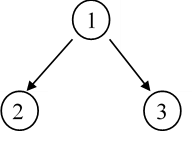

Для того, чтобы определить, является ли ребро обратным необходимо
посмотреть на дерево доминаторов. Если конец доминирует над началом, то
по определению данное ребро является обратным. В противном случае --
нет. Перебрав все ребра графа потока управления и проверив указанное
условие, мы получим искомое множество обратных рёбер.

Рассмотрим теперь приводимость графа.

**Определение**: граф потока управления называется приводимым, если все
его отступающие рёбра в любом остовном дереве являются обратными.

Поскольку все обратные рёбра являются отступающими, то можно считать,
что граф потока управления является приводимым, если все его остовные
деревья имеют одно и то же множество отступающих рёбер, совпадающее с
множеством обратных рёбер. Из примера, приведённого выше, видно, что для
различных остовных деревьев множества их отступающих рёбер могут
отличаться. Таким образом, если удалить все обратные рёбра из графа
потока управления и оставшийся граф будет цикличен, то такой граф
неприводим, и наоборот.

Таким образом, для того, чтобы установить, является ли граф потока
управления приводимым или нет, необходимо:

1)  Удалить из него все обратные рёбра;
2)  Найти циклы в получившемся графе. Если они есть, то граф неприводим.
    В противном случае -- приводим.

Существует стандартный алгоритм поиска циклом в графе. Рассмотрим его
суть. Пусть у нас есть некоторый граф, изображённый на последнем
рисунке. Все его вершины изначально пометим белым цветом. Обойдём данный
граф поиском в глубину. Мы стартуем из вершины 1. Поскольку она белая,
мы перекрашиваем её в серый цвет и переходим к одной из вершин, в
которую ведут дуги из данной. Пусть это вершина 2. Поскольку изначально
она белая, мы также помечаем её серым цветом и переходим в вершину 5.
Она также белая, поэтому помечаем её серым цветом. Из вершины 5 не
выходит ни одна дуга. Поэтому помечаем её чёрным цветом, как
просмотренную, и возвращаемся в вершину 2. Идем из неё в вершину 4.
Помечаем вершину 4 серым цветом. Из неё также не выходит ни одна дуга.
Поэтому помечаем её чёрным цветом и возвращаемся в вершину 2. Помечаем
вершину 2 чёрным цветом, переходим в вершину 1. Из вершины 1 аналогичным
образом идём в вершины 2, 6, 7, 8. Из вершины 8 идёт дуга в вершину 7,
помеченную серым цветом. Поскольку мы попали в серую вершину, значит в
нашем графе есть цикл. Алгоритм прекращает свою работу. Если бы мы в
ходе обхода графа в глубину не наткнулись на вершину, покрашенную серым
цветом, то это означало бы, что в графе нет циклов.

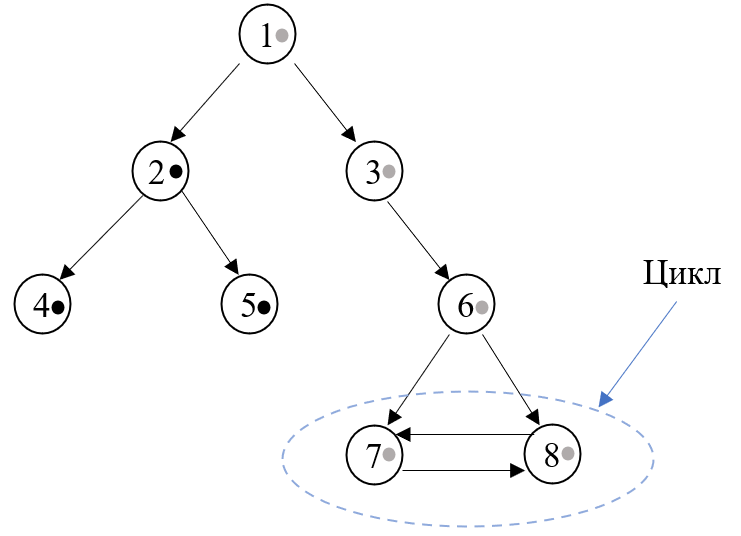

Необходимо также отметить, что приводимость графа потока управления,
согласно определению, не накладывает ограничения, связанные с
недостижимостью кода. Поэтому в случае, если граф потока управления
имеет две или более компоненты сильной связности, нам необходимо
проверить на наличие циклов каждую из них. Таким образом, после того,
как мы обойдём в глубину компоненту сильной связности, содержащую
начальный блок, нам необходимо запустить поиск в глубину из каждой
вершины, помеченной белым цветом.

### Практическая часть

Реализовано расширение для ControlFlowGraph
`public static class ControlFlowGraphExtension`

``` {.csharp}
public static bool IsReducibleGraph(this ControlFlowGraph cfg)
            => new BackEdges(cfg).GraphIsReducible;
public static IReadOnlyList<(BasicBlock, BasicBlock)> GetBackEdges(this ControlFlowGraph cfg) 
            => new BackEdges(cfg).BackEdgesFromCFG;            
```

`IsReducibleGraph` - возвращает true в случае, если граф приводим.
`GetBackEdges` - возвращает список обратных рёбер (от вершины к
вершине). Поиск обратных рёбер и анализ графа на приводимость
реализованы в приватном классе `BackEdges`. Для обеспечения работы
алгоритма был дополнительно создан класс `Edge`, который отвечает за
хранение данных о рёбрах. То есть о начале и о конце каждого ребра.
Класс `BackEdges` имеет конструктор, принимающий граф потока управления.
Сначала данный конструктор запускает `EdgesFromCFG`, который создает
объекты класса Edge. Тем самым он создает список всех рёбер в графе
потока управления. Данный список сохраняется в свойстве `enumEdgesCFG`.
Далее запускается метод `GetBackEdges`, который в цикле берёт ребро из
свойства `enumEdgesCFG` и проверяет по дереву доминаторов, является ли
данное ребро обратным или нет. Если да, то данное ребро добавляется в
результирующий список `enumBackEdges`. Код данного метода представлен
ниже.

``` {.csharp}
private void GetBackEdges()
{
    var dominators = new DominatorTree().GetDominators(controlFlowGraph);
    foreach (var edge in enumEdgesCFG)
    {
        if (dominators[edge.From].ToList().Contains(edge.To))
        {
            enumBackEdges.Add(new Edge(edge.From, edge.To));
        }
    }
}    
```

Далее запускается метод `CheckReducibility`. Он проверяет граф на
приводимость. Алгоритм работы данного метода в точности повторяет
алгоритм, описанный в теоретической части. Цвет вершин графа хранится в
словаре `BlockColorDictionary`. После запуска указанного метода, в
словаре все вершины помечаются белым цветом. Далее запускается цикл,
который в свою очередь запускает обход графа в глубину из начальной
вершины. Если по окончанию обхода останутся белые вершины, то обход в
глубину будет запущен из них. Сам обход в глубину запускается с помощью
рекурсивного метода `OpenBlock`. Код данного метода представлен ниже.

``` {.csharp}
private bool OpenBlock(BasicBlock block)
{
    if (BlockColorDictionary[block] == BlockColor.White)
    {
        BlockColorDictionary[block] = BlockColor.Gray;
    }
    var blockNumber = controlFlowGraph.VertexOf(block);            
    foreach (var child in controlFlowGraph.GetChildrenBasicBlocks(blockNumber))
    {
        var childBlock = child.block;               
        var isNotBackEdge = !enumBackEdges.ContainsEdge(block, childBlock);
        if (isNotBackEdge && BlockColorDictionary[childBlock] == BlockColor.Gray)
        {
            return false;
        }
        if (isNotBackEdge && BlockColorDictionary[childBlock] == BlockColor.White && OpenBlock(childBlock) == false)
        {                   
            return false;                                       
        }
        
    }
    BlockColorDictionary[block] = BlockColor.Black;
    return true;
}    
```

### Место в общем проекте (Интеграция)

Обратные рёбра, а также информация о приводимости графа потока
управления используется дальше в поиске естественных циклов и ряде
других задач.

### Тесты

Для проверки работоспособности программы был написан ряд разнообразных
тестов, охватывающих всевозможные случаи.

Тест на наличие обратных рёбер

``` {.csharp}
[TestCase(@"
var a, b, c, d, e, f;
1: a = 1;
5: b = 2;
goto 2;
2: c = 3;
d = 4;
goto 3;
3: e = 5;
goto 4;
4: f = 6;
goto 5;
",
    ExpectedResult = 1,
    TestName = "BackEdgesWithGoTo")]

public int TestBackEdges(string sourceCode) =>
    BuildTACOptimizeCFG(sourceCode).GetBackEdges().Count;
```

Тест на приводимость графа

``` {.csharp}
[TestCase(@"
var a, b, i, j, p, x;
input(a);
1: for i = 1, 5
{
    b = b + a * a;
    a = a + 1;
}
goto 1;
2: for j = 1, 5
{
    p = b + a * a;
    x = a + 1;
}
goto 2;
",
    ExpectedResult = true,
    TestName = "CheckIfGraphIsReducible1")]

public bool TestReducibility(string sourceCode) =>
    BuildTACOptimizeCFG(sourceCode).IsReducibleGraph();
```
